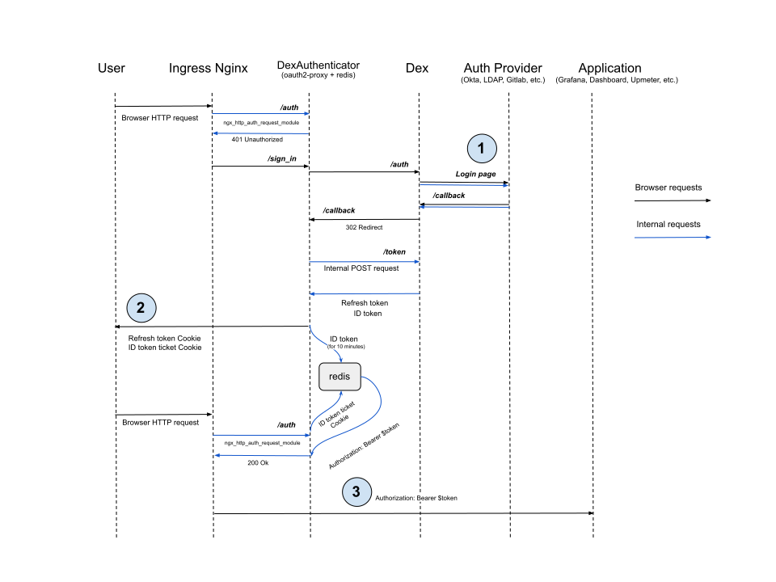
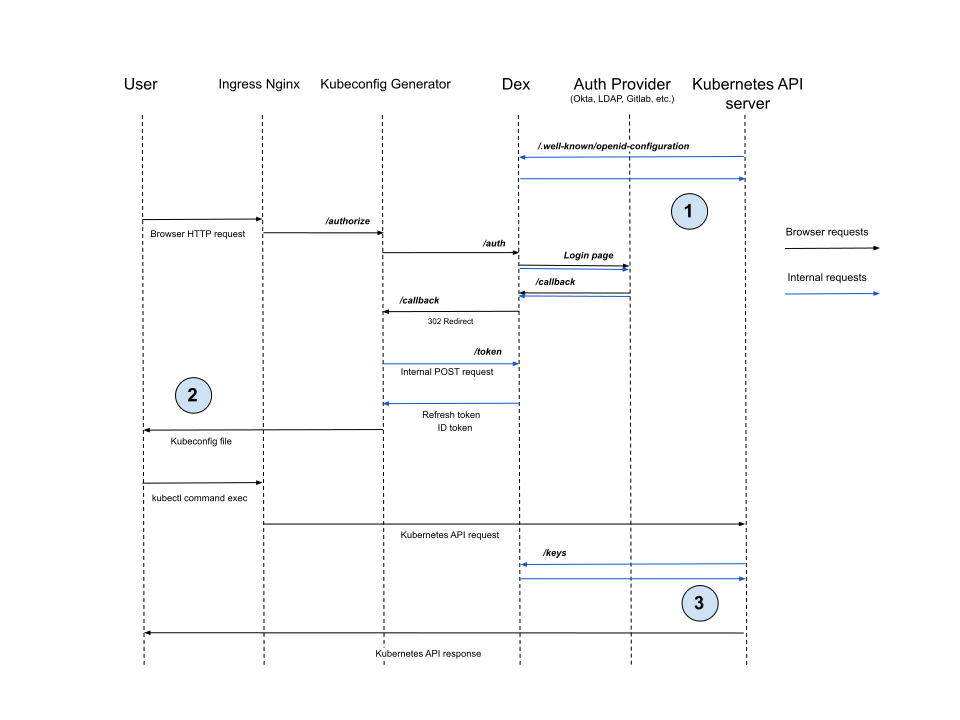

## How to secure my application?

To enable Dex authentication for your application, follow these steps:

1. Create a [DexAuthenticator](/modules/user-authn/cr.html#dexauthenticator) custom resource.

   When you create a [DexAuthenticator](/modules/user-authn/cr.html#dexauthenticator) in a cluster, an instance of [oauth2-proxy](https://github.com/oauth2-proxy/oauth2-proxy) is created and connected to Dex. The Deployment, Service, Ingress, and Secret objects will be created in the specified namespace.

   Example of the DexAuthenticator custom resource:

   ```yaml
   apiVersion: deckhouse.io/v1
   kind: DexAuthenticator
   metadata:
     # Dex authenticator pod name prefix.
     # For example, if the name prefix is `app-name`, then Dex authenticator pods will look like `app-name-dex-authenticator-7f698684c8-c5cjg`.
     name: app-name
     # Namespace to deploy Dex authenticator to.
     namespace: app-ns
   spec:
     # Your application's domain. Requests to it will be redirected for Dex authentication.
     applicationDomain: "app-name.kube.my-domain.com"
     # A parameter that determines whether to send the `Authorization: Bearer` header to the application.
     # This one is useful in combination with auth_request in NGINX.
     # If sendAuthorizationHeader is set to true, add the Authorization header to to nginx.ingress.kubernetes.io/auth-response-headers annotation of the application's Ingress.
     sendAuthorizationHeader: false
     # The name of the Secret containing the SSL certificate.
     applicationIngressCertificateSecretName: "ingress-tls"
     # The name of the Ingress class to use in the Ingress resource created for the Dex authenticator.
     applicationIngressClassName: "nginx"
     # The duration of the active user session.
     keepUsersLoggedInFor: "720h"
     # The list of groups whose users are allowed to authenticate.
     allowedGroups:
     - everyone
     - admins
     # The list of addresses and networks for which authentication is allowed.
     whitelistSourceRanges:
     - 1.1.1.1/32
     - 192.168.0.0/24
   ```

1. Connect your application to Dex.

   To do this, add annotations to the resource through which the app is published. The set of annotations depends on how the application is published. Choose the relevant option:






   Add the following annotations to the application's Ingress resource:

   - `nginx.ingress.kubernetes.io/auth-signin: https://$host/dex-authenticator/sign_in`
   - `nginx.ingress.kubernetes.io/auth-response-headers: X-Auth-Request-User,X-Auth-Request-Email`
   - `nginx.ingress.kubernetes.io/auth-url: https://<SERVICE_NAME>.<NS>.svc.{{ C_DOMAIN }}/dex-authenticator/auth`, where:
      - `SERVICE_NAME`: Name of the authenticator's Service. Usually, it is `<NAME>-dex-authenticator` (`<NAME>` is the `metadata.name` of the [DexAuthenticator](/modules/user-authn/cr.html#dexauthenticator)).
      - `NS`: Value of the `metadata.namespace` parameter of the [DexAuthenticator](/modules/user-authn/cr.html#dexauthenticator).
      - `C_DOMAIN`: Cluster domain (the [clusterDomain](/products/kubernetes-platform/documentation/v1/reference/api/cr.html#clusterconfiguration-clusterdomain) parameter of the [ClusterConfiguration](/products/kubernetes-platform/documentation/v1/reference/api/cr.html#clusterconfiguration) resource).

   > **Note:** If the DexAuthenticator `<NAME>` is too long, the Service name may be truncated. To find the correct service name, use the following command (specify the namespace name and DexAuthenticator name):
   >
   > ```shell
   > d8 k get service -n <NS> -l "deckhouse.io/dex-authenticator-for=<NAME>" -o jsonpath='{.items[0].metadata.name}'
   > ```
   >

   Example of annotations for an application's Ingress resource for connecting to Dex:

   ```yaml
   annotations:
     nginx.ingress.kubernetes.io/auth-signin: https://$host/dex-authenticator/sign_in
     nginx.ingress.kubernetes.io/auth-url: https://app-name-dex-authenticator.app-ns.svc.cluster.local/dex-authenticator/auth
     nginx.ingress.kubernetes.io/auth-response-headers: X-Auth-Request-User,X-Auth-Request-Email
   ```






If the application is published through an ALBInstance or ClusterALBInstance resource (for details, see the [`alb`](/modules/alb/) module documentation), add the following annotations to the application's HTTPRoute resource:

- `alb.network.deckhouse.io/auth-signin: https://<application-domain>/dex-authenticator/sign_in` — unlike nginx, the `alb` controller does not support the `$host` variable, so the application's domain must be specified explicitly.
- `alb.network.deckhouse.io/auth-response-headers: X-Auth-Request-User,X-Auth-Request-Email`.
- `alb.network.deckhouse.io/auth-url: https://<SERVICE_NAME>.<NS>.svc.<C_DOMAIN>/dex-authenticator/auth`, where `SERVICE_NAME`, `NS`, and `C_DOMAIN` are determined the same way as for an Ingress resource.

Example of annotations for an application's HTTPRoute resource for connecting to Dex:

```yaml
annotations:
  alb.network.deckhouse.io/auth-signin: https://app-name.kube.my-domain.com/dex-authenticator/sign_in
  alb.network.deckhouse.io/auth-url: https://app-name-dex-authenticator.app-ns.svc.cluster.local/dex-authenticator/auth
  alb.network.deckhouse.io/auth-response-headers: X-Auth-Request-User,X-Auth-Request-Email
```

Also, in the DexAuthenticator resource, specify the same ListenerSet used to publish the application's domain:

```yaml
spec:
  gatewayAPI:
    applicationHTTPRouteListenerSetName: my-listenerset
```





When setting `sendAuthorizationHeader: true`, list all necessary headers in the Ingress (or in the HTTPRoute, if the [`alb`](/modules/alb/) module is used) in the corresponding annotation, since the `Authorization` header is not transmitted by default:

For details on what is passed in the `Authorization` header and how to specify it in the annotation, see [How to pass the user's login and groups to an application](#how-to-pass-the-users-login-and-groups-to-an-application).



The application Ingress must have TLS configured. DexAuthenticator does not support HTTP-only Ingress resources.


### Setting up CIDR-based restrictions

DexAuthenticator does not have a built-in system for managing authentication based on user IP address. Instead, you can use Ingress resource annotations:

* To restrict access by IP and keep Dex authentication, add the annotation with a comma-separated list of allowed CIDRs:

  ```yaml
  nginx.ingress.kubernetes.io/whitelist-source-range: 192.168.0.0/32,1.1.1.1
  ```

* To allow access without Dex authentication for users from specified networks while requiring authentication for others, add the annotation:

  ```yaml
  nginx.ingress.kubernetes.io/satisfy: "any"
  ```

## How to pass the user's login and groups to an application?

By default DexAuthenticator passes only two headers to the application: `X-Auth-Request-User` (based on the opaque `sub` claim) and `X-Auth-Request-Email`. The user's groups are not passed as a header. It grows unboundedly with the number of groups, so it is disabled in DKP, and it cannot be enabled.

To give the application full information about the user, including groups, enable [`sendAuthorizationHeader`](cr.html#dexauthenticator-v1-spec-sendauthorizationheader):

```yaml
apiVersion: deckhouse.io/v1
kind: DexAuthenticator
metadata:
  name: app-name
  namespace: app-ns
spec:
  applicationDomain: "app-name.kube.my-domain.com"
  applicationIngressClassName: "nginx"
  applicationIngressCertificateSecretName: "ingress-tls"
  sendAuthorizationHeader: true
```

In this case, the application receives the `Authorization: Bearer <id_token>` header, where `<id_token>` is a JWT signed by Dex (for details on the token contents and how to process it in your application, see [JWT token contents and processing considerations](#jwt-token-contents-and-processing-considerations)).

Regardless of how the application is published, this header is not passed to the application automatically. It must be explicitly listed in the annotation of the resource through which the application is published. Choose the relevant option depending on how the application is published:




If the application is published through an Ingress resource (for details, see the [`ingress-nginx`](/modules/ingress-nginx/) module documentation), when setting `sendAuthorizationHeader: true`, you need to:

- Specify the headers to pass to the application in the `nginx.ingress.kubernetes.io/auth-response-headers` annotation.
- Also increase the buffer size using the `nginx.ingress.kubernetes.io/proxy-buffer-size` annotation, since a JWT with many groups does not fit into the default buffer.

Example of specifying the headers and buffer size using the corresponding annotations:



```yaml
annotations:
  nginx.ingress.kubernetes.io/auth-signin: https://$host/dex-authenticator/sign_in
  nginx.ingress.kubernetes.io/auth-url: https://app-name-dex-authenticator.app-ns.svc.cluster.local/dex-authenticator/auth
  nginx.ingress.kubernetes.io/auth-response-headers: X-Auth-Request-User,X-Auth-Request-Email,Authorization
  nginx.ingress.kubernetes.io/proxy-buffer-size: 32k
```



If the `Authorization` header is not listed in `auth-response-headers`, the application won't receive it. If `proxy-buffer-size` is not increased, requests will fail with a 500 error, and the Ingress controller log will show `upstream sent too big header while reading response header from upstream`.




If the application is published through an ALBInstance or ClusterALBInstance resource (for details, see the [`alb`](/modules/alb/) module documentation), when setting `sendAuthorizationHeader: true`, specify the headers to pass to the application in the `alb.network.deckhouse.io/auth-response-headers` annotation of the HTTPRoute resource:

```yaml
annotations:
  alb.network.deckhouse.io/auth-signin: https://app-name.kube.my-domain.com/dex-authenticator/sign_in
  alb.network.deckhouse.io/auth-url: https://app-name-dex-authenticator.app-ns.svc.cluster.local/dex-authenticator/auth
  alb.network.deckhouse.io/auth-response-headers: Authorization
```

For the `alb.network.deckhouse.io/auth-response-headers` annotation, it is enough to specify only `Authorization`, since it already passes the base set of headers by default.

Also, in the DexAuthenticator resource, specify the same ListenerSet used to publish the application's domain:

```yaml
spec:
  gatewayAPI:
    applicationHTTPRouteListenerSetName: my-listenerset
```




### JWT token contents and processing considerations

Example of the JWT payload for a static user (the [User](cr.html#user) and [Group](cr.html#group) resources):

```json
{
  "iss": "https://dex.kube.my-domain.com/",
  "sub": "Cg1qb2huLmRvZUBleGFtcGxlEgVsb2NhbA",
  "aud": "app-name-app-ns-dex-authenticator",
  "exp": 1757000600,
  "iat": 1757000000,
  "email": "john.doe@example.com",
  "email_verified": true,
  "name": "john-doe",
  "preferred_username": "",
  "groups": ["everyone", "developers"]
}
```

When parsing the token in your application, keep in mind the following:

- Use the `email` field to identify the user. The `sub` field is opaque (it is not predictable and cannot be used as a meaningful user identifier outside the context of a specific system), and `preferred_username` is empty for static users (external authentication providers may populate it).
- The `name` field contains the object's name (from the `metadata.name` field of the [User](cr.html#user) object), not the user's display name.
- The `aud` field contains the authenticator client identifier (`<name>-<namespace>-dex-authenticator`), not your application's own OIDC client identifier. An application that validates `aud` against its own `client_id` will reject such a token.
- Verify the signature using the JWKS endpoint `https://dex.<modules.publicDomainTemplate>/keys`.
- The token's lifetime is defined by the [`idTokenTTL`](configuration.html#parameters-idtokenttl) parameter (10 minutes by default). DexAuthenticator refreshes the token on its own, so the application always gets a current one.

If the application supports OIDC on its own, use the [DexClient](cr.html#dexclient) resource instead of DexAuthenticator: the application will request the required scope itself and get a `refresh_token` in addition to the `id_token`.

DexAuthenticator does not have a built-in system for managing authentication based on user IP address. Instead, you can use Ingress resource annotations:

* To restrict access by IP and keep Dex authentication, add the annotation with a comma-separated list of allowed CIDRs:

  ```yaml
  nginx.ingress.kubernetes.io/whitelist-source-range: 192.168.0.0/32,1.1.1.1
  ```

* To allow access without Dex authentication for users from specified networks while requiring authentication for others, add the annotation:

  ```yaml
  nginx.ingress.kubernetes.io/satisfy: "any"
  ```

## Authentication flow with DexAuthenticator




DexAuthenticator only works with HTTPS. It does not support Ingress resources configured for HTTP only.

Authentication cookies are set with the `Secure` attribute, which means they are only sent over encrypted HTTPS connections.

Make sure your application Ingress has TLS configured before integrating with DexAuthenticator.


1. Dex redirects the user to the provider's login page in most cases and waits for the user to be redirected back to the `/callback` URL. However, some providers like LDAP or Atlassian Crowd do not support this flow. The user must enter credentials in the Dex login form instead, and Dex will validate them by making a request to the provider's API.

1. DexAuthenticator sets the cookie with the full refresh token (instead of issuing a ticket as for the ID token) because Redis does not persist data.
   If no ID token is found in Redis by the ticket, the user can request a new ID token by providing the refresh token from the cookie.

1. DexAuthenticator sets the `Authorization` HTTP header to the ID token value from Redis. This is not required for services like [`upmeter`](/modules/upmeter/), as `upmeter` permissions are less granular.
   For the [Kubernetes Dashboard](/modules/dashboard/), it is critical: the Dashboard passes the ID token on to access the Kubernetes API.

## How to generate a kubeconfig and access Kubernetes API?

`kubeconfig` for remote access to the cluster via `kubectl` can be generated in the [`kubeconfigurator` web interface](/products/kubernetes-platform/documentation/v1/user/web/kubeconfig.html).

Configure the [`publishAPI`](/modules/user-authn/configuration.html#parameters-publishapi) parameter:

- Open the `user-authn` module settings (create the ModuleConfig `user-authn` resource if there is none):

  ```shell
  d8 k edit mc user-authn
  ```

- Add the following section to the `settings` block and save:

  ```yaml
  publishAPI:
    enabled: true
  ```

The name `kubeconfig` is reserved for the kubeconfig generation web interface. The URL depends on the [`publicDomainTemplate`](/products/kubernetes-platform/documentation/v1/reference/api/global.html#parameters-modules-publicdomaintemplate) parameter (for example, for the template that looks like `%s.kube.my`, the kubeconfig generation web interface will be available at `kubeconfig.kube.my`, and for `%s-kube.company.my` — at `kubeconfig-kube.company.my`).

### Configuring kube-apiserver

Using the [`control-plane-manager`](/modules/control-plane-manager/) module, DKP automatically configures `kube-apiserver` with the following flags so that the `dashboard` and `kubeconfig-generator` modules can work in the cluster.



* `--oidc-client-id=kubernetes`
* `--oidc-groups-claim=groups`
* `--oidc-issuer-url=https://dex.%addonsPublicDomainTemplate%/`
* `--oidc-username-claim=email`

When self-signed certificates are used for Dex, one more argument is added and the CA file is mounted in the `apiserver` pod:

* `--oidc-ca-file=/etc/kubernetes/oidc-ca.crt`


### The flow of accessing Kubernetes API with generated kubeconfig



1. Before `kube-apiserver` starts, it must request the OIDC provider's configuration endpoint (Dex in our case) to get the issuer and JWKS endpoint settings.

1. Kubeconfig generator stores the ID token and refresh token in the `kubeconfig` file.

1. After receiving a request with an ID token, `kube-apiserver` verifies that the token is signed by the provider configured in step 1 using keys from the JWKS endpoint. It then compares the token's `iss` and `aud` claim values with the configuration.

## How to rotate the secret of the kubernetes OAuth2 client?

The secret of the privileged `kubernetes` OAuth2 client is stored in the `kubernetes-dex-client-app-secret` Secret of the `d8-user-authn` namespace. The same value is used by the `kubeconfig-generator`, `kubeconfig-publish-api` and `kubeconfig-<slug>` OAuth2 clients, and is passed to basic-auth-proxy as `--ldap-client-secret`.

Deleting the Secret does not rotate the value: while it is still present in the module's values, the owning hook renders the very same one back.

To rotate the secret, do the following:

1. If a GitOps tool controls the `d8-user-authn` namespace, exclude the `kubernetes-dex-client-app-secret` Secret from syncing. Otherwise the GitOps tool will restore the previous value.

1. Empty the `secret` field:

   ```shell
   d8 k -n d8-user-authn patch secret kubernetes-dex-client-app-secret --type merge -p '{"data":{"secret":""}}'
   ```

1. Restart DKP so that the hook picks the empty field up and generates a new value:

   ```shell
   d8 k -n d8-system rollout restart deployment/deckhouse
   ```

1. Verify that the secret value changed:

   ```shell
   d8 k -n d8-user-authn get secret kubernetes-dex-client-app-secret -o jsonpath='{.data.secret}'
   ```

   If it did not, repeat the steps 2 and 3. The module may have restored the previous before DKP was restarted.

One the secret has been rotated, the configuration of components that use it will be updated automatically and the corresponding pods will be restarted.

Kubeconfig files downloaded from the kubeconfig generator earlier carry the old client secret and stop refreshing tokens. Download these files again. ID tokens issued before the rotation keep working until they expire, which is configured via [`settings.idTokenTTL`](configuration.html#parameters-idtokenttl) (10 minutes by default).

## How to enable Kerberos (SPNEGO) SSO for LDAP?

If clients run in a corporate SSO environment (browser trusts the Dex host), Dex can accept Kerberos tickets via `Authorization: Negotiate` and log in without the password form.

Enabling Kerberos (SPNEGO) SSO for LDAP:

1. In AD/KDC, create/provision an SPN `HTTP/<dex-fqdn>` for a service account and generate a `keytab`.
1. In the cluster, create a Secret in the `d8-user-authn` namespace with the `krb5.keytab` data key.
1. In the LDAP DexProvider resource, enable [`spec.ldap.kerberos`](/modules/user-authn/cr.html#dexprovider-v1-spec-ldap-kerberos):
   - `enabled: true`
   - `keytabSecretName: <secret name>`
   - optional: `expectedRealm`, `usernameFromPrincipal`, `fallbackToPassword`

Dex will mount the `keytab` automatically and start accepting SPNEGO. A server‑side `krb5.conf` is not required — tickets are validated using the keytab.

## How to configure Basic Authentication for accessing Kubernetes API via LDAP?

1. Enable the [`publishAPI`](/modules/user-authn/configuration.html#parameters-publishapi) parameter in the `user-authn` module configuration.
1. Create a [DexProvider](/modules/user-authn/cr.html#dexprovider) resource of type `LDAP` and set [`enableBasicAuth: true`](/modules/user-authn/cr.html#dexprovider-v1-spec-oidc-enablebasicauth).
1. Configure [RBAC](/modules/user-authz/cr.html#clusterauthorizationrule) for groups obtained from LDAP.
1. Provide users with a `kubeconfig` configured for Basic Authentication (LDAP username and password).


Only one authentication provider in the cluster can have [`enableBasicAuth`](/modules/user-authn/cr.html#dexprovider-v1-spec-oidc-enablebasicauth) enabled.


A detailed example is described in the [Usage](/modules/user-authn/usage.html#configuring-basic-authentication) section.

## How is Dex protected against credential brute-forcing?

Each user is allowed no more than 20 login attempts. After the limit is exhausted, one additional attempt is added every 6 seconds.

## A UserOperation is in the Failed status — what should I do?

Check the `status.message` field of the UserOperation resource for the error description:

```shell
d8 k get useroperation <name> -o jsonpath='{.status.message}'
```

Fix the cause (for example, an invalid password hash or a non-existent user), then create a new UserOperation. A UserOperation is immutable — its specification cannot be updated after creation.

## How do I unlock a user?

Use the command:

```shell
d8 iam user unlock <username>
```

Alternatively, create a new UserOperation resource with `type: Unlock`. Note that `ResetPassword`, `Reset2FA`, and `Lock` operations terminate all active sessions of the user.

## A user was locked automatically — why?

The number of failed login attempts exceeded [`passwordPolicy.lockout.maxAttempts`](configuration.html#parameters-passwordpolicy-lockout-maxattempts). The user is locked for the duration specified in [`passwordPolicy.lockout.lockDuration`](configuration.html#parameters-passwordpolicy-lockout-lockduration) and is unlocked automatically afterwards. An administrator can also unlock the user manually with `d8 iam user unlock <username>` or by creating a UserOperation with `type: Unlock`.

## Can I cancel a UserOperation?

No. A UserOperation is a single-use, immutable object. To reverse its effect, create an opposite operation — for example, create a UserOperation with `type: Unlock` after a `Lock` operation.
