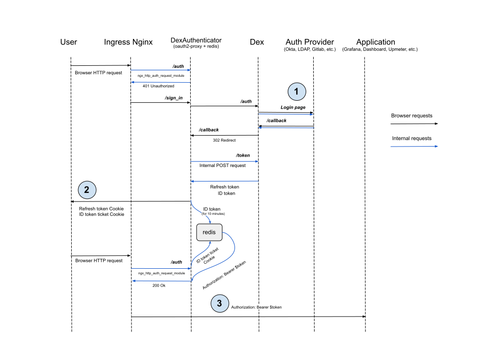
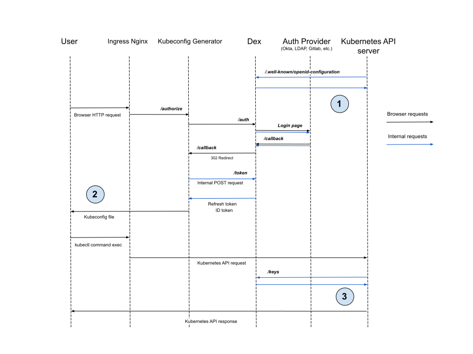

## How to secure my application?

To enable Dex authentication for your application, follow these steps:

1. Create a [DexAuthenticator](/modules/user-authn/cr.html#dexauthenticator) custom resource.

   When you create a [DexAuthenticator](/modules/user-authn/cr.html#dexauthenticator) in a cluster, an instance of [oauth2-proxy](https://github.com/oauth2-proxy/oauth2-proxy) is created and connected to Dex. The Deployment, Service, Ingress, and Secret objects will be created in the specified namespace.

   Example of the `DexAuthenticator` custom resource:

   ```yaml
   apiVersion: deckhouse.io/v1
   kind: DexAuthenticator
   metadata:
     # Dex authenticator pod name prefix.
     # For example, if the name prefix is `app-name`, then Dex authenticator pods will look like `app-name-dex-authenticator-7f698684c8-c5cjg`.
     name: app-name
     # Namespace to deploy Dex authenticator to.
     namespace: app-ns
   spec:
     # Your application's domain. Requests to it will be redirected for Dex authentication.
     applicationDomain: "app-name.kube.my-domain.com"
     # A parameter that determines whether to send the `Authorization: Bearer` header to the application.
     # This one is useful in combination with auth_request in NGINX.
     sendAuthorizationHeader: false
     # The name of the Secret containing the SSL certificate.
     applicationIngressCertificateSecretName: "ingress-tls"
     # The name of the Ingress class to use in the Ingress resource created for the Dex authenticator.
     applicationIngressClassName: "nginx"
     # The duration of the active user session.
     keepUsersLoggedInFor: "720h"
     # The list of groups whose users are allowed to authenticate.
     allowedGroups:
     - everyone
     - admins
     # The list of addresses and networks for which authentication is allowed.
     whitelistSourceRanges:
     - 1.1.1.1/32
     - 192.168.0.0/24
   ```

1. Connect your application to Dex.

   For this, add the following annotations to the application's Ingress resource:

   - `nginx.ingress.kubernetes.io/auth-signin: https://$host/dex-authenticator/sign_in`
   - `nginx.ingress.kubernetes.io/auth-response-headers: X-Auth-Request-User,X-Auth-Request-Email`
   - `nginx.ingress.kubernetes.io/auth-url: https://<SERVICE_NAME>.<NS>.svc.{{ C_DOMAIN }}/dex-authenticator/auth`, where:
      - `SERVICE_NAME`: Name of the authenticator's Service. Usually, it is `<NAME>-dex-authenticator` (`<NAME>` is the `metadata.name` of the [DexAuthenticator](/modules/user-authn/cr.html#dexauthenticator)).
      - `NS`: Value of the `metadata.namespace` parameter of the [DexAuthenticator](/modules/user-authn/cr.html#dexauthenticator).
      - `C_DOMAIN`: Cluster domain (the [clusterDomain](/products/kubernetes-platform/documentation/v1/reference/api/cr.html#clusterconfiguration-clusterdomain) parameter of the [ClusterConfiguration](/products/kubernetes-platform/documentation/v1/reference/api/cr.html#clusterconfiguration) resource).

   > *Note:** If the DexAuthenticator `<NAME>` is too long, the Service name may be truncated. To find the correct service name, use the following command (specify the namespace name and DexAuthenticator name):
   >
   > ```shell
   > d8 k get service -n <NS> -l "deckhouse.io/dex-authenticator-for=<NAME>" -o jsonpath='{.items[0].metadata.name}'
   > ```
   >

   Example of annotations for an application's Ingress resource for connecting to Dex:

   ```yaml
   annotations:
     nginx.ingress.kubernetes.io/auth-signin: https://$host/dex-authenticator/sign_in
     nginx.ingress.kubernetes.io/auth-url: https://app-name-dex-authenticator.app-ns.svc.cluster.local/dex-authenticator/auth
     nginx.ingress.kubernetes.io/auth-response-headers: X-Auth-Request-User,X-Auth-Request-Email
   ```


The application Ingress must have TLS configured. DexAuthenticator does not support HTTP-only Ingress resources.


### Setting up CIDR-based restrictions

DexAuthenticator does not have a built-in system for managing authentication based on user IP address. Instead, you can use Ingress resource annotations:

* To restrict access by IP and keep Dex authentication, add the annotation with a comma-separated list of allowed CIDRs:

  ```yaml
  nginx.ingress.kubernetes.io/whitelist-source-range: 192.168.0.0/32,1.1.1.1
  ```

* To allow access without Dex authentication for users from specified networks while requiring authentication for others, add the annotation:

  ```yaml
  nginx.ingress.kubernetes.io/satisfy: "any"
  ```

## Authentication flow with DexAuthenticator




DexAuthenticator only works with HTTPS. It does not support Ingress resources configured for HTTP only.

Authentication cookies are set with the `Secure` attribute, which means they are only sent over encrypted HTTPS connections.

Make sure your application Ingress has TLS configured before integrating with DexAuthenticator.


1. Dex redirects the user to the provider's login page in most cases and waits for the user to be redirected back to the `/callback` URL. However, some providers like LDAP or Atlassian Crowd do not support this flow. The user must enter credentials in the Dex login form instead, and Dex will validate them by making a request to the provider's API.

1. DexAuthenticator sets the cookie with the full refresh token (instead of issuing a ticket as for the ID token) because Redis does not persist data.
   If no ID token is found in Redis by the ticket, the user can request a new ID token by providing the refresh token from the cookie.

1. DexAuthenticator sets the `Authorization` HTTP header to the ID token value from Redis. This is not required for services like [Upmeter](/modules/upmeter/), as Upmeter permissions are less granular.
   For the [Kubernetes Dashboard](/modules/dashboard/), it is critical: the Dashboard passes the ID token on to access the Kubernetes API.

## How to generate a kubeconfig and access Kubernetes API?

`kubeconfig` for remote access to the cluster via `kubectl` can be generated in the `kubeconfigurator` web interface.

Configure the [publishAPI](/modules/user-authn/configuration.html#parameters-publishapi) parameter:

- Open the `user-authn` module settings (create the ModuleConfig `user-authn` resource if there is none):

  ```shell
  d8 k edit mc user-authn
  ```

- Add the following section to the `settings` block and save:

  ```yaml
  publishAPI:
    enabled: true
  ```

The name `kubeconfig` is reserved for the kubeconfig generation web interface. The URL depends on the [publicDomainTemplate](/products/kubernetes-platform/documentation/v1/reference/api/global.html#parameters-modules-publicdomaintemplate) parameter (e.g. for `%s.kube.my` — `kubeconfig.kube.my`, for `%s-kube.company.my` — `kubeconfig-kube.company.my`).

### Configuring kube-apiserver

Using the [control-plane-manager](/modules/control-plane-manager/) module, Deckhouse automatically configures `kube-apiserver` with the following flags so that the `dashboard` and `kubeconfig-generator` modules can work in the cluster.



* `--oidc-client-id=kubernetes`
* `--oidc-groups-claim=groups`
* `--oidc-issuer-url=https://dex.%addonsPublicDomainTemplate%/`
* `--oidc-username-claim=email`

When self-signed certificates are used for Dex, one more argument is added and the CA file is mounted in the `apiserver` pod:

* `--oidc-ca-file=/etc/kubernetes/oidc-ca.crt`


### The flow of accessing Kubernetes API with generated kubeconfig



1. Before `kube-apiserver` starts, it must request the OIDC provider's configuration endpoint (Dex in our case) to get the issuer and JWKS endpoint settings.

1. Kubeconfig generator stores the ID token and refresh token in the `kubeconfig` file.

1. After receiving a request with an ID token, `kube-apiserver` verifies that the token is signed by the provider configured in step 1 using keys from the JWKS endpoint. It then compares the token's `iss` and `aud` claim values with the configuration.

## How to enable Kerberos (SPNEGO) SSO for LDAP?

If clients run in a corporate SSO environment (browser trusts the Dex host), Dex can accept Kerberos tickets via `Authorization: Negotiate` and log in without the password form.

Enabling Kerberos (SPNEGO) SSO for LDAP:

1. In AD/KDC, create/provision an SPN `HTTP/<dex-fqdn>` for a service account and generate a keytab.
1. In the cluster, create a Secret in the `d8-user-authn` namespace with the `krb5.keytab` data key.
1. In the LDAP DexProvider resource, enable `spec.ldap.kerberos`:
   - `enabled: true`
   - `keytabSecretName: <secret name>`
   - optional: `expectedRealm`, `usernameFromPrincipal`, `fallbackToPassword`

Dex will mount the keytab automatically and start accepting SPNEGO. A server‑side `krb5.conf` is not required — tickets are validated using the keytab.

## How to configure Basic Authentication for accessing Kubernetes API via LDAP?

1. Enable the [publishAPI](/modules/user-authn/configuration.html#parameters-publishapi) parameter in the `user-authn` module configuration.
1. Create a [DexProvider](/modules/user-authn/cr.html#dexprovider) resource of type `LDAP` and set [`enableBasicAuth: true`](/modules/user-authn/cr.html#dexprovider-v1-spec-oidc-enablebasicauth).
1. Configure [RBAC](/modules/user-authz/cr.html#clusterauthorizationrule) for groups obtained from LDAP.
1. Provide users with a `kubeconfig` configured for Basic Authentication (LDAP username and password).

> **Warning.** Only one authentication provider in the cluster can have [`enableBasicAuth`](/modules/user-authn/cr.html#dexprovider-v1-spec-oidc-enablebasicauth) enabled.

A detailed example is described in the [Usage](/modules/user-authn/usage.html#configuring-basic-authentication) section.

## How is Dex protected against credential brute-forcing?

Each user is allowed no more than 20 login attempts. After the limit is exhausted, one additional attempt is added every 6 seconds.
