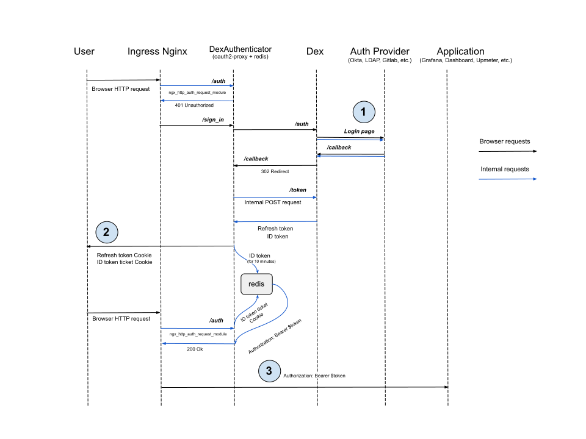
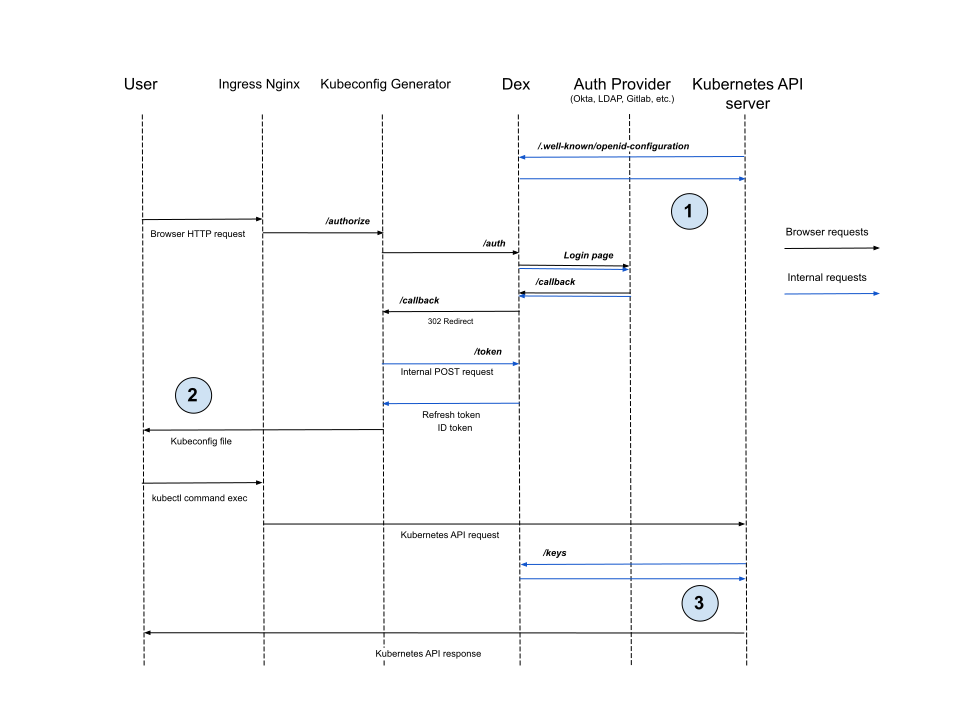

## Как защитить мое приложение?

Чтобы включить аутентификацию через Dex для приложения, выполните следующие шаги:

1. Создайте ресурс [DexAuthenticator](/modules/user-authn/cr.html#dexauthenticator).

   При создании [DexAuthenticator](/modules/user-authn/cr.html#dexauthenticator) в кластере создаётся экземпляр [oauth2-proxy](https://github.com/oauth2-proxy/oauth2-proxy), подключённый к Dex. В указанном неймспейсе будут созданы объекты Deployment, Service, Ingress, Secret.

   Пример ресурса [DexAuthenticator](/modules/user-authn/cr.html#dexauthenticator):

   ```yaml
   apiVersion: deckhouse.io/v1
   kind: DexAuthenticator
   metadata:
     # Префикс имени подов Dex authenticator.
     # Например, если префикс имени `app-name`, то поды Dex authenticator будут вида `app-name-dex-authenticator-7f698684c8-c5cjg`.
     name: app-name
     # Namespace, в котором будет развернут Dex authenticator.
     namespace: app-ns
   spec:
     # Домен вашего приложения. Запросы на него будут перенаправляться для прохождения аутентификации в Dex.
     applicationDomain: "app-name.kube.my-domain.com"
     # Отправлять ли `Authorization: Bearer` header приложению. Полезно в связке с auth_request в NGINX.
     sendAuthorizationHeader: false
     # Имя Secret'а с SSL-сертификатом.
     applicationIngressCertificateSecretName: "ingress-tls"
     # Название Ingress-класса, которое будет использоваться в создаваемом для Dex authenticator Ingress-ресурсе.
     applicationIngressClassName: "nginx"
     # Время, на протяжении которого пользовательская сессия будет считаться активной.
     keepUsersLoggedInFor: "720h"
     # Список групп, пользователям которых разрешено проходить аутентификацию.
     allowedGroups:
     - everyone
     - admins
     # Список адресов и сетей, с которых разрешено проходить аутентификацию.
     whitelistSourceRanges:
     - 1.1.1.1/32
     - 192.168.0.0/24
   ```

1. Подключите приложение к Dex.

   Для этого добавьте в Ingress-ресурс приложения следующие аннотации:

   - `nginx.ingress.kubernetes.io/auth-signin: https://$host/dex-authenticator/sign_in`
   - `nginx.ingress.kubernetes.io/auth-response-headers: X-Auth-Request-User,X-Auth-Request-Email`
   - `nginx.ingress.kubernetes.io/auth-url: https://<SERVICE_NAME>.<NS>.svc.{{ C_DOMAIN }}/dex-authenticator/auth`, где:
      - `SERVICE_NAME` — имя сервиса (Service) аутентификатора. Как правило, оно соответствует формату `<NAME>-dex-authenticator` (`<NAME>` — это `metadata.name` ресурса [DexAuthenticator](/modules/user-authn/cr.html#dexauthenticator)).
      - `NS` — значение параметра `metadata.namespace` ресурса [DexAuthenticator](/modules/user-authn/cr.html#dexauthenticator).
      - `C_DOMAIN` — домен кластера (параметр [clusterDomain](/products/kubernetes-platform/documentation/v1/reference/api/cr.html#clusterconfiguration-clusterdomain) ресурса [ClusterConfiguration](/products/kubernetes-platform/documentation/v1/reference/api/cr.html#clusterconfiguration)).

   > **Важно:** Если имя DexAuthenticator (`<NAME>`) слишком длинное, имя сервиса (Service) может быть сокращено. Чтобы найти корректное имя сервиса, воспользуйтесь следующей командой (укажите имя пространства имен и имя аутентификатора):
   >
   > ```shell
   > d8 k get service -n <NS> -l "deckhouse.io/dex-authenticator-for=<NAME>" -o jsonpath='{.items[0].metadata.name}'
   > ```
   >

   Пример аннотаций Ingress-ресурса приложения для подключения к Dex:

   ```yaml
   annotations:
     nginx.ingress.kubernetes.io/auth-signin: https://$host/dex-authenticator/sign_in
     nginx.ingress.kubernetes.io/auth-url: https://app-name-dex-authenticator.app-ns.svc.cluster.local/dex-authenticator/auth
     nginx.ingress.kubernetes.io/auth-response-headers: X-Auth-Request-User,X-Auth-Request-Email
   ```


Ingress приложения должен иметь настроенный TLS. DexAuthenticator не поддерживает Ingress-ресурсы, работающие только по HTTP.


### Настройка ограничений на основе CIDR

В DexAuthenticator нет встроенной системы управления разрешением аутентификации на основе IP-адреса пользователя. Вместо этого вы можете воспользоваться аннотациями для Ingress-ресурсов:

* Если нужно ограничить доступ по IP и оставить прохождение аутентификации в Dex, добавьте аннотацию с указанием разрешенных CIDR через запятую:

  ```yaml
  nginx.ingress.kubernetes.io/whitelist-source-range: 192.168.0.0/32,1.1.1.1
  ```

* Чтобы разрешить доступ без аутентификации в Dex для пользователей из указанных сетей, а для остальных оставить обязательную аутентификацию, добавьте аннотацию:

  ```yaml
  nginx.ingress.kubernetes.io/satisfy: "any"
  ```

## Как работает аутентификация с помощью DexAuthenticator




DexAuthenticator работает только по HTTPS. Ingress-ресурсы, настроенные только на HTTP, не поддерживаются.

Аутентификационные cookie устанавливаются с атрибутом `Secure`, что означает их передачу только через зашифрованные HTTPS-соединения.

Убедитесь, что для Ingress вашего приложения настроен TLS, прежде чем интегрировать его с DexAuthenticator.


1. Dex в большинстве случаев перенаправляет пользователя на страницу входа провайдера и ожидает, что пользователь будет перенаправлен на его `/callback` URL. Однако такие провайдеры, как LDAP или Atlassian Crowd, не поддерживают этот вариант. Вместо этого пользователь должен ввести логин и пароль в форму входа в Dex, и Dex сам проверит учётные данные, выполнив запрос к API провайдера.

1. DexAuthenticator устанавливает cookie с полным токеном обновления (вместо выдачи тикета, как для ID-токена), потому что Redis не сохраняет данные на диск.
   Если по тикету в Redis не найден ID-токен, пользователь сможет запросить новый ID-токен, предоставив токен обновления из cookie.

1. DexAuthenticator выставляет HTTP-заголовок `Authorization`, равный значению ID-токена из Redis. Это необязательно для сервисов вроде [`upmeter`](/modules/upmeter/), так как права доступа к upmeter менее детальные.
   Для [Kubernetes Dashboard](/modules/dashboard/) это критичная функциональность: Dashboard передаёт ID-токен дальше для доступа к API Kubernetes.

## Как сгенерировать kubeconfig для доступа к Kubernetes API?

`kubeconfig` для удалённого доступа к кластеру через `kubectl` можно сгенерировать в веб-интерфейсе `kubeconfigurator`.

Настройте параметр [publishAPI](/modules/user-authn/configuration.html#parameters-publishapi):

- Откройте настройки модуля `user-authn` (создайте ресурс ModuleConfig `user-authn`, если его нет):

  ```shell
  d8 k edit mc user-authn
  ```

- Добавьте следующую секцию в блок `settings` и сохраните изменения:

  ```yaml
  publishAPI:
    enabled: true
  ```

Имя `kubeconfig` зарезервировано для веб-интерфейса генерации kubeconfig. URL зависит от параметра [publicDomainTemplate](/products/kubernetes-platform/documentation/v1/reference/api/global.html#parameters-modules-publicdomaintemplate) (например, при `%s.kube.my` — `kubeconfig.kube.my`, при `%s-kube.company.my` — `kubeconfig-kube.company.my`).  


### Настройка kube-apiserver

С помощью функций модуля [control-plane-manager](/modules/control-plane-manager/) Deckhouse автоматически настраивает `kube-apiserver`, выставляя следующие флаги так, чтобы модули `dashboard` и `kubeconfig-generator` могли работать в кластере.



* `--oidc-client-id=kubernetes`
* `--oidc-groups-claim=groups`
* `--oidc-issuer-url=https://dex.%addonsPublicDomainTemplate%/`
* `--oidc-username-claim=email`

При использовании самоподписанных сертификатов для Dex добавляется ещё один аргумент, а в под `apiserver` монтируется файл CA:

* `--oidc-ca-file=/etc/kubernetes/oidc-ca.crt`


### Как работает подключение к Kubernetes API с помощью сгенерированного kubeconfig



1. До начала работы `kube-apiserver` необходимо запросить конфигурационный эндпоинт OIDC провайдера (в нашем случае — Dex), чтобы получить issuer и настройки JWKS-эндпоинта.

1. Kubeconfig generator сохраняет ID-токен и Refresh-токен в файл `kubeconfig`.

1. После получения запроса с ID-токеном `kube-apiserver` проверяет, что токен подписан провайдером, настроенным на первом шаге, с помощью ключей, полученных с JWKS-эндпоинта. Затем сравнивает значения claim `iss` и `aud` из токена со значениями из конфигурации.

## Как включить SSO по Kerberos (SPNEGO) для LDAP?

Если на стороне клиента настроено доменное SSO (браузер доверяет домену Dex), Dex может принимать Kerberos‑билеты по заголовку `Authorization: Negotiate` и выполнять аутентификацию без отображения формы ввода логина/пароля.

Включение SSO по Kerberos (SPNEGO) для LDAP:

1. В инфраструктуре клиента должен быть задан SPN `HTTP/<fqdn-dex>` для сервисного аккаунта и сгенерирован `keytab`.
1. В кластере создайте секрет в неймспейсе `d8-user-authn` с ключом `krb5.keytab`.
1. В ресурсе DexProvider (тип LDAP) включите блок `spec.ldap.kerberos` и настройте в нём параметры:
   - `enabled: true`;
   - `keytabSecretName: <имя секрета>`;
   - опционально: `expectedRealm`, `usernameFromPrincipal`, `fallbackToPassword`.

Dex автоматически смонтирует `keytab` и начнёт принимать SPNEGO. `krb5.conf` на сервере не обязателен — билеты проверяются по keytab.

## Как настроить базовую аутентификацию для доступа к Kubernetes API через LDAP?

1. Включите параметр [publishAPI](/modules/user-authn/configuration.html#parameters-publishapi) в конфигурации модуля `user-authn`.
1. Создайте ресурс [DexProvider](/modules/user-authn/cr.html#dexprovider) типа `LDAP` и установите параметр [`enableBasicAuth: true`](/modules/user-authn/cr.html#dexprovider-v1-spec-oidc-enablebasicauth).
1. Настройте [RBAC](/modules/user-authz/cr.html#clusterauthorizationrule) для групп, получаемых из LDAP.
1. Передайте пользователям `kubeconfig` с настроенными параметрами базовой аутентификации (логин и пароль LDAP).

> **Внимание**. В кластере может быть только один провайдер аутентификации со включенным параметром [`enableBasicAuth`](/modules/user-authn/cr.html#dexprovider-v1-spec-oidc-enablebasicauth).

Подробный пример описан в разделе [Примеры конфигурации](/modules/user-authn/usage.html#настройка-базовой-аутентификации).

## Как Dex защищен от подбора логина и пароля?

Каждому пользователю разрешено не более 20 попыток входа. После исчерпания лимита одна дополнительная попытка добавляется каждые 6 секунд.


