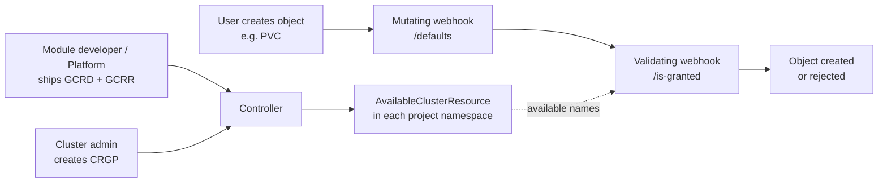

## Description

The module enables the creation of projects in a Kubernetes cluster. **Project** is an isolated environment where applications can be deployed.

## Why is this needed?

The standard `Namespace` resource, used for logical resource separation in Kubernetes, does not provide necessary functionalities, hence it is not an isolated environment:
* [Resource consumption by pods](https://kubernetes.io/docs/concepts/policy/resource-quotas/) is not limited by default;
* [Network communication](https://kubernetes.io/docs/concepts/services-networking/network-policies/) with other pods works by default from any point in the cluster;
* Unrestricted access to node resources: address space, network space, mounted host directories.

The configuration capabilities of `Namespace` do not fully meet modern development requirements. By default, the following features are not included for `Namespace`:
* Log collection;
* Audit;
* Vulnerability scanning.

The functionality of projects allows addressing these issues.


The [`secret-copier`](../secret-copier/) module cannot be used together with `multitenancy-manager` module.


## Advantages of the module

For platform administrators:
* **Consistency**: Administrators can create projects using the same template, ensuring consistency and simplifying management.
* **Security**: Projects provide isolation of resources and access policies between different projects, supporting a secure multitenant environment.
* **Resource Consumption**: Administrators can easily set quotas on resources and limitations for each project, preventing excessive resource usage.

For platform users:
* **Quick Start**: Developers can request projects created from ready-made templates from administrators, allowing for a quick start to developing a new application.
* **Isolation**: Each project provides an isolated environment where developers can deploy and test their applications without impacting other projects.

## Limitations

The module works only within the limits below:

- Creating more than one namespace within a project is not supported. If you need multiple namespaces, create a separate project for each of them.
- Template resources are applied only to a single namespace whose name matches the project name.

## Internal Logic

### Creating a project

To create projects, the following [Custom Resources](https://kubernetes.io/docs/concepts/extend-kubernetes/api-extension/custom-resources/) are used:
* [ProjectTemplate](./cr.html#projecttemplate) — a resource that describes the project template. It defines a list of resources to be created in the project and a schema for parameters that can be passed when creating the project;
* [Project](./cr.html#project) — a resource that describes a specific project.

When creating a [Project](./cr.html#project) resource from a specific [ProjectTemplate](./cr.html#projecttemplate), the following happens:
1. The [parameters](./cr.html#project-v1alpha2-spec-parameters) passed are validated against the OpenAPI specification (the [`parametersSchema.openAPIV3Schema`
](./cr.html#projecttemplate-v1alpha1-spec-parametersschema-openapiv3schema) field of [ProjectTemplate](./cr.html#projecttemplate));
1. Rendering of the [resources template](./cr.html#projecttemplate-v1alpha1-spec-resourcestemplate) is performed using [Helm](https://helm.sh/docs/). Values for rendering are taken from the [`parameters`](./cr.html#project-v1alpha2-spec-parameters) field of the [Project](./cr.html#project) resource;
1. A `Namespace` is created with a name matching the name of [Project](./cr.html#project);
1. All resources described in the template are created in sequence.

> **Attention!** When changing the project template, all created projects will be updated according to the new template.

### Isolating a project

The project is based on the `Namespace` resource mechanism. Namespaces group pods, services, secrets, and other objects but do not provide complete isolation. The project functionality enhances namespaces by offering additional tools to improve control and security levels. To manage project isolation, Kubernetes features can be leveraged, such as:

- Access control resources (`AuthorizationRule` / `RoleBinding`) — manage interaction with objects within a `Namespace`. Define rules and assign roles to precisely control who can perform actions in your project.
- Resource quotas (`ResourceQuota`) — set limits on resource usage, such as CPU time, RAM, and object counts within a `Namespace`. These quotas help prevent excessive load and maintain control over applications within the project.
- Network connectivity control resources  (`NetworkPolicy`) — control incoming and outgoing network traffic within a `Namespace`. Configure allowed connections between pods to enhance security and manage network interactions effectively.

These tools can be combined to configure the project according to the requirements of your application.

## Managing access to cluster-scoped resources

Projects routinely reference cluster-scoped resources — a `PersistentVolumeClaim` names a
`StorageClass`, a `Certificate` names a `ClusterIssuer`, a `RoleBinding` references a `ClusterRole`.
The module lets cluster administrators control, per project, **which** cluster resources may be used
from within project namespaces, and which value is used by default.

This is a separate mechanism from RBAC: RBAC decides *who can create* an object, grants decide *which
cluster resource values that object may reference*.

### How it works

The mechanism is a five-step pipeline:

1. **Definitions** ([`GrantableClusterResourceDefinition`](./cr.html#grantableclusterresourcedefinition),
   short name `gcrd`) register which cluster resources are governed (shipped by the platform, extended
   by module developers).
2. **References** ([`GrantableClusterResourceReference`](./cr.html#grantableclusterresourcereference),
   short name `gcrr`) declare *where* a granted resource is referenced — which field of which CRD is
   validated/defaulted (shipped by modules).
3. The **administrator** creates a
   [`ClusterResourceGrantPolicy`](./cr.html#clusterresourcegrantpolicy) (short name `crgp`) — the only
   manual step for access control. A policy selects projects by label and, per resource, lists the
   allowed/denied names and the per-project default.
4. The **controller** renders an
   [`AvailableClusterResource`](./cr.html#availableclusterresource) (short name `available`) catalog in
   each matched project's namespace — a read-only list of what the project may use.
5. **Webhooks** validate references on CREATE/UPDATE and substitute defaults on CREATE.

Until an administrator creates a `ClusterResourceGrantPolicy`, **all** resources are available (the
permissive default). Resource **quota** is not part of this system — it is delegated to the standard
Kubernetes `ResourceQuota`. Validation applies only to project namespaces; existing objects are
grandfathered on UPDATE.

### Resources registered by the platform

| Definition name | Granted resource | Registered paths | Defaulting mode |
| --- | --- | --- | --- |
| `storageclasses` | `StorageClass` (storage.k8s.io) | PVC `.spec.storageClassName` | Coerce |
| `loadbalancerclasses` | value-backed (no k8s object) | Service `.spec.loadBalancerClass` (guarded by `type: LoadBalancer`) | FillEmpty |
| `clusterissuers` | `ClusterIssuer` (cert-manager.io) | Certificate `.spec.issuerRef.name`; Ingress annotation `cert-manager.io/cluster-issuer` | FillEmpty / None |
| `clusterroles` | `ClusterRole` (rbac.authorization.k8s.io) | RoleBinding `.roleRef.name` | None |

The `clusterroles` registration excludes every `ClusterRole` lacking the
`rbac.deckhouse.io/delegatable` label — so by default only the namespace-level access roles
(`d8:use:role:*` and the legacy `user-authz:*` roles) are available in `RoleBinding`s.

### CRD ownership at a glance

| CRD | Short name | Scope | Created by | Manual creation | Purpose |
| --- | --- | --- | --- | --- | --- |
| `GrantableClusterResourceDefinition` | `gcrd` | Cluster | Module developer / Platform | Allowed for custom resources | Registers a cluster resource as grant-controlled |
| `GrantableClusterResourceReference` | `gcrr` | Cluster | Module developer | Allowed for custom CRD fields | Declares where a granted resource is referenced |
| `ClusterResourceGrantPolicy` | `crgp` | Cluster | Cluster administrator | **Required** — only manual | Allow/deny lists and defaults per project |
| `AvailableClusterResource` | `available` | Namespace | Controller (automatic) | **Forbidden** — protected by webhook | Read-only catalog of available resources for a project |

### Key behaviors

- **Permissive default**: without a `ClusterResourceGrantPolicy`, all resources are available.
- **Not a quota**: resource quota is delegated to the standard Kubernetes `ResourceQuota`.
- **Project namespaces only**: validation applies only to namespaces that are projects.
- **Grandfathering on UPDATE**: values already present in an object are preserved when the policy is
  narrowed — existing objects keep working.

For the full guide — administrator scenarios, tenant resource discovery, the module developer guide,
and validation/defaulting rules — see the [usage guide](./usage.html#managing-access-to-cluster-scoped-resources-grants).

