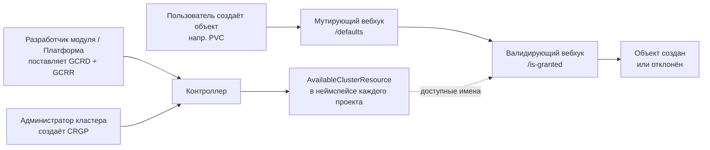

## Описание

Модуль позволяет создавать проекты в кластере Kubernetes. **Проект** — это изолированное окружение, в котором можно развернуть приложения.

## Для чего это нужно?

Стандартный ресурс `Namespace`, который используется для логического разделения ресурсов в Kubernetes, не предоставляет необходимых функций, поэтому не является изолированным окружением:

* [Потребление ресурсов подами](https://kubernetes.io/docs/concepts/policy/resource-quotas/) по умолчанию не ограничено;
* [Сетевое взаимодействие](https://kubernetes.io/docs/concepts/services-networking/network-policies/) с другими подами по умолчанию работает из любой точки кластера;
* Неограниченный доступ к ресурсам узла: адресное пространство, сетевое пространство, смонтированные директории хоста.

Возможности настройки пространств имен `Namespace` не полностью соответствуют современным требованиям к разработке. По умолчанию для `Namespace` не включены следующие функции:

* Сборка логов;
* Аудит;
* Сканирование уязвимостей.

Функционал проектов позволяет решить эти проблемы.


Модуль [`secret-copier`](../secret-copier/) не может использоваться совместно с модулем `multitenancy-manager`.


## Преимущества модуля

Для администраторов платформы:

* **Единообразие**: Администраторы могут создавать проекты, используя один и тот же шаблон, что обеспечивает единообразие и упрощает управление.
* **Безопасность**: Проекты обеспечивают изоляцию ресурсов и политик доступа между различными проектами, что поддерживает безопасное многотенантное окружение.
* **Потребление ресурсов**: Администраторы могут легко устанавливать квоты на ресурсы и ограничения для каждого проекта, предотвращая избыточное использование ресурсов.

Для пользователей платформы:

* **Быстрый старт**: Разработчики могут запрашивать у администраторов проекты, созданные по готовым шаблонам, что позволяет быстро начать разработку нового приложения.
* **Изоляция**: Каждый проект обеспечивает изолированное окружение, где разработчики могут развертывать и тестировать свои приложения без влияния на другие проекты.

## Ограничения

Модуль работает только в рамках перечисленных ниже ограничений:

- Создание более одного пространства имён внутри проекта не предусматривается. Если требуется несколько пространств имён, создайте отдельный проект для каждого из них.
- Ресурсы шаблона применяются только к одному пространству имён, имя которого совпадает с именем проекта.

## Внутренняя логика работы

### Создание проекта

Для создания проекта используются [ресурсы](https://kubernetes.io/docs/concepts/extend-kubernetes/api-extension/custom-resources/):

* [ProjectTemplate](./cr.html#projecttemplate) — ресурс, который описывает шаблон проекта. При помощи него задается список ресурсов, которые будут созданы в проекте, а также схема параметров, которые можно передать при создании проекта;
* [Project](./cr.html#project) — ресурс, который описывает конкретный проект.

При создании ресурса [Project](./cr.html#project) из определенного [ProjectTemplate](./cr.html#projecttemplate) происходит следующее:

1. Переданные [параметры](./cr.html#project-v1alpha2-spec-parameters) валидируются по OpenAPI-спецификации (параметр [`parametersSchema.openAPIV3Schema`
](./cr.html#projecttemplate-v1alpha1-spec-parametersschema-openapiv3schema) ресурса [ProjectTemplate](./cr.html#projecttemplate));
1. Выполняется рендеринг [шаблона для ресурсов](./cr.html#projecttemplate-v1alpha1-spec-resourcestemplate) с помощью [Helm](https://helm.sh/docs/). Значения для рендеринга берутся из параметра [`parameters`](./cr.html#project-v1alpha2-spec-parameters) ресурса [Project](./cr.html#project);
1. Cоздается `Namespace` с именем, которое совпадает c именем [Project](./cr.html#project);
1. По очереди создаются все ресурсы, описанные в шаблоне.

> **Внимание.** При изменении шаблона проекта, все созданные проекты будут обновлены в соответствии с новым шаблоном.

### Изоляция проекта

В основе проекта используется механизм изоляции ресурсов в рамках пространства имен (`Namespace`).
Пространства имен позволяют группировать поды, сервисы, секреты и другие объекты, но не обеспечивают полноценной изоляции.
Проект расширяет функциональность пространств имен, предлагая дополнительные инструменты для повышения уровня контроля и безопасности.
Для управления уровнем изоляции проекта можно использовать возможности Kubernetes, например:

* Ресурсы контроля доступа (`AuthorizationRule` / `RoleBinding`) — позволяют управлять взаимодействием объектов внутри `Namespace`. Вы можете задавать правила и назначать роли, чтобы точно контролировать, кто и что может делать в вашем проекте.
* Ресурсы контроля использования нагрузки (`ResourceQuota`) — с их помощью можно задать лимиты на использование процессорного времени (CPU), оперативной памяти (RAM), а также количества объектов внутри `Namespace`. Это помогает избежать чрезмерной нагрузки и обеспечивает мониторинг за приложениями в рамках проекта.
* Ресурсы контроля сетевой связности (`NetworkPolicy`) — управляют входящим и исходящим сетевым трафиком в `Namespace`. Таким образом, можно настроить разрешенные подключения между подами, улучшить безопасность и управляемость сетевого взаимодействия в рамках проекта.

Эти инструменты можно комбинировать, чтобы настроить проект в соответствии с требованиями вашего приложения.

## Управление доступом к кластерным ресурсам

Проекты регулярно ссылаются на кластерные ресурсы: `PersistentVolumeClaim` указывает `StorageClass`,
`Certificate` — `ClusterIssuer`, `RoleBinding` — `ClusterRole`. Модуль позволяет администраторам
кластера управлять для каждого проекта, **какие** кластерные ресурсы можно использовать из неймспейсов
проектов, и какое значение используется по умолчанию.

Это отдельный механизм от RBAC: RBAC решает, *кто может создать* объект, гранты — *какие кластерные
ресурсы этот объект может ссылаться*.

### Как это работает

Механизм — пятиступенчатый конвейер:

1. **Определения** ([`GrantableClusterResourceDefinition`](./cr.html#grantableclusterresourcedefinition),
   короткое имя `gcrd`) регистрируют, какие кластерные ресурсы контролируются (поставляются
   платформой, расширяются разработчиками модулей).
2. **Ссылки** ([`GrantableClusterResourceReference`](./cr.html#grantableclusterresourcereference),
   короткое имя `gcrr`) объявляют, *где* грантуемый ресурс используется — какое поле какого CRD
   валидируется/подставляется (поставляются модулями).
3. **Администратор** создаёт
   [`ClusterResourceGrantPolicy`](./cr.html#clusterresourcegrantpolicy) (короткое имя `crgp`) —
   единственный ручной шаг для контроля доступа. Политика выбирает проекты по меткам и для каждого
   ресурса задаёт разрешённые/запрещённые имена и дефолт проекта.
4. **Контроллер** формирует каталог
   [`AvailableClusterResource`](./cr.html#availableclusterresource) (короткое имя `available`) в
   неймспейсе каждого совпавшего проекта — read-only список того, что проект может использовать.
5. **Вебхуки** валидируют ссылки при CREATE/UPDATE и подставляют дефолты при CREATE.

Пока администратор не создал `ClusterResourceGrantPolicy`, **все** ресурсы доступны (разрешающий
дефолт). **Квотирование** ресурсов не является частью этой системы — оно делегировано стандартному
Kubernetes `ResourceQuota`. Валидация применяется только к неймспейсам проектов; существующие объекты
при UPDATE сохраняют свои значения (grandfathering).

### Ресурсы, регистрируемые платформой

| Имя определения | Грантируемый ресурс | Зарегистрированные пути | Режим дефолтинга |
| --- | --- | --- | --- |
| `storageclasses` | `StorageClass` (storage.k8s.io) | PVC `.spec.storageClassName` | Coerce |
| `loadbalancerclasses` | value-backed (без k8s-объекта) | Service `.spec.loadBalancerClass` (guard `type: LoadBalancer`) | FillEmpty |
| `clusterissuers` | `ClusterIssuer` (cert-manager.io) | Certificate `.spec.issuerRef.name`; аннотация Ingress `cert-manager.io/cluster-issuer` | FillEmpty / None |
| `clusterroles` | `ClusterRole` (rbac.authorization.k8s.io) | RoleBinding `.roleRef.name` | None |

Регистрация `clusterroles` исключает все `ClusterRole` без лейбла `rbac.deckhouse.io/delegatable` —
по умолчанию в `RoleBinding` доступны только роли уровня неймспейса (`d8:use:role:*` и устаревшие роли
`user-authz:*`).

### Матрица владения CRD

| CRD | Короткое имя | Область | Кто создаёт | Ручное создание | Назначение |
| --- | --- | --- | --- | --- | --- |
| `GrantableClusterResourceDefinition` | `gcrd` | Кластер | Разработчик модуля / Платформа | Разрешено для кастомных ресурсов | Регистрирует кластерный ресурс как управляемый грантами |
| `GrantableClusterResourceReference` | `gcrr` | Кластер | Разработчик модуля | Разрешено для полей кастомных CRD | Объявляет, где грантуемый ресурс используется |
| `ClusterResourceGrantPolicy` | `crgp` | Кластер | Администратор кластера | **Обязательно** — только ручное | Списки разрешений/запретов и дефолты для проекта |
| `AvailableClusterResource` | `available` | Неймспейс | Контроллер (автоматически) | **Запрещено** — защищено вебхуком | Read-only каталог доступных ресурсов для проекта |

### Ключевые поведения

- **Разрешающий дефолт**: без `ClusterResourceGrantPolicy` все ресурсы доступны.
- **Не квота**: квотирование ресурсов делегировано стандартному Kubernetes `ResourceQuota`.
- **Только неймспейсы проектов**: валидация применяется только к неймспейсам, которые являются проектами.
- **Grandfathering при UPDATE**: уже присутствующие в объекте значения сохраняются при сужении политики
  — существующие объекты продолжают работать.

Полное руководство — сценарии для администратора, обнаружение ресурсов тенантами, руководство для
разработчиков модулей, правила валидации и дефолтинга — см. в
[руководстве по использованию](./usage_ru.html#управление-доступом-к-кластерным-ресурсам-гранты).
