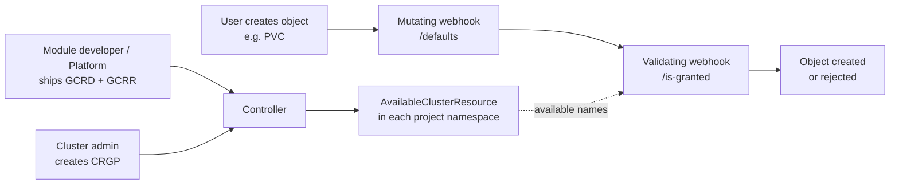



## Default project templates

The following project templates are included in the Deckhouse Kubernetes Platform:

- `default` — a template that covers basic project use cases:
  - resource limitation
  - network isolation
  - automatic alerts and log collection
  - choice of security profile
  - project administrators setup

  Template description on [GitHub](https://github.com/deckhouse/deckhouse/blob/main/modules/160-multitenancy-manager/images/multitenancy-manager/src/templates/default.yaml).

- `secure` — includes all the capabilities of the `default` template and additional features:
  - setting up permissible UID/GID for the project
  - audit rules for project users' access to the Linux kernel
  - scanning of launched container images for CVE presence

  Template description on [GitHub](https://github.com/deckhouse/deckhouse/blob/main/modules/160-multitenancy-manager/images/multitenancy-manager/src/templates/secure.yaml).

- `secure-with-dedicated-nodes` — includes all the capabilities of the `secure` template and additional features:
  - defining the node selector for all the pods in the project: if a pod is created, the node selector pod will be **substituted** with the project's node selector automatically.
  - defining the default toleration for all the pods in the project: if a pod is created, the default toleration will be **added** to the pod automatically.

  Template description on [GitHub](https://github.com/deckhouse/deckhouse/blob/main/modules/160-multitenancy-manager/images/multitenancy-manager/src/templates/secure-with-dedicated-nodes.yaml).

To list all available parameters for a project template, execute the command:

```shell
d8 k get projecttemplates <PROJECT_TEMPLATE_NAME> -o jsonpath='{.spec.parametersSchema.openAPIV3Schema}' | jq
```

## Creating a project

1. To create a project, create the [Project](cr.html#project) resource by specifying the name of the project template in [.spec.projectTemplateName](cr.html#project-v1alpha2-spec-projecttemplatename) field.
1. In the [.spec.parameters](cr.html#project-v1alpha2-spec-parameters) field of the Project resource, specify the parameter values suitable for the ProjectTemplate [.spec.parametersSchema.openAPIV3Schema](cr.html#projecttemplate-v1alpha1-spec-parametersschema-openapiv3schema).

   Example of creating a project using the [Project](cr.html#project) resource from the `default` [ProjectTemplate](cr.html#projecttemplate):

   ```yaml
   apiVersion: deckhouse.io/v1alpha2
   kind: Project
   metadata:
     name: my-project
   spec:
     description: This is an example from the Deckhouse documentation.
     projectTemplateName: default
     parameters:
       resourceQuota:
         requests:
           cpu: 5
           memory: 5Gi
           storage: 1Gi
         limits:
           cpu: 5
           memory: 5Gi
       networkPolicy: Isolated
       podSecurityProfile: Restricted
       extendedMonitoringEnabled: true
       administrators:
       - subject: Group
         name: k8s-admins
   ```

1. To check the status of the project, execute the command:

   ```shell
   d8 k get projects my-project
   ```

   A successfully created project should be in the `Deployed` state. If the state equals `Error`, add the `-o yaml` argument to the command (e.g., `d8 k get projects my-project -o yaml`) to get more detailed information about the error.

### Creating a project automatically for a namespace

You can create a new project for a namespace. To do this, add the `projects.deckhouse.io/adopt` annotation to the namespace. For example:

1. Create a new namespace:

   ```shell
   d8 k create ns test
   ```

1. Add the annotation:

   ```shell
   d8 k annotate ns test projects.deckhouse.io/adopt=""
   ```

1. Make sure that the project was created:

   ```shell
   d8 k get projects
   ```

   A new project corresponding to the namespace will appear in the project list:

   ```shell
   NAME        STATE      PROJECT TEMPLATE   DESCRIPTION                                            AGE
   deckhouse   Deployed   virtual            This is a virtual project                              181d
   default     Deployed   virtual            This is a virtual project                              181d
   test        Deployed   empty                                                                     1m
   ```

You can change the template of the created project to the existing one.




Note that changing the template may cause a resource conflict. If the template chart contains resources that are already present in the namespace, you will not be able to apply the template.




## Creating your own project template

Default templates cover basic project use cases and serve as a good example of template capabilities.

To create your own template:

1. Take one of the default templates as a basis, for example, `default`.
1. Copy it to a separate file, for example, `my-project-template.yaml` using the command:

   ```shell
   d8 k get projecttemplates default -o yaml > my-project-template.yaml
   ```

1. Edit the `my-project-template.yaml` file, make the necessary changes.

   
   You must update not only the template itself, but also the input parameters schema to match it.

   Project templates support all [Helm templating functions](https://helm.sh/docs/chart_template_guide/function_list/).
   

1. Change the template name in the `.metadata.name` field.
1. Apply your new template with the command:

   ```shell
   d8 k apply -f my-project-template.yaml
   ```

1. Check the availability of the new template with the command:

   ```shell
   d8 k get projecttemplates <NEW_TEMPLATE_NAME>
   ```



## Using labels to manage resources

When creating resources in `ProjectTemplate`, you can use special labels to control how the `multitenancy-manager` processes these resources.

### Skipping creation of the `heritage: multitenancy-manager` label

By default, all resources created from `ProjectTemplate` receive the label `heritage: multitenancy-manager`.  
This label prohibits changes to resources by users or any other controller except `multitenancy-manager`.  
If you need to allow resource modification (for example, for compatibility with other systems, or if implementing your own control over the created objects), add the label `projects.deckhouse.io/skip-heritage-label` to the resource.

Example:



```yaml
---
apiVersion: v1
kind: ConfigMap
metadata:
  name: my-config
  namespace: {{ .projectName }}
  labels:
    projects.deckhouse.io/skip-heritage-label: "true"
    app: my-app
data:
  key: value
```



In this case, the resource will receive the labels `projects.deckhouse.io/project` and `projects.deckhouse.io/project-template`, but will not receive the label `heritage: multitenancy-manager`.

### Excluding resources from management by multitenancy-manager

If you need to exclude a resource from management by `multitenancy-manager` (for example, if the resource should be managed manually or by another controller), add the label `projects.deckhouse.io/unmanaged` to the resource.

Example:



```yaml
---
apiVersion: v1
kind: Secret
metadata:
  name: external-secret
  namespace: {{ .projectName }}
  labels:
    projects.deckhouse.io/unmanaged: "true"
type: Opaque
data:
  token: <base64-encoded-value>
```



Resources with the label `projects.deckhouse.io/unmanaged`:

- Will be created **only once** when the project is created;
- **Will not be updated** with subsequent template changes or updates;
- Will not be monitored in the project's status;
- Will receive the labels `projects.deckhouse.io/project` and `projects.deckhouse.io/project-template` but **will not receive** the label `heritage: multitenancy-manager`.


Once a resource is marked as `unmanaged`, it will be created on initial installation but not updated when the `ProjectTemplate` is changed.  
After creation, the resource becomes fully independent and must be managed manually.


## Implementing validation of object changes with a custom label

The `multitenancy-manager` module uses `ValidatingAdmissionPolicy` to protect resources labeled `heritage: multitenancy-manager` from manual changes.  
You can implement similar validation for resources with any label.

### How validation works in multitenancy-manager

Validation occurs for objects labeled `heritage: multitenancy-manager`.  
The following components are used for this:

1. `ValidatingAdmissionPolicy`: Defines validation rules:
   - Operations: `UPDATE` and `DELETE`.
   - Check: only operations on behalf of the controller's service account are allowed.
   - Applies to all resources and API groups.
1. `ValidatingAdmissionPolicyBinding`: Defines which objects the validation applies to:
   - Uses `namespaceSelector` and `objectSelector` to select resources by the label `heritage: multitenancy-manager`.

### Creating your own validation

To implement validation for resources with a different label (for example, `heritage: my-custom-label`):

1. Create a file with the ValidatingAdmissionPolicy and ValidatingAdmissionPolicyBinding resource manifests:

   ```yaml
   apiVersion: admissionregistration.k8s.io/v1
   kind: ValidatingAdmissionPolicy
   metadata:
     name: my-custom-label-validation
   spec:
     failurePolicy: Fail
     matchConstraints:
       resourceRules:
         - apiGroups:   ["*"]
           apiVersions: ["*"]
           operations:  ["UPDATE", "DELETE"]
           resources:   ["*"]
           scope: "*"
     validations:
       - expression: 'request.userInfo.username == "system:serviceaccount:my-namespace:my-service-account"' # Replace with your service account
         reason: Forbidden
         messageExpression: 'object.kind == ''Namespace'' ? ''This resource is managed by '' + object.metadata.name + '' system. Manual modification is forbidden.''
           : ''This resource is managed by '' + object.metadata.namespace + '' system. Manual modification is forbidden.'''
   ---
   apiVersion: admissionregistration.k8s.io/v1
   kind: ValidatingAdmissionPolicyBinding
   metadata:
     name: my-custom-label-validation
   spec:
     policyName: my-custom-label-validation
     validationActions: [Deny, Audit]
     matchResources:
       namespaceSelector:
         matchLabels:
           heritage: my-custom-label
       objectSelector:
         matchLabels:
           heritage: my-custom-label
   ```

1. Configure the validation parameters:

   - `policyName`: Unique policy name (must match in Policy and Binding).
   - `request.userInfo.username`: The name of the service account allowed to change resources (replace with your service account).
   - `heritage: my-custom-label`: The value of the `heritage` label for your resources (replace with your value). The use of the values `multitenancy-manager`, `deckhouse` is prohibited.
   - `failurePolicy: Fail`: Policy on validation failure.
     - `Fail`: Reject the request on validation failure.
     - `Ignore`: Ignore validation errors.
   - `validationActions`: Validation actions:
     - `Deny`: Deny unauthorized operations.
     - `Audit`: Record operations in the audit log.
1. Apply the policy:

   ```shell
   d8 k apply -f my-validation-policy.yaml
   ```

1. Ensure your resources have the corresponding `heritage` label:

   ```yaml
   apiVersion: v1
   kind: ConfigMap
   metadata:
     name: my-resource
     labels:
       heritage: my-custom-label
   ```

## Managing access to cluster-scoped resources (grants)

Projects routinely reference cluster-scoped resources — a `PersistentVolumeClaim` names a `StorageClass`,
a `Certificate` names a `ClusterIssuer`, a `RoleBinding` references a `ClusterRole`. The
`multitenancy-manager` lets cluster administrators control, per project, **which** cluster resources may
be used from within project namespaces, and which value is used by default.

This is a separate mechanism from RBAC: RBAC decides *who can create* an object, grants decide *which
cluster resource values that object may reference*. A user needs both — the RBAC right to create a PVC
*and* a grant that allows the chosen `StorageClass`.

### How it works

The mechanism is a five-step pipeline:

1. **Definitions** ([`GrantableClusterResourceDefinition`](cr.html#grantableclusterresourcedefinition),
   short name `gcrd`) register which cluster resources are governed. Deckhouse ships a set of
   registrations by default; module developers can add their own.
2. **References** ([`GrantableClusterResourceReference`](cr.html#grantableclusterresourcereference),
   short name `gcrr`) declare *where* a granted resource is referenced — which field of which CRD is
   validated and/or defaulted. Deckhouse ships references for the built-in paths; module developers can
   register paths for their own CRDs.
3. The **administrator** creates a
   [`ClusterResourceGrantPolicy`](cr.html#clusterresourcegrantpolicy) (short name `crgp`) — this is the
   only manual step for controlling access. A policy selects projects by label and, per resource, lists
   the allowed/denied names and the per-project default.
4. The **controller** renders an
   [`AvailableClusterResource`](cr.html#availableclusterresource) (short name `available`) catalog in
   each matched project's namespace — a read-only list of what the project may use.
5. **Webhooks** validate references on CREATE/UPDATE and substitute defaults on CREATE.



Until an administrator creates a `ClusterResourceGrantPolicy`, **all** resources are available (the
permissive default). Resource **quota** is not part of this system — it is delegated to the standard
Kubernetes `ResourceQuota`. Validation applies only to project namespaces.

### CRD ownership at a glance

| CRD | Short name | Scope | Created by | Manual creation | Purpose |
| --- | --- | --- | --- | --- | --- |
| `GrantableClusterResourceDefinition` | `gcrd` | Cluster | Module developer / Platform | Allowed for custom resources | Registers a cluster resource as grant-controlled |
| `GrantableClusterResourceReference` | `gcrr` | Cluster | Module developer | Allowed for custom CRD fields | Declares where a granted resource is referenced (validation/defaulting path) |
| `ClusterResourceGrantPolicy` | `crgp` | Cluster | Cluster administrator | **Required** — only manual | Allow/deny lists and defaults per project |
| `AvailableClusterResource` | `available` | Namespace | Controller (automatic) | **Forbidden** — protected by webhook | Read-only catalog of available resources for a project |

### Resources registered by the platform

These registrations are shipped by default (from the module's Helm chart), so the feature works out of the
box. `defaultAvailability: All` everywhere, so nothing is restricted until an admin narrows it with a
policy.

| Definition name | Granted resource | Registered paths | Defaulting mode |
| --- | --- | --- | --- |
| `storageclasses` | `StorageClass` (storage.k8s.io) | PVC `.spec.storageClassName` | Coerce |
| `loadbalancerclasses` | value-backed (no k8s object) | Service `.spec.loadBalancerClass` (guarded by `type: LoadBalancer`) | FillEmpty |
| `clusterissuers` | `ClusterIssuer` (cert-manager.io) | Certificate `.spec.issuerRef.name` (guarded by `kind: ClusterIssuer`); Ingress annotation `cert-manager.io/cluster-issuer` | FillEmpty / None |
| `clusterroles` | `ClusterRole` (rbac.authorization.k8s.io) | RoleBinding `.roleRef.name` (guarded by `kind: ClusterRole`) | None |

The `clusterroles` registration excludes every `ClusterRole` that lacks the
`rbac.deckhouse.io/delegatable` label — so by default only the namespace-level access roles
(`d8:use:role:*` and the legacy `user-authz:*` roles) are available in `RoleBinding`s.

### For cluster administrators

#### Scenario 1 — Restrict StorageClasses for a project

Allow only `fast-ssd` and `standard` in production projects, and default empty PVCs to `fast-ssd`:



```yaml
---
apiVersion: multitenancy.deckhouse.io/v1alpha1
kind: ClusterResourceGrantPolicy
metadata:
  name: production-storage
spec:
  projectSelector:
    matchLabels:
      environment: production
  resources:
    - resourceName: storageclasses
      default: fast-ssd
      allowed:
        - fast-ssd
        - standard
```



A PVC created without `spec.storageClassName` is patched to `fast-ssd`. A PVC naming a `StorageClass`
that is not in the list is rejected. Because the path uses the **Coerce** defaulting mode, a PVC whose
`storageClassName` was pre-filled by the built-in Kubernetes admission (the cluster-wide default) with a
value not available to the project is *rewritten* to the project default instead of being rejected.

Check what the project actually sees:

```shell
d8 k get available storageclasses -n <project-name> -o yaml
```

#### Scenario 2 — Restrict ClusterIssuers for a project

The `clusterissuers` registration has two paths: `Certificate.spec.issuerRef.name` (guarded by
`issuerRef.kind == ClusterIssuer`, **FillEmpty** defaulting) and the Ingress annotation
`cert-manager.io/cluster-issuer` (**None** defaulting — it is a feature toggle, so it is validated but
never filled in automatically).



```yaml
---
apiVersion: multitenancy.deckhouse.io/v1alpha1
kind: ClusterResourceGrantPolicy
metadata:
  name: production-issuers
spec:
  projectSelector:
    matchLabels:
      environment: production
  resources:
    - resourceName: clusterissuers
      default: letsencrypt-prod
      allowed:
        - letsencrypt-prod
        - vault-issuer
```



A `Certificate` whose `issuerRef.kind` is `ClusterIssuer` and whose `issuerRef.name` is empty is
filled with `letsencrypt-prod` on creation. A `Certificate` naming a disallowed issuer is rejected. The
Ingress annotation is validated against the same allow-list but is never defaulted.

> The `clusterissuers` registration is only shipped when the `cert-manager` module is enabled.

#### Scenario 3 — Restrict ClusterRoles in RoleBindings

By default only delegatable ClusterRoles are available in `RoleBinding`s (everything lacking the
`rbac.deckhouse.io/delegatable` label is excluded). To grant a project access to additional ClusterRoles:



```yaml
---
apiVersion: multitenancy.deckhouse.io/v1alpha1
kind: ClusterResourceGrantPolicy
metadata:
  name: extra-roles
spec:
  projectSelector:
    matchLabels:
      team: payments
  resources:
    - resourceName: clusterroles
      allowed:
        - my-custom-role
      allowedSelector:
        matchLabels:
          shared: "true"
```



The `allowed`/`allowedSelector` entries are *unioned with* the default-excluded set, so the delegatable
roles remain available. The path uses **None** defaulting — auto-filling a ClusterRole into a RoleBinding
makes no sense, so only validation is performed.

#### Scenario 4 — Restrict LoadBalancerClasses

`loadbalancerclasses` is a **value-backed** resource — there is no k8s object, the "names" are simply
the values of `Service.spec.loadBalancerClass`. The path is guarded by `spec.type == LoadBalancer` and
uses **FillEmpty** defaulting.



```yaml
---
apiVersion: multitenancy.deckhouse.io/v1alpha1
kind: ClusterResourceGrantPolicy
metadata:
  name: lb-classes
spec:
  projectSelector:
    matchLabels:
      environment: staging
  resources:
    - resourceName: loadbalancerclasses
      default: internal-lb
      allowed:
        - internal-lb
        - edge-lb
```



A `LoadBalancer` Service created without `spec.loadBalancerClass` is filled with `internal-lb`. A
Service naming a disallowed class is rejected.

#### Scenario 5 — Fully open a resource for specific projects

Use `availabilityDefault: All` to open a resource completely for matched projects (overrides the
registration's `defaultAvailability`), without an allow-list:



```yaml
---
apiVersion: multitenancy.deckhouse.io/v1alpha1
kind: ClusterResourceGrantPolicy
metadata:
  name: open-storage-for-sandbox
spec:
  projectSelector:
    matchLabels:
      environment: sandbox
  resources:
    - resourceName: storageclasses
      availabilityDefault: All
```



This is rarely needed — an allow-list already implies a `None` baseline and is the usual way to
restrict. `availabilityDefault` is for flipping the baseline *without* a list.

#### Scenario 6 — Deny specific resources, allow the rest

Use the `denied` list (or `deniedSelector`) to exclude specific names while keeping everything else
available:



```yaml
---
apiVersion: multitenancy.deckhouse.io/v1alpha1
kind: ClusterResourceGrantPolicy
metadata:
  name: deny-expensive-storage
spec:
  projectSelector:
    matchLabels:
      environment: dev
  resources:
    - resourceName: storageclasses
      denied:
        - expensive-nvme
        - archived-hdd
```



`denied` overrides `allowed`/`allowedSelector`: a name matching both is denied.

#### Scenario 7 — Use label selectors for dynamic lists

`allowedSelector` and `deniedSelector` grant or exclude objects by label, which avoids listing every
name:



```yaml
---
apiVersion: multitenancy.deckhouse.io/v1alpha1
kind: ClusterResourceGrantPolicy
metadata:
  name: shared-storage-only
spec:
  projectSelector:
    matchLabels:
      tier: shared
  resources:
    - resourceName: storageclasses
      allowedSelector:
        matchLabels:
          shared: "true"
      deniedSelector:
        matchLabels:
          deprecated: "true"
```



### How validation and defaulting work

**Availability resolution order.** For a given object name, the controller decides availability in
this order (first match wins):

1. `excluded` filters on the `GrantableClusterResourceDefinition` — a hard deny, regardless of any
   policy;
2. `denied` / `deniedSelector` on the matching policy entry;
3. `allowed` / `allowedSelector` on the matching policy entry;
4. the policy entry's `availabilityDefault`;
5. the definition's `defaultAvailability`.

**Defaulting modes** (set per path in the `GrantableClusterResourceReference`):

- `None` — validate only, never substitute a value (e.g. feature-toggle annotations, RoleBinding
  roleRef).
- `FillEmpty` — fill the per-project default into an *empty* field on CREATE (e.g. Certificate
  issuerRef, Service loadBalancerClass).
- `Coerce` — rewrite an *unavailable or empty* value to the per-project default on CREATE (e.g. PVC
  storageClassName, where the built-in admission may have pre-filled the cluster default).

**Default value resolution.** The per-project default comes from the policy entry's `default` if set,
otherwise from the definition's `defaultFrom` (an annotation marking the cluster-wide default object),
otherwise empty.

**Grandfathering.** On UPDATE, values already present in the object are not rejected — existing objects
keep working after a policy is narrowed. Only CREATE and field changes on UPDATE are validated against
the current grants.

**System requests.** Requests from system service accounts (e.g. the platform's own controllers) bypass
grant validation, so platform components are not blocked.

### For project users (tenants)

#### Discovering available cluster resources

Each project namespace gets an `AvailableClusterResource` object per registered definition. Read them
to find out which cluster resources your project may use and which is the default:

```shell
# List all available cluster resources in your project:
d8 k get available -n <project-name>

# Full details for one resource (names + which is the default):
d8 k get available storageclasses -n <project-name> -o yaml
```

Example output:

```text
NAME                KIND         DEFAULT      AVAILABLE   AGE
storageclasses      StorageClass fast-ssd     2           5m
clusterissuers      ClusterIssuer letsencrypt 2           5m
```

#### Understanding rejections

If a create/update is rejected with a message like `resource <name> is not available to project
<project>`, the value you referenced is not in your project's allow-list. Check the `AvailableClusterResource`
catalog — if the name is missing, ask the cluster administrator to add it (or use a name that is listed).

#### Understanding auto-defaulting

For paths with `FillEmpty` or `Coerce` defaulting, leaving the field empty (or, for Coerce, naming an
unavailable value) results in the per-project default being substituted automatically on CREATE. You do
not need to specify the value yourself — but you can always set it explicitly to any name listed in the
`AvailableClusterResource` catalog.

### For module developers

#### Registering a validation path for an existing granted resource

If your module's CRD has a field that references a cluster resource already registered as grantable
(e.g. a `StorageClass`), ship a `GrantableClusterResourceReference` in your Helm chart so that field is
validated and (optionally) defaulted for projects.

Template for a reference:



```yaml
---
apiVersion: multitenancy.deckhouse.io/v1alpha1
kind: GrantableClusterResourceReference
metadata:
  name: mycrd-storageclasses
  labels:
    heritage: deckhouse
    module: my-module
spec:
  grantableClusterResourceName: storageclasses   # An existing GrantableClusterResourceDefinition
  rule:
    apiGroups:   ["my.example.com"]
    apiVersions: ["v1"]
    resources:    ["postgresdatabases"]
  fieldPaths:
    - path: $.spec.storageClassName
      defaulting: Coerce
```



Key fields:

- `grantableClusterResourceName` — the `metadata.name` of the `GrantableClusterResourceDefinition` this
  path validates against.
- `rule` — which usage objects this reference applies to (API groups/versions/resources, as plural
  names).
- `fieldPaths` — the version-scoped locations of the granted name. At least one entry is required.
  Each entry has a `path` (JSONPath to the granted name), an optional `defaulting` mode, an optional
  `match` guard, and optional `apiGroups`/`apiVersions` to scope the entry to specific versions.

Choose the `defaulting` mode per path:

- `None` — validate only. Use for annotations that toggle a feature (their absence is meaningful) or
  for fields that should never be auto-filled (e.g. a RoleBinding's `roleRef.name`).
- `FillEmpty` — fill the per-project default on CREATE when the field is empty. Use for fields the
  resource needs but the user often omits (e.g. a Certificate's `issuerRef.name`).
- `Coerce` — rewrite an unavailable *or* empty value to the per-project default on CREATE. Use for
  fields that a built-in admission may pre-fill with a value not available to the project (e.g. a PVC's
  `storageClassName`).

Use a `match` guard to apply the path only when a predicate holds — e.g. only validate
`issuerRef.name` when `issuerRef.kind == ClusterIssuer`, or only validate `loadBalancerClass` when
`spec.type == LoadBalancer`:



```yaml
  fieldPaths:
    - path: $.spec.loadBalancerClass
      match:
        fieldPath: $.spec.type
        equals: LoadBalancer
      defaulting: FillEmpty
```



For CRDs with multiple API versions, provide version-scoped entries and an unscoped fallback — the
entry whose `apiGroups`/`apiVersions` match the request's GVK wins; an entry with empty scope is the
fallback.

Example: a `PostgresDatabase` CRD referencing a `StorageClass`:



```yaml
---
apiVersion: multitenancy.deckhouse.io/v1alpha1
kind: GrantableClusterResourceReference
metadata:
  name: postgresdatabases-storageclasses
  labels:
    heritage: deckhouse
    module: postgres
spec:
  grantableClusterResourceName: storageclasses
  rule:
    apiGroups:   ["postgres.example.com"]
    apiVersions: ["*"]
    resources:    ["postgresdatabases"]
  fieldPaths:
    - path: $.spec.storageClassName
      defaulting: Coerce
```



#### Registering a brand-new granted resource

To make a new cluster resource grant-controllable, ship a `GrantableClusterResourceDefinition` in your
chart, then one or more `GrantableClusterResourceReference` objects for the paths that reference it:



```yaml
---
apiVersion: multitenancy.deckhouse.io/v1alpha1
kind: GrantableClusterResourceDefinition
metadata:
  name: myclusterresources
  labels:
    heritage: deckhouse
    module: my-module
spec:
  grantedResource:
    apiGroup: my.example.com
    kind: MyClusterResource
  enforcement: Managed          # Managed = our webhooks enforce; External = your own webhook
  defaultAvailability: All      # All = available unless a policy narrows it; None = locked by default
  # defaultFrom:                # Optional: annotation marking the cluster-wide default object
  #   annotationKey: my.example.com/is-default
  excluded:                     # Optional: objects never available to tenants (hard deny)
    - matchExpressions:
        - key: my.example.com/internal
          operator: Exists
```



Choose `enforcement`:

- `Managed` — the platform's webhooks enforce the grants (the usual choice).
- `External` — your module's own webhook enforces; the registration is informational only.

Choose `defaultAvailability`:

- `All` — the resource is available unless a policy narrows it (permissive; the platform default).
- `None` — the resource is locked unless a policy explicitly opens it (restrictive).

Then register the paths with `GrantableClusterResourceReference` objects as shown above.

#### Using `x-deckhouse-grantable-resource` in DKP application settings

For DKP application settings (not raw CRDs), use the `x-deckhouse-grantable-resource` OpenAPI extension
on a string field. The `deckhouse-controller` then automatically validates the field against the
matching grants and substitutes the per-project default — no manual reference registration is needed.

See the [application development guide](/products/kubernetes-platform/documentation/v1/architecture/marketplace/application-development.html) for the schema and examples.

#### Observability for developers

- `GrantableClusterResourceDefinition.status.references` — a reverse index of the
  `GrantableClusterResourceReference` objects bound to the definition (their names and matched
  resources).
- `GrantableClusterResourceReference.status.bound` — `true` when the referenced definition exists.
- `GrantableClusterResourceReference.status.conditions[Bound]` — `Resolved` when bound, or
  `UnknownResource` when the referenced definition does not exist (a typo or a missing registration).

### Monitoring and alerts

- **Alert** `ClusterResourceGrantPolicyViolation`: fires when existing objects in a project violate the
  current grants (e.g. after a policy is narrowed). It is informational — the objects are not broken
  (grandfathering), but the administrator is alerted to the drift.
- **Grafana dashboard**: *Security → Cluster Resource Grant Violations*.
- **Metric**: `d8_cluster_objects_grant_violated`.
