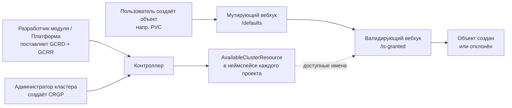



## Шаблоны для проектов доступные по умолчанию

В Deckhouse Kubernetes Platform есть набор шаблонов для создания проектов:

- `default` — шаблон для базовых сценариев использования проектов:
  - ограничение ресурсов;
  - сетевая изоляция;
  - автоматические алерты и сбор логов;
  - выбор профиля безопасности;
  - настройка администраторов проекта.

    Описание шаблона [в GitHub](https://github.com/deckhouse/deckhouse/blob/main/modules/160-multitenancy-manager/images/multitenancy-manager/src/templates/default.yaml).

- `secure` — включает все возможности шаблона `default`, а также дополнительные функции:
  - настройка допустимых для проекта UID/GID;
  - правила аудита обращения Linux-пользователей проекта к ядру;
  - сканирование запускаемых образов контейнеров на наличие известных уязвимостей (CVE).

  Описание шаблона [в GitHub](https://github.com/deckhouse/deckhouse/blob/main/modules/160-multitenancy-manager/images/multitenancy-manager/src/templates/secure.yaml).

- `secure-with-dedicated-nodes` — включает все возможности шаблона `secure`, а также дополнительные функции:
  - определение селектора узла для всех подов в проекте: если под создан, селектор узла пода будет автоматически **заменён** на селектор узла проекта;
  - определение стандартных tolerations для всех подов в проекте: если под создан, стандартные значения tolerations **добавляются** к нему автоматически.

  Описание шаблона [в GitHub](https://github.com/deckhouse/deckhouse/blob/main/modules/160-multitenancy-manager/images/multitenancy-manager/src/templates/secure-with-dedicated-nodes.yaml).

Чтобы перечислить все доступные параметры для шаблона проекта, выполните команду:

```shell
d8 k get projecttemplates <ИМЯ_ШАБЛОНА_ПРОЕКТА> -o jsonpath='{.spec.parametersSchema.openAPIV3Schema}' | jq
```

## Создание проекта

1. Для создания проекта создайте ресурс [Project](cr.html#project) с указанием имени шаблона проекта в поле [.spec.projectTemplateName](cr.html#project-v1alpha2-spec-projecttemplatename).
1. В параметре [.spec.parameters](cr.html#project-v1alpha2-spec-parameters) ресурса Project укажите значения параметров для секции [.spec.parametersSchema.openAPIV3Schema](cr.html#projecttemplate-v1alpha1-spec-parametersschema-openapiv3schema) ресурса ProjectTemplate.

   Пример создания проекта с помощью ресурса [Project](cr.html#project) из `default` [ProjectTemplate](cr.html#projecttemplate) представлен ниже:

   ```yaml
   apiVersion: deckhouse.io/v1alpha2
   kind: Project
   metadata:
     name: my-project
   spec:
     description: This is an example from the Deckhouse documentation.
     projectTemplateName: default
     parameters:
       resourceQuota:
         requests:
           cpu: 5
           memory: 5Gi
           storage: 1Gi
         limits:
           cpu: 5
           memory: 5Gi
       networkPolicy: Isolated
       podSecurityProfile: Restricted
       extendedMonitoringEnabled: true
       administrators:
       - subject: Group
         name: k8s-admins
   ```

1. Для проверки статуса проекта выполните команду:

   ```shell
   d8 k get projects my-project
   ```

   Успешно созданный проект должен отображаться в статусе `Deployed` (синхронизирован). Если отображается статус `Error` (ошибка), добавьте аргумент `-o yaml` к команде (например, `d8 k get projects my-project -o yaml`) для получения более подробной информации о причине ошибки.

### Автоматическое создание проекта для пространства имён

Для пространства имён возможно создать новый проект. Для этого пометьте пространство имён аннотацией `projects.deckhouse.io/adopt`. Например:

1. Создайте новое пространство имён:

   ```shell
   d8 k create ns test
   ```

1. Пометьте его аннотацией:

   ```shell
   d8 k annotate ns test projects.deckhouse.io/adopt=""
   ```

1. Убедитесь, что проект создался:

   ```shell
   d8 k get projects
   ```

   В списке проектов появится новый проект, соответствующий пространству имён:

   ```shell
   NAME        STATE      PROJECT TEMPLATE   DESCRIPTION                                            AGE
   deckhouse   Deployed   virtual            This is a virtual project                              181d
   default     Deployed   virtual            This is a virtual project                              181d
   test        Deployed   empty                                                                     1m
   ```

Шаблон созданного проекта можно изменить на существующий.




Обратите внимание, что при смене шаблона может возникнуть конфликт ресурсов: если в чарте шаблона прописаны ресурсы, которые уже присутствуют в пространстве имён, то применить шаблон не получится.




## Создание собственного шаблона для проекта

Шаблоны проектов по умолчанию включают базовые сценарии использования и служат примером возможностей шаблонов.

Для создания своего шаблона:

1. Возьмите за основу один из шаблонов по умолчанию, например, `default`.
1. Скопируйте его в отдельный файл, например, `my-project-template.yaml` при помощи команды:

   ```shell
   d8 k get projecttemplates default -o yaml > my-project-template.yaml
   ```

1. Отредактируйте файл `my-project-template.yaml`, внесите в него необходимые изменения.

   
   Необходимо изменить не только шаблон, но и схему входных параметров под него.

   Шаблоны для проектов поддерживают все [функции шаблонизации Helm](https://helm.sh/docs/chart_template_guide/function_list/).
   

1. Измените имя шаблона в поле `.metadata.name`.
1. Примените полученный шаблон командой:

   ```shell
   d8 k apply -f my-project-template.yaml
   ```

1. Проверьте доступность нового шаблона с помощью команды:

   ```shell
   d8 k get projecttemplates <ИМЯ_НОВОГО_ШАБЛОНА>
   ```



## Использование лейблов для управления ресурсами

При создании ресурсов в `ProjectTemplate` можно использовать специальные лейблы для управления поведением `multitenancy-manager` при обработке этих ресурсов:

### Пропуск создания лейбла `heritage: multitenancy-manager`

По умолчанию все ресурсы, созданные из `ProjectTemplate`, получают лейбл `heritage: multitenancy-manager`.  
Он запрещают изменение ресурсов пользователями или любым контроллером, кроме `multitenancy-manager`.  
Если необходимо разрешить изменение ресурса (например, для совместимости с другими системами, или в случае реализации собственного контроля изменения создаваемых объектов), добавьте к ресурсу лейбл `projects.deckhouse.io/skip-heritage-label`.

Пример:



```yaml
---
apiVersion: v1
kind: ConfigMap
metadata:
  name: my-config
  namespace: {{ .projectName }}
  labels:
    projects.deckhouse.io/skip-heritage-label: "true"
    app: my-app
data:
  key: value
```



В этом случае ресурс получит лейблы `projects.deckhouse.io/project` и `projects.deckhouse.io/project-template`, но не получит лейбл `heritage: multitenancy-manager`.

### Исключение ресурсов из управления multitenancy-manager

Если необходимо исключить ресурс из управления `multitenancy-manager` (например, если он должен управляться вручную или другим контроллером), добавьте к ресурсу лейбл `projects.deckhouse.io/unmanaged`.

Пример:



```yaml
---
apiVersion: v1
kind: Secret
metadata:
  name: external-secret
  namespace: {{ .projectName }}
  labels:
    projects.deckhouse.io/unmanaged: "true"
type: Opaque
data:
  token: <base64-encoded-value>
```



Ресурсы с лейблом `projects.deckhouse.io/unmanaged`:

- Будут созданы **только один раз** при создании проекта;
- **Не будут обновляться** при последующих изменениях шаблона или обновлениях;
- Не будут отслеживаться в статусе проекта;
- Получат лейблы `projects.deckhouse.io/project` и `projects.deckhouse.io/project-template`, но **не получат** лейбл `heritage: multitenancy-manager`.


После того как ресурс помечен как `unmanaged`, он будет создан при первой установке, но не будет обновляться при изменении ProjectTemplate.
После создания ресурс становится полностью независимым и должен управляться вручную.


## Реализация валидации изменений объектов с помощью пользовательского лейбла

Модуль `multitenancy-manager` использует `ValidatingAdmissionPolicy` для защиты ресурсов с лейблом `heritage: multitenancy-manager` от ручных изменений.  
Вы можете реализовать аналогичную валидацию для ресурсов с любым лейблом.

### Как работает валидация в multitenancy-manager

Происходит валидация объектов с лейблом `heritage: multitenancy-manager`.  
Для этого используются следующие ресурсы:

1. ValidatingAdmissionPolicy — определяет правила валидации:
   - Операции: `UPDATE` и `DELETE`;
   - Проверка: разрешены только операции от имени service account контроллера;
   - Применяется ко всем ресурсам и API группам.

1. ValidatingAdmissionPolicyBinding — определяет на какие объекты распространяется валидация:
   - Использует `namespaceSelector` и `objectSelector` для выбора ресурсов по лейблу `heritage: multitenancy-manager`.

### Создание собственной валидации

Для реализации валидации для ресурсов с другим лейблом (например, `heritage: my-custom-label`):

1. Создайте файл с манифестами ресурсов ValidatingAdmissionPolicy и ValidatingAdmissionPolicyBinding:

   ```yaml
   apiVersion: admissionregistration.k8s.io/v1
   kind: ValidatingAdmissionPolicy
   metadata:
     name: my-custom-label-validation
   spec:
     failurePolicy: Fail
     matchConstraints:
       resourceRules:
         - apiGroups:   ["*"]
           apiVersions: ["*"]
           operations:  ["UPDATE", "DELETE"]
           resources:   ["*"]
           scope: "*"
     validations:
       - expression: 'request.userInfo.username == "system:serviceaccount:my-namespace:my-service-account"' # Замените на ваш service account.
         reason: Forbidden
         messageExpression: 'object.kind == ''Namespace'' ? ''This resource is managed by '' + object.metadata.name + '' system. Manual modification is forbidden.''
           : ''This resource is managed by '' + object.metadata.namespace + '' system. Manual modification is forbidden.'''
   ---
   apiVersion: admissionregistration.k8s.io/v1
   kind: ValidatingAdmissionPolicyBinding
   metadata:
     name: my-custom-label-validation
   spec:
     policyName: my-custom-label-validation
     validationActions: [Deny, Audit]
     matchResources:
       namespaceSelector:
         matchLabels:
           heritage: my-custom-label
       objectSelector:
         matchLabels:
           heritage: my-custom-label
   ```

1. Настройте параметры валидации:

   - `policyName` — уникальное имя политики (должно совпадать с `Policy` и `Binding`);
   - `request.userInfo.username` — имя service account, которому разрешено изменять ресурсы (замените на ваш service account);
   - `heritage: my-custom-label` — значение лейбла `heritage` для ваших ресурсов (замените на ваше значение). Запрещено использование значение `multitenancy-manager`, `deckhouse`;
   - `failurePolicy: Fail` — политика при ошибке валидации:
     - `Fail` — отклонять запрос при ошибке проверки,
     - `Ignore` — игнорировать ошибки валидации.
   - `validationActions` — действия валидации:
     - `Deny` — отклонять неразрешенные операции,
     - `Audit` — записывать операции в аудит лог.

1. Примените политику:

   ```shell
   d8 k apply -f my-validation-policy.yaml
   ```

1. Убедитесь, что ваши ресурсы имеют соответствующий лейбл `heritage`:

   ```yaml
   apiVersion: v1
   kind: ConfigMap
   metadata:
     name: my-resource
     labels:
       heritage: my-custom-label
   ```

## Управление доступом к кластерным ресурсам (гранты)

Проекты routinely ссылаются на кластерные ресурсы: `PersistentVolumeClaim` указывает `StorageClass`,
`Certificate` — `ClusterIssuer`, `RoleBinding` — `ClusterRole`. Модуль `multitenancy-manager` позволяет
администраторам кластера управлять для каждого проекта, **какие** кластерные ресурсы можно использовать
из неймспейсов проектов, и какое значение используется по умолчанию.

Это отдельный механизм от RBAC: RBAC решает, *кто может создать* объект, гранты — *какие кластерные
ресурсы этот объект может ссылаться*. Пользователю нужно и то, и другое — RBAC-право на создание PVC *и*
грант, разрешающий выбранный `StorageClass`.

### Как это работает

Механизм — пятиступенчатый конвейер:

1. **Определения** ([`GrantableClusterResourceDefinition`](cr.html#grantableclusterresourcedefinition),
   короткое имя `gcrd`) регистрируют, какие кластерные ресурсы контролируются. Deckhouse поставляет набор
   регистраций по умолчанию; разработчики модулей могут добавлять свои.
2. **Ссылки** ([`GrantableClusterResourceReference`](cr.html#grantableclusterresourcereference),
   короткое имя `gcrr`) объявляют, *где* грантуемый ресурс используется — какое поле какого CRD
   валидируется и/или подставляется по умолчанию. Deckhouse поставляет ссылки для встроенных путей;
   разработчики модулей могут регистрировать пути для своих CRD.
3. **Администратор** создаёт
   [`ClusterResourceGrantPolicy`](cr.html#clusterresourcegrantpolicy) (короткое имя `crgp`) — это
   единственный ручной шаг для контроля доступа. Политика выбирает проекты по меткам и для каждого
   ресурса задаёт разрешённые/запрещённые имена и дефолт проекта.
4. **Контроллер** формирует каталог
   [`AvailableClusterResource`](cr.html#availableclusterresource) (короткое имя `available`) в
   неймспейсе каждого совпавшего проекта — read-only список того, что проект может использовать.
5. **Вебхуки** валидируют ссылки при CREATE/UPDATE и подставляют дефолты при CREATE.



Пока администратор не создал `ClusterResourceGrantPolicy`, **все** ресурсы доступны (разрешающий
дефолт). **Квотирование** ресурсов не является частью этой системы — оно делегировано стандартному
Kubernetes `ResourceQuota`. Валидация применяется только к неймспейсам проектов.

### Матрица владения CRD

| CRD | Короткое имя | Область | Кто создаёт | Ручное создание | Назначение |
| --- | --- | --- | --- | --- | --- |
| `GrantableClusterResourceDefinition` | `gcrd` | Кластер | Разработчик модуля / Платформа | Разрешено для кастомных ресурсов | Регистрирует кластерный ресурс как управляемый грантами |
| `GrantableClusterResourceReference` | `gcrr` | Кластер | Разработчик модуля | Разрешено для полей кастомных CRD | Объявляет, где грантуемый ресурс используется (путь валидации/дефолтинга) |
| `ClusterResourceGrantPolicy` | `crgp` | Кластер | Администратор кластера | **Обязательно** — только ручное | Списки разрешений/запретов и дефолты для проекта |
| `AvailableClusterResource` | `available` | Неймспейс | Контроллер (автоматически) | **Запрещено** — защищено вебхуком | Read-only каталог доступных ресурсов для проекта |

### Ресурсы, регистрируемые платформой

Эти регистрации поставляются по умолчанию (из Helm-чарта модуля), поэтому механизм работает «из коробки».
Везде `defaultAvailability: All` — ничего не ограничено, пока администратор не сузит доступ политикой.

| Имя определения | Грантируемый ресурс | Зарегистрированные пути | Режим дефолтинга |
| --- | --- | --- | --- |
| `storageclasses` | `StorageClass` (storage.k8s.io) | PVC `.spec.storageClassName` | Coerce |
| `loadbalancerclasses` | value-backed (без k8s-объекта) | Service `.spec.loadBalancerClass` (guard `type: LoadBalancer`) | FillEmpty |
| `clusterissuers` | `ClusterIssuer` (cert-manager.io) | Certificate `.spec.issuerRef.name` (guard `kind: ClusterIssuer`); аннотация Ingress `cert-manager.io/cluster-issuer` | FillEmpty / None |
| `clusterroles` | `ClusterRole` (rbac.authorization.k8s.io) | RoleBinding `.roleRef.name` (guard `kind: ClusterRole`) | None |

Регистрация `clusterroles` исключает все `ClusterRole` без лейбла `rbac.deckhouse.io/delegatable` —
по умолчанию в `RoleBinding` доступны только роли уровня неймспейса (`d8:use:role:*` и устаревшие роли
`user-authz:*`).

### Для администраторов кластера

#### Сценарий 1 — Ограничение StorageClasses для проекта

Разрешить только `fast-ssd` и `standard` в production-проектах, а пустые PVC дефолтить на `fast-ssd`:



```yaml
---
apiVersion: multitenancy.deckhouse.io/v1alpha1
kind: ClusterResourceGrantPolicy
metadata:
  name: production-storage
spec:
  projectSelector:
    matchLabels:
      environment: production
  resources:
    - resourceName: storageclasses
      default: fast-ssd
      allowed:
        - fast-ssd
        - standard
```



PVC, созданный без `spec.storageClassName`, патчится на `fast-ssd`. PVC с `StorageClass`, которого нет
в списке, отклоняется. Поскольку путь использует режим **Coerce**, PVC, чей `storageClassName` был
предзаполнен встроенным admission Kubernetes (кластерным дефолтом) значением, недоступным проекту,
*перезаписывается* на дефолт проекта, а не отклоняется.

Проверьте, что видит проект:

```shell
d8 k get available storageclasses -n <имя-проекта> -o yaml
```

#### Сценарий 2 — Ограничение ClusterIssuers для проекта

Регистрация `clusterissuers` содержит два пути: `Certificate.spec.issuerRef.name` (guard
`issuerRef.kind == ClusterIssuer`, дефолтинг **FillEmpty**) и аннотацию Ingress
`cert-manager.io/cluster-issuer` (дефолтинг **None** — это переключатель функции, поэтому валидируется,
но никогда не подставляется автоматически).



```yaml
---
apiVersion: multitenancy.deckhouse.io/v1alpha1
kind: ClusterResourceGrantPolicy
metadata:
  name: production-issuers
spec:
  projectSelector:
    matchLabels:
      environment: production
  resources:
    - resourceName: clusterissuers
      default: letsencrypt-prod
      allowed:
        - letsencrypt-prod
        - vault-issuer
```



`Certificate` с `issuerRef.kind == ClusterIssuer` и пустым `issuerRef.name` при создании заполняется
значением `letsencrypt-prod`. `Certificate` с запрещённым issuer отклоняется. Аннотация Ingress
валидируется по тому же allow-списку, но никогда не подставляется.

> Регистрация `clusterissuers` поставляется только при включённом модуле `cert-manager`.

#### Сценарий 3 — Ограничение ClusterRoles в RoleBinding

По умолчанию в `RoleBinding` доступны только delegatable ClusterRoles (всё без лейбла
`rbac.deckhouse.io/delegatable` исключается). Чтобы выдать проекту дополнительные ClusterRoles:



```yaml
---
apiVersion: multitenancy.deckhouse.io/v1alpha1
kind: ClusterResourceGrantPolicy
metadata:
  name: extra-roles
spec:
  projectSelector:
    matchLabels:
      team: payments
  resources:
    - resourceName: clusterroles
      allowed:
        - my-custom-role
      allowedSelector:
        matchLabels:
          shared: "true"
```



Записи `allowed`/`allowedSelector` *объединяются с* набором исключённых по умолчанию, поэтому
delegatable-роли остаются доступными. Путь использует дефолтинг **None** — автоподстановка ClusterRole
в RoleBinding бессмысленна, выполняется только валидация.

#### Сценарий 4 — Ограничение LoadBalancerClasses

`loadbalancerclasses` — **value-backed** ресурс: объекта k8s нет, «имена» — это просто значения
`Service.spec.loadBalancerClass`. Путь ограничен guard `spec.type == LoadBalancer` и использует
дефолтинг **FillEmpty**.



```yaml
---
apiVersion: multitenancy.deckhouse.io/v1alpha1
kind: ClusterResourceGrantPolicy
metadata:
  name: lb-classes
spec:
  projectSelector:
    matchLabels:
      environment: staging
  resources:
    - resourceName: loadbalancerclasses
      default: internal-lb
      allowed:
        - internal-lb
        - edge-lb
```



`LoadBalancer`-Service, созданный без `spec.loadBalancerClass`, заполняется значением `internal-lb`.
Service с запрещённым классом отклоняется.

#### Сценарий 5 — Полное открытие ресурса для конкретных проектов

Используйте `availabilityDefault: All`, чтобы полностью открыть ресурс для совпавших проектов
(перекрывает `defaultAvailability` регистрации), без allow-списка:



```yaml
---
apiVersion: multitenancy.deckhouse.io/v1alpha1
kind: ClusterResourceGrantPolicy
metadata:
  name: open-storage-for-sandbox
spec:
  projectSelector:
    matchLabels:
      environment: sandbox
  resources:
    - resourceName: storageclasses
      availabilityDefault: All
```



Это редко нужно — allow-список уже задаёт базу `None` и является обычным способом ограничить.
`availabilityDefault` нужен, чтобы перевернуть базу *без* списка.

#### Сценарий 6 — Запрет конкретных ресурсов, разрешение остальных

Используйте список `denied` (или `deniedSelector`), чтобы исключить конкретные имена, оставив остальное
доступным:



```yaml
---
apiVersion: multitenancy.deckhouse.io/v1alpha1
kind: ClusterResourceGrantPolicy
metadata:
  name: deny-expensive-storage
spec:
  projectSelector:
    matchLabels:
      environment: dev
  resources:
    - resourceName: storageclasses
      denied:
        - expensive-nvme
        - archived-hdd
```



`denied` перекрывает `allowed`/`allowedSelector`: имя, совпавшее с обоими, запрещается.

#### Сценарий 7 — Использование label-селекторов для динамических списков

`allowedSelector` и `deniedSelector` выдают или исключают объекты по лейблу, что избавляет от
перечисления всех имён:



```yaml
---
apiVersion: multitenancy.deckhouse.io/v1alpha1
kind: ClusterResourceGrantPolicy
metadata:
  name: shared-storage-only
spec:
  projectSelector:
    matchLabels:
      tier: shared
  resources:
    - resourceName: storageclasses
      allowedSelector:
        matchLabels:
          shared: "true"
      deniedSelector:
        matchLabels:
          deprecated: "true"
```



### Как работают валидация и дефолтинг

**Порядок определения доступности.** Для данного имени объекта доступность определяется в следующем
порядке (первое совпадение выигрывает):

1. фильтры `excluded` на `GrantableClusterResourceDefinition` — жёсткий запрет, независимо от политики;
2. `denied` / `deniedSelector` на совпавшей записи политики;
3. `allowed` / `allowedSelector` на совпавшей записи политики;
4. `availabilityDefault` записи политики;
5. `defaultAvailability` определения.

**Режимы дефолтинга** (задаются на путь в `GrantableClusterResourceReference`):

- `None` — только валидация, значение никогда не подставляется (напр. аннотации-переключатели,
  roleRef в RoleBinding).
- `FillEmpty` — подставить дефолт проекта в *пустое* поле при CREATE (напр. issuerRef в Certificate,
  loadBalancerClass в Service).
- `Coerce` — перезаписать *недоступное или пустое* значение на дефолт проекта при CREATE (напр.
  storageClassName в PVC, где встроенный admission мог предзаполнить кластерный дефолт).

**Определение значения по умолчанию.** Дефолт проекта берётся из `default` записи политики, если задан;
иначе из `defaultFrom` определения (аннотация, помечающая кластерный дефолт-объект); иначе пусто.

**Grandfathering.** При UPDATE уже присутствующие в объекте значения не отклоняются — существующие
объекты продолжают работать после сужения политики. Валидации подвергаются только CREATE и изменения
полей при UPDATE.

**Системные запросы.** Запросы от системных service accounts (напр. собственных контроллеров платформы)
обходят валидацию грантов, поэтому компоненты платформы не блокируются.

### Для пользователей проекта (тенантов)

#### Обнаружение доступных кластерных ресурсов

В неймспейсе каждого проекта создаётся объект `AvailableClusterResource` на каждое зарегистрированное
определение. Читайте их, чтобы узнать, какие кластерные ресурсы разрешено использовать и какой является
дефолтом:

```shell
# Список всех доступных кластерных ресурсов в проекте:
d8 k get available -n <имя-проекта>

# Полная информация по одному ресурсу (имена + какой дефолт):
d8 k get available storageclasses -n <имя-проекта> -o yaml
```

Пример вывода:

```text
NAME                KIND         DEFAULT      AVAILABLE   AGE
storageclasses      StorageClass fast-ssd     2           5m
clusterissuers      ClusterIssuer letsencrypt 2           5m
```

#### Понимание отказов

Если создание/обновление отклонено с сообщением вида `resource <name> is not available to project
<project>`, указанное значение отсутствует в allow-списке проекта. Проверьте каталог
`AvailableClusterResource` — если имени нет, попросите администратора кластера добавить его (или
используйте имя из списка).

#### Понимание автоподстановки дефолтов

Для путей с дефолтингом `FillEmpty` или `Coerce` пустое поле (или, для Coerce, недоступное значение)
при CREATE автоматически заменяется на дефолт проекта. Значение можно не указывать — но всегда можно
задать его явно любым именем из каталога `AvailableClusterResource`.

### Для разработчиков модулей

#### Регистрация пути валидации для существующего грантуемого ресурса

Если CRD вашего модуля содержит поле, ссылающееся на уже зарегистрированный грантуемый кластерный
ресурс (напр. `StorageClass`), поставьте `GrantableClusterResourceReference` в вашем Helm-чарте, чтобы
поле валидировалось и (опционально) подставлялось по умолчанию для проектов.

Шаблон ссылки:



```yaml
---
apiVersion: multitenancy.deckhouse.io/v1alpha1
kind: GrantableClusterResourceReference
metadata:
  name: mycrd-storageclasses
  labels:
    heritage: deckhouse
    module: my-module
spec:
  grantableClusterResourceName: storageclasses   # Существующий GrantableClusterResourceDefinition
  rule:
    apiGroups:   ["my.example.com"]
    apiVersions: ["v1"]
    resources:    ["postgresdatabases"]
  fieldPaths:
    - path: $.spec.storageClassName
      defaulting: Coerce
```



Ключевые поля:

- `grantableClusterResourceName` — `metadata.name` определения `GrantableClusterResourceDefinition`, по
  которому валидируется путь.
- `rule` — к каким usage-объектам применяется ссылка (apiGroups/apiVersions/resources во множественном
  числе).
- `fieldPaths` — version-scoped расположения грантуемого имени. Требуется минимум одна запись. У каждой
  записи: `path` (JSONPath до имени), опциональный режим `defaulting`, опциональный guard `match` и
  опциональные `apiGroups`/`apiVersions` для ограничения записи конкретными версиями.

Выбирайте режим `defaulting` на путь:

- `None` — только валидация. Используйте для аннотаций-переключателей (их отсутствие осмысленно) или
  полей, которые не следует автоподставлять (напр. `roleRef.name` в RoleBinding).
- `FillEmpty` — подставить дефолт проекта при CREATE, если поле пусто. Используйте для полей, которые
  ресурсу нужны, но пользователь их часто опускает (напр. `issuerRef.name` в Certificate).
- `Coerce` — перезаписать недоступное *или* пустое значение на дефолт проекта при CREATE. Используйте
  для полей, которые встроенный admission может предзаполнить недоступным проекту значением (напр.
  `storageClassName` в PVC).

Используйте guard `match`, чтобы применять путь только при выполнении предиката — напр. валидировать
`issuerRef.name` только при `issuerRef.kind == ClusterIssuer`, или `loadBalancerClass` только при
`spec.type == LoadBalancer`:



```yaml
  fieldPaths:
    - path: $.spec.loadBalancerClass
      match:
        fieldPath: $.spec.type
        equals: LoadBalancer
      defaulting: FillEmpty
```



Для CRD с несколькими API-версиями предоставьте version-scoped записи и unscoped fallback — выигрывает
запись, чьи `apiGroups`/`apiVersions` совпадают с GVK запроса; запись с пустой областью — fallback.

Пример: CRD `PostgresDatabase`, ссылающийся на `StorageClass`:



```yaml
---
apiVersion: multitenancy.deckhouse.io/v1alpha1
kind: GrantableClusterResourceReference
metadata:
  name: postgresdatabases-storageclasses
  labels:
    heritage: deckhouse
    module: postgres
spec:
  grantableClusterResourceName: storageclasses
  rule:
    apiGroups:   ["postgres.example.com"]
    apiVersions: ["*"]
    resources:    ["postgresdatabases"]
  fieldPaths:
    - path: $.spec.storageClassName
      defaulting: Coerce
```



#### Регистрация совершенно нового грантуемого ресурса

Чтобы сделать новый кластерный ресурс управляемым грантами, поставьте
`GrantableClusterResourceDefinition` в вашем чарте, затем один или несколько
`GrantableClusterResourceReference` для путей, которые на него ссылаются:



```yaml
---
apiVersion: multitenancy.deckhouse.io/v1alpha1
kind: GrantableClusterResourceDefinition
metadata:
  name: myclusterresources
  labels:
    heritage: deckhouse
    module: my-module
spec:
  grantedResource:
    apiGroup: my.example.com
    kind: MyClusterResource
  enforcement: Managed          # Managed = наши вебхуки; External = ваш собственный вебхук
  defaultAvailability: All      # All = доступен, пока политика не сузит; None = закрыт по умолчанию
  # defaultFrom:                # Опционально: аннотация, помечающая кластерный дефолт-объект
  #   annotationKey: my.example.com/is-default
  excluded:                     # Опционально: объекты, никогда не доступные тенантам (жёсткий запрет)
    - matchExpressions:
        - key: my.example.com/internal
          operator: Exists
```



Выбор `enforcement`:

- `Managed` — гранты обеспечивает вебхук платформы (обычный выбор).
- `External` — гранты обеспечивает собственный вебхук вашего модуля; регистрация информационная.

Выбор `defaultAvailability`:

- `All` — ресурс доступен, пока политика не сузит его (разрешающий; платформенный дефолт).
- `None` — ресурс закрыт, пока политика явно его не откроет (ограничивающий).

Затем зарегистрируйте пути объектами `GrantableClusterResourceReference`, как показано выше.

#### Использование `x-deckhouse-grantable-resource` в настройках DKP-приложений

Для настроек DKP-приложений (не «сырых» CRD) используйте OpenAPI-расширение
`x-deckhouse-grantable-resource` на строковом поле. `deckhouse-controller` автоматически валидирует поле
по совпадающим грантам и подставляет дефолт проекта — ручная регистрация ссылки не нужна.

См. [руководство по разработке приложений](/products/kubernetes-platform/documentation/v1/architecture/marketplace/application-development.html) — схема и примеры.

#### Наблюдаемость для разработчиков

- `GrantableClusterResourceDefinition.status.references` — обратный индекс объектов
  `GrantableClusterResourceReference`, привязанных к определению (их имена и совпавшие ресурсы).
- `GrantableClusterResourceReference.status.bound` — `true`, когда указанное определение существует.
- `GrantableClusterResourceReference.status.conditions[Bound]` — `Resolved` при привязке или
  `UnknownResource`, когда определения не существует (опечатка или отсутствующая регистрация).

### Мониторинг и алерты

- **Алерт** `ClusterResourceGrantPolicyViolation`: срабатывает, когда существующие объекты в проекте
  нарушают текущие гранты (напр. после сужения политики). Он информационный — объекты не сломаны
  (grandfathering), но администратор оповещается о расхождении.
- **Grafana-дашборд**: *Security → Cluster Resource Grant Violations*.
- **Метрика**: `d8_cluster_objects_grant_violated`.
