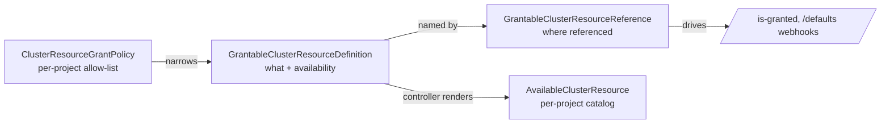

# Cluster resource grants — design

Status: design. This supersedes the earlier quota-bearing design. Quota is **removed** from this
feature (delegated to Kubernetes `ResourceQuota`); the feature now does **availability** (which
cluster-scoped resources a project may reference) and **defaulting** only.

## Problem

A project (tenant) lives in one or more namespaces and references **cluster-scoped** resources from
its objects: `StorageClass` (via `PersistentVolumeClaim.spec.storageClassName`), `ClusterIssuer` (via
`Certificate.spec.issuerRef` / an `Ingress` annotation), `ClusterRole` (via `RoleBinding.roleRef`),
`LoadBalancerClass` (via `Service.spec.loadBalancerClass`), and arbitrary global resources referenced
from third-party module CRDs. The platform must control, per project: **which** such resources are
usable and **what the default** is — without per-user proxying.

Two requirements shape the model:

1. **Extensibility.** A module developer must be able to register a *new validation path* — "in my
   CRD, field X references global resource Z" — **without editing** the central registration owned by
   the resource's owner.
2. **No bespoke quota.** Object/usage quota is left to Kubernetes `ResourceQuota` (per-storage-class
   storage and PVC count are native; total object counts via `count/<resource>.<group>`; LB services
   via `services.loadbalancers`). See [Why no quota](#why-no-quota).

## User stories

Personas: **module developer** (owns a resource domain and/or a CRD that references global resources),
**cluster admin** (governs projects), **tenant** (works inside a project's namespaces).

Module developer:
- **D1** — register a cluster-scoped resource as grantable: its identity and baseline availability. → `GrantableClusterResourceDefinition`
- **D2** — register a *new validation path* for **my own** resource ("field X of my CRD references global resource Z") **without editing** the resource owner's registration. → `GrantableClusterResourceReference` *(the story driving this redesign)*
- **D3** — declare how the resource's cluster-wide default is discovered (an annotation on the object). → `defaultFrom`
- **D4** — exclude some objects of my resource from ever being grantable (hard deny, e.g. system `ClusterRole`s). → `excluded`
- **D5** — per path, choose validate-only vs also-default, and how to default. → `fieldPaths[].defaulting`
- **D6** — keep enforcement in my own webhook; the platform only renders the catalog. → `enforcement: External`

Cluster admin:
- **A1** — control, per project, which granted names are usable (allow-list / selector). → `ClusterResourceGrantPolicy`
- **A2** — set the per-project default name. → policy `default`
- **A3** — flip the baseline for a project (open fully / lock down). → policy `availabilityDefault`
- **A4** — deny specific names for a project (override the allow-list). → policy `denied`/`deniedSelector`

Tenant:
- **T1** — discover what my project may use and the default, via ordinary namespace RBAC. → `AvailableClusterResource`
- **T2** — a reference to a disallowed resource is rejected with a clear message; an omitted field is defaulted where the path opts in.

Observability:
- **O1** — as a resource owner, see which paths reference my resource. → `definition.status.references`
- **O2** — as a path author, see whether my reference resolved or I mistyped the name. → `reference.status.bound` / `Bound` condition

Out of scope (delegated): **quota** on usage — left to Kubernetes `ResourceQuota` (see [Why no quota](#why-no-quota)).

## Model: split definition from reference

Governance and usage paths are **two separate concerns**, so they are two CRDs:

- **`GrantableClusterResourceDefinition`** (cluster-scoped) — declares a governed cluster resource and
  its baseline availability. Owned by whoever owns the resource domain.
- **`GrantableClusterResourceReference`** (cluster-scoped) — declares **one place** the resource is
  referenced (a validation/defaulting path). Shipped by **any** module, for its own resources.

Plus the per-project pieces, unchanged from before:

- **`ClusterResourceGrantPolicy`** (cluster-scoped) — per-project (by selector) allow-list + default.
- **`AvailableClusterResource`** (namespaced, read-only) — the controller-rendered catalog a tenant
  reads to discover what its project may use.



## CRDs

### GrantableClusterResourceDefinition

```yaml
apiVersion: multitenancy.deckhouse.io/v1alpha1
kind: GrantableClusterResourceDefinition
metadata:
  name: storageclasses
spec:
  grantedResource:                 # the governed cluster-scoped resource; absent ⇒ value-backed
    apiGroup: storage.k8s.io       # group + kind (version is resolved via discovery)
    kind: StorageClass
  enforcement: Managed             # Managed (our webhooks enforce) | External (owner enforces; we only render the catalog)
  defaultAvailability: All         # All (usable unless a policy narrows) | None (opt-in)
  excluded:                        # objects never available to tenants (hard deny); names and/or selectors
    - matchLabels:
        storageclass.deckhouse.io/system: "true"
  defaultFrom:                     # how to discover the resource's cluster-wide default value
    annotationKey: storageclass.kubernetes.io/is-default-class
status:
  observedGeneration: 1
  references:                      # reverse index: which paths point at this resource
    - name: storageclasses-pvc
      resources:
        - persistentvolumeclaims
    - name: storageclasses-postgres
      resources:
        - postgresqls
  referenceCount: 2
  conditions: []                   # standard Ready condition, set by the controller
```

| field | meaning |
|-------|---------|
| `grantedResource.apiGroup`/`.kind` | the governed resource. Present ⇒ object-backed (selectors apply); absent ⇒ value-backed (names are field values, e.g. `loadBalancerClass`). Version resolved by discovery. |
| `enforcement` | `Managed` (default) or `External` |
| `defaultAvailability` | baseline when no policy decides: `All` (default) or `None` |
| `excluded` | objects never available, regardless of policy (hard deny) |
| `defaultFrom.annotationKey` | annotation marking the resource's cluster default (fallback default) |
| `status.references[]` | reference objects bound to this definition (name + matched resources) |
| `status.referenceCount` | `len(references)` (printer column) |

No `usageReferences`, no `measure`, no `coerceToDefault` — measurement is gone; defaulting behaviour
moved to the reference.

### GrantableClusterResourceReference

```yaml
apiVersion: multitenancy.deckhouse.io/v1alpha1
kind: GrantableClusterResourceReference
metadata:
  name: storageclasses-pvc
spec:
  grantableClusterResourceName: storageclasses   # the definition this path validates against
  rule:                                           # which usage objects this reference matches
    apiGroups:
      - ""
    apiVersions:
      - v1
    resources:
      - persistentvolumeclaims
  fieldPaths:                                     # where the granted NAME is, per version
    - path: $.spec.storageClassName               # entry without scope = default (all versions)
      defaulting: Coerce                          # None | FillEmpty | Coerce
    # version-scoped entry example (IngressClass moved between versions):
    # - apiVersions:
    #     - v1beta1
    #   path: $.metadata.annotations['kubernetes.io/ingress.class']
    #   defaulting: None
status:
  observedGeneration: 1
  bound: true                                     # grantableClusterResourceName resolves to a definition
  conditions:
    - type: Bound
      status: "True"
      reason: Resolved                            # Resolved | UnknownResource (name missed)
```

| field | meaning |
|-------|---------|
| `grantableClusterResourceName` | the `GrantableClusterResourceDefinition` this path validates against |
| `rule.apiGroups/apiVersions/resources` | which usage objects this reference applies to; `*` = any |
| `fieldPaths[]` | version-scoped name locations: `{apiGroups?, apiVersions?, path, match?, defaulting?}` |
| `fieldPaths[].path` | JSONPath to the granted name (may target an annotation) |
| `fieldPaths[].match` | `{fieldPath, equals\|in}` guard: the entry applies only when the predicate holds |
| `fieldPaths[].defaulting` | `None` (validate only), `FillEmpty` (inject project default into an empty field), `Coerce` (also rewrite a disallowed value — for fields a built-in admission pre-fills) |
| `status.bound` | true if the named definition exists |
| `status.conditions[Bound].reason` | `Resolved` or `UnknownResource` |

**Path selection.** For a request of group/version `g/v`, pick the `fieldPaths` entry whose
`apiGroups`/`apiVersions` match `g/v`; a more specific (scoped) entry beats an unscoped one; the
unscoped entry is the fallback. At least one entry is required; a fallback (unscoped) entry is
recommended.

### ClusterResourceGrantPolicy (unchanged)

Per-project allow-list and default; selects projects by namespace labels via `projectSelector`, and
per resource (`resourceName`) sets `allowed` / `allowedSelector` / `denied` / `deniedSelector` /
`default` / `availabilityDefault`. An allow-list infers a `None` baseline.

### AvailableClusterResource (unchanged)

Per-project catalog (available names + default) the controller renders into each project namespace.

## Coverage: which CRD closes which story

| CRD / component | stories closed |
|-----------------|----------------|
| `GrantableClusterResourceDefinition` | D1 (register), D3 (`defaultFrom`), D4 (`excluded`), D6 (`enforcement: External`), O1 (`status.references`) |
| `GrantableClusterResourceReference` | D2 (register a path), D5 (`defaulting`), O2 (`status.bound`) |
| `ClusterResourceGrantPolicy` | A1 (allow-list), A2 (default), A3 (`availabilityDefault`), A4 (`denied`) |
| `AvailableClusterResource` | T1 (discovery) |
| `/is-granted` + `/defaults` webhooks | T2 (reject + default) |
| Kubernetes `ResourceQuota` (delegated) | quota — out of scope |

Every story has an owner; no story is left uncovered, and nothing in the model exists without a story.

## Availability resolution

Precedence for "may project P use granted name N of resource R":
`excluded → denied → allowed → policy availabilityDefault → registration defaultAvailability`.
This lives in a single place (`internal/resolve`) shared by the webhook and the reconciler.

## Defaulting

Per path (`fieldPaths[].defaulting`):

- `None` — validate only. Use for a reference whose absence is meaningful (a feature-toggling
  annotation like `cert-manager.io/cluster-issuer`).
- `FillEmpty` — on CREATE, inject the project default into an empty field.
- `Coerce` — `FillEmpty` plus: rewrite a non-empty value that is not available to the project default.
  For fields a built-in admission controller pre-fills (e.g. `DefaultStorageClass` on PVCs).

The default *value* comes from the policy's `default`, falling back to the definition's `defaultFrom`.

## Webhooks

Generated from the set of `GrantableClusterResourceReference` (their `rule`s determine the intercepted
GVKs — so registering a reference automatically extends interception to that module's CRD):

- **`/is-granted`** (validating) — for the request's GVK, find matching references → their definitions
  → deny if the referenced name is not available to the project. On UPDATE, values already present are
  grandfathered so existing objects are not broken.
- **`/defaults`** (mutating, CREATE) — apply `fieldPaths[].defaulting`.
- **`/protect`** (validating) — keep the controller-owned `AvailableClusterResource` read-only (with
  system-group exemptions). No quota status to protect anymore.

## Controller

- **Catalog reconciler** (keyed by namespace) — renders `AvailableClusterResource` per project per
  definition from resolved availability.
- **Binding reconciler** (keyed by `GrantableClusterResourceReference` and
  `GrantableClusterResourceDefinition`) — sets `reference.status.bound`/`Bound` condition and the
  definition's `status.references`/`referenceCount` reverse index.

## Worked examples

**StorageClass** — definition + the PVC path:

```yaml
---
apiVersion: multitenancy.deckhouse.io/v1alpha1
kind: GrantableClusterResourceDefinition
metadata:
  name: storageclasses
spec:
  grantedResource:
    apiGroup: storage.k8s.io
    kind: StorageClass
  defaultAvailability: All
  defaultFrom:
    annotationKey: storageclass.kubernetes.io/is-default-class
---
apiVersion: multitenancy.deckhouse.io/v1alpha1
kind: GrantableClusterResourceReference
metadata:
  name: storageclasses-pvc
spec:
  grantableClusterResourceName: storageclasses
  rule:
    apiGroups:
      - ""
    apiVersions:
      - v1
    resources:
      - persistentvolumeclaims
  fieldPaths:
    - path: $.spec.storageClassName
      defaulting: Coerce
```

**Indirection (PostgresDatabase → PVC).** A `PostgresDatabase.spec.storageClass` references a
StorageClass; the operator creates a PVC under the hood. Register a *validation-only* reference for the
CRD; the PVC is validated by its own reference. Both are validated; there is no quota, so no
double-counting concern:

```yaml
---
apiVersion: multitenancy.deckhouse.io/v1alpha1
kind: GrantableClusterResourceReference
metadata:
  name: storageclasses-postgres
spec:
  grantableClusterResourceName: storageclasses
  rule:
    apiGroups:
      - acid.zalan.do
    apiVersions:
      - v1
    resources:
      - postgresqls
  fieldPaths:
    - path: $.spec.volume.storageClass
      defaulting: None
```

**ClusterIssuer — two paths.** Certificate (`spec.issuerRef`, guarded `kind == ClusterIssuer`) and the
Ingress annotation (a toggle — `defaulting: None`, never filled in):

```yaml
---
apiVersion: multitenancy.deckhouse.io/v1alpha1
kind: GrantableClusterResourceDefinition
metadata:
  name: clusterissuers
spec:
  grantedResource:
    apiGroup: cert-manager.io
    kind: ClusterIssuer
  defaultAvailability: All
---
apiVersion: multitenancy.deckhouse.io/v1alpha1
kind: GrantableClusterResourceReference
metadata:
  name: clusterissuers-certificate
spec:
  grantableClusterResourceName: clusterissuers
  rule:
    apiGroups:
      - cert-manager.io
    apiVersions:
      - v1
    resources:
      - certificates
  fieldPaths:
    - path: $.spec.issuerRef.name
      match:
        fieldPath: $.spec.issuerRef.kind
        equals: ClusterIssuer
      defaulting: FillEmpty
---
apiVersion: multitenancy.deckhouse.io/v1alpha1
kind: GrantableClusterResourceReference
metadata:
  name: clusterissuers-ingress
spec:
  grantableClusterResourceName: clusterissuers
  rule:
    apiGroups:
      - networking.k8s.io
    apiVersions:
      - "*"
    resources:
      - ingresses
  fieldPaths:
    - path: $.metadata.annotations['cert-manager.io/cluster-issuer']
      defaulting: None
```

**ClusterRole** — availability-only; bind a curated set via the `rbac.deckhouse.io/delegatable` label:

```yaml
---
apiVersion: multitenancy.deckhouse.io/v1alpha1
kind: GrantableClusterResourceDefinition
metadata:
  name: clusterroles
spec:
  grantedResource:
    apiGroup: rbac.authorization.k8s.io
    kind: ClusterRole
  defaultAvailability: All
  excluded:
    - matchExpressions:
        - key: rbac.deckhouse.io/delegatable
          operator: DoesNotExist
---
apiVersion: multitenancy.deckhouse.io/v1alpha1
kind: GrantableClusterResourceReference
metadata:
  name: clusterroles-rolebinding
spec:
  grantableClusterResourceName: clusterroles
  rule:
    apiGroups:
      - rbac.authorization.k8s.io
    apiVersions:
      - v1
    resources:
      - rolebindings
  fieldPaths:
    - path: $.roleRef.name
      match:
        fieldPath: $.roleRef.kind
        equals: ClusterRole
      defaulting: None
```

## Why no quota

Kubernetes `ResourceQuota` already covers what this feature would quota, and does it race-free
(reservation in the quota controller) at the **terminal consumer**:

- per-storage-class storage and PVC count — native (`<sc>.storageclass.storage.k8s.io/...`), and the
  project already renders a `ResourceQuota`;
- total object counts of any resource — `count/<resource>.<group>`;
- LoadBalancer / NodePort services — `services.loadbalancers` / `services.nodeports`.

What `ResourceQuota` cannot express is narrow (per-referenced-name counts for non-storage resources,
per-name counts inside arbitrary CRDs, summation of arbitrary quantity fields). None of the shipped
resources need it today (per-`loadBalancerClass`-value counts are debatable; total LB services
suffice). So quota is dropped; if a concrete per-name/CRD need appears, it is introduced later, and
made race-safe via reservation in status — not via a TOCTOU webhook counter.

## Removed vs the prior design

`ClusterResourceGrant` (the object-quota pool) and all measurement: the `measure`/`countable`/
`quantities` fields, the quota webhook path, `internal/quota`, and the per-namespace rendered quota
objects. `usageReferences` left `GrantableClusterResourceDefinition` for the new
`GrantableClusterResourceReference` CRD. `coerceToDefault` left the definition for
`fieldPaths[].defaulting: Coerce`.
