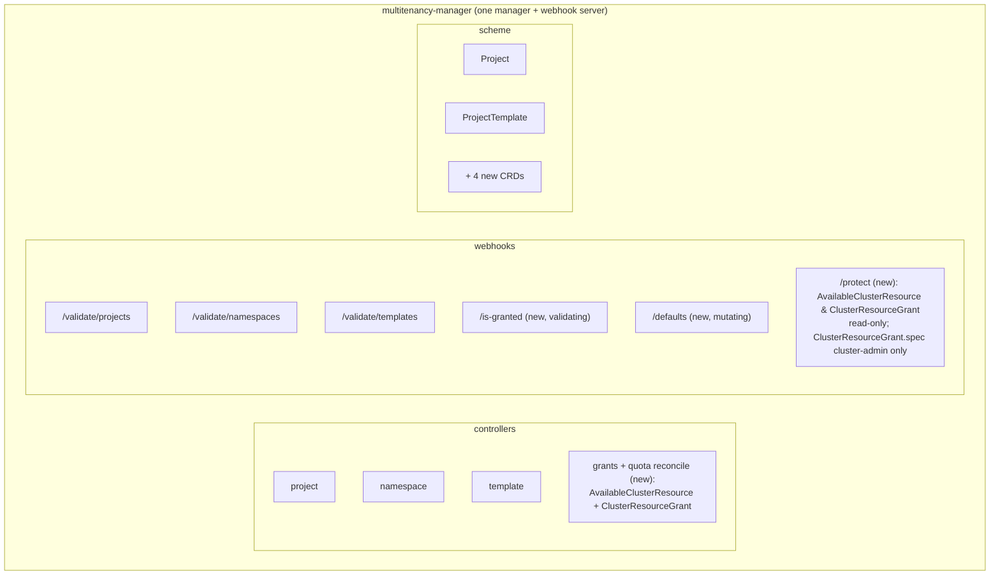
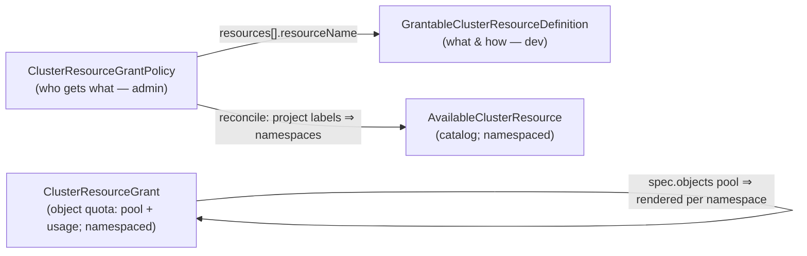
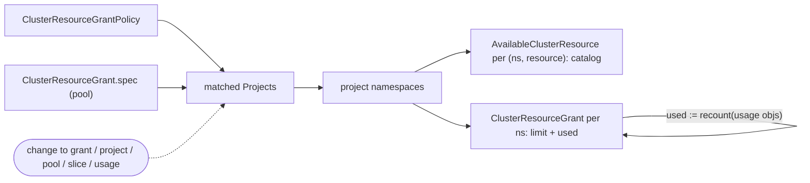
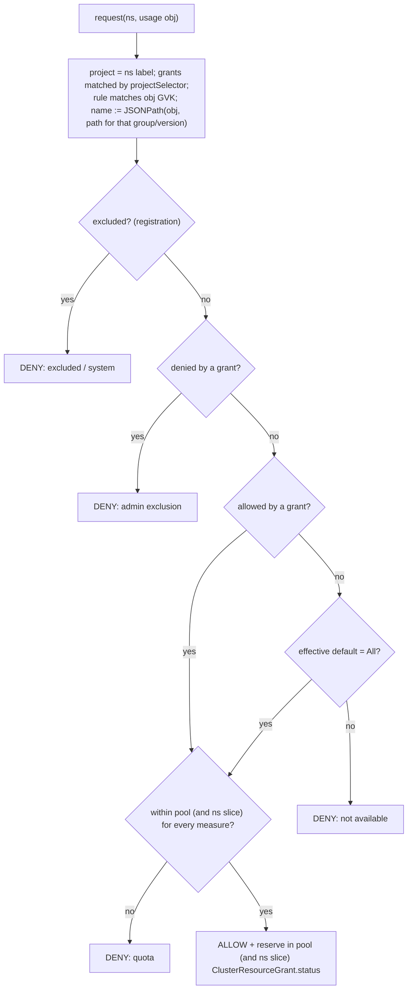

# Cluster object grants — design

> Status: **draft / discussion.** Problem, user stories, the resource model, how it works, and the
> decisions taken so far. Implementation lives inside the existing `multitenancy-manager`
> (see [Architecture](#architecture)).

## Problem

A project (tenant) lives in one or more namespaces. Several **cluster-scoped** resources shape what
a project may do: `StorageClass`, `IngressClass`, `LoadBalancerClass` (and the `Service`/`PVC`/`Ingress`
objects referencing them), `PriorityClass`, `RuntimeClass`, … Today a project can reference *any* of
them. Multitenancy must control, per project: **which** are usable, **what the default** is, and
**how much** may be consumed.

Projects vs namespaces: project↔namespace is 1:1 today, but a project will own **several** namespaces.
So everything here is **per-project** (the admin grants at project level; the user subdivides inside).
Enforcement/materialization is **per namespace**. A project's namespaces are the `namespaces` labelled
`projects.deckhouse.io/project=<project>`.

## User stories

- **U1 (user)** — see which global resources are available to me in my project.
- **D1 (module developer)** — configure how my global resource is projected into a project (where it
  may be referenced).
- **A1 (admin)** — assign the set of resources available in a project.
- **A2 (admin)** — set the per-project default resource.
- **A3 (admin)** — set quotas on the project (e.g. 5 external LBs, unlimited internal; 1 TiB any disk,
  200 GiB fast): compute on `Project.spec.quota.compute`, object limits on [`ClusterResourceGrant`](#clusterresourcegrant)
  (see [Quotas](#quotas)).
- **A4 (admin)** — pre-configure and attach these settings to projects easily (presets).
- **D2 (module developer)** — define a global default (e.g. the default-class annotation) and reuse it.
- **D3 (module developer)** — enforce grants with *my own* webhook/controller instead of the
  built-in one (my resource has bespoke validation), while still reading the per-project
  allow-list / default / quota.
- **A5 (admin)** — exclude some resources (or objects) from what projects get by default.
- **D4 (module developer)** — exclude some objects of my resource from default availability
  (e.g. system/service `ClusterRole`s that must never be tenant-bindable).

Coverage: U1 → [`AvailableClusterResource`](#availableclusterresource); D1/D2 →
[`GrantableClusterResourceDefinition`](#grantableclusterresourcedefinition); A1/A2/A4/A5 →
[`ClusterResourceGrantPolicy`](#clusterresourcegrantpolicy); A3 (quota) → `Project.spec.quota.compute` +
[`ClusterResourceGrant`](#clusterresourcegrant) (see [Quotas](#quotas)).

## Architecture

There is **no separate `cluster-objects-controller` image**. `multitenancy-manager` is already a
controller-runtime manager with a webhook server, owns `Project`/`ProjectTemplate` and the
project↔namespace mapping, and renders native `ResourceQuota`/`LimitRange` via `ProjectTemplate`.
We extend it with four CRDs, one reconciler, and two webhook handlers — no new image, no `Project`
type duplication, no cross-module split.

There are **four surfaces**, easy to confuse — each does a different job:

- **admission webhooks** (`/is-granted`, `/defaults`) — control **writes** (use of a granted object);
- **`AvailableClusterResource`** — a synthetic per-project **catalog** (`get available`), namespaced, so a
  tenant discovers *which* resources their project may use (names + default) via ordinary namespace RBAC;
- **`ClusterResourceGrant`** — the **object-quota** resource: `spec` is the project's object-quota pool (limits),
  `status` is the live usage. Namespaced, rendered into every project namespace so usage is visible
  there. Compute quota stays native (`ResourceQuota`); `ClusterResourceGrant` is its counterpart for granted
  objects;
- **reconciler** — materializes the catalog, renders `ClusterResourceGrant`, and computes effective availability.

**Non-goal — filtering native `kubectl get <cluster-resource>`.** A Capsule-proxy-style filter
operates on the **requesting user**, not the project; it breaks down when one user belongs to several
projects, which is a separate problem. Project-scoped discovery is therefore done via the namespaced
`AvailableClusterResource` (no user-identity ambiguity), not by filtering the native cluster-scoped lists.



## Resource model

Four CRDs in group `multitenancy.deckhouse.io/v1alpha1`:

| Kind | Scope | Owner (writes) | Purpose |
|------|-------|----------------|---------|
| [`GrantableClusterResourceDefinition`](#grantableclusterresourcedefinition) | Cluster | module developer | register a governed resource: GVK, where referenced, default source, what is measurable |
| [`ClusterResourceGrantPolicy`](#clusterresourcegrantpolicy) | Cluster | admin | per-project (by selector) allow-list + default; the preset |
| [`AvailableClusterResource`](#availableclusterresource) | Namespaced | controller | per-project **catalog** — available names + default (read-only to users) |
| [`ClusterResourceGrant`](#clusterresourcegrant) | Namespaced | cluster admin (`spec`) / controller (`status`) | object-quota **pool** (`spec`) + live **usage** (`status`); rendered into every project namespace |



### GrantableClusterResourceDefinition

Registered once by the module developer. **Measurement is declared per `usageReference`** (where it
is actually counted), which removes the "count of what?" ambiguity and needs no value-type field:
a count is an integer, a quantity is a `resource.Quantity`.

```yaml
apiVersion: multitenancy.deckhouse.io/v1alpha1
kind: GrantableClusterResourceDefinition
metadata:
  name: storageclasses           # referenced by grants; also the AvailableClusterResource name
spec:
  grantedResource:               # the cluster-scoped resource being governed
    apiVersion: storage.k8s.io/v1
    kind: StorageClass
  enforcement: Managed           # Managed (our webhooks enforce) | External (the module's own webhook does)
  defaultAvailability: All       # All (usable unless a grant narrows) | None (opt-in: nothing unless granted)
  excluded:                      # objects never available to tenants, regardless of grants (hard deny)
    matchLabels:
      storageclass.deckhouse.io/system: "true"
  defaultFrom:                   # optional fallback default (story D2); overridden by a grant's default
    annotationKey: storageclass.kubernetes.io/is-default-class
  usageReferences:               # where the granted name is referenced (for allow-list / default / metering)
  - rule:                        # webhook/RBAC-style match of the usage object (groups/versions/resources)
      apiGroups:
      - ""                       # core group
      apiVersions:
      - v1
      resources:
      - persistentvolumeclaims
    fieldPath: $.spec.storageClassName              # default path to the granted object's NAME
    countable: true                                 # measure: PVC count (measure key: persistentvolumeclaims)
    quantities:                                     # measure: summable quantity fields
    - name: requests.storage                        # measure key
      fieldPath: $.spec.resources.requests.storage
  # Allow-list/default need only `rule` + `fieldPath`. Measurement (countable/quantities) is OPTIONAL —
  # many resources have none (then the resource is allow-list only; no ClusterResourceGrant entry).
  # Quota LIMITS live on ClusterResourceGrant.spec — see Quotas; the grant (below) carries no quota.
status:
  conditions: []           # standard Ready condition, set by the controller
  observedGeneration: 1
```

| Field | Type | Req | Meaning |
|-------|------|-----|---------|
| `grantedResource.apiVersion`/`.kind` | string | no | GVK of the cluster-scoped resource being granted. **Present ⇒ object-backed** (names are real objects; `allowedSelector` applies). **Absent ⇒ value-backed** (names are values of the reference field, e.g. `loadBalancerClass`; literal `allowed` only) |
| `enforcement` | enum | no | `Managed` (default — our webhooks deny/default) or `External` (the module's own webhook enforces; we only materialize `AvailableClusterResource`) — see [Module-owned validation](#module-owned-validation-external-enforcement) |
| `defaultAvailability` | enum | no | baseline when no grant allows an object: `All` (default — usable unless a grant narrows) or `None` (opt-in — nothing usable unless granted). Admin may override per project with `grant.availabilityDefault` |
| `excluded` | names / LabelSelector | no | objects of this resource **never** available to tenants, regardless of any grant (hard deny; story D4 — e.g. system `ClusterRole`s) |
| `defaultFrom.annotationKey` | string | no | annotation on a granted object marking the cluster-wide default (fallback only) |
| `usageReferences[].rule.apiGroups[]` | []string | yes | API groups of the usage object (e.g. `networking.k8s.io`, `extensions`); `*` = any. A resource may live in **several** groups |
| `usageReferences[].rule.apiVersions[]` | []string | yes | versions to match (e.g. `v1`, `v1beta1`); `*` = any |
| `usageReferences[].rule.resources[]` | []string | yes | plural(s) of the usage object (e.g. `ingresses`) |
| `usageReferences[].fieldPath` | JSONPath | yes | **default** path to the **name** of the granted resource (string), for all matched group/versions. May target an annotation, e.g. `$.metadata.annotations['ipam.cilium.io/ip-pool']` |
| `usageReferences[].paths[]` | `{apiGroups?, apiVersions?, fieldPath}` | no | per-group/version **overrides** of `fieldPath` (the field moved between versions). The entry whose `apiGroups`/`apiVersions` match the request's GVK wins; otherwise the top-level `fieldPath` is used |
| `usageReferences[].match` | `{fieldPath, equals\|in}` | no | guard: this reference applies only when the predicate holds on the object (e.g. `objectRef.kind == ClusterVirtualImage`); absent ⇒ always applies |
| `usageReferences[].countable` | bool | no | if true, this usage object can be counted in quota; the **measure key is the resource plural** (e.g. `persistentvolumeclaims`) — an integer measure. The plural is shared across the matched groups/versions; if `rule.resources` lists several plurals, each counts under its own key |
| `usageReferences[].quantities[].name` / `.fieldPath` | string / JSONPath | no | summable quantity fields; each `name` is a **measure key** — a `resource.Quantity` measure. The `fieldPath` may also be version-scoped via `paths[]` if it moved |

The set of quota **measures** for a granted resource is therefore: the resource plural of every
`countable` usage reference, plus every `quantities[].name`. **If there are none, the resource is
availability-only** (allow-list + default, no quota). Otherwise these measures are what an admin may
put limits on under `ClusterResourceGrant.spec.objects.<resource>.<name|"*">.<measure>` — the registration
declares the measures, [`ClusterResourceGrant`](#clusterresourcegrant) **carries the limits** (see [Quotas](#quotas)).

### ClusterResourceGrantPolicy

Authored by the admin; one grant is a preset attached to a class of projects by label.
It does **allow-list + default only** — it carries **no quota** (object quota lives on
[`ClusterResourceGrant`](#clusterresourcegrant); see [Quotas](#quotas)).
`allowed` and `allowedSelector` are **not exclusive** — the granted set is their **union** (use
either, or both).

```yaml
apiVersion: multitenancy.deckhouse.io/v1alpha1
kind: ClusterResourceGrantPolicy
metadata:
  name: production-storage
spec:
  projectSelector:                 # matches PROJECT labels; expands to the project's namespaces
    matchLabels:
      environment: production
  resources:
  - resourceName: storageclasses    # storage classes: allow-list + default
    allowed:                       # by name…
    - standard
    allowedSelector:               # …union with granted objects carrying these labels
      matchLabels:
        shared: "true"
    default: standard              # per-project default (overrides defaultFrom)
  - resourceName: loadbalancerclasses
    allowed:
    - external
    - internal
    default: internal
```

| Field | Type | Req | Meaning |
|-------|------|-----|---------|
| `projectSelector` | LabelSelector | yes | selects Projects by labels (nil ⇒ none; empty ⇒ all) |
| `resources[].resourceName` | string | yes | name of a `GrantableClusterResourceDefinition` |
| `resources[].allowed` | []string | no | granted object names allowed (union with `allowedSelector`) |
| `resources[].allowedSelector` | LabelSelector | no | granted objects matching these labels are allowed (union with `allowed`) |
| `resources[].denied` | []string | no | object names explicitly excluded for matched projects (story A5); overrides `allowed` |
| `resources[].deniedSelector` | LabelSelector | no | granted objects matching these labels are excluded; overrides `allowed`/`allowedSelector` |
| `resources[].default` | string | no | per-project default name (overrides `defaultFrom`) |
| `resources[].availabilityDefault` | enum | no | override the resource's `defaultAvailability` (`All`/`None`) for matched projects (story A5) |

The grant has **no `quota` field** — object-quota limits are set on [`ClusterResourceGrant`](#clusterresourcegrant). Quota
scope and multi-namespace sharing are described in [Quotas](#quotas).

### AvailableClusterResource

Per-project **catalog** (discovery only — names + default; **no quota**, that is [`ClusterResourceGrant`](#clusterresourcegrant)).
Namespaced, **status-only**, `shortName: available`, one per `(project namespace,
GrantableClusterResourceDefinition)` with `metadata.name` = the grantable resource name, so:

```shell
d8 k get available -n <project-ns>                 # which resources are available to me here
d8 k get available storageclasses -n <project-ns>  # one resource: allowed names + default
```

```yaml
apiVersion: multitenancy.deckhouse.io/v1alpha1
kind: AvailableClusterResource
metadata:
  name: storageclasses
  namespace: team-a-prod
  labels:
    heritage: deckhouse
    module: multitenancy-manager       # owning module (controller-owned)
    projects.deckhouse.io/project: team-a
status:
  grantedResourceKind: StorageClass
  available:                 # allow-list + default, from the matching grants
  - name: standard
    default: true
  - name: ssd-a
```

Protection: these objects carry `module: multitenancy-manager` (+ `heritage: deckhouse`,
`projects.deckhouse.io/project`) and are **controller-owned** (label scheme: [projects design](./PROJECTS_DESIGN.md#service-labels-and-annotations)).
Beyond read-only RBAC for tenants, a **validating admission policy** rejects create/update/delete of
`AvailableClusterResource` by anyone other than the controller's service account — they are a status
surface, not user input.

### ClusterResourceGrant

The **object-quota** resource — the counterpart to the native `ResourceQuota` (which covers compute),
but for granted objects. Namespaced, with **both `spec` (limits) and `status` (usage)**. Unlike
`AvailableClusterResource` (one per `(namespace, resource)`), there is **one `ClusterResourceGrant` per namespace**
listing every measure — exactly as a single `ResourceQuota` lists every compute measure. It appears in
two roles, same Kind:

- **the pool** — one `ClusterResourceGrant` in the project's **control namespace** (in single-namespace projects:
  the project's only namespace). Its `spec.objects` is the project's object-quota budget; `status` is
  the project total. **`spec` is writable by the cluster admin only** (a tenant must never raise their
  own quota — see [Quotas](#quotas) for RBAC).
- **the per-namespace view** — the controller renders a **read-only** `ClusterResourceGrant` into every workload
  namespace; `status` shows that namespace's `used`, its effective `limit` (the per-namespace slice if
  the project admin set one via `ProjectNamespace`, else the shared pool), and the project totals. This
  is what a tenant reads in their own namespace.

In a **single-namespace project** the two collapse into **one** object in that namespace — the pool's
`spec` plus its own usage in `status`; there is no separate rendered copy. In multi-namespace the pool
(control namespace) and the rendered views (workload namespaces) are distinct objects, all named
`objects`.

`spec.objects` mirrors the registration's measures: **grantable-resource → granted name (or `*`) →
measure → limit** (`-1` = unlimited).

```yaml
# THE POOL — control namespace; spec writable by the cluster admin only.
apiVersion: multitenancy.deckhouse.io/v1alpha1
kind: ClusterResourceGrant
metadata:
  name: objects
  namespace: team-a                    # the project control namespace
spec:
  objects:
    storageclasses:
      "*":
        requests.storage: 1Ti
        persistentvolumeclaims: 50
      fast:
        requests.storage: 200Gi
    loadbalancerclasses:
      external:
        services: 5
      internal:
        services: -1
status:                                # project total (rollup)
  objects:
  - resource: storageclasses
    name: "*"
    measure: requests.storage
    limit: 1Ti
    used: 420Gi
  - resource: loadbalancerclasses
    name: external
    measure: services
    limit: 5
    used: 3
---
# THE PER-NAMESPACE VIEW — rendered by the controller, read-only to tenants.
apiVersion: multitenancy.deckhouse.io/v1alpha1
kind: ClusterResourceGrant
metadata:
  name: objects
  namespace: team-a-backend            # a workload namespace
  labels:
    heritage: deckhouse
    module: multitenancy-manager
    projects.deckhouse.io/project: team-a
status:
  objects:
  - resource: loadbalancerclasses
    name: external
    measure: services
    used: 1                            # this namespace
    limit: 5                           # effective here (per-ns slice if set, else the shared pool)
    projectUsed: 3                     # whole project
    projectLimit: 5
```

Protection: the rendered (workload-namespace) `ClusterResourceGrant`s carry `module: multitenancy-manager` and
are controller-owned (read-only via the same admission policy as `AvailableClusterResource`). The pool's
`status` is controller-owned too; only its `spec` is admin-writable, and only by the cluster admin.

### Effective availability (precedence)

Whether a project may use a given object of a granted resource is decided by, in order (first match
wins, deny beats allow):

1. registration `excluded` matches → **deny** (system objects; never grantable — story D4);
2. grant `denied` / `deniedSelector` matches → **deny** (admin exclusion — story A5);
3. grant `allowed` / `allowedSelector` matches → **allow**;
4. grant `availabilityDefault` (if set) → its value (`All`/`None`) — admin per-project override;
5. registration `defaultAvailability` → `All` ⇒ allow, `None` ⇒ deny.

So a registered resource can be **opt-in** (`defaultAvailability: None` ⇒ nothing until granted) or
**opt-out** (`All` ⇒ everything until narrowed). The webhook and the catalog use this same resolved
set; in particular the webhook **must enforce even when no grant matches the project** (to honour
`None` and `excluded`) — not only when a grant exists.

## How it works

Field meanings are in [Resource model](#resource-model); this section is the runtime behaviour only.

### Reconcile → materialize catalog + render ClusterResourceGrant

Triggered by changes to any grant, grantable resource, `Project` (labels), the pool `ClusterResourceGrant.spec`,
`ProjectNamespace` (slices), a granted object, or a usage object. For each matched Project (by
`projectSelector`) → expand to its namespaces and:

- upsert an `AvailableClusterResource` per `(namespace, resourceName)` — the available set
  (`allowed` ∪ `allowedSelector`) and the default (the **catalog**);
- render a read-only `ClusterResourceGrant` per workload namespace — effective `limit` (the `ProjectNamespace`
  slice if set, else the pool from the control-namespace `ClusterResourceGrant.spec`) and `used` recomputed from
  live usage objects, plus the project totals;
- roll the project totals into the pool `ClusterResourceGrant.status` (objects) and `Project.status.quota`
  (compute, summed from per-NS `ResourceQuota.status`).



### Validating admission `/is-granted` (usage object CREATE/UPDATE)



**Which counters.** Object usage is a **project pool**, so the authoritative ledger is the **pool**
`ClusterResourceGrant.status` in the control namespace; the per-namespace rendered `ClusterResourceGrant` carries that
namespace's `used`. On admission the webhook (controller service account) checks and optimistically
reserves on **both** where a Level-2 slice exists — `used(ns)+1 ≤ slice` *and* `projectUsed+1 ≤ pool` —
and only the pool when there is no slice. The reconcile/alert pass recomputes both from live objects.

A `usageReference` whose `match` guard is false for the object is skipped (not validated, not
counted) — e.g. a `RoleBinding` to a namespaced `Role`, or a `VirtualDisk` sourced from a namespaced
`VirtualImage`. UPDATE is **diff-based**: values already present in `OldObject` are grandfathered, so
tightening a grant never breaks an object that merely gets updated.

### Mutating admission `/defaults` (usage object CREATE only)

If the referenced field is empty, inject the default: the grant's `default` if set, else the object
annotated by `defaultFrom.annotationKey`. Never on UPDATE.

### Reconcile / alert (drift & tightening)

A periodic pass recomputes the true `used`, corrects `ClusterResourceGrant.status`, and **alerts** on quota breach
(race drift), objects using a now-revoked name, or objects over a tightened quota.
**Tightening only alerts — nothing is ever deleted.**

### Module-owned validation (external enforcement)

Some modules already run their own admission webhook for a resource and want to keep that single
decision point (bespoke validation our generic field-path checks cannot express). They set
`enforcement: External` on the `GrantableClusterResourceDefinition`. Then:

- our `/is-granted` and `/defaults` webhooks **do not** intercept that resource;
- the controller **still** materializes `AvailableClusterResource` (allow-list + default) and `ClusterResourceGrant`
  (limits + usage) per project — so they are the **read/integration API** the module's own webhook
  consults to make its decision (and to surface the catalog to users, story U1);
- if `usageReferences` are declared, the controller still recomputes `used` and exposes it in
  `ClusterResourceGrant`; the module reads it for quota decisions. If they are not declared, `used` is unknown
  and quota for that resource is entirely the module's responsibility (see Open questions).

`Managed` (the default) needs zero code from the developer; `External` answers story D3 without
forcing two webhooks to fight over the same object.

## Quotas

Two kinds of quota, by mechanism:

- **compute — native.** `requests.cpu`/`memory`, `limits.*`, `pods`, raw `count/<resource>`. Lives on
  `Project.spec.quota.compute`, rendered as a native `ResourceQuota` per namespace. (See the
  [projects design](./PROJECTS_DESIGN.md#quotas).)
- **objects — ours, on `ClusterResourceGrant`.** Per-class limits keyed by **grantable-resource → granted name
  (or `*`) → measure** — the limits native quota cannot express. **Entirely optional**: a resource with
  no measures has no `ClusterResourceGrant` entry and is governed by availability (allow-list + default) alone.

**Why object quota is ours, not native.** Native `ResourceQuota` *can* limit storage per class
(`fast.storageclass.storage.k8s.io/requests.storage`) but cannot limit per `loadBalancerClass` or per
`IngressClass` at all (it only knows the *total* `services.loadbalancers`, `count/ingresses`), and its
plugin is not pluggable beyond `count/<resource>.<group>`. So all per-class object limits are ours and
uniform — one `ClusterResourceGrant.spec.objects` block, regardless of whether Kubernetes happens to have a
native key.

**No "flavor" grouping.** The key is the granted name itself (or `*`) — a real object name
(object-backed) or a field value (value-backed). No combined limit across a group of names (use `*` or
per-name).

**Two levels — pool and slice.**

- **Pool (project total, Level 1).** One `ClusterResourceGrant` in the project's **control namespace** (in a
  single-namespace project: its only namespace). `spec.objects` is the project budget; by default it is
  a shared pool across all the project's namespaces (not one pool across many projects — unlike OpenShift
  `ClusterResourceQuota`). `status` is the project total.
- **Slice (per namespace, Level 2, optional).** The project admin carves a per-namespace sub-budget via
  `ProjectNamespace.spec.quota.objects`, validated `Σ slices ≤ pool`. Where set, the namespace's
  effective `limit` is the slice; otherwise the namespace draws from the shared pool.

**RBAC — a tenant can never raise their own quota.**

| surface | write | read |
|---|---|---|
| `ClusterResourceGrant.spec` (the pool, control ns) | **cluster admin only** | project admin |
| `ProjectNamespace.spec.quota` (the slice) | project admin (≤ pool) | project admin |
| rendered `ClusterResourceGrant` (workload ns) `status` | controller only | tenant |
| native `ResourceQuota` | controller only | tenant |

The pool lives in the control namespace, which tenants can't reach — but they don't need to: the
rendered per-namespace `ClusterResourceGrant` carries `projectUsed`/`projectLimit`, so a tenant sees the project
total from their own namespace. The pool's `spec` is namespaced but the project-admin role does **not**
get write on `ClusterResourceGrant` (verb omitted + admission guard) — so a project admin distributes the budget
but cannot grow the total. Cluster admin sets *how much the project gets*; project admin decides *how it
is split*; tenant *sees* usage.

**Visibility — rendered into every namespace.** The pool is authored once (control namespace); the
controller renders a read-only `ClusterResourceGrant` into every workload namespace showing that namespace's
`used`, its effective `limit`, and the project totals. A tenant in `team-a-backend` runs
`d8 k get clusterresourcegrant -n team-a-backend` (and `get resourcequota` for compute) — both via plain
namespace RBAC.

**How object quota matches and counts (the "5 external" mechanism).** For a value-backed resource
like `loadBalancerClass`:

1. the granted **name** is extracted from each usage object by `usageReferences[].fieldPath` — for a
   `Service` that is `spec.loadBalancerClass`, whose value (`external`) *is* the name; the `match`
   guard (`spec.type == LoadBalancer`) skips non-LB Services;
2. `ClusterResourceGrant.spec.objects.loadbalancerclasses.external.services: 5` sets the limit on that name;
3. on CREATE/UPDATE the webhook reads the name, reads `used` for it from the project's `ClusterResourceGrant`,
   and denies if `used + 1 > 5`; `used` aggregates Services with that value across **all the project's
   namespaces**;
4. the reconciler periodically recomputes the true count and alerts on drift.

Storage works the same way: `requests.storage` per StorageClass is summed from PVCs across the
project, `*` caps total storage, a named class caps that class.

**Single vs multi-namespace.**

- **Single-namespace:** the one project namespace holds both the pool `ClusterResourceGrant` (spec cluster-admin
  only, status = used) and the native `ResourceQuota`. No slices (nothing to divide).
- **Multi-namespace:** the pool `ClusterResourceGrant` + `Project.spec.quota.compute` live with the control
  namespace; optional per-NS slices via `ProjectNamespace`; the controller renders a `ClusterResourceGrant` +
  `ResourceQuota` into each workload namespace.

**Atomicity.** Native `ResourceQuota` is itself only mostly atomic (optimistic concurrency on
`status.used`, with known bugs e.g. kube #118509). Our webhook uses the same pattern — optimistic
check-and-update of `ClusterResourceGrant.status` `used` (retry on conflict) — so it is not inherently less
atomic; the reconcile/alert pass is the backstop.

## Guide — module developer (register a resource)

Goal: make a cluster-scoped resource your module ships grant-controllable. You create one
[`GrantableClusterResourceDefinition`](#grantableclusterresourcedefinition); admins do the rest.

1. **Identify**: the granted GVK; every usage object as a `rule` (its `apiGroups`/`apiVersions`/
   `resources`, with `*` where it spans many) + the `fieldPath` to the referenced name (add `paths[]`
   if that field sits in different places across versions); optionally what is measurable (count via
   `countable`; quantities via `quantities[]`) — many resources have nothing to measure.
2. **Create** the `GrantableClusterResourceDefinition` (ship it from your module templates) — see the example
   above.
3. **Make objects grant-friendly**: stable, meaningful names (they are the allow-list and quota
   keys); labels for `allowedSelector`; model variants with different limits (external/internal LB)
   as **separate named granted objects**, not a usage-object annotation.
4. **Verify**: once an admin grants it, `d8 k get available <name> -n <project-ns>` shows it.

Remember: `fieldPath` must resolve to the granted object's **name**; validation runs on CREATE+UPDATE
(diff-based), defaulting on CREATE only; your `defaultFrom` is only a fallback.

## Guide — administrator (grant resources to projects)

You use [`ClusterResourceGrantPolicy`](#clusterresourcegrantpolicy). One grant is a reusable preset attached to a
class of projects by label (story A4).

- **A1 — assign resources.** Set `resources[].resourceName` and `allowed` / `allowedSelector` (union).
  Example: allow `standard` plus any StorageClass labelled `shared=true`.
- **A2 — set the default.** Set `resources[].default` (overrides the developer's `defaultFrom`).
- **A3 — set quotas.** Quotas are **not** on the grant. Compute → `Project.spec.quota.compute`; object
  limits → the pool [`ClusterResourceGrant`](#clusterresourcegrant) in the control namespace
  (`spec.objects.<resource>.<name|"*">.<measure>`, cluster-admin-writable only). `-1` = unlimited; the
  most restrictive applicable limit wins (`*` and a named entry both apply). The project admin may then
  carve per-namespace slices via `ProjectNamespace.spec.quota` (≤ pool) — see [Quotas](#quotas).
- **A4 — presets.** Author one grant with a `projectSelector` (e.g. `environment: production`) and
  attach it to many projects just by labelling the Projects.

Notes: overlapping grants are resolved deterministically (allowed = union, default = oldest grant) and
flagged with a `Conflict` condition + alert — see [Decisions](#decisions). Tightening a grant (or a
quota on the project) never deletes existing objects; it only alerts.

## Migration (turning on governance on a live cluster)

Bringing a resource under control on a cluster where projects already use it must not silently break
tenants:

- A registration left at `defaultAvailability: All` with no grants changes nothing — existing usage
  keeps working; you only add restrictions where you create grants. Safe default for rollout.
- `defaultAvailability: None` or `excluded` is a **breaking change** for projects already using the
  resource (new objects get denied). Roll out in stages: register with `All` first (observe via the
  alert hook and the `AvailableClusterResource` catalog), create the grants, then tighten to `None` per
  project once grants are in place.
- Diff-based UPDATE already grandfathers in-place objects, so existing objects are not broken by an
  update; only **new** uses are subject to the tightened policy.
- `enforcement: External` is additive and does not affect existing usage.

## Decisions

- One controller, merged into `multitenancy-manager`; no separate image.
- Keep custom webhooks (not `ValidatingAdmissionPolicy`): quotas need custom enforcement anyway.
- Four CRDs; the grant uses `resources[]` with `resourceName`.
- `projectSelector` matches Project labels, then expands to the project's namespaces.
- **Quota by mechanism, not on the grant.** Compute → `Project.spec.quota.compute` (native
  `ResourceQuota`). Objects → [`ClusterResourceGrant`](#clusterresourcegrant): `spec` (pool, control namespace) + `status`
  (usage), keyed by grantable-resource → granted name (+ `*`) → measure; no flavor grouping; uniform
  even where Kubernetes has a native per-class key (e.g. storage).
- **`ClusterResourceGrant` is spec + status, rendered per namespace.** Pool authored in the control namespace
  (cluster-admin-writable `spec`); controller renders a read-only `ClusterResourceGrant` into every workload
  namespace (`status`: per-ns used, effective limit, project totals) so usage is visible via namespace
  RBAC. Per-namespace slices via `ProjectNamespace.spec.quota` (project admin, `Σ ≤ pool`).
- **Quota RBAC**: a tenant can never raise their own quota — `ClusterResourceGrant.spec` is cluster-admin-only;
  the project admin only distributes the pool across namespaces (slices ≤ pool).
- **Measurement is declared per `usageReference`** (`countable`, `quantities[]`); no separate
  `measures` block and no value-type field — count ⇒ integer, quantity ⇒ `resource.Quantity`.
  **Measurement is optional**: a resource with no `countable`/`quantities` is availability-only
  (allow-list + default, no quota).
- **`usageReference` matches like a webhook/RBAC rule**: `rule.apiGroups[]`/`apiVersions[]` (with `*`
  wildcard)/`resources[]` — a granted name can be referenced from **several groups and versions** of
  the same usage object. The referenced field may sit at **different paths per version**, so `fieldPath`
  is the default and `paths[]` overrides it for specific groups/versions.
- **Granted names are object-backed or value-backed.** `grantedResource` present ⇒ object-backed
  (real objects; `allowedSelector` applies). Absent ⇒ value-backed (the name is a field value, e.g.
  `loadBalancerClass`; literal `allowed`). Either way per-name quota is ours on `ClusterResourceGrant`
  — including the "5 external LB" case native cannot express.
- `allowed` and `allowedSelector` are a **union**, not exclusive.
- **Guarded references**: `usageReferences[].match` (`{fieldPath, equals|in}`) scopes a reference to
  objects where the predicate holds (e.g. `roleRef.kind == ClusterRole`,
  `objectRef.kind == ClusterVirtualImage`); non-matching objects are ignored.
- **Enforcement mode** per resource: `Managed` (our webhooks) or `External` (the module's own
  webhook enforces; we only materialize `AvailableClusterResource` + `ClusterResourceGrant` as the read API). Answers story D3.
- **Default availability is configurable, not always-allow.** Registration `defaultAvailability:
  All|None` (developer; `None` = opt-in), admin override via grant `availabilityDefault`. The webhook
  enforces even when no grant matches (so `None`/`excluded` actually deny). Answers A5.
- **Exclusions with deny-over-allow precedence**: registration `excluded` (hard deny, system objects —
  story D4) and grant `denied`/`deniedSelector` (admin exclusion — story A5). Precedence:
  excluded → denied → allowed → grant `availabilityDefault` → registration `defaultAvailability`.
- **Non-goal:** filtering native `kubectl get <cluster-resource>` per project. A proxy filters by the
  requesting **user**, not the project, and breaks for users in multiple projects — a separate story.
  Project discovery is the namespaced `AvailableClusterResource`.
- Quota limits are **per project** (the pool `ClusterResourceGrant`), shared across its namespaces (Level 1);
  optional per-namespace slice by the project admin (Level 2) is nested/additive (`Σ slices ≤ pool`).
- `AvailableClusterResource`: namespaced, status-only **catalog** (names + default), `shortName available`,
  `module: multitenancy-manager` + `projects.deckhouse.io/project` labels, protected by an admission
  policy in addition to read-only RBAC. Quota is a separate resource (`ClusterResourceGrant`).
- Defaulting: per-project `default` overrides `defaultFrom`; CREATE only.
- UPDATE is diff-based (pre-existing values grandfathered).
- Tightening/revocation = alert only, never delete.
- Overlapping grants: no hard-deny on create (conflicts emerge dynamically). Runtime resolution:
  `allowed` = union; `default` = oldest grant wins (creationTimestamp, tie-break name); genuine
  disagreement ⇒ `Conflict` condition + alert (webhook may soft-warn, never hard-deny). Quota is not
  on the grant, so it never conflicts between grants; within `ClusterResourceGrant.spec.objects` a `*` and a
  named limit both apply (most restrictive wins).
- ProjectTemplate integration for presets — later (reference/embed TBD).

## Open questions

- Final field names / CEL validation of the four CRDs.
- Defence in depth: confirm hard-deny vs observe-only. Plan: allow-list → deny; quota → deny
  (best-effort) + alert; default → mutate; tightening → alert only.
- How presets attach to a `ProjectTemplate` (reference vs embed).
- Where the periodic recount lives (addon-operator hook vs manager reconciler).
- Per-namespace sub-quota by the project admin (Level 2) — v1 or later? (proposal: later).
- `External` enforcement with no `usageReferences`: quota `used` cannot be computed by us — does the
  module report usage back, or is quota simply unsupported in that case?
- `usageReferences[].match` shape: is `{fieldPath, equals|in}` enough, or do some references need a
  full CEL predicate?

## User-docs TODO (when implemented)

Document in USAGE: `get available` discovery and `get clusterresourcegrant` for usage; the four resources and
their owners; conflict resolution ("like multiple ResourceQuotas — the most restrictive wins");
defaulting precedence (CREATE only); that tightening never deletes, only alerts.

## Examples — Deckhouse resources

Cluster-scoped resources a project references that fit this model. `allow` = allow-listing makes
sense; `default` = per-project default makes sense; `quota` = metering makes sense.

| Granted resource | Group | Referenced from → fieldPath | allow | default | quota |
|------------------|-------|------------------------------|:---:|:---:|------|
| `StorageClass` | `storage.k8s.io` | `PersistentVolumeClaim` → `$.spec.storageClassName` | ✓ | ✓ (`is-default-class`) | count PVC, sum `requests.storage` |
| `IngressClass` | `networking.k8s.io` | `Ingress` → `$.spec.ingressClassName` | ✓ | ✓ (`is-default-class`) | count Ingress |
| LoadBalancer class¹ | (core string) | `Service` (type=LoadBalancer) → `$.spec.loadBalancerClass` | ✓ | ✓ (e.g. internal) | count LB Services |
| `VirtualMachineClass`² | `virtualization.deckhouse.io` | `VirtualMachine` → `$.spec.virtualMachineClassName` | ✓ | ✓ | count VM (sum cpu/mem) |
| `ClusterVirtualImage`² | `virtualization.deckhouse.io` | `VirtualDisk`/`VirtualMachine` dataSource | ✓ | — | count / size |
| `ClusterLogDestination` | `deckhouse.io` | `PodLoggingConfig` → `$.spec.clusterDestinationRefs[*]` | ✓ | — | — |
| `ClusterRole` | `rbac.authorization.k8s.io` | `RoleBinding` → `$.roleRef.name` (guarded: `roleRef.kind == ClusterRole`) | ✓ | — | — |
| `ClusterIssuer` | `cert-manager.io` | `Certificate` → `$.spec.issuerRef.name` (guarded: `issuerRef.kind == ClusterIssuer`) | ✓ | — | count |
| `CiliumPodIPPool` | `cilium.io` | `Pod` → `$.metadata.annotations['ipam.cilium.io/ip-pool']` (name via annotation) | ✓ | — | — |
| `PriorityClass` | `scheduling.k8s.io` | `Pod` → `$.spec.priorityClassName` | ✓ (privileged!) | rarely | count |
| `RuntimeClass` | `node.k8s.io` | `Pod` → `$.spec.runtimeClassName` | ✓ | ✓ | — |
| `VolumeSnapshotClass` | `snapshot.storage.k8s.io` | `VolumeSnapshot` → `$.spec.volumeSnapshotClassName` | ✓ | ✓ | count |

¹ Kubernetes has no built-in `LoadBalancerClass` object — `Service.spec.loadBalancerClass` is a free
string. So this is **value-backed**: `external`/`internal` are values of that field (no
`grantedResource`, literal `allowed`), and the per-class count quota is ours (native has only the
total). See the LoadBalancer example below. ² Virtualization (`virtualization.deckhouse.io/v1alpha2`,
[deckhouse/virtualization](https://github.com/deckhouse/virtualization)) — `VirtualMachineClass` and
`ClusterVirtualImage` are cluster-scoped.

`PriorityClass`, `RuntimeClass` and `VolumeSnapshotClass` follow the same shapes as below and are
omitted for brevity. Full registrations (developer side) and paired grants (admin side):

### StorageClass — allow-list, default; storage quota on ClusterResourceGrant

Registration declares the measures (PVC count, summed `requests.storage`); the grant does allow-list +
default; the **limits live on the pool `ClusterResourceGrant`** (uniform per-class keys — `*` and a named class —
not the native `…storageclass.storage.k8s.io/…` keys).

```yaml
apiVersion: multitenancy.deckhouse.io/v1alpha1
kind: GrantableClusterResourceDefinition
metadata:
  name: storageclasses
spec:
  grantedResource:
    apiVersion: storage.k8s.io/v1
    kind: StorageClass
  defaultFrom:
    annotationKey: storageclass.kubernetes.io/is-default-class
  usageReferences:
  - rule:
      apiGroups:
      - ""
      apiVersions:
      - v1
      resources:
      - persistentvolumeclaims
    fieldPath: $.spec.storageClassName
    countable: true                  # measure: persistentvolumeclaims (count)
    quantities:
    - name: requests.storage         # measure: summed PVC requests
      fieldPath: $.spec.resources.requests.storage
---
apiVersion: multitenancy.deckhouse.io/v1alpha1
kind: ClusterResourceGrantPolicy
metadata:
  name: production-storage
spec:
  projectSelector:
    matchLabels:
      environment: production
  resources:
  - resourceName: storageclasses     # allow-list + default only
    allowed:
    - standard
    allowedSelector:
      matchLabels:
        shared: "true"
    default: standard
---
# Storage limits for the project — the pool ClusterResourceGrant in the control namespace (cluster-admin only).
apiVersion: multitenancy.deckhouse.io/v1alpha1
kind: ClusterResourceGrant
metadata:
  name: objects
  namespace: team-a                 # the project control namespace
spec:
  objects:
    storageclasses:
      "*":                          # all classes together
        requests.storage: 1Ti
        persistentvolumeclaims: 50
      fast:                         # the "fast" class, tighter
        requests.storage: 200Gi
```

### IngressClass — allow-list, default, count Ingresses (multi-group, per-version path)

`Ingress` lived in `extensions` and `networking.k8s.io`, and the class moved from an annotation
(`v1beta1`) to a field (`v1`) — so this is the example that exercises a multi-group `rule` and a
version-scoped `paths[]` override.

```yaml
apiVersion: multitenancy.deckhouse.io/v1alpha1
kind: GrantableClusterResourceDefinition
metadata:
  name: ingressclasses
spec:
  grantedResource:
    apiVersion: networking.k8s.io/v1
    kind: IngressClass
  defaultFrom:
    annotationKey: ingressclass.kubernetes.io/is-default-class
  usageReferences:
  - rule:
      apiGroups:
      - networking.k8s.io
      - extensions
      apiVersions:
      - "*"
      resources:
      - ingresses
    fieldPath: $.spec.ingressClassName                              # v1
    paths:
    - apiVersions:
      - v1beta1
      fieldPath: $.metadata.annotations['kubernetes.io/ingress.class']   # older versions
    countable: true
```

### LoadBalancer class — value-backed names, our quota ("5 external")

`Service.spec.loadBalancerClass` is a plain string — there is **no `LoadBalancerClass` object**. This
is a **value-backed** grant: the granted names (`external`/`internal`) are *values* of the reference
field, so `grantedResource` is omitted and `allowed` is a literal list (no `allowedSelector`). The
quota is **ours** — native `ResourceQuota` has only the *total* `services.loadbalancers`, no per-class
key. This is the canonical "our own quota" case; the limits go on the pool `ClusterResourceGrant`.

```yaml
apiVersion: multitenancy.deckhouse.io/v1alpha1
kind: GrantableClusterResourceDefinition
metadata:
  name: loadbalancerclasses
spec:
  # value-backed: no grantedResource — the names are values of spec.loadBalancerClass, not objects.
  usageReferences:
  - rule:
      apiGroups:
      - ""
      apiVersions:
      - v1
      resources:
      - services
    fieldPath: $.spec.loadBalancerClass   # the value here IS the granted name (external / internal)
    match:
      fieldPath: $.spec.type
      equals: LoadBalancer                # only LoadBalancer Services count
    countable: true                       # measure: number of such Services, keyed by the value
---
apiVersion: multitenancy.deckhouse.io/v1alpha1
kind: ClusterResourceGrantPolicy
metadata:
  name: production-loadbalancers
spec:
  projectSelector:
    matchLabels:
      environment: production
  resources:
  - resourceName: loadbalancerclasses     # allow-list + default only
    allowed:
    - external
    - internal
    default: internal
---
# LB limits for the project — the pool ClusterResourceGrant (the "5 external" case)
apiVersion: multitenancy.deckhouse.io/v1alpha1
kind: ClusterResourceGrant
metadata:
  name: objects
  namespace: team-a                       # the project control namespace
spec:
  objects:
    loadbalancerclasses:
      external:
        services: 5                       # at most 5 external LBs per project
      internal:
        services: -1                      # unlimited
```

### VirtualMachineClass — allow-list, default, count VMs

```yaml
apiVersion: multitenancy.deckhouse.io/v1alpha1
kind: GrantableClusterResourceDefinition
metadata:
  name: virtualmachineclasses
spec:
  grantedResource:
    apiVersion: virtualization.deckhouse.io/v1alpha2
    kind: VirtualMachineClass
  usageReferences:
  - rule:
      apiGroups:
      - virtualization.deckhouse.io
      apiVersions:
      - v1alpha2
      resources:
      - virtualmachines
    fieldPath: $.spec.virtualMachineClassName
    countable: true
```

### ClusterVirtualImage — allow-list (guarded reference)

A `VirtualDisk` references it via `spec.dataSource.objectRef`, but only when
`objectRef.kind == ClusterVirtualImage` (the same field also references namespaced `VirtualImage`).
`usageReferences[].match` guards the reference so it applies only then.

```yaml
apiVersion: multitenancy.deckhouse.io/v1alpha1
kind: GrantableClusterResourceDefinition
metadata:
  name: clustervirtualimages
spec:
  grantedResource:
    apiVersion: virtualization.deckhouse.io/v1alpha2
    kind: ClusterVirtualImage
  usageReferences:
  - rule:
      apiGroups:
      - virtualization.deckhouse.io
      apiVersions:
      - v1alpha2
      resources:
      - virtualdisks
    fieldPath: $.spec.dataSource.objectRef.name
    match:                                   # apply only when this holds
      fieldPath: $.spec.dataSource.objectRef.kind
      equals: ClusterVirtualImage
    countable: true
```

### ClusterRole — which cluster roles a project may bind (guarded reference)

A namespaced `RoleBinding` may reference a `ClusterRole` via `roleRef`, but only when
`roleRef.kind == ClusterRole` (it may also reference a namespaced `Role`). Allow-list which
ClusterRoles a tenant is allowed to bind; another `match` case.

```yaml
apiVersion: multitenancy.deckhouse.io/v1alpha1
kind: GrantableClusterResourceDefinition
metadata:
  name: clusterroles
spec:
  grantedResource:
    apiVersion: rbac.authorization.k8s.io/v1
    kind: ClusterRole
  defaultAvailability: None        # opt-in: a project may bind a ClusterRole only when granted
  excluded:                        # system/service roles are never tenant-bindable (story D4)
    matchExpressions:
    - key: iam.deckhouse.io/role-model
      operator: NotExists
  usageReferences:
  - rule:
      apiGroups:
      - rbac.authorization.k8s.io
      apiVersions:
      - v1
      resources:
      - rolebindings
    fieldPath: $.roleRef.name
    match:
      fieldPath: $.roleRef.kind
      equals: ClusterRole
    # no countable/quantities — ClusterRole is availability-only
---
apiVersion: multitenancy.deckhouse.io/v1alpha1
kind: ClusterResourceGrantPolicy
metadata:
  name: production-clusterroles
spec:
  projectSelector:
    matchLabels:
      environment: production
  resources:
  - resourceName: clusterroles
    allowedSelector:                 # allow binding any ClusterRole labelled for tenants
      matchLabels:
        rbac.deckhouse.io/tenant-bindable: "true"
```

### ClusterIssuer — which cluster issuers a project may use (two reference paths)

cert-manager lets a tenant reach a `ClusterIssuer` **two ways**, so the registration needs **two
usage references**:

1. a `Certificate` via `spec.issuerRef` — but only when `issuerRef.kind == ClusterIssuer` (it may also
   point at a namespaced `Issuer`), hence the `match` guard;
2. an `Ingress` via the `cert-manager.io/cluster-issuer` annotation — cert-manager creates the
   `Certificate` for you, so the name appears only in that annotation (no `kind`, so no guard needed —
   the annotation is `ClusterIssuer`-specific; the namespaced variant is `cert-manager.io/issuer`).

Only the **Certificate** path is `countable`: an annotated `Ingress` makes cert-manager generate a
`Certificate`, so counting both paths would double-count one logical use. The Ingress path is
allow-list only.

```yaml
apiVersion: multitenancy.deckhouse.io/v1alpha1
kind: GrantableClusterResourceDefinition
metadata:
  name: clusterissuers
spec:
  grantedResource:
    apiVersion: cert-manager.io/v1
    kind: ClusterIssuer
  usageReferences:
  - rule:                                        # path 1: Certificate.spec.issuerRef (guarded)
      apiGroups:
      - cert-manager.io
      apiVersions:
      - v1
      resources:
      - certificates
    fieldPath: $.spec.issuerRef.name
    match:
      fieldPath: $.spec.issuerRef.kind
      equals: ClusterIssuer
    countable: true
  - rule:                                        # path 2: Ingress annotation (name via annotation)
      apiGroups:
      - networking.k8s.io
      apiVersions:
      - "*"
      resources:
      - ingresses
    fieldPath: $.metadata.annotations['cert-manager.io/cluster-issuer']
    # not countable — the Certificate cert-manager generates is already counted by path 1
```

### ClusterLogDestination — allow-list only, array reference

One `PodLoggingConfig` may reference several destinations, so the path is multi-match.

```yaml
apiVersion: multitenancy.deckhouse.io/v1alpha1
kind: GrantableClusterResourceDefinition
metadata:
  name: clusterlogdestinations
spec:
  grantedResource:
    apiVersion: deckhouse.io/v1alpha1
    kind: ClusterLogDestination
  usageReferences:
  - rule:
      apiGroups:
      - deckhouse.io
      apiVersions:
      - v1alpha1
      resources:
      - podloggingconfigs
    fieldPath: $.spec.clusterDestinationRefs[*]   # multi-match: every ref is validated
    # no measures — availability-only
```

Candidates intentionally left out:

- **Not referenced by tenant objects** (admin/cluster/node config): `NodeGroup`, `NodeUser`,
  `ClusterAuthorizationRule`, `GrafanaDashboardDefinition`, `IngressNginxController`,
  `ClusterLoggingConfig`, `Group`/`User`, … — nothing is "used" by name inside a project.
- **Inverse selection — the cluster object selects namespaced objects** (so there is no name to
  grant): `CiliumLoadBalancerIPPool` (its `spec.serviceSelector` picks Services by label, like our
  own selectors), `SecurityPolicy` / `OperationPolicy` (they select namespaces themselves). These
  are already an admin-side selector; there is nothing for a tenant to reference by name.

Note: referencing the granted object **by name through an annotation** *does* fit — `fieldPath` can
point into `metadata.annotations` (e.g. `CiliumPodIPPool` via `ipam.cilium.io/ip-pool`, above; or the
`ClusterIssuer` `cert-manager.io/cluster-issuer` annotation on an Ingress, in the ClusterIssuer
example above). The only annotation case we excluded is distinguishing a **quota flavor** by
annotation with no named object.
