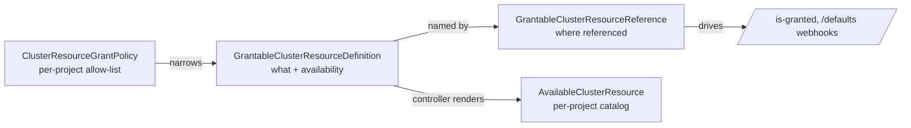

# Cluster resource grants — design

Status: design. This supersedes the earlier quota-bearing design. Quota is **removed** from this
feature (delegated to Kubernetes `ResourceQuota`); the feature now does **availability** (which
cluster-scoped resources a project may reference) and **defaulting** only.

## Problem

A project (tenant) lives in one or more namespaces and references **cluster-scoped** resources from
its objects: `StorageClass` (via `PersistentVolumeClaim.spec.storageClassName`), `ClusterIssuer` (via
`Certificate.spec.issuerRef` / an `Ingress` annotation), `ClusterRole` (via `RoleBinding.roleRef`),
`LoadBalancerClass` (via `Service.spec.loadBalancerClass`), and arbitrary global resources referenced
from third-party module CRDs. The platform must control, per project: **which** such resources are
usable and **what the default** is — without per-user proxying.

Two requirements shape the model:

1. **Extensibility.** A module developer must be able to register a *new validation path* — "in my
   CRD, field X references global resource Z" — **without editing** the central registration owned by
   the resource's owner.
2. **No bespoke quota.** Object/usage quota is left to Kubernetes `ResourceQuota` (per-storage-class
   storage and PVC count are native; total object counts via `count/<resource>.<group>`; LB services
   via `services.loadbalancers`). See [Why no quota](#why-no-quota).

## User stories

Personas: **module developer** (owns a resource domain and/or a CRD that references global resources),
**cluster admin** (governs projects), **tenant** (works inside a project's namespaces).

Module developer:
- **D1** — register a cluster-scoped resource as grantable: its identity and baseline availability. → `GrantableClusterResourceDefinition`
- **D2** — register a *new validation path* for **my own** resource ("field X of my CRD references global resource Z") **without editing** the resource owner's registration. → `GrantableClusterResourceReference` *(the story driving this redesign)*
- **D3** — declare how the resource's cluster-wide default is discovered (an annotation on the object). → `defaultFrom`
- **D4** — exclude some objects of my resource from ever being grantable (hard deny, e.g. system `ClusterRole`s). → `excluded`
- **D5** — per path, choose validate-only vs also-default, and how to default. → `fieldPaths[].defaulting`
- **D6** — keep enforcement in my own webhook; the platform only renders the catalog. → `enforcement: External`

Cluster admin:
- **A1** — control, per project, which granted names are usable (allow-list / selector). → `ClusterResourceGrantPolicy`
- **A2** — set the per-project default name. → policy `default`
- **A3** — flip the baseline for a project (open fully / lock down). → policy `availabilityDefault`
- **A4** — deny specific names for a project (override the allow-list). → policy `denied`/`deniedSelector`

Tenant:
- **T1** — discover what my project may use and the default, via ordinary namespace RBAC. → `AvailableClusterResource`
- **T2** — a reference to a disallowed resource is rejected with a clear message; an omitted field is defaulted where the path opts in.

Observability:
- **O1** — as a resource owner, see which paths reference my resource. → `definition.status.references`
- **O2** — as a path author, see whether my reference resolved or I mistyped the name. → `reference.status.bound` / `Bound` condition

Out of scope (delegated): **quota** on usage — left to Kubernetes `ResourceQuota` (see [Why no quota](#why-no-quota)).

## Model: split definition from reference

Governance and usage paths are **two separate concerns**, so they are two CRDs:

- **`GrantableClusterResourceDefinition`** (cluster-scoped) — declares a governed cluster resource and
  its baseline availability. Owned by whoever owns the resource domain.
- **`GrantableClusterResourceReference`** (cluster-scoped) — declares **one place** the resource is
  referenced (a validation/defaulting path). Shipped by **any** module, for its own resources.

Plus the per-project pieces, unchanged from before:

- **`ClusterResourceGrantPolicy`** (cluster-scoped) — per-project (by selector) allow-list + default.
- **`AvailableClusterResource`** (namespaced, read-only) — the controller-rendered catalog a tenant
  reads to discover what its project may use.


```mermaid
flowchart LR
  GCRD[GrantableClusterResourceDefinition\nwhat + availability] -->|named by| REF[GrantableClusterResourceReference\nwhere referenced]
  POL[ClusterResourceGrantPolicy\nper-project allow-list] -->|narrows| GCRD
  GCRD -->|controller renders| ACR[AvailableClusterResource\nper-project catalog]
  REF -->|drives| WH[/is-granted, /defaults webhooks/]
```

## CRDs

### GrantableClusterResourceDefinition

```yaml
apiVersion: multitenancy.deckhouse.io/v1alpha1
kind: GrantableClusterResourceDefinition
metadata:
  name: storageclasses
spec:
  grantedResource:                 # the governed cluster-scoped resource; absent ⇒ value-backed
    apiGroup: storage.k8s.io       # group + kind (version is resolved via discovery)
    kind: StorageClass
  enforcement: Managed             # Managed (our webhooks enforce) | External (owner enforces; we only render the catalog)
  defaultAvailability: All         # All (usable unless a policy narrows) | None (opt-in)
  excluded:                        # objects never available to tenants (hard deny); names and/or selectors
    - matchLabels:
        storageclass.deckhouse.io/system: "true"
  defaultFrom:                     # how to discover the resource's cluster-wide default value
    annotationKey: storageclass.kubernetes.io/is-default-class
  catalogFields:                   # fields of the granted objects copied into the tenant catalog
    - name: provisioner
      path: $.provisioner
    - name: reclaimPolicy
      path: $.reclaimPolicy
status:
  observedGeneration: 1
  references:                      # reverse index: which paths point at this resource
    - name: storageclasses-pvc
      resources:
        - persistentvolumeclaims
    - name: storageclasses-postgres
      resources:
        - postgresqls
  referenceCount: 2
  conditions:                      # set by the binding reconciler, see below
    - type: GrantedResourceValid
      status: "True"
      reason: ClusterScoped        # ValueBacked | Namespaced (False) | KindNotServed, MappingFailed (Unknown)
      message: grantedResource StorageClass.storage.k8s.io is cluster-scoped.
    - type: CatalogFieldsValid
      status: "True"
      reason: Valid                # InvalidCatalogFields (False)
      message: All catalogFields are valid.
```

| field | meaning |
|-------|---------|
| `grantedResource.apiGroup`/`.kind` | the governed resource. Present ⇒ object-backed (selectors apply); absent ⇒ value-backed (names are field values, e.g. `loadBalancerClass`). Version resolved by discovery. |
| `enforcement` | `Managed` (default) or `External` |
| `defaultAvailability` | baseline when no policy decides: `All` (default) or `None` |
| `excluded` | objects never available, regardless of policy (hard deny) |
| `defaultFrom.annotationKey` | annotation marking the resource's cluster default (fallback default) |
| `catalogFields[]` | fields of the granted objects shown in the catalog (`name` + singular JSONPath `path`), see [Catalog fields](#catalog-fields) |
| `status.references[]` | reference objects bound to this definition (name + matched resources) |
| `status.referenceCount` | `len(references)` (printer column) |
| `status.conditions[GrantedResourceValid]` | whether `grantedResource` resolves: `True` (`ClusterScoped`, `ValueBacked`), `False` (`Namespaced`), `Unknown` (`KindNotServed`, `MappingFailed`), see below |
| `status.conditions[CatalogFieldsValid]` | whether `catalogFields` passes the webhook's checks, see [Catalog fields](#catalog-fields) |

**Cluster-scoped `grantedResource` only.** A definition of a namespaced kind is not resolved:
`internal/resolve.grantedGVK`, the only way to the granted objects (the live list and `defaultFrom`),
checks the REST mapping scope and fails the registration with `resolve.ErrNamespacedGrantedResource`.
The catalog of such a definition is not rendered, and one rendered earlier is swept. That differs
from an unknown kind, whose catalog stays in its last good state because the kind may be served once
its CRD is installed: the refusal is permanent, and the old catalog would keep showing the names the
refusal exists to hide.

**A definition that does not resolve is inert.** A namespaced `grantedResource` and a kind the
apiserver does not serve are configuration errors (`resolve.IsConfigurationError`, the one rule the
webhooks and the reconciler share). A kind removed after it was served counts as not served: the
REST mapper still maps it, and its list answers 404, which for a list, naming no object, can only
mean the kind is gone (`resolve.ErrGrantedResourceNotServed`). `/is-granted` and `/defaults` skip the references to such a
definition with a log line naming the definition, the reference and the reason, and keep enforcing
the other references of the request, the same way they skip a reference whose path cannot be
evaluated. The problem is visible in the definition's `GrantedResourceValid` condition (see below).
Both webhooks run with `failurePolicy: Fail`, so answering with an error instead would block every
write of the reference's rule in every project because of one bad registration. The catalog
reconciler logs these errors at `V(1)` instead of returning them, so the pass still requeues after
`ResyncInterval` rather than falling into the error back-off, and the violation scan skips the
definition and goes on with the others. Every other `Resolve` error (a failed list, an API error)
still fails the webhook request and the reconcile pass. Inert means unchecked: while the granted
kind's CRD is not served, a tenant can write any value (say a `cert-manager.io/cluster-issuer`
annotation), and once the CRD appears, an UPDATE keeps it, since values already in the old object
are not re-checked. The violation metric reports it later.

The `grantableclusterresourcedefinitions` webhook refuses such a definition at apply time (see
[Webhooks](#webhooks)), and the binding reconciler reports a stored one as
`GrantedResourceValid=False`/`Namespaced`. Both ask `resolve.GrantedResourceProblem`, which goes
through `grantedGVK`, so they refuse exactly what the catalog reconciler refuses. A kind the mapper
does not know has no scope to judge: the webhook lets it through, and the condition is
`Unknown`/`KindNotServed`. The reconciler requeues every definition after `ResyncInterval`, whatever
the answer, since nothing else triggers it when the CRD of the kind gets installed or removed. A
separate condition rather than a part of `CatalogFieldsValid`: a namespaced kind breaks the whole
definition, catalog and checks, not only its `catalogFields`, and `kubectl describe` then says so
under its own name. The reasons for refusing a namespaced kind:

- "cluster-wide resource" is cluster-scoped by definition; a namespaced kind is not what the
  mechanism grants;
- the controller runs as `cluster-admin` and lists the granted kind across the whole cluster. For
  `Secret` it would put the names of every Secret in the cluster, and with `catalogFields` their
  values (`$.data.token`), into the catalog of every project;
- the catalog is keyed by name only, so objects of the same name in different namespaces would
  collide.

**The grants REST mapper.** The resolver, the catalog and policy reconcilers and both webhooks share
their own discovery-backed REST mapper, separate from the manager's. A REST mapper never forgets a
kind it has mapped, so the grants mapper is reset every `ResyncInterval` and on a list 404 of a
granted kind: a removed CRD, or one re-created with another scope, is noticed within
`ResyncInterval` instead of at the next pod restart. The other direction lags the same way: the
grants mapper answers a CRD installed after its last fill with a no-match, so `/is-granted` and
`/defaults` skip references to that kind for up to `ResyncInterval`.

No `usageReferences`, no `measure`, no `coerceToDefault` — measurement is gone; defaulting behaviour
moved to the reference.

### GrantableClusterResourceReference

```yaml
apiVersion: multitenancy.deckhouse.io/v1alpha1
kind: GrantableClusterResourceReference
metadata:
  name: storageclasses-pvc
spec:
  grantableClusterResourceName: storageclasses   # the definition this path validates against
  rule:                                           # which usage objects this reference matches
    apiGroups:
      - ""
    apiVersions:
      - v1
    resources:
      - persistentvolumeclaims
  fieldPaths:                                     # where the granted NAME is, per resource/version
    - path: $.spec.storageClassName               # entry without scope = default (all resources/versions)
      defaulting: Coerce                          # None | FillEmpty | Coerce
    # The two examples below belong to OTHER references: a scope must stay within spec.rule, and
    # this reference's rule is core/v1 persistentvolumeclaims only.
    # version-scoped entry, from a reference whose rule covers networking.k8s.io v1 and v1beta1 ingresses:
    # - apiVersions:
    #     - v1beta1
    #   path: $.metadata.annotations['kubernetes.io/ingress.class']
    #   defaulting: None
    # resource-scoped entry, from a reference whose rule covers batch/v1 jobs and cronjobs:
    # - apiGroups: [batch]
    #   apiVersions: [v1]
    #   resources: [cronjobs]
    #   path: $.spec.jobTemplate.spec.template.spec.priorityClassName
status:
  observedGeneration: 1
  bound: true                                     # grantableClusterResourceName resolves to a definition
  conditions:
    - type: Bound
      status: "True"
      reason: Resolved                            # Resolved | UnknownResource (name missed)
    - type: FieldPathsValid
      status: "True"
      reason: Valid                               # Valid | InvalidFieldPaths (message lists the problems)
```

| field | meaning |
|-------|---------|
| `grantableClusterResourceName` | the `GrantableClusterResourceDefinition` this path validates against |
| `rule.apiGroups/apiVersions/resources` | which usage objects this reference applies to; `*` = any |
| `fieldPaths[]` | scoped name locations: `{apiGroups?, apiVersions?, resources?, path, match?, defaulting?}` |
| `fieldPaths[].path` | JSONPath to the granted name (may target an annotation) |
| `fieldPaths[].match` | `{fieldPath, equals\|in}` guard: the entry applies only when the predicate holds |
| `fieldPaths[].defaulting` | `None` (validate only), `FillEmpty` (inject project default into an empty field), `Coerce` (also rewrite a disallowed value — for fields a built-in admission pre-fills) |
| `status.bound` | true if the named definition exists |
| `status.conditions[Bound].reason` | `Resolved` or `UnknownResource` |
| `status.conditions[FieldPathsValid].reason` | `Valid` or `InvalidFieldPaths`; the message carries the webhook's refusal text |

**Path selection.** For a request of resource `r` in group/version `g/v`, keep the `fieldPaths`
entries whose `resources`/`apiGroups`/`apiVersions` match (an empty dimension matches anything) and
pick the most specific one: `resources` scores 4, `apiGroups` 2, `apiVersions` 1, and the scores add
up, so `resources` alone outranks `apiGroups` + `apiVersions` together. Equal scores go to the
earliest entry in the list. The unscoped entry scores 0 and is the fallback. A dimension scores only
when it actually narrows the entry: a list containing `*` matches anything and scores 0, like an
omitted one, so `apiGroups: ["*"]` ties with the unscoped entry and never outranks an explicit scope.
The same holds for `fieldPaths[].resources`: `resources: ["*"]` is accepted and behaves exactly like
an omitted field. At least one entry is required.

**Scopes must fit the rule.** Two rules tie `fieldPaths[]` to `rule`, because a request no entry
applies to is skipped by `/is-granted`, `/defaults` and the violation scan without any check — a
silent fail-open:

- *Subset.* Every value in an entry's `resources`/`apiGroups`/`apiVersions` must be in the matching
  dimension of `rule`. `*` in `rule` admits any value; `*` in the entry restricts nothing and is fine.
  An entry scoped to `pod` under `rule.resources: [pods]` is a typo that would select nothing.
- *Coverage.* Every (group, version, resource) `rule` matches must be selected by some entry. The check
  enumerates `rule`'s lists (`rule.apiGroups` never holds `*`, the CRD rejects it); a `*` in
  `rule.apiVersions` or `rule.resources` is replaced by a placeholder no explicit list contains, so
  only an entry unrestricted in that dimension covers it. The unscoped fallback is one way to cover
  everything; scoped entries that together cover every combination are another
  (`rule.resources: [jobs, cronjobs]` with one entry per resource).

The resource scope exists because one path is not enough per group/version: in core/v1 a Pod carries
`$.spec.priorityClassName` while a ReplicationController carries
`$.spec.template.spec.priorityClassName`, and in batch/v1 a Job carries
`$.spec.template.spec.priorityClassName` while a CronJob carries
`$.spec.jobTemplate.spec.template.spec.priorityClassName`.

### ClusterResourceGrantPolicy (unchanged)

Per-project allow-list and default; `projectSelector` is evaluated per namespace against the union of
the Project labels and the namespace labels (the namespace wins a shared key), so a label on the Project
selects all its namespaces (`internal/resolve.GrantsForNamespace`, shared by the webhooks and the
catalog reconciler), and
per resource (`resourceName`) sets `allowed` / `allowedSelector` / `denied` / `deniedSelector` /
`default` / `availabilityDefault`. A non-empty allow-list or an `allowedSelector` infers a `None` baseline; empty `allowed: []` does not.

### AvailableClusterResource

Per-project catalog (available names, their [catalog fields](#catalog-fields) and the default) the
controller renders into each project namespace. It lives exactly as long as its
`GrantableClusterResourceDefinition`: when the registration is deleted, the controller deletes the
catalog from every project namespace on the next reconcile. A registration held by a finalizer
counts as deleted from the moment its `deletionTimestamp` is set.
The sweep runs on every reconcile, even when another registration fails to resolve; the catalog of
the failing registration itself is kept in its last good state, except for a namespaced
`grantedResource`, whose catalog is swept. A configuration error (namespaced or unserved kind) is
logged, not returned, so it does not slow down the resync of the other registrations.

```yaml
status:
  grantedResourceKind: StorageClass
  default: fast
  availableCount: 1
  available:
    - name: fast
      default: true
      fields:                      # from the definition's catalogFields; values keep their JSON type
        provisioner: rbd.csi.ceph.com
        reclaimPolicy: Retain
        allowVolumeExpansion: true
```

#### Catalog fields

A tenant choosing a StorageClass needs more than its name: the provisioner, the reclaim policy,
whether volumes can grow. The definition owner lists those fields in `spec.catalogFields`, and the
catalog reconciler copies their values from the granted objects into `status.available[].fields`.
The platform provides the mechanism only; which fields are shown is decided by the team that owns the
definition.

Rules (the projection lives in `internal/engine/catalog.go`):

- `name` is a lowerCamelCase key (`^[a-z][a-zA-Z0-9]*$`, at most 63 characters), unique in the list
  (`listType: map`).
- `path` is an RFC 9535 **singular query**: member names and indexes only, one value at most. No
  wildcards, descendant segments, slices or filters.
- Paths overlapping `metadata.managedFields` or the `kubectl.kubernetes.io/last-applied-configuration`
  annotation are refused. Both hold a copy of the whole object, so a parent of them (`$`,
  `$.metadata`, `$.metadata.annotations`) is refused as well. The comparison is done on the parsed
  segments, so `$["metadata"]["managedFields"]` is caught too.
- At most 10 fields (`maxItems` in the schema, and the projection takes the first 10 of an object that
  bypassed it; a duplicate name keeps its first entry).
- A value longer than 512 bytes in its JSON serialization, an absent value and `null` are left out.
- One catalog (one `AvailableClusterResource`) with its fields has a budget of 512 KiB
  (`engine.MaxCatalogFieldsBytes`, checked by `engine.CatalogSize`: the length of the JSON
  serialization of the whole `status.available` list, entries with their names, `default` flags and
  fields; exact for `status.available`, the rest of the object is not counted. The entries are
  counted one at a time and the count stops at the first one past the budget). A catalog over it
  carries no `fields` in any entry; names and default stay. All or nothing, so the result depends
  only on the catalog, never on the order the objects are read in. Without the budget, hundreds of
  objects × 10 fields × 512 bytes would push the object past the ~1.5 MiB etcd limit: the status
  write would fail and the catalog would freeze with every name in it.
- Near the budget a catalog can flap: a value that changes length moves the catalog across the
  threshold, and it switches between "with fields" and "without" on consecutive passes, each switch a
  status write in every project namespace the catalog is rendered in. There is no hysteresis; a
  catalog that close to the limit is a sign to show fewer or shorter fields.
- Values keep their JSON type (`map[string]apiextensionsv1.JSON`; in the schema `additionalProperties`
  with `x-kubernetes-preserve-unknown-fields`).
- Only object-backed definitions: a value-backed one has no objects, so the webhook refuses the list
  there (a stored one is ignored by the projection).
- Show non-secret data only: every user of every project the object is available to reads it. The
  shipped `storageclasses` definition leaves out `parameters`, which is driver-specific, can be large
  and may name secrets.

The values are refreshed on each catalog reconcile; the granted objects themselves are not watched,
so a changed value shows up within `ResyncInterval` (2 minutes).

What is checked where:

- **The declaration** (paths, value-backed) is refused at apply time by the
  `grantableclusterresourcedefinitions` webhook (see [Webhooks](#webhooks)) and reported on the stored
  object by `CatalogFieldsValid`: `True`/`Valid`, or `False`/`InvalidCatalogFields` with the refusal
  text as the message. A definition without `catalogFields` is `True` too (message
  `No catalogFields are declared.`), so every definition carries the condition and a missing one only
  means "not reconciled yet". Both use `engine.DefinitionProblems`. An invalid entry that got stored
  anyway is still skipped during projection and breaks nothing else.
- **The values** depend on the objects and on the project, so a condition on the cluster-wide
  definition cannot carry them. A value over 512 bytes and a catalog over the budget are reported by a
  `Warning` event `CatalogFieldsSkipped` on the definition, naming the namespace, the catalog and the
  skipped `<object>/<field>` pairs (the first five, then "and N more"). The event is emitted on every
  pass that skips, so it does not expire while the skip lasts; the recorder's spam filter bounds it to
  a burst and then one event per five minutes per definition, whatever the number of projects. The log
  has no such filter, so it is written only when the skip set of a catalog (namespace + definition)
  changes: the oversized pairs, and whether the catalog is over the budget, not its size, which moves
  with any value (a hash of them is kept). An Info line carries the event's text, a `V(1)` line the
  full list; a pass without skips forgets the catalog, and so does a pass after the definition is
  deleted, so a skip that returns is logged again. Per catalog rather than once per
  definition, because the set differs between projects and a pass is per namespace anyway. Events rather than a metric: the owner of the definition looks at `kubectl describe`
  next to `CatalogFieldsValid`, and the module has no alerting on catalog content to feed.

**Why an allow-list in the definition and not a marker in the CRD schema.** A marker on the fields of
the granted resource's schema (an `x-...` extension saying "show to tenants") looks more natural, but:

- a CRD schema accepts only the fixed set of `x-kubernetes-*` extensions the apiserver defines, and
  a CRD carrying any other key is refused as a whole — a made-up `x-kubernetes-...` one included
  (`field not declared in schema` on server-side apply, `strict decoding error: unknown field` on
  create). That prefix is also reserved for Kubernetes itself. There is nowhere to put the marker;
- the main registered resources (StorageClass, ClusterRole) are built-in types with no
  CRD schema to mark at all;
- an opt-out marker shows every unmarked field, and every field added to the schema later, to every
  tenant without a decision. An opt-in marker avoids that but still runs into the two points above.
  The explicit list in the definition is opt-in, and it is shipped by the module that owns the
  resource, so the decision stays with the owner either way.

## Coverage: which CRD closes which story

| CRD / component | stories closed |
|-----------------|----------------|
| `GrantableClusterResourceDefinition` | D1 (register), D3 (`defaultFrom`), D4 (`excluded`), D6 (`enforcement: External`), O1 (`status.references`) |
| `GrantableClusterResourceReference` | D2 (register a path), D5 (`defaulting`), O2 (`status.bound`) |
| `ClusterResourceGrantPolicy` | A1 (allow-list), A2 (default), A3 (`availabilityDefault`), A4 (`denied`) |
| `AvailableClusterResource` | T1 (discovery) |
| `/is-granted` + `/defaults` webhooks | T2 (reject + default) |
| Kubernetes `ResourceQuota` (delegated) | quota — out of scope |

Every story has an owner; no story is left uncovered, and nothing in the model exists without a story.

## Availability resolution

Precedence for "may project P use granted name N of resource R":
`excluded → denied → allowed → policy availabilityDefault → registration defaultAvailability`.
This lives in a single place (`internal/resolve`) shared by the webhook and the reconciler.

## Defaulting

Per path (`fieldPaths[].defaulting`):

- `None` — validate only. Use for a reference whose absence is meaningful (a feature-toggling
  annotation like `cert-manager.io/cluster-issuer`).
- `FillEmpty` — on CREATE, inject the project default into an empty field.
- `Coerce` — `FillEmpty` plus: rewrite a non-empty value that is not available to the project default.
  For fields a built-in admission controller pre-fills (e.g. `DefaultStorageClass` on PVCs). The rewrite
  is reported to the author as an admission warning naming the original and the substituted value.

`FillEmpty` and `Coerce` constrain the path. Validation reads the value with the full RFC 9535
evaluator, but defaulting writes a JSON Patch and so needs one unambiguous location: `path` must be a
simple member path (`$.spec.storageClassName`, `$.metadata.annotations['cert-manager.io/cluster-issuer']`),
never a wildcard, index or filter. A reference that breaks this is rejected at apply time by the
`GrantableClusterResourceReference` validating webhook (`/validate/v1alpha1/grantableclusterresourcereferences`),
rather than binding and silently never defaulting. With `None` any valid RFC 9535 path is fine. The
simple-member-path check reads the segments off the same RFC 9535 parse tree the evaluator uses, so
escapes decode identically on both sides, and it also refuses an empty member name (`$['']`).

The default *value* comes from the policy's `default`, falling back to the definition's `defaultFrom`;
`defaultFrom` accepts an object only when the annotation value is `true` (case-insensitive), so a class
marked `is-default-class: "false"` is not a default.

## Webhooks

Generated from the set of `GrantableClusterResourceReference` (their `rule`s determine the intercepted
GVKs — so registering a reference automatically extends interception to that module's CRD):

- **`/is-granted`** (validating) — for the request's GVK, find matching references → their definitions
  → deny if the referenced name is not available to the project. On UPDATE, values already present are
  grandfathered so existing objects are not broken. A reference whose selected `path` or
  `match.fieldPath` cannot be evaluated is logged (reference name, entry index, path) and skipped; the
  other references are still enforced. This is a deliberate fail-open for the broken reference only:
  the reference webhook runs with `failurePolicy: Ignore`, so such an object can still be stored, and
  answering with an error instead would, under this webhook's `failurePolicy: Fail`, block every
  CREATE/UPDATE of the reference's `rule` in every project because of one bad object. Visibility comes
  from the log and the reference's `FieldPathsValid=False`. Errors not tied to one reference (listing
  references, reading the namespace or grants, decoding, resolving) still fail the request.
  `/defaults` and the violation scan already skipped such a reference and are unchanged.
- **`/defaults`** (mutating, CREATE) — apply `fieldPaths[].defaulting`.

Registered statically, not derived from the references:

- **`/validate/v1alpha1/grantableclusterresourcereferences`** (validating, CREATE/UPDATE) — reject a
  `fieldPaths[]` entry whose `path` or `match.fieldPath` does not compile with the RFC 9535 parser
  `/is-granted` uses (whatever the `defaulting` mode: `/is-granted` skips a stored uncompilable path, so the
  reference would silently check nothing), or whose `defaulting` is not `None` while its `path` is not a simple member path, and a
  spec that breaks the subset or coverage rule (see *Scopes must fit the rule*). All problems are
  reported in one refusal. On UPDATE only entries that are new or changed relative to `oldObject`
  have their paths checked (compared by content, not index); an entry's scope is re-checked when the
  entry or `rule` changed (dropping a resource from `rule` must not leave a stored entry scoped to it);
  coverage, a property of the whole spec, is re-checked when `rule` or `fieldPaths` changed. An object
  with a `deletionTimestamp` is not checked at all. So a reference stored before the webhook — or
  while it was unavailable — stays editable (metadata, finalizers) instead of being refused on every
  write; fixing a broken entry is a change, so it is checked and passes. The rules live in one place,
  `engine.ReferenceProblems`, shared with the binding reconciler.
  `failurePolicy: Ignore` and no system-writer exclusion: the authors of these objects are module
  developers (`system:masters` on a stand) and the deckhouse-controller applying a module's release,
  so excluding them would leave nothing to police; `Ignore` keeps an unavailable backend from
  blocking a release.
- **`/validate/v1alpha1/grantableclusterresourcedefinitions`** (validating, CREATE/UPDATE) — reject a
  namespaced `grantedResource` (see [Cluster-scoped `grantedResource` only](#grantableclusterresourcedefinition)),
  a `catalogFields[]` entry whose `path` `engine.CompileCatalogPath` refuses (does not compile, is not a
  singular query, overlaps a forbidden path) and `catalogFields` on a value-backed definition. All
  problems in one refusal, the scope first, then the entries with their index. The scope comes from the
  grants REST mapper (see [The grants REST mapper](#grantableclusterresourcedefinition)), the one the
  catalog and definition reconcilers resolve with, so the webhook refuses exactly what they refuse: a
  kind it does not know (no matches for kind) is let through, and any other mapping error is logged and
  let through too, since a discovery hiccup must not refuse a module's release. The kind comes from the
  request body, but that mapper rediscovers the API only once after each reset, so a made-up group
  costs no discovery of its own; a kind whose CRD was installed after the last reset is let through
  until the next one (at most `ResyncInterval`), and the reconciler reports it. On UPDATE the scope is checked only when
  `grantedResource` changed, only entries that are new or changed relative to `oldObject` are checked
  (by content, not index), and the value-backed rule only when `catalogFields` or `grantedResource`
  changed; an object with a `deletionTimestamp` is not checked.
  `failurePolicy: Ignore` and no system-writer exclusion, for the same reasons as the reference
  webhook: definitions are shipped by modules through the deckhouse-controller. Names, their
  uniqueness and the limit of 10 are left to the schema. The rules live in `engine.DefinitionProblems`,
  shared with the binding reconciler.
- **`/protect`** (validating) — keep the controller-owned `AvailableClusterResource` read-only (with
  system-group exemptions). No quota status to protect anymore.

`/is-granted`, `/defaults`, the reference and definition webhooks and the project, reference and
definition reconcilers share one JSONPath factory
(`jsonpath.NewWithCache` in `cmd/main.go`), so a path compiles the same way everywhere. Its cache of
parsed paths is a bounded LRU (`MaxCachedPaths`, 1024 entries; expressions over `MaxCachedPathLen`,
256 bytes, are parsed but not cached; parse errors are never cached). The bound matters because the
cache also sees paths from objects that are rejected or dry-run and never stored, and the webhook
server accepts requests from any pod without a client certificate: an unbounded cache could be inflated
until the controller is OOM-killed, and with it `/is-granted`, which runs with `failurePolicy: Fail`.
Legitimate paths — those of stored references, definitions and their match guards — number in the tens
to hundreds and fit with a wide margin.

## Controller

- **Catalog reconciler** (keyed by namespace) — renders `AvailableClusterResource` per project per
  definition from resolved availability, and deletes the module-owned catalogs of the namespace whose
  definition is gone (the catalog is read-only to everyone but the controller, so nothing else could).
  Catalog fields it leaves out for size are reported as `CatalogFieldsSkipped` events on the
  definition (see [Catalog fields](#catalog-fields)).
- **Binding reconciler** (keyed by `GrantableClusterResourceReference` and
  `GrantableClusterResourceDefinition`) — sets `reference.status.bound`/`Bound` condition and the
  definition's `status.references`/`referenceCount` reverse index. It also sets `FieldPathsValid`
  on the reference: the webhook's checks applied to the whole stored object, without ratcheting, so a
  reference stored past the webhook shows up (`False`/`InvalidFieldPaths`, message = the refusal text).
  The definition gets `CatalogFieldsValid` the same way (`False`/`InvalidCatalogFields`), and
  `GrantedResourceValid` for the scope of its `grantedResource`.
- **Policy reconciler** (keyed by `ClusterResourceGrantPolicy`) — reports `SelectorsValid` (a selector
  the schema accepts but the selector library refuses would otherwise silently match nothing) and
  `AllowedEffective` (an allowed name the definition's `excluded` filter refuses anyway grants nothing;
  for ClusterRole the message names the `rbac.deckhouse.io/delegatable` label).
- **Violation scan** (inside the catalog reconciler) — after each catalog render, walks the intercepted
  objects of the namespace and exposes `d8_cluster_objects_grant_violated{project,grant,violating_resource,
  violating_object_name,violating_field}` on the controller's `:9091` metrics endpoint for objects whose
  referenced name is no longer available (grandfathered on UPDATE, so this is the only place they show).

## Worked examples

**StorageClass** — definition + the PVC path:

```yaml
---
apiVersion: multitenancy.deckhouse.io/v1alpha1
kind: GrantableClusterResourceDefinition
metadata:
  name: storageclasses
spec:
  grantedResource:
    apiGroup: storage.k8s.io
    kind: StorageClass
  defaultAvailability: All
  defaultFrom:
    annotationKey: storageclass.kubernetes.io/is-default-class
---
apiVersion: multitenancy.deckhouse.io/v1alpha1
kind: GrantableClusterResourceReference
metadata:
  name: storageclasses-pvc
spec:
  grantableClusterResourceName: storageclasses
  rule:
    apiGroups:
      - ""
    apiVersions:
      - v1
    resources:
      - persistentvolumeclaims
  fieldPaths:
    - path: $.spec.storageClassName
      defaulting: Coerce
```

**Indirection (PostgresDatabase → PVC).** A `PostgresDatabase.spec.storageClass` references a
StorageClass; the operator creates a PVC under the hood. Register a *validation-only* reference for the
CRD; the PVC is validated by its own reference. Both are validated; there is no quota, so no
double-counting concern:

```yaml
---
apiVersion: multitenancy.deckhouse.io/v1alpha1
kind: GrantableClusterResourceReference
metadata:
  name: storageclasses-postgres
spec:
  grantableClusterResourceName: storageclasses
  rule:
    apiGroups:
      - acid.zalan.do
    apiVersions:
      - v1
    resources:
      - postgresqls
  fieldPaths:
    - path: $.spec.volume.storageClass
      defaulting: None
```

**ClusterIssuer — two paths.** Certificate (`spec.issuerRef`, guarded `kind == ClusterIssuer`) and the
Ingress annotation (a toggle — `defaulting: None`, never filled in):

```yaml
---
apiVersion: multitenancy.deckhouse.io/v1alpha1
kind: GrantableClusterResourceDefinition
metadata:
  name: clusterissuers
spec:
  grantedResource:
    apiGroup: cert-manager.io
    kind: ClusterIssuer
  defaultAvailability: All
---
apiVersion: multitenancy.deckhouse.io/v1alpha1
kind: GrantableClusterResourceReference
metadata:
  name: clusterissuers-certificate
spec:
  grantableClusterResourceName: clusterissuers
  rule:
    apiGroups:
      - cert-manager.io
    apiVersions:
      - v1
    resources:
      - certificates
  fieldPaths:
    - path: $.spec.issuerRef.name
      match:
        fieldPath: $.spec.issuerRef.kind
        equals: ClusterIssuer
      defaulting: FillEmpty
---
apiVersion: multitenancy.deckhouse.io/v1alpha1
kind: GrantableClusterResourceReference
metadata:
  name: clusterissuers-ingress
spec:
  grantableClusterResourceName: clusterissuers
  rule:
    apiGroups:
      - networking.k8s.io
    apiVersions:
      - "*"
    resources:
      - ingresses
  fieldPaths:
    - path: $.metadata.annotations['cert-manager.io/cluster-issuer']
      defaulting: None
```

**ClusterRole** — availability-only; bind a curated set via the `rbac.deckhouse.io/delegatable` label:

```yaml
---
apiVersion: multitenancy.deckhouse.io/v1alpha1
kind: GrantableClusterResourceDefinition
metadata:
  name: clusterroles
spec:
  grantedResource:
    apiGroup: rbac.authorization.k8s.io
    kind: ClusterRole
  defaultAvailability: All
  excluded:
    - matchExpressions:
        - key: rbac.deckhouse.io/delegatable
          operator: NotIn
          values: ["true"]
---
apiVersion: multitenancy.deckhouse.io/v1alpha1
kind: GrantableClusterResourceReference
metadata:
  name: clusterroles-rolebinding
spec:
  grantableClusterResourceName: clusterroles
  rule:
    apiGroups:
      - rbac.authorization.k8s.io
    apiVersions:
      - v1
    resources:
      - rolebindings
  fieldPaths:
    - path: $.roleRef.name
      match:
        fieldPath: $.roleRef.kind
        equals: ClusterRole
      defaulting: None
```

## Why no quota

Kubernetes `ResourceQuota` already covers what this feature would quota, and does it race-free
(reservation in the quota controller) at the **terminal consumer**:

- per-storage-class storage and PVC count — native (`<sc>.storageclass.storage.k8s.io/...`), and the
  project already renders a `ResourceQuota`;
- total object counts of any resource — `count/<resource>.<group>`;
- LoadBalancer / NodePort services — `services.loadbalancers` / `services.nodeports`.

What `ResourceQuota` cannot express is narrow (per-referenced-name counts for non-storage resources,
per-name counts inside arbitrary CRDs, summation of arbitrary quantity fields). None of the shipped
resources need it today (per-`loadBalancerClass`-value counts are debatable; total LB services
suffice). So quota is dropped; if a concrete per-name/CRD need appears, it is introduced later, and
made race-safe via reservation in status — not via a TOCTOU webhook counter.

## Removed vs the prior design

`ClusterResourceGrant` (the object-quota pool) and all measurement: the `measure`/`countable`/
`quantities` fields, the quota webhook path, `internal/quota`, and the per-namespace rendered quota
objects. `usageReferences` left `GrantableClusterResourceDefinition` for the new
`GrantableClusterResourceReference` CRD. `coerceToDefault` left the definition for
`fieldPaths[].defaulting: Coerce`.
