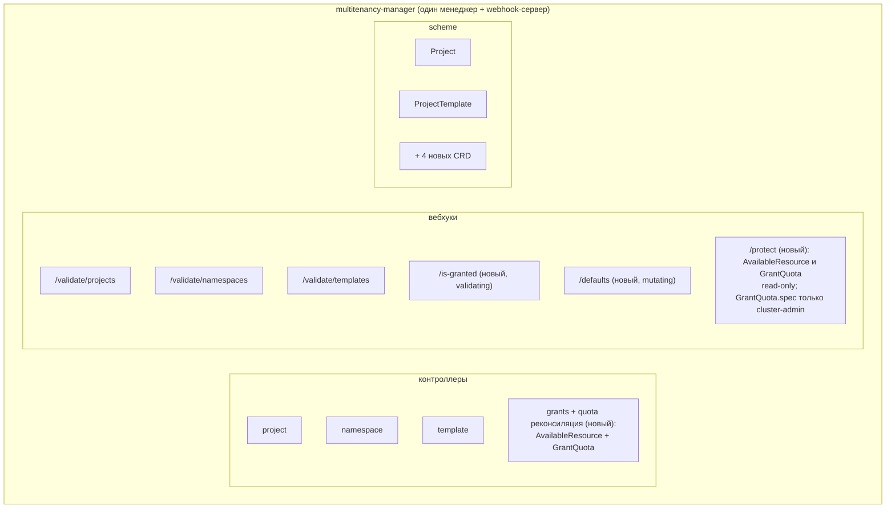
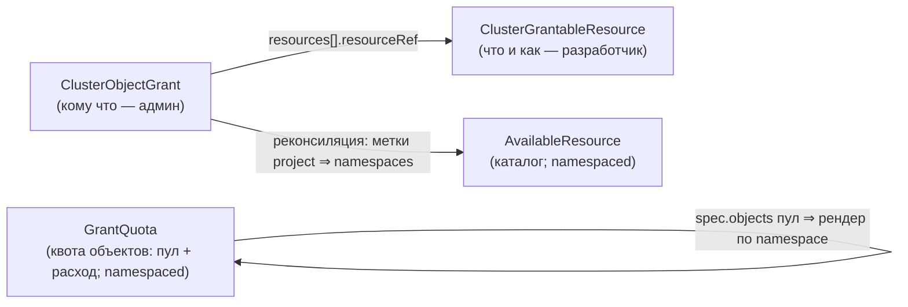
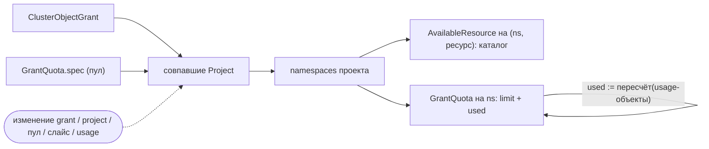
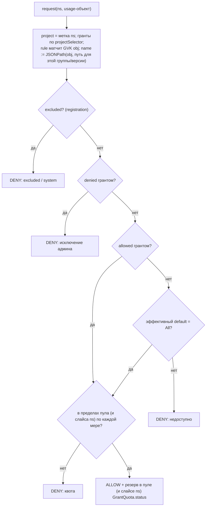

# Гранты на кластерные объекты — дизайн

> Статус: **черновик / обсуждение.** Проблема, пользовательские истории, модель ресурсов, как это
> работает и принятые решения. Реализация живёт внутри существующего `multitenancy-manager`
> (см. [Архитектура](#архитектура)).

## Проблема

Проект (тенант) живёт в одном или нескольких namespace. На то, что проекту можно, влияет ряд
**кластерных (cluster-scoped)** ресурсов: `StorageClass`, `IngressClass`, `LoadBalancerClass` (и
объекты `Service`/`PVC`/`Ingress`, которые на них ссылаются), `PriorityClass`, `RuntimeClass`, …
Сегодня проект может ссылаться на *любой*. Multitenancy должен контролировать попроектно: **какие**
доступны, **какой дефолтный** и **сколько** можно потребить.

Проекты против namespace: сейчас 1:1, но проект сможет владеть **несколькими** namespace. Поэтому всё
здесь — **попроектно** (админ выдаёт на уровне проекта; пользователь делит внутри). Энфорсмент/материализация
— **по namespace**. Namespace проекта — это `namespaces` с меткой `projects.deckhouse.io/project=<project>`.

## Пользовательские истории

- **U1 (пользователь)** — видеть, какие глобальные ресурсы доступны мне в проекте.
- **D1 (разработчик модуля)** — настроить, как мой глобальный ресурс пробрасывается в проект (где на
  него можно ссылаться).
- **A1 (админ)** — назначить набор ресурсов, доступных в проекте.
- **A2 (админ)** — задать дефолтный ресурс на проект.
- **A3 (админ)** — задать квоты на проект (например, 5 внешних LB, внутренних сколько угодно; 1 ТиБ
  любого диска, 200 ГиБ быстрого): compute в `Project.spec.quota.compute`, лимиты объектов в
  [`GrantQuota`](#grantquota) (см. [Квоты](#квоты)).
- **A4 (админ)** — преднастроить и легко навешивать эти настройки на проекты (пресеты).
- **D2 (разработчик модуля)** — задать глобальный дефолт (например, аннотацию default-class) и
  переиспользовать его.
- **D3 (разработчик модуля)** — энфорсить гранты *своим* вебхуком/контроллером вместо встроенного
  (у ресурса своя сложная валидация), при этом читая per-project allow-list / дефолт / квоту.
- **A5 (админ)** — исключить часть ресурсов (или объектов) из доступного проектам по умолчанию.
- **D4 (разработчик модуля)** — исключить часть объектов своего ресурса из дефолтной доступности
  (например, служебные `ClusterRole`, которые тенант не должен биндить никогда).

Покрытие: U1 → [`AvailableResource`](#availableresource); D1/D2 →
[`ClusterGrantableResource`](#clustergrantableresource); A1/A2/A4/A5 →
[`ClusterObjectGrant`](#clusterobjectgrant); A3 (квота) → `Project.spec.quota.compute` +
[`GrantQuota`](#grantquota) (см. [Квоты](#квоты)).

## Архитектура

**Отдельного образа `cluster-objects-controller` нет.** `multitenancy-manager` уже является
controller-runtime-менеджером с webhook-сервером, владеет `Project`/`ProjectTemplate` и связью
проект↔namespace, и рендерит нативные `ResourceQuota`/`LimitRange` через `ProjectTemplate`. Мы
расширяем его четырьмя CRD, одним реконсайлером и двумя webhook-хендлерами — без нового образа, без
дублирования типа `Project`, без кросс-модульного разделения.

Есть **четыре поверхности**, их легко спутать — каждая делает своё:

- **admission-вебхуки** (`/is-granted`, `/defaults`) — контроль **записи** (использования granted-объекта);
- **`AvailableResource`** — синтетический per-project **каталог** (`get available`), namespaced —
  тенант узнаёт, *какие* ресурсы доступны проекту (имена + дефолт), обычным RBAC на namespace;
- **`GrantQuota`** — ресурс **квоты объектов**: `spec` — пул квоты объектов проекта (лимиты), `status`
  — живой расход. Namespaced, рендерится в каждый namespace проекта, чтобы расход был там виден. Квота
  compute остаётся нативной (`ResourceQuota`); `GrantQuota` — её аналог для granted-объектов;
- **реконсайлер** — материализует каталог, рендерит `GrantQuota` и считает эффективную доступность.

**Non-goal — фильтрация native `kubectl get <cluster-resource>`.** Фильтр в стиле Capsule-proxy
работает по **запрашивающему пользователю**, а не по проекту; и ломается, когда один юзер состоит в
нескольких проектах — это отдельная история. Поэтому per-project discovery делаем через namespaced
`AvailableResource` (без неоднозначности user-identity), а не фильтрацией нативных cluster-scoped
списков.



## Модель ресурсов

Четыре CRD в группе `multitenancy.deckhouse.io/v1alpha1`:

| Kind | Scope | Владелец (пишет) | Назначение |
|------|-------|------------------|------------|
| [`ClusterGrantableResource`](#clustergrantableresource) | Cluster | разработчик модуля | регистрация ресурса: GVK, где ссылаются, источник дефолта, что измеримо |
| [`ClusterObjectGrant`](#clusterobjectgrant) | Cluster | админ | per-project (по селектору) allow-list + дефолт; пресет |
| [`AvailableResource`](#availableresource) | Namespaced | контроллер | per-project **каталог** — доступные имена + дефолт (read-only для пользователей) |
| [`GrantQuota`](#grantquota) | Namespaced | cluster-admin (`spec`) / контроллер (`status`) | **пул** квоты объектов (`spec`) + живой **расход** (`status`); рендерится в каждый namespace проекта |



### ClusterGrantableResource

Регистрируется один раз разработчиком модуля. **Измерение объявляется внутри `usageReference`** (там,
где реально считается) — это убирает неоднозначность «count чего?» и не требует поля с типом
значения: count — целое, quantity — `resource.Quantity`.

```yaml
apiVersion: multitenancy.deckhouse.io/v1alpha1
kind: ClusterGrantableResource
metadata:
  name: storageclasses           # на это имя ссылаются гранты; оно же — имя AvailableResource
spec:
  grantedResource:               # контролируемый кластерный ресурс
    apiVersion: storage.k8s.io/v1
    kind: StorageClass
  enforcement: Managed           # Managed (энфорсят наши вебхуки) | External (свой вебхук модуля)
  defaultAvailability: All       # All (доступно, пока грант не сузит) | None (opt-in: ничего без гранта)
  excluded:                      # объекты, недоступные тенантам никогда, вне зависимости от грантов (hard deny)
    matchLabels:
      storageclass.deckhouse.io/system: "true"
  defaultFrom:                   # опц. fallback-дефолт (история D2); перекрывается дефолтом гранта
    annotationKey: storageclass.kubernetes.io/is-default-class
  usageReferences:               # где ссылаются на имя granted-объекта (для allow-list / default / учёта)
  - rule:                        # webhook/RBAC-стиль матча usage-объекта (группы/версии/ресурсы)
      apiGroups:
      - ""                       # core-группа
      apiVersions:
      - v1
      resources:
      - persistentvolumeclaims
    fieldPath: $.spec.storageClassName              # дефолтный путь до ИМЕНИ granted-объекта
    countable: true                                 # мера: число PVC (ключ меры: persistentvolumeclaims)
    quantities:                                     # мера: суммируемые величины
    - name: requests.storage                        # ключ меры
      fieldPath: $.spec.resources.requests.storage
  # Для allow-list/default нужны только `rule` + `fieldPath`. Измерение (countable/quantities)
  # ОПЦИОНАЛЬНО — у многих ресурсов его нет (тогда ресурс только allow-list; записи в GrantQuota нет).
  # ЛИМИТЫ квоты живут в GrantQuota.spec — см. Квоты; грант (ниже) квоты не несёт.
status:
  conditions: []           # стандартное условие Ready, ставит контроллер
  observedGeneration: 1
```

| Поле | Тип | Обяз. | Значение |
|------|-----|-------|----------|
| `grantedResource.apiVersion`/`.kind` | string | нет | GVK выдаваемого кластерного ресурса. **Есть ⇒ object-backed** (имена — реальные объекты; работает `allowedSelector`). **Нет ⇒ value-backed** (имена — значения поля ссылки, напр. `loadBalancerClass`; только литеральный `allowed`) |
| `enforcement` | enum | нет | `Managed` (по умолчанию — энфорсят наши вебхуки) или `External` (энфорсит свой вебхук модуля; мы только материализуем `AvailableResource`) — см. [Валидация на стороне модуля](#валидация-на-стороне-модуля-external-энфорсмент) |
| `defaultAvailability` | enum | нет | база, когда ни один грант не разрешает объект: `All` (по умолчанию — доступно, пока грант не сузит) или `None` (opt-in — ничего, пока не выдано). Админ может переопределить per-project через `grant.availabilityDefault` |
| `excluded` | имена / LabelSelector | нет | объекты этого ресурса, **никогда** недоступные тенантам, вне зависимости от грантов (hard deny; история D4 — например системные `ClusterRole`) |
| `defaultFrom.annotationKey` | string | нет | аннотация на granted-объекте, помечающая cluster-wide дефолт (только fallback) |
| `usageReferences[].rule.apiGroups[]` | []string | да | API-группы usage-объекта (например `networking.k8s.io`, `extensions`); `*` = любая. Ресурс может жить в **нескольких** группах |
| `usageReferences[].rule.apiVersions[]` | []string | да | версии для матча (например `v1`, `v1beta1`); `*` = любая |
| `usageReferences[].rule.resources[]` | []string | да | plural(ы) usage-объекта (например `ingresses`) |
| `usageReferences[].fieldPath` | JSONPath | да | **дефолтный** путь до **имени** granted-ресурса (строка), для всех совпавших group/version. Может указывать в аннотацию, например `$.metadata.annotations['ipam.cilium.io/ip-pool']` |
| `usageReferences[].paths[]` | `{apiGroups?, apiVersions?, fieldPath}` | нет | **переопределения** `fieldPath` по группе/версии (поле переехало между версиями). Выигрывает запись, чьи `apiGroups`/`apiVersions` совпали с GVK запроса; иначе берётся верхнеуровневый `fieldPath` |
| `usageReferences[].match` | `{fieldPath, equals\|in}` | нет | условие: ссылка применяется только когда предикат истинен на объекте (например `objectRef.kind == ClusterVirtualImage`); без него — применяется всегда |
| `usageReferences[].countable` | bool | нет | если true — этот usage-объект можно считать в квоте; **ключ меры = plural ресурса** (например `persistentvolumeclaims`) — целочисленная мера. Plural общий для совпавших групп/версий; если `rule.resources` содержит несколько plural, каждый считается под своим ключом |
| `usageReferences[].quantities[].name` / `.fieldPath` | string / JSONPath | нет | суммируемые величины; каждое `name` — **ключ меры**, мера `resource.Quantity`. `fieldPath` тоже можно сделать version-scoped через `paths[]`, если он переехал |

Набор **мер** квоты для granted-ресурса = plural ресурса каждой `countable`-ссылки плюс каждое
`quantities[].name`. **Если их нет — ресурс только availability** (allow-list + default, без квоты).
Иначе на эти меры админ может задать лимиты в `GrantQuota.spec.objects.<resource>.<имя|"*">.<мера>` —
регистрация объявляет меры, а **лимиты несёт [`GrantQuota`](#grantquota)** (см. [Квоты](#квоты)).

### ClusterObjectGrant

Создаётся админом; один грант — пресет, навешиваемый на класс проектов по метке. Делает **только
allow-list + default** — квоты в нём **нет** (квота объектов живёт в [`GrantQuota`](#grantquota), см.
[Квоты](#квоты)). `allowed` и `allowedSelector` **не взаимоисключающие** — разрешённый набор это их
**объединение** (можно любое из/оба).

```yaml
apiVersion: multitenancy.deckhouse.io/v1alpha1
kind: ClusterObjectGrant
metadata:
  name: production-storage
spec:
  projectSelector:                 # матчит метки PROJECT; разворачивается в namespace проекта
    matchLabels:
      environment: production
  resources:
  - resourceRef: storageclasses    # storage-классы: allow-list + default
    allowed:                       # по имени…
    - standard
    allowedSelector:               # …объединение с granted-объектами по меткам
      matchLabels:
        shared: "true"
    default: standard              # per-project дефолт (перекрывает defaultFrom)
  - resourceRef: loadbalancerclasses
    allowed:
    - external
    - internal
    default: internal
```

| Поле | Тип | Обяз. | Значение |
|------|-----|-------|----------|
| `projectSelector` | LabelSelector | да | выбирает Project по меткам (nil ⇒ никого; пустой ⇒ все) |
| `resources[].resourceRef` | string | да | имя `ClusterGrantableResource` |
| `resources[].allowed` | []string | нет | разрешённые имена granted-объектов (объединение с `allowedSelector`) |
| `resources[].allowedSelector` | LabelSelector | нет | granted-объекты с этими метками разрешены (объединение с `allowed`) |
| `resources[].denied` | []string | нет | имена объектов, явно исключённые для совпавших проектов (история A5); перекрывают `allowed` |
| `resources[].deniedSelector` | LabelSelector | нет | granted-объекты с этими метками исключены; перекрывают `allowed`/`allowedSelector` |
| `resources[].default` | string | нет | per-project дефолтное имя (перекрывает `defaultFrom`) |
| `resources[].availabilityDefault` | enum | нет | переопределить `defaultAvailability` ресурса (`All`/`None`) для совпавших проектов (история A5) |

В гранте **нет поля `quota`** — лимиты квоты объектов задаются в [`GrantQuota`](#grantquota). Скоуп
квоты и шаринг по namespace — см. [Квоты](#квоты).

### AvailableResource

Per-project **каталог** (только discovery — имена + дефолт; **без квоты**, это
[`GrantQuota`](#grantquota)). Namespaced, **только status**, `shortName: available`, по одному на
`(namespace проекта, ClusterGrantableResource)`, `metadata.name` = имя grantable-ресурса, поэтому:

```shell
d8 k get available -n <ns-проекта>                 # какие ресурсы доступны мне здесь
d8 k get available storageclasses -n <ns-проекта>  # один ресурс: разрешённые имена + дефолт
```

```yaml
apiVersion: multitenancy.deckhouse.io/v1alpha1
kind: AvailableResource
metadata:
  name: storageclasses
  namespace: team-a-prod
  labels:
    heritage: deckhouse
    module: multitenancy-manager       # владелец-модуль (управляется контроллером)
    projects.deckhouse.io/project: team-a
status:
  grantedResourceKind: StorageClass
  available:                 # allow-list + default из совпавших грантов
  - name: standard
    default: true
  - name: ssd-a
```

Защита: объекты несут метки `module: multitenancy-manager` (+ `heritage: deckhouse`,
`projects.deckhouse.io/project`) и **управляются контроллером** (схема меток: [дизайн проектов](./PROJECTS_DESIGN_RU.md#служебные-метки-и-аннотации)).
Помимо read-only RBAC для тенантов, **validating admission-политика** запрещает create/update/delete
`AvailableResource` кому-либо, кроме service account контроллера — это поверхность статуса, а не
пользовательский ввод.

### GrantQuota

Ресурс **квоты объектов** — аналог нативного `ResourceQuota` (который покрывает compute), но для
granted-объектов. Namespaced, с **обоими `spec` (лимиты) и `status` (расход)**. В отличие от
`AvailableResource` (по одному на `(namespace, ресурс)`), `GrantQuota` — **один на namespace**, со
всеми мерами — ровно как один `ResourceQuota` перечисляет все compute-меры. Выступает в двух ролях,
один Kind:

- **пул** — один `GrantQuota` в **control namespace** проекта (в single-namespace проекте — в его
  единственном namespace). `spec.objects` — бюджет квоты объектов проекта; `status` — итог по проекту.
  **`spec` пишет только cluster-admin** (тенант не должен повышать себе квоту — RBAC см. в [Квотах](#квоты)).
- **вид по namespace** — контроллер рендерит **read-only** `GrantQuota` в каждый рабочий namespace;
  `status` показывает расход (`used`) этого namespace, его эффективный `limit` (слайс этого namespace,
  если админ проекта задал его через `ProjectNamespace`, иначе общий пул) и итоги по проекту. Это то,
  что тенант читает в своём namespace.

В **single-namespace проекте** обе роли схлопываются в **один** объект в этом namespace — `spec` пула
плюс собственный расход в `status`; отдельной рендеримой копии нет. В multi-namespace пул (control
namespace) и рендеримые виды (рабочие namespace) — разные объекты, все с именем `objects`.

`spec.objects` повторяет меры регистрации: **grantable-ресурс → имя granted (или `*`) → мера → лимит**
(`-1` = unlimited).

```yaml
# ПУЛ — control namespace; spec пишет только cluster-admin.
apiVersion: multitenancy.deckhouse.io/v1alpha1
kind: GrantQuota
metadata:
  name: objects
  namespace: team-a                    # control namespace проекта
spec:
  objects:
    storageclasses:
      "*":
        requests.storage: 1Ti
        persistentvolumeclaims: 50
      fast:
        requests.storage: 200Gi
    loadbalancerclasses:
      external:
        services: 5
      internal:
        services: -1
status:                                # итог по проекту (свод)
  objects:
  - resource: storageclasses
    name: "*"
    measure: requests.storage
    limit: 1Ti
    used: 420Gi
  - resource: loadbalancerclasses
    name: external
    measure: services
    limit: 5
    used: 3
---
# ВИД ПО NAMESPACE — рендерит контроллер, read-only для тенантов.
apiVersion: multitenancy.deckhouse.io/v1alpha1
kind: GrantQuota
metadata:
  name: objects
  namespace: team-a-backend            # рабочий namespace
  labels:
    heritage: deckhouse
    module: multitenancy-manager
    projects.deckhouse.io/project: team-a
status:
  objects:
  - resource: loadbalancerclasses
    name: external
    measure: services
    used: 1                            # этот namespace
    limit: 5                           # эффективный здесь (слайс, если задан, иначе общий пул)
    projectUsed: 3                     # весь проект
    projectLimit: 5
```

Защита: рендеримые (в рабочих namespace) `GrantQuota` несут метку `module: multitenancy-manager` и
управляются контроллером (read-only через ту же admission-политику, что и `AvailableResource`). `status`
пула тоже под контроллером; админ-записываем только его `spec`, и только cluster-admin'ом.

### Эффективная доступность (приоритет)

Доступен ли проекту конкретный объект granted-ресурса, решается по порядку (первое совпадение
выигрывает, deny бьёт allow):

1. совпало registration `excluded` → **deny** (system-объекты; грантом не вернуть — история D4);
2. совпало grant `denied` / `deniedSelector` → **deny** (исключение админа — история A5);
3. совпало grant `allowed` / `allowedSelector` → **allow**;
4. grant `availabilityDefault` (если задан) → его значение (`All`/`None`) — per-project override админа;
5. registration `defaultAvailability` → `All` ⇒ allow, `None` ⇒ deny.

Так зарегистрированный ресурс может быть **opt-in** (`defaultAvailability: None` ⇒ ничего, пока не
выдано) или **opt-out** (`All` ⇒ всё, пока не сужено). Вебхук и каталог используют один и тот же
разрешённый набор; в частности вебхук **обязан энфорсить даже когда грант не матчит проект** (чтобы
`None`/`excluded` реально запрещали), а не только при наличии гранта.

## Как это работает

Значения полей — в [Модель ресурсов](#модель-ресурсов); здесь только рантайм-поведение.

### Реконсиляция → материализация каталога + рендер GrantQuota
Триггеры: изменение любого гранта, grantable-ресурса, `Project` (метки), `GrantQuota.spec` пула,
`ProjectNamespace` (слайсы), granted-объекта или usage-объекта. Для каждого совпавшего Project (по
`projectSelector`) → развернуть в его namespace и:

- upsert `AvailableResource` на `(namespace, resourceRef)` — доступный набор (`allowed` ∪
  `allowedSelector`) и дефолт (**каталог**);
- отрендерить read-only `GrantQuota` на каждый рабочий namespace — эффективный `limit` (слайс
  `ProjectNamespace`, если задан, иначе пул из `GrantQuota.spec` в control namespace) и `used`,
  пересчитанный по живым usage-объектам, плюс итоги по проекту;
- свести итоги проекта в `GrantQuota.status` пула (objects) и `Project.status.quota` (compute, суммой
  по per-NS `ResourceQuota.status`).



### Validating-вебхук `/is-granted` (usage-объект CREATE/UPDATE)



**Какие счётчики.** Расход объектов — это **пул проекта**, поэтому авторитетный ledger — `status`
**пула** `GrantQuota` в control namespace; рендеримый per-namespace `GrantQuota` несёт `used` своего
namespace. На admission вебхук (service account контроллера) проверяет и оптимистично резервирует на
**обоих**, где есть слайс Уровня 2 — `used(ns)+1 ≤ слайс` *и* `projectUsed+1 ≤ пул` — и только на пуле,
если слайса нет. Реконсиляция/алерт пересчитывает оба по живым объектам.

`usageReference`, чей guard `match` ложен для объекта, пропускается (не валидируется и не считается)
— например, `RoleBinding` на namespaced `Role` или `VirtualDisk` из namespaced `VirtualImage`.
UPDATE **diff-based**: значения, уже присутствующие в `OldObject`, grandfather-ятся, поэтому сужение
гранта не ломает объект при обычном обновлении.

### Mutating-вебхук `/defaults` (usage-объект только CREATE)
Если referenced-поле пустое, подставляется дефолт: `default` гранта если задан, иначе объект с
аннотацией `defaultFrom.annotationKey`. Никогда на UPDATE.

### Реконсиляция / алерт (дрейф и сужение)
Периодический проход пересчитывает реальный `used`, корректирует `GrantQuota.status` и **алертит** на
превышение квоты (дрейф из-за гонки), объекты с отозванным именем, объекты сверх сужённой квоты.
**Сужение только алертит — ничего не удаляется.**

### Валидация на стороне модуля (External-энфорсмент)

Некоторые модули уже держат свой admission-вебхук на ресурс и хотят оставить одну точку решения
(сложная валидация, которую наши generic-проверки по fieldPath не выразят). Они ставят
`enforcement: External` в `ClusterGrantableResource`. Тогда:

- наши `/is-granted` и `/defaults` **не** перехватывают этот ресурс;
- контроллер **всё равно** материализует `AvailableResource` (allow-list + дефолт) и `GrantQuota`
  (лимиты + расход) на проект — то есть они это **read/integration API**, которое вебхук модуля читает
  для своего решения (и витрина для пользователя, история U1);
- если заданы `usageReferences` — контроллер всё равно пересчитывает `used` и отдаёт его в `GrantQuota`;
  модуль читает для решений по квоте. Если не заданы — `used` неизвестен, и квоту по этому ресурсу
  целиком ведёт модуль (см. «Открытые вопросы»).

`Managed` (по умолчанию) требует 0 кода от разработчика; `External` закрывает историю D3, не
заставляя два вебхука драться за один объект.

## Квоты

Два вида квоты, по механизму:

- **compute — нативная.** `requests.cpu`/`memory`, `limits.*`, `pods`, сырой `count/<resource>`. Живёт
  в `Project.spec.quota.compute`, рендерится нативным `ResourceQuota` на каждый namespace. (См.
  [дизайн проектов](./PROJECTS_DESIGN_RU.md#квоты).)
- **objects — наша, в `GrantQuota`.** Per-class лимиты по ключу **grantable-ресурс → имя granted (или
  `*`) → мера** — то, что натив-квота не выражает. **Полностью опционально**: у ресурса без мер записи
  в `GrantQuota` нет, он управляется только доступностью (allow-list + default).

**Почему квота объектов наша, а не нативная.** Нативный `ResourceQuota` *умеет* лимитировать storage
per class (`fast.storageclass.storage.k8s.io/requests.storage`), но **не умеет** лимитировать per
`loadBalancerClass` или per `IngressClass` вовсе (знает только *total* `services.loadbalancers`,
`count/ingresses`), а его плагин не подключаемый дальше `count/<resource>.<group>`. Поэтому все
per-class лимиты объектов — наши и единообразные: один блок `GrantQuota.spec.objects`, независимо от
того, есть ли нативный ключ.

**Без группировки «flavor».** Ключ — само гранёное имя (или `*`): реальное имя объекта (object-backed)
или значение поля (value-backed). Нет общего лимита на группу имён (используйте `*` или по именам).

**Два уровня — пул и слайс.**

- **Пул (итог по проекту, Уровень 1).** Один `GrantQuota` в **control namespace** проекта (в
  single-namespace проекте — в его единственном namespace). `spec.objects` — бюджет проекта; по
  умолчанию это общий пул на все namespace проекта (не один пул на много проектов — в отличие от
  OpenShift `ClusterResourceQuota`). `status` — итог по проекту.
- **Слайс (на namespace, Уровень 2, опц.).** Админ проекта нарезает per-namespace суб-бюджет через
  `ProjectNamespace.spec.quota.objects`, с проверкой `Σ слайсов ≤ пул`. Где задан — эффективный `limit`
  namespace это слайс; иначе namespace тянет из общего пула.

**RBAC — тенант не может повысить себе квоту.**

| Поверхность | Пишет | Читает |
|---|---|---|
| `GrantQuota.spec` (пул, control ns) | **только cluster-admin** | админ проекта |
| `ProjectNamespace.spec.quota` (слайс) | админ проекта (≤ пул) | админ проекта |
| рендеримый `GrantQuota` (рабочий ns) `status` | только контроллер | тенант |
| нативный `ResourceQuota` | только контроллер | тенант |

Пул живёт в control namespace, куда тенант не достаёт — но это и не нужно: рендеримый per-namespace
`GrantQuota` несёт `projectUsed`/`projectLimit`, так что тенант видит итог по проекту из своего
namespace. `spec` пула namespaced, но роль админа проекта **не** даёт запись на `GrantQuota` (verb
опущен + admission-guard) — поэтому админ проекта распределяет бюджет, но не наращивает итог.
Cluster-admin задаёт, *сколько проект получает*; админ проекта решает, *как это делится*; тенант *видит*
расход.

**Видимость — рендер в каждый namespace.** Пул задаётся один раз (control namespace); контроллер
рендерит read-only `GrantQuota` в каждый рабочий namespace, показывая расход (`used`) этого namespace,
его эффективный `limit` и итоги по проекту. Тенант в `team-a-backend` делает
`d8 k get grantquota -n team-a-backend` (и `get resourcequota` для compute) — оба обычным namespace-RBAC.

**Как квота объектов матчится и считается (механизм «5 external»).** Для value-backed ресурса
`loadBalancerClass`:

1. гранёное **имя** извлекается из usage-объекта через `usageReferences[].fieldPath` — у `Service`
   это `spec.loadBalancerClass`, чьё значение (`external`) и есть имя; guard `match`
   (`spec.type == LoadBalancer`) пропускает не-LB Service'ы;
2. `GrantQuota.spec.objects.loadbalancerclasses.external.services: 5` задаёт лимит на это имя;
3. на CREATE/UPDATE вебхук читает имя, берёт `used` для него из `GrantQuota` проекта и отклоняет, если
   `used + 1 > 5`; `used` агрегирует Service'ы с этим значением по **всем namespace проекта**;
4. reconciler периодически пересчитывает реальный счёт и алертит на дрейф.

Storage работает так же: `requests.storage` по StorageClass суммируется по PVC всего проекта, `*`
ограничивает суммарный storage, именованный класс ограничивает этот класс.

**Single vs multi-namespace.**

- **Single-namespace:** единственный namespace проекта держит и пул `GrantQuota` (spec — только
  cluster-admin, status = used), и нативный `ResourceQuota`. Слайсов нет (делить нечего).
- **Multi-namespace:** пул `GrantQuota` + `Project.spec.quota.compute` — при control namespace;
  опциональные per-NS слайсы через `ProjectNamespace`; контроллер рендерит `GrantQuota` +
  `ResourceQuota` в каждый рабочий namespace.

**Атомарность.** Нативный `ResourceQuota` сам лишь в основном атомарен (optimistic concurrency на
`status.used`, с известными багами, например kube #118509). Наш вебхук использует тот же приём —
optimistic check-and-update `used` в `GrantQuota.status` (retry на конфликте) — поэтому не менее
атомарен; реконсиляция/алерт — бэкстоп.

## Гайд — разработчик модуля (зарегистрировать ресурс)

Цель: сделать кластерный ресурс вашего модуля управляемым через гранты. Вы создаёте один
[`ClusterGrantableResource`](#clustergrantableresource); остальное делают админы.

1. **Определите**: granted GVK; каждый usage-объект как `rule` (его `apiGroups`/`apiVersions`/
   `resources`, с `*` где их много) + `fieldPath` до имени (добавьте `paths[]`, если поле в разных
   версиях лежит в разных местах); опционально что измеримо (`countable`; величины через
   `quantities[]`) — у многих ресурсов мерить нечего.
2. **Создайте** `ClusterGrantableResource` (поставляйте из шаблонов модуля) — см. пример выше.
3. **Сделайте объекты grant-friendly**: стабильные осмысленные имена (это allow-list и ключи квот);
   метки под `allowedSelector`; варианты с разными лимитами (внешний/внутренний LB) — **отдельные
   именованные granted-объекты**, не аннотация usage-объекта.
4. **Проверьте**: после гранта `d8 k get available <name> -n <ns-проекта>` его покажет.

Помните: `fieldPath` должен резолвиться в **имя** granted-объекта; валидация на CREATE+UPDATE
(diff-based), дефолтинг только на CREATE; ваш `defaultFrom` — лишь fallback.

## Гайд — администратор (выдать ресурсы проектам)

Используется [`ClusterObjectGrant`](#clusterobjectgrant). Один грант — переиспользуемый пресет,
навешиваемый на класс проектов по метке (история A4).

- **A1 — назначить ресурсы.** Задайте `resources[].resourceRef` и `allowed` / `allowedSelector`
  (объединение). Пример: разрешить `standard` плюс любой StorageClass с меткой `shared=true`.
- **A2 — задать дефолт.** `resources[].default` (перекрывает `defaultFrom` разработчика).
- **A3 — задать квоты.** Квоты задаются **не** в гранте. Compute → `Project.spec.quota.compute`;
  лимиты объектов → пул [`GrantQuota`](#grantquota) в control namespace
  (`spec.objects.<resource>.<имя|"*">.<мера>`, пишет только cluster-admin). `-1` = unlimited;
  применяется самый строгий лимит (`*` и именованная запись действуют обе). Админ проекта затем может
  нарезать per-namespace слайсы через `ProjectNamespace.spec.quota` (≤ пул) — см. [Квоты](#квоты).
- **A4 — пресеты.** Один грант с `projectSelector` (например, `environment: production`),
  навешивается на много проектов просто меткой на Project.

Примечания: пересекающиеся гранты разрешаются детерминированно (allowed = объединение, default =
старейший грант) и помечаются condition `Conflict` + алерт — см. [Решения](#решения). Сужение гранта
(или квоты на проекте) не удаляет существующие объекты, только алертит.

## Миграция (включение governance на живом кластере)

Взятие ресурса под контроль на кластере, где проекты уже им пользуются, не должно молча ломать
тенантов:

- Registration с `defaultAvailability: All` и без грантов ничего не меняет — существующее
  использование продолжает работать; ограничения добавляются только там, где создаёшь гранты.
  Безопасный дефолт для раскатки.
- `defaultAvailability: None` или `excluded` — **breaking change** для проектов, уже использующих
  ресурс (новые объекты будут отклонены). Раскатывать поэтапно: сначала register с `All` (наблюдать
  через alert-хук и каталог `AvailableResource`), создать гранты, затем сузить до `None` по проектам,
  когда гранты на месте.
- Diff-based UPDATE уже grandfather-ит существующие объекты, так что обновление их не ломает; под
  сужённую политику попадает только **новое** использование.
- `enforcement: External` аддитивен и не влияет на существующее использование.

## Решения

- Один контроллер, влит в `multitenancy-manager`; без отдельного образа.
- Оставляем свои вебхуки (не `ValidatingAdmissionPolicy`): квоты всё равно требуют своего энфорсмента.
- Четыре CRD; грант использует `resources[]` с `resourceRef`.
- `projectSelector` матчит метки Project, затем разворачивается в namespace проекта.
- **Квота по механизму, не в гранте.** Compute → `Project.spec.quota.compute` (нативный `ResourceQuota`).
  Objects → [`GrantQuota`](#grantquota): `spec` (пул, control namespace) + `status` (расход), по ключу
  grantable-ресурс → имя granted (+ `*`) → мера; без группировки flavor; единообразно даже там, где у
  Kubernetes есть нативный per-class ключ (например storage).
- **`GrantQuota` это spec + status, рендерится по namespace.** Пул задаётся в control namespace
  (`spec` пишет cluster-admin); контроллер рендерит read-only `GrantQuota` в каждый рабочий namespace
  (`status`: расход ns, эффективный лимит, итоги проекта), чтобы расход был виден обычным namespace-RBAC.
  Per-namespace слайсы через `ProjectNamespace.spec.quota` (админ проекта, `Σ ≤ пул`).
- **RBAC квоты**: тенант не может повысить себе квоту — `GrantQuota.spec` пишет только cluster-admin;
  админ проекта лишь распределяет пул по namespace (слайсы ≤ пул).
- **Измерение объявляется внутри `usageReference`** (`countable`, `quantities[]`); без отдельного
  блока `measures` и без поля типа — count ⇒ целое, quantity ⇒ `resource.Quantity`. **Измерение
  опционально**: ресурс без `countable`/`quantities` — только availability (allow-list + default, без
  квоты).
- **`usageReference` матчит как webhook/RBAC-правило**: `rule.apiGroups[]`/`apiVersions[]` (с `*`)/
  `resources[]` — на granted-имя можно ссылаться из **нескольких групп и версий** одного usage-объекта.
  Поле может лежать **по разным путям в разных версиях**, поэтому `fieldPath` — дефолт, а `paths[]`
  переопределяет его для конкретных групп/версий.
- **Гранёные имена бывают object-backed или value-backed.** `grantedResource` есть ⇒ object-backed
  (реальные объекты; работает `allowedSelector`). Нет ⇒ value-backed (имя — значение поля, напр.
  `loadBalancerClass`; литеральный `allowed`). В любом случае per-name квота наша, в `GrantQuota`
  — включая кейс «5 external LB», который натив не выражает.
- `allowed` и `allowedSelector` — **объединение**, не взаимоисключающие.
- **Условные ссылки**: `usageReferences[].match` (`{fieldPath, equals|in}`) ограничивает ссылку
  объектами, где предикат истинен (например `roleRef.kind == ClusterRole`,
  `objectRef.kind == ClusterVirtualImage`); несовпавшие объекты игнорируются.
- **Режим энфорсмента** на ресурс: `Managed` (наши вебхуки) или `External` (энфорсит свой вебхук
  модуля; мы только материализуем `AvailableResource` + `GrantQuota` как read API). Закрывает историю D3.
- **Доступность по умолчанию настраиваемая, не always-allow.** Registration `defaultAvailability:
  All|None` (разработчик; `None` = opt-in), админ переопределяет через grant `availabilityDefault`.
  Вебхук энфорсит даже когда грант не матчит (чтобы `None`/`excluded` реально запрещали). Закрывает A5.
- **Исключения с приоритетом deny-over-allow**: registration `excluded` (hard deny, system-объекты —
  история D4) и grant `denied`/`deniedSelector` (исключение админа — история A5). Приоритет:
  excluded → denied → allowed → grant `availabilityDefault` → registration `defaultAvailability`.
- **Non-goal:** фильтрация native `kubectl get <cluster-resource>` по проекту. Прокси фильтрует по
  **пользователю**, а не по проекту, и ломается для юзеров в нескольких проектах — отдельная история.
  Discovery проекта — namespaced `AvailableResource`.
- Лимиты квоты — **на проект** (пул `GrantQuota`), общие между его namespace (Уровень 1); опц.
  per-namespace слайс от админа проекта (Уровень 2) вложенный/аддитивный (`Σ слайсов ≤ пул`).
- `AvailableResource`: namespaced, только status **каталог** (имена + дефолт), `shortName available`,
  метки `module: multitenancy-manager` + `projects.deckhouse.io/project`, защищён admission-политикой в
  дополнение к read-only RBAC. Квота — отдельный ресурс (`GrantQuota`).
- Дефолтинг: per-project `default` перекрывает `defaultFrom`; только на CREATE.
- UPDATE diff-based (уже присутствующие значения grandfather-ятся).
- Сужение/отзыв = только алерт, никогда не удаляем.
- Пересекающиеся гранты: без hard-deny на создании (конфликты возникают динамически). Рантайм:
  `allowed` = объединение; `default` = старейший грант (creationTimestamp, tie-break имя); настоящее
  расхождение ⇒ condition `Conflict` + алерт (вебхук может мягко предупредить, но не hard-deny). Квоты
  в гранте нет, поэтому между грантами она не конфликтует; внутри `GrantQuota.spec.objects` `*` и
  именованный лимит действуют оба (самый строгий выигрывает).
- Интеграция пресетов с `ProjectTemplate` — позже (ссылка/встраивание TBD).

## Открытые вопросы

- Финальные имена полей / CEL-валидация четырёх CRD.
- Defence in depth: подтвердить hard-deny vs только наблюдение. План: allow-list → deny; квота → deny
  (best-effort) + алерт; default → mutate; сужение → только алерт.
- Как пресеты привязываются к `ProjectTemplate` (ссылка vs встраивание).
- Где живёт периодический пересчёт (addon-operator хук vs реконсайлер менеджера).
- Per-namespace суб-квота от админа проекта (Уровень 2) — в v1 или позже? (предложение: позже).
- `External`-энфорсмент без `usageReferences`: `used` мы посчитать не можем — модуль сам репортит
  расход, или квота в этом случае просто не поддерживается?
- Форма `usageReferences[].match`: достаточно `{fieldPath, equals|in}` или некоторым ссылкам нужен
  полноценный CEL-предикат?

## TODO для пользовательской доки (при реализации)

Задокументировать в USAGE: обнаружение через `get available` и `get grantquota` для расхода; четыре
ресурса и их владельцев; конфликт-резолюцию («как несколько ResourceQuota — самый строгий лимит»);
приоритет дефолта (только CREATE); что сужение никогда не удаляет, только алертит.

## Примеры — ресурсы Deckhouse

Кластерные ресурсы, на которые ссылается проект и которые ложатся в модель. `allow` = есть смысл
allow-list; `default` = есть смысл per-project дефолта; `quota` = есть смысл метрить.

| Granted-ресурс | Группа | Откуда ссылаются → fieldPath | allow | default | quota |
|----------------|--------|-------------------------------|:---:|:---:|------|
| `StorageClass` | `storage.k8s.io` | `PersistentVolumeClaim` → `$.spec.storageClassName` | ✓ | ✓ (`is-default-class`) | count PVC, сумма `requests.storage` |
| `IngressClass` | `networking.k8s.io` | `Ingress` → `$.spec.ingressClassName` | ✓ | ✓ (`is-default-class`) | count Ingress |
| LoadBalancer-класс¹ | (core, строка) | `Service` (type=LoadBalancer) → `$.spec.loadBalancerClass` | ✓ | ✓ (например internal) | count LB-сервисов |
| `VirtualMachineClass`² | `virtualization.deckhouse.io` | `VirtualMachine` → `$.spec.virtualMachineClassName` | ✓ | ✓ | count VM (сумма cpu/mem) |
| `ClusterVirtualImage`² | `virtualization.deckhouse.io` | `VirtualDisk`/`VirtualMachine` dataSource | ✓ | — | count / размер |
| `ClusterLogDestination` | `deckhouse.io` | `PodLoggingConfig` → `$.spec.clusterDestinationRefs[*]` | ✓ | — | — |
| `ClusterRole` | `rbac.authorization.k8s.io` | `RoleBinding` → `$.roleRef.name` (условие: `roleRef.kind == ClusterRole`) | ✓ | — | — |
| `ClusterIssuer` | `cert-manager.io` | `Certificate` → `$.spec.issuerRef.name` (условие: `issuerRef.kind == ClusterIssuer`) | ✓ | — | count |
| `CiliumPodIPPool` | `cilium.io` | `Pod` → `$.metadata.annotations['ipam.cilium.io/ip-pool']` (имя через аннотацию) | ✓ | — | — |
| `PriorityClass` | `scheduling.k8s.io` | `Pod` → `$.spec.priorityClassName` | ✓ (привилегия!) | редко | count |
| `RuntimeClass` | `node.k8s.io` | `Pod` → `$.spec.runtimeClassName` | ✓ | ✓ | — |
| `VolumeSnapshotClass` | `snapshot.storage.k8s.io` | `VolumeSnapshot` → `$.spec.volumeSnapshotClassName` | ✓ | ✓ | count |

¹ В Kubernetes нет встроенного объекта `LoadBalancerClass` — `Service.spec.loadBalancerClass` это
свободная строка. Значит это **value-backed**: `external`/`internal` — значения этого поля (без
`grantedResource`, литеральный `allowed`), а per-class count квота — наша (у натива только total).
См. пример LoadBalancer ниже. ² Виртуализация (`virtualization.deckhouse.io/v1alpha2`,
[deckhouse/virtualization](https://github.com/deckhouse/virtualization)) — `VirtualMachineClass` и
`ClusterVirtualImage` cluster-scoped.

`PriorityClass`, `RuntimeClass` и `VolumeSnapshotClass` устроены так же, как примеры ниже, и опущены
для краткости. Полные регистрации (сторона разработчика) и парные гранты (сторона админа):

### StorageClass — allow-list, дефолт; квота storage в GrantQuota

Регистрация объявляет меры (число PVC, суммарный `requests.storage`); грант делает allow-list +
дефолт; **лимиты живут в пуле `GrantQuota`** (единообразные per-class ключи — `*` и именованный класс —
а не нативные ключи `…storageclass.storage.k8s.io/…`).

```yaml
apiVersion: multitenancy.deckhouse.io/v1alpha1
kind: ClusterGrantableResource
metadata:
  name: storageclasses
spec:
  grantedResource:
    apiVersion: storage.k8s.io/v1
    kind: StorageClass
  defaultFrom:
    annotationKey: storageclass.kubernetes.io/is-default-class
  usageReferences:
  - rule:
      apiGroups:
      - ""
      apiVersions:
      - v1
      resources:
      - persistentvolumeclaims
    fieldPath: $.spec.storageClassName
    countable: true                  # мера: persistentvolumeclaims (число)
    quantities:
    - name: requests.storage         # мера: суммарные requests PVC
      fieldPath: $.spec.resources.requests.storage
---
apiVersion: multitenancy.deckhouse.io/v1alpha1
kind: ClusterObjectGrant
metadata:
  name: production-storage
spec:
  projectSelector:
    matchLabels:
      environment: production
  resources:
  - resourceRef: storageclasses     # только allow-list + default
    allowed:
    - standard
    allowedSelector:
      matchLabels:
        shared: "true"
    default: standard
---
# Лимиты storage для проекта — пул GrantQuota в control namespace (только cluster-admin).
apiVersion: multitenancy.deckhouse.io/v1alpha1
kind: GrantQuota
metadata:
  name: objects
  namespace: team-a                 # control namespace проекта
spec:
  objects:
    storageclasses:
      "*":                          # все классы вместе
        requests.storage: 1Ti
        persistentvolumeclaims: 50
      fast:                         # класс "fast", строже
        requests.storage: 200Gi
```

### IngressClass — allow-list, дефолт, счёт Ingress'ов (несколько групп, путь по версии)

`Ingress` жил в `extensions` и `networking.k8s.io`, а класс переехал из аннотации (`v1beta1`) в поле
(`v1`) — поэтому это пример с multi-group `rule` и version-scoped переопределением `paths[]`.

```yaml
apiVersion: multitenancy.deckhouse.io/v1alpha1
kind: ClusterGrantableResource
metadata:
  name: ingressclasses
spec:
  grantedResource:
    apiVersion: networking.k8s.io/v1
    kind: IngressClass
  defaultFrom:
    annotationKey: ingressclass.kubernetes.io/is-default-class
  usageReferences:
  - rule:
      apiGroups:
      - networking.k8s.io
      - extensions
      apiVersions:
      - "*"
      resources:
      - ingresses
    fieldPath: $.spec.ingressClassName                              # v1
    paths:
    - apiVersions:
      - v1beta1
      fieldPath: $.metadata.annotations['kubernetes.io/ingress.class']   # старые версии
    countable: true
```

### LoadBalancer-класс — value-backed имена, наша квота («5 external»)

`Service.spec.loadBalancerClass` это строка — **объекта `LoadBalancerClass` нет**. Это
**value-backed** грант: имена (`external`/`internal`) — это *значения* поля ссылки, поэтому
`grantedResource` опущен, а `allowed` — литеральный список (без `allowedSelector`). Квота **наша** —
у нативного `ResourceQuota` есть только *total* `services.loadbalancers`, без per-class ключа. Это
каноничный кейс «наша собственная квота»; лимиты идут в пул `GrantQuota`.

```yaml
apiVersion: multitenancy.deckhouse.io/v1alpha1
kind: ClusterGrantableResource
metadata:
  name: loadbalancerclasses
spec:
  # value-backed: без grantedResource — имена это значения spec.loadBalancerClass, не объекты.
  usageReferences:
  - rule:
      apiGroups:
      - ""
      apiVersions:
      - v1
      resources:
      - services
    fieldPath: $.spec.loadBalancerClass   # значение здесь И ЕСТЬ имя (external / internal)
    match:
      fieldPath: $.spec.type
      equals: LoadBalancer                # считаем только LoadBalancer-сервисы
    countable: true                       # мера: число таких Service, по значению
---
apiVersion: multitenancy.deckhouse.io/v1alpha1
kind: ClusterObjectGrant
metadata:
  name: production-loadbalancers
spec:
  projectSelector:
    matchLabels:
      environment: production
  resources:
  - resourceRef: loadbalancerclasses     # только allow-list + default
    allowed:
    - external
    - internal
    default: internal
---
# Лимиты LB для проекта — пул GrantQuota (кейс «5 external»)
apiVersion: multitenancy.deckhouse.io/v1alpha1
kind: GrantQuota
metadata:
  name: objects
  namespace: team-a                       # control namespace проекта
spec:
  objects:
    loadbalancerclasses:
      external:
        services: 5                       # не более 5 внешних LB на проект
      internal:
        services: -1                      # без ограничения
```

### VirtualMachineClass — allow-list, дефолт, счёт VM

```yaml
apiVersion: multitenancy.deckhouse.io/v1alpha1
kind: ClusterGrantableResource
metadata:
  name: virtualmachineclasses
spec:
  grantedResource:
    apiVersion: virtualization.deckhouse.io/v1alpha2
    kind: VirtualMachineClass
  usageReferences:
  - rule:
      apiGroups:
      - virtualization.deckhouse.io
      apiVersions:
      - v1alpha2
      resources:
      - virtualmachines
    fieldPath: $.spec.virtualMachineClassName
    countable: true
```

### ClusterVirtualImage — allow-list (условная ссылка)

`VirtualDisk` ссылается через `spec.dataSource.objectRef`, но только когда
`objectRef.kind == ClusterVirtualImage` (то же поле ссылается и на namespaced `VirtualImage`).
`usageReferences[].match` ограничивает ссылку этим условием.

```yaml
apiVersion: multitenancy.deckhouse.io/v1alpha1
kind: ClusterGrantableResource
metadata:
  name: clustervirtualimages
spec:
  grantedResource:
    apiVersion: virtualization.deckhouse.io/v1alpha2
    kind: ClusterVirtualImage
  usageReferences:
  - rule:
      apiGroups:
      - virtualization.deckhouse.io
      apiVersions:
      - v1alpha2
      resources:
      - virtualdisks
    fieldPath: $.spec.dataSource.objectRef.name
    match:                                   # применять только при этом условии
      fieldPath: $.spec.dataSource.objectRef.kind
      equals: ClusterVirtualImage
    countable: true
```

### ClusterRole — какие кластерные роли проект может биндить (условная ссылка)

Namespaced `RoleBinding` может ссылаться на `ClusterRole` через `roleRef`, но только когда
`roleRef.kind == ClusterRole` (может ссылаться и на namespaced `Role`). Allow-list, какие ClusterRole
тенанту разрешено биндить; ещё один кейс `match`.

```yaml
apiVersion: multitenancy.deckhouse.io/v1alpha1
kind: ClusterGrantableResource
metadata:
  name: clusterroles
spec:
  grantedResource:
    apiVersion: rbac.authorization.k8s.io/v1
    kind: ClusterRole
  defaultAvailability: None        # opt-in: проект может биндить ClusterRole только при выдаче
  excluded:                        # системные/служебные роли тенант не биндит никогда (история D4)
    matchExpressions:
      - key: iam.deckhouse.io/role-model
        operator: NotExists
  usageReferences:
  - rule:
      apiGroups:
      - rbac.authorization.k8s.io
      apiVersions:
      - v1
      resources:
      - rolebindings
    fieldPath: $.roleRef.name
    match:
      fieldPath: $.roleRef.kind
      equals: ClusterRole
    # без countable/quantities — ClusterRole только availability
---
apiVersion: multitenancy.deckhouse.io/v1alpha1
kind: ClusterObjectGrant
metadata:
  name: production-clusterroles
spec:
  projectSelector:
    matchLabels:
      environment: production
  resources:
  - resourceRef: clusterroles
    allowedSelector:                 # разрешить биндить любой ClusterRole с этой меткой
      matchLabels:
        rbac.deckhouse.io/tenant-bindable: "true"
```

### ClusterIssuer — какие кластерные issuer'ы проект может использовать (два пути ссылки)

cert-manager позволяет тенанту дотянуться до `ClusterIssuer` **двумя путями**, поэтому регистрации
нужны **две usage-ссылки**:

1. `Certificate` через `spec.issuerRef` — но только когда `issuerRef.kind == ClusterIssuer` (может
   указывать и на namespaced `Issuer`), отсюда guard `match`;
2. `Ingress` через аннотацию `cert-manager.io/cluster-issuer` — cert-manager сам создаёт `Certificate`,
   так что имя присутствует только в этой аннотации (без `kind`, guard не нужен — аннотация
   специфична для `ClusterIssuer`; namespaced-вариант — `cert-manager.io/issuer`).

`countable` только у пути **Certificate**: аннотированный `Ingress` заставляет cert-manager создать
`Certificate`, так что счёт по обоим путям дважды посчитал бы одно использование. Путь Ingress — только
allow-list.

```yaml
apiVersion: multitenancy.deckhouse.io/v1alpha1
kind: ClusterGrantableResource
metadata:
  name: clusterissuers
spec:
  grantedResource:
    apiVersion: cert-manager.io/v1
    kind: ClusterIssuer
  usageReferences:
  - rule:                                        # путь 1: Certificate.spec.issuerRef (с условием)
      apiGroups:
      - cert-manager.io
      apiVersions:
      - v1
      resources:
      - certificates
    fieldPath: $.spec.issuerRef.name
    match:
      fieldPath: $.spec.issuerRef.kind
      equals: ClusterIssuer
    countable: true
  - rule:                                        # путь 2: аннотация Ingress (имя через аннотацию)
      apiGroups:
      - networking.k8s.io
      apiVersions:
      - "*"
      resources:
      - ingresses
    fieldPath: $.metadata.annotations['cert-manager.io/cluster-issuer']
    # не countable — Certificate, который создаёт cert-manager, уже считается путём 1
```

### ClusterLogDestination — только allow-list, ссылка-массив

Один `PodLoggingConfig` может ссылаться на несколько назначений, поэтому путь multi-match.

```yaml
apiVersion: multitenancy.deckhouse.io/v1alpha1
kind: ClusterGrantableResource
metadata:
  name: clusterlogdestinations
spec:
  grantedResource:
    apiVersion: deckhouse.io/v1alpha1
    kind: ClusterLogDestination
  usageReferences:
  - rule:
      apiGroups:
      - deckhouse.io
      apiVersions:
      - v1alpha1
      resources:
      - podloggingconfigs
    fieldPath: $.spec.clusterDestinationRefs[*]   # multi-match: проверяется каждая ссылка
    # без мер — только availability
```

Намеренно не включены:

- **Не ссылаются объекты тенанта** (админ/кластер/нода-конфиг): `NodeGroup`, `NodeUser`,
  `ClusterAuthorizationRule`, `GrafanaDashboardDefinition`, `IngressNginxController`,
  `ClusterLoggingConfig`, `Group`/`User`, … — внутри проекта по имени ничего не «используется».
- **Обратная выборка — кластерный объект сам выбирает namespaced-объекты** (имени для гранта нет):
  `CiliumLoadBalancerIPPool` (его `spec.serviceSelector` выбирает Service'ы по меткам, как наши
  собственные селекторы), `SecurityPolicy` / `OperationPolicy` (сами выбирают namespace). Это уже
  инструмент админа на стороне самого объекта; тенанту ссылаться по имени не на что.

Замечание: ссылка на granted-объект **по имени через аннотацию** — *подходит*: `fieldPath` может
указывать в `metadata.annotations` (например `CiliumPodIPPool` через `ipam.cilium.io/ip-pool` выше;
или `ClusterIssuer` через аннотацию `cert-manager.io/cluster-issuer` на Ingress — в примере ClusterIssuer
выше). Исключали мы только различение **квоты-флейвора** по аннотации без именованного объекта.
