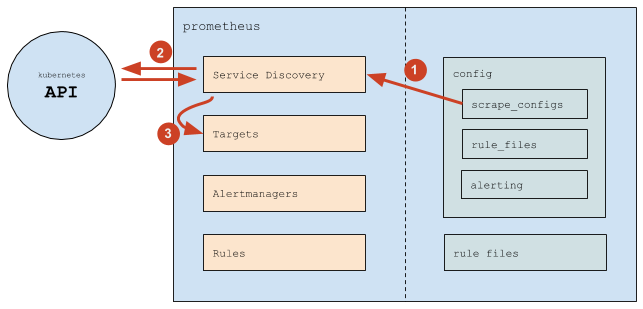
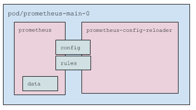
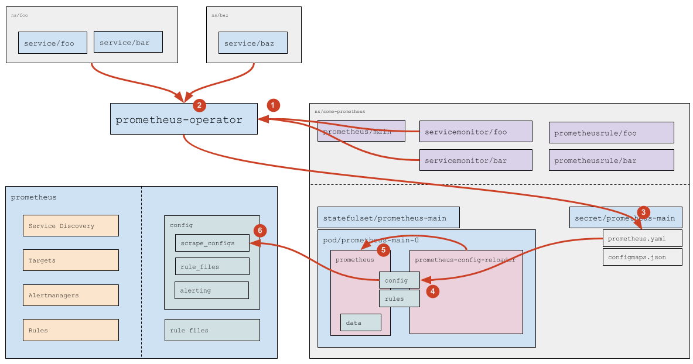
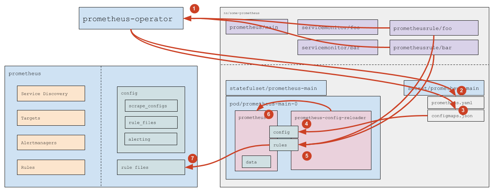

The module installs the [Prometheus Operator](https://github.com/coreos/prometheus-operator), which automates the deployment and management of [Prometheus](https://prometheus.io/) installations.

<!-- Source: https://docs.google.com/drawings/d/1KMgawZD4q7jEYP-_g6FvUeJUaT3edro_u6_RsI3ZVvQ/edit -->

Operator:

- Creates the following custom resources:
  - Prometheus — describes a Prometheus installation (cluster);
  - ServiceMonitor — defines how to collect metrics from services;
  - Alertmanager — describes an Alertmanager cluster;
  - PrometheusRule — contains a set of Prometheus rules.
- Watches these resources and:
  - Generates a StatefulSet with Prometheus and the required configuration files, storing them in a Secret.
  - When ServiceMonitor or PrometheusRule change, updates the Prometheus configuration by modifying the corresponding Secret.

## Prometheus

### Prometheus functions

The Prometheus server performs two primary tasks — it collects metrics and processes rules.

* For each monitoring target, at every `scrape_interval` an HTTP request is sent to that target. The metrics [in its own text format](https://github.com/prometheus/docs/blob/main/docs/instrumenting/exposition_formats.md#text-format-details) are stored in the Prometheus database.
* At every `evaluation_interval`, rules are processed, resulting in:
  * alerts being sent;
  * new metrics (rule evaluation results) being written to the database.

### Prometheus configuration

Prometheus configuration consists of the main `config` file and rule files (`rule files`).

The key sections used in `config` are:

* `scrape_configs`: Defines where and how to discover monitoring targets.
* `rule_files`: Lists the paths to rule files that Prometheus should load. Example:

  ```yaml
  rule_files:
  - /etc/prometheus/rules/rules-0/*
  - /etc/prometheus/rules/rules-1/*


* `alerting`: Defines how to discover and where to send alerts to Alertmanager clusters. Structurally, this section is similar to `scrape_configs`, but its result is a list of endpoints to which Prometheus sends notifications.

### Sources of monitoring targets

General Prometheus workflow:



* Prometheus reads the `scrape_configs` section and configures its internal Service Discovery.
* Service Discovery interacts with the Kubernetes API (retrieving endpoints and related metadata).
* Based on cluster events, Service Discovery updates the list of monitoring targets.

In `scrape_configs`, a set of `scrape job`s is defined — logical descriptions of where and how to collect metrics. Example:

```yaml
scrape_configs:
# General settings.
- job_name: d8-monitoring/custom/0    # Name of the scrape job, shown in the Service Discovery section.
scrape_interval: 30s                  # How often to scrape data.
scrape_timeout: 10s                   # Request timeout.
metrics_path: /metrics                # HTTP path.
scheme: http                          # HTTP or HTTPS.
# Service Discovery settings.
kubernetes_sd_configs:                # Get targets from Kubernetes.
- api_server: null                    # API server address is taken from environment variables (present in every Pod).
  role: endpoints                     # Use endpoints as targets.
  namespaces:
    names:                            # Restrict the list of namespaces.
    - foo
    - baz
# Filtering settings (which endpoints to include/exclude) and relabeling (which labels to add or remove; applies to all scraped metrics).
relabel_configs:
# Filter by the value of the prometheus_custom_target label (taken from the Service associated with the endpoint).
- source_labels: [__meta_kubernetes_service_label_prometheus_custom_target]
  regex: .+                           # Any non-empty label.
  action: keep
# Filter by port name.
- source_labels: [__meta_kubernetes_endpointslice_port_name]
  regex: http-metrics                 # Only the port named http-metrics.
  action: keep
# Add the job label. Use the value of the prometheus_custom_target label on the Service, prefixed with "custom-".
#
# The job label:
#    * defines the group name under which the target will appear;
#    * is added to metrics for convenient filtering in rules and dashboards.
- source_labels: [__meta_kubernetes_service_label_prometheus_custom_target]
  regex: (.*)
  target_label: job
  replacement: custom-$1
  action: replace
# Add the namespace label.
- source_labels: [__meta_kubernetes_namespace]
  regex: (.*)
  target_label: namespace
  replacement: $1
  action: replace
# Add the service label.
- source_labels: [__meta_kubernetes_service_name]
  regex: (.*)
  target_label: service
  replacement: $1
  action: replace
# Add the instance label (will contain the Pod name).
- source_labels: [__meta_kubernetes_pod_name]
  regex: (.*)
  target_label: instance
  replacement: $1
  action: replace
```

Thus, Prometheus automatically tracks the addition and removal of:

* Pods (changes to endpoints lead to the addition or removal of monitoring targets)
* Services (and corresponding endpoints) in the specified namespaces

Configuration changes are required when you need to:

* Add a new `scrape_config` (usually a new class of services to monitor).
* Change the list of namespaces.

## Prometheus Operator

### Prometheus Operator functions

Using CRDs (Custom Resource Definitions), Prometheus Operator defines four custom resources:

* [Prometheus](https://github.com/coreos/prometheus-operator/blob/master/Documentation/api-reference/api.md#prometheus): Describes a Prometheus installation (cluster);
* [ServiceMonitor](https://github.com/coreos/prometheus-operator/blob/master/Documentation/api-reference/api.md#servicemonitor): Specifies how to collect metrics from a set of services;
* [Alertmanager](https://github.com/coreos/prometheus-operator/blob/master/Documentation/api-reference/api.md#alertmanager): Describes an Alertmanager cluster;
* [PrometheusRule](https://github.com/coreos/prometheus-operator/blob/master/Documentation/api-reference/api.md#prometheusrule): Contains a set of Prometheus rules.

Prometheus Operator also watches Prometheus resources and, for each one, generates:

* StatefulSet with Prometheus itself
* Secret containing `prometheus.yaml` (the main configuration file) and `configmaps.json` (the configuration file for `prometheus-config-reloader`)

It watches ServiceMonitor and PrometheusRule resources and, based on them, updates the configuration (`prometheus.yaml` and `configmaps.json`) in the corresponding Secret.

### Contents of the Prometheus Pod



Prometheus pods include:

* Three containers:
  * `prometheus`: Prometheus server itself.
  * `prometheus-config-reloader`: [Utility](https://github.com/coreos/prometheus-operator/tree/master/cmd/prometheus-config-reloader) that watches:
    * Changes made to `prometheus.yaml` and, if needed, triggers a Prometheus configuration reload (via a special HTTP request; see [details below](#servicemonitor-processing)).
    * PrometheusRules (see [details below](#processing-custom-resources-with-rules)), downloads them if necessary, and restarts Prometheus.
  * `kube-rbac-proxy`: Proxy that handles RBAC-based authentication and authorization for accessing Prometheus metrics.
* Key volumes:
  * `config`: Mounted Secret with the files `prometheus.yaml` and `configmaps.json`. Used by the `prometheus` and `prometheus-config-reloader` containers.
  * `rules`: An `emptyDir` populated by `prometheus-config-reloader` and read by `prometheus`. Mounted into both containers; in `prometheus`, it is read-only.
  * `data`: Prometheus data. Mounted only into the `prometheus` container.

### ServiceMonitor processing



1. Prometheus Operator watches ServiceMonitor resources (which ones exactly is defined in the Prometheus resource spec; see details in the [official documentation](https://github.com/coreos/prometheus-operator/blob/master/Documentation/api-reference/api.md#prometheusspec)).
1. For each ServiceMonitor that does not specify an explicit list of namespaces (`any: true` is used), the operator queries the Kubernetes API to compute the list of namespaces with Service`s that match the labels from the ServiceMonitor.
1. Based on the discovered [ServiceMonitor resources](https://github.com/coreos/prometheus-operator/blob/master/Documentation/api-reference/api.md#servicemonitorspec) and the computed namespaces, the operator generates the Prometheus configuration fragment (the `scrape_configs` section) and stores it in the corresponding Secret.
1. Kubernetes mounting mechanism updates the files in the Prometheus pod — `prometheus.yaml` from the Secret is refreshed.
1. The `prometheus-config-reloader` container detects the change to `prometheus.yaml` and sends Prometheus an HTTP request to reload the configuration.
1. Prometheus rereads the configuration and applies the changes in `scrape_configs` according to its workflow.

### Processing custom resources with rules



1. Prometheus Operator watches PrometheusRule objects that match the `ruleSelector` specified in the Prometheus resource.
1. When a new PrometheusRule appears or an existing one is deleted, the operator updates `prometheus.yaml` — after that, the same chain as for `ServiceMonitor` processing applies.
1. When a PrometheusRule is added, deleted, or its contents change, the operator updates the ConfigMap `prometheus-main-rulefiles-0`.
1. Kubernetes’ mounting mechanism delivers the updated ConfigMap to the pod.
1. The `prometheus-config-reloader` container detects the changes and then:
   - writes the updated ConfigMaps to the `rules` directory (`emptyDir`);
   - sends Prometheus an HTTP request to reload the configuration.
1. Prometheus rereads the configuration and applies the updated rules.
