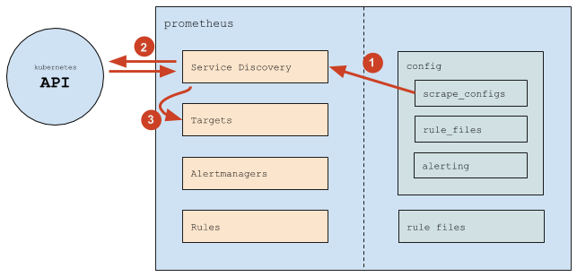
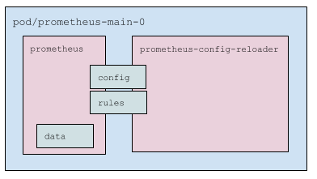
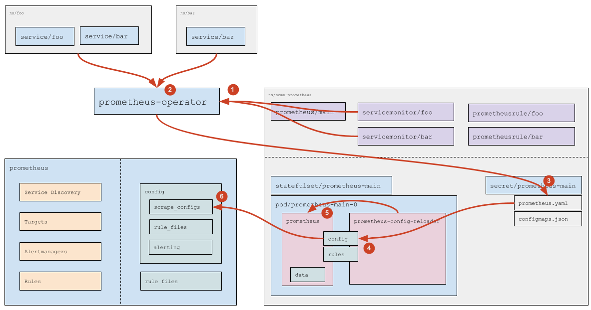
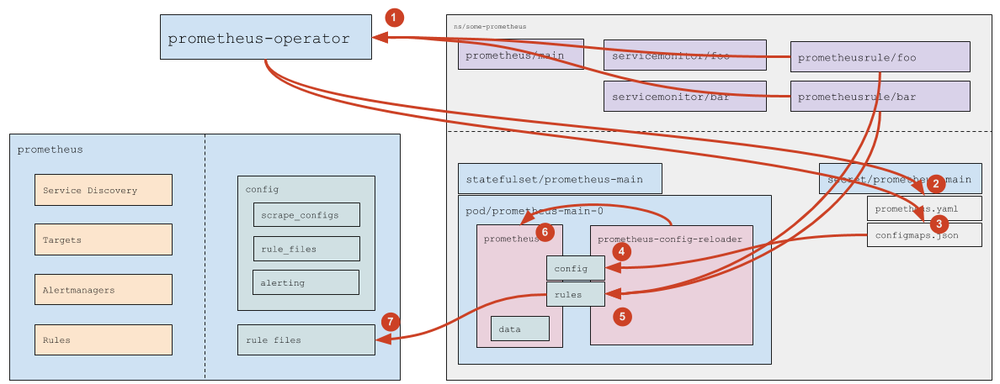

Модуль устанавливает [Prometheus Operator](https://github.com/coreos/prometheus-operator), который автоматизирует развёртывание и управление инсталляциями [Prometheus](https://prometheus.io/).

<!-- Исходник: https://docs.google.com/drawings/d/1KMgawZD4q7jEYP-_g6FvUeJUaT3edro_u6_RsI3ZVvQ/edit -->

Оператор:

- Создаёт следующие кастомные ресурсы:
  - Prometheus — описывает инсталляцию (кластер) Prometheus;
  - ServiceMonitor — определяет как собирать метрики с сервисов;
  - Alertmanager — описывает кластер Alertmanager;
  - PrometheusRule — содержит набор правил Prometheus.
- Отслеживает эти ресурсы и:
  - Генерирует StatefulSet с Prometheus и необходимые конфигурационные файлы, сохраняя их в секрете (Secret).
  - При изменениях ServiceMonitor и PrometheusRule обновляет конфигурацию Prometheus путём изменения соответствующего секрета.

## Prometheus

### Функции Prometheus

Сервер Prometheus выполняет две основные задачи — собирает метрики и обрабатывает правила.

* Для каждой цели мониторинга (target) с указанным интервалом `scrape_interval` выполняется HTTP-запрос к этой цели. Метрики [в собственном текстовом формате](https://github.com/prometheus/docs/blob/main/docs/instrumenting/exposition_formats.md#text-format-details) сохраняются в базу данных Prometheus.
* Через указанный интервал `evaluation_interval` обрабатываются правила (rules), в результате чего:
  * отправляются алерты;
  * в базу записываются новые метрики (результаты выполнения правил).

### Настройка Prometheus

Конфигурация Prometheus состоит из основного файла `config` и файлов правил (`rule files`).

В `config` используются ключевые секции:

* `scrape_configs` — определяет, где и как обнаруживать цели мониторинга (targets);
* `rule_files` — перечисляет пути к файлам правил, которые Prometheus должен загружать. Пример:

  ```yaml
  rule_files:
  - /etc/prometheus/rules/rules-0/*
  - /etc/prometheus/rules/rules-1/*
  ```

* `alerting` — задаёт параметры поиска и отправки алертов в кластеры Alertmanager. По структуре секция похожа на `scrape_configs`, но результатом будет список эндпоинтов, в которые Prometheus отправляет оповещения.

### Источники целей мониторинга

Общий принцип работы Prometheus:



1. Prometheus читает секцию `scrape_configs` и настраивает внутренний механизм Service Discovery.
1. Service Discovery взаимодействует с API Kubernetes (получает эндпоинты и связанную метаинформацию).
1. На основе событий в кластере Service Discovery обновляет список целей мониторинга.

В `scrape_configs` задаётся набор `scrape job` — логических описаний того, откуда и как собирать метрики. Пример:

```yaml
scrape_configs:
# Общие настройки.
- job_name: d8-monitoring/custom/0    # Название scrape job, показывается в разделе Service Discovery.
scrape_interval: 30s                  # Как часто собирать данные.
scrape_timeout: 10s                   # Таймаут на запрос.
metrics_path: /metrics                # HTTP-путь.
scheme: http                          # HTTP или HTTPS.
# Настройки Service Discovery.
kubernetes_sd_configs:                # Брать цели из Kubernetes.
- api_server: null                    # Адрес API-сервера используется из переменных окружения (переменные есть в каждом поде).
  role: endpoints                     # Брать цели из эндпоинтов.
  namespaces:
    names:                            # Ограничение спика пространств имён.
    - foo
    - baz
# Настройки фильтрации (какие эндпоинты брать, а какие нет) и relabeling'а (какие лейблы добавить или удалить, распостраняется на все получаемые метрики).
relabel_configs:
# Фильтр по значению лейбла prometheus_custom_target (полученного из связанного с эндпоинтом сервиса).
- source_labels: [__meta_kubernetes_service_label_prometheus_custom_target]
  regex: .+                           # Любой не пустой лейбл.
  action: keep
# Фильтр по имени порта.
- source_labels: [__meta_kubernetes_endpointslice_port_name]
  regex: http-metrics                 # Только порт с именем http-metrics.
  action: keep
# Добавление лейбла job. Используйте значение лейбла prometheus_custom_target у сервиса, к которому добавлен префикс "custom-".
#
# Лейбл job:
#    * определяет название группы, в которой будет показываться цель мониторинга;
#    * добавляется к метрикам для удобной фильтрации в правилах и дашбордах.
- source_labels: [__meta_kubernetes_service_label_prometheus_custom_target]
  regex: (.*)
  target_label: job
  replacement: custom-$1
  action: replace
# Добавление лейбла namespace.
- source_labels: [__meta_kubernetes_namespace]
  regex: (.*)
  target_label: namespace
  replacement: $1
  action: replace
# Добавление лейбла service.
- source_labels: [__meta_kubernetes_service_name]
  regex: (.*)
  target_label: service
  replacement: $1
  action: replace
# Добавление лейбла instance (в котором будет имя пода).
- source_labels: [__meta_kubernetes_pod_name]
  regex: (.*)
  target_label: instance
  replacement: $1
  action: replace
```

Таким образом, Prometheus автоматически отслеживает добавление и удаление:

* подов (изменение эндпоинтов приводит к добавлению или удалению целей мониторинга);
* сервисов (и соответствующих эндпоинтов) в указанных пространствах имён.

Изменение конфигурации требуется, когда необходимо:

* добавить новый `scrape_config` (обычно — новый класс сервисов для мониторинга);
* изменить список пространств имён.

## Prometheus Operator

### Функции Prometheus Operator

Prometheus Operator с помощью механизма CRD (Custom Resource Definitions) определяет четыре кастомных ресурса:

* [Prometheus](https://github.com/coreos/prometheus-operator/blob/master/Documentation/api-reference/api.md#prometheus) — описывает инсталляцию (кластер) Prometheus;
* [ServiceMonitor](https://github.com/coreos/prometheus-operator/blob/master/Documentation/api-reference/api.md#servicemonitor) — задаёт, как собирать метрики с набора сервисов;
* [Alertmanager](https://github.com/coreos/prometheus-operator/blob/master/Documentation/api-reference/api.md#alertmanager) — описывает кластер Alertmanager;
* [PrometheusRule](https://github.com/coreos/prometheus-operator/blob/master/Documentation/api-reference/api.md#prometheusrule) — содержит набор правил Prometheus.

Также Prometheus Operator отслеживает ресурсы Prometheus и для каждого генерирует:

* StatefulSet с самим Prometheus;
* секрет с `prometheus.yaml` (основной конфигурационный файл) и `configmaps.json` (конфигурационный файл для `prometheus-config-reloader`).

Отслеживает ресурсы ServiceMonitor и PrometheusRule и на их основании обновляет конфигурацию (`prometheus.yaml` и `configmaps.json`) в соответствующем секрете.

### Состав пода Prometheus



Поды Prometheus представляют собой:

* Три контейнера:
  * `prometheus` — сам Prometheus;
  * `prometheus-config-reloader` — [утилита](https://github.com/coreos/prometheus-operator/tree/master/cmd/prometheus-config-reloader), которая:
    * следит за изменениями `prometheus.yaml` и при необходимости инициирует перезагрузку конфигурации Prometheus (специальным HTTP-запросом, см. [подробнее ниже](#обработка-servicemonitor));
    * отслеживает PrometheusRule (см. [подробнее ниже](#обработка-каcтомных-ресурсов-с-правилами)), по необходимости скачивает их и перезапускает Prometheus.
  * `kube-rbac-proxy` — прокси для аутентификации и авторизации по RBAC при доступе к метрикам Prometheus.
* Ключевые тома (volumes):
  * `config` — примонтированный секрет с файлами `prometheus.yaml` и `configmaps.json`. Используется в контейнерах `prometheus` и `prometheus-config-reloader`.
  * `rules` — `emptyDir`, который заполняет `prometheus-config-reloader`, а читает `prometheus`. Примонтирован в оба контейнера, в `prometheus` — в режиме только для чтения.
  * `data`— данные Prometheus. Примонтирован только в контейнер `prometheus`.

### Обработка ServiceMonitor



1. Prometheus Operator отслеживает ресурсы ServiceMonitor (какие именно — задаётся в спецификации ресурса Prometheus, см. подробнее [в официальной документации](https://github.com/coreos/prometheus-operator/blob/master/Documentation/api-reference/api.md#prometheusspec)).
1. Для каждого ServiceMonitor, у которого не задан явный список пространств имён (используется `any: true`), Prometheus Operator через API Kubernetes вычисляет список пространств имён с сервисами (Service), подходящими под лейблы из ServiceMonitor.
1. На основе найденных [ресурсов ServiceMonitor](https://github.com/coreos/prometheus-operator/blob/master/Documentation/api-reference/api.md#servicemonitorspec) и вычисленных пространств имён Prometheus Operator формирует фрагмент конфигурации Prometheus (секцию `scrape_configs`) и сохраняет его в соответствующий секрет.
1. Механизм монтирования Kubernetes обновляет файлы в поде Prometheus, в результате чего обновляется `prometheus.yaml` из секрета.
1. Контейнер `prometheus-config-reloader` обнаруживает изменение `prometheus.yaml` и отправляет Prometheus HTTP-запрос на перезагрузку конфигурации.
1. Prometheus перечитывает конфигурацию и применяет изменения в `scrape_configs` согласно своей логике работы.

### Обработка каcтомных ресурсов с правилами



1. Prometheus Operator отслеживает объекты PrometheusRule, подходящие под `ruleSelector`, заданный в ресурсе Prometheus.
1. При появлении нового или удалении существующего PrometheusRule Prometheus Operator обновляет `prometheus.yaml` — далее срабатывает та же цепочка, что описана для обработки ServiceMonitor.
1. При добавлении, удалении или изменении содержимого PrometheusRule Prometheus Operator обновляет ConfigMap `prometheus-main-rulefiles-0`.
1. Механизм монтирования Kubernetes доставляет обновлённый ConfigMap в под.
1. Контейнер `prometheus-config-reloader` фиксирует изменения, затем:
   - выгружает обновлённые ConfigMap в каталог `rules` (`emptyDir`);
   - отправляет Prometheus HTTP-запрос на перезагрузку конфигурации.
1. Prometheus перечитывает конфигурацию и применяет изменённые правила.
