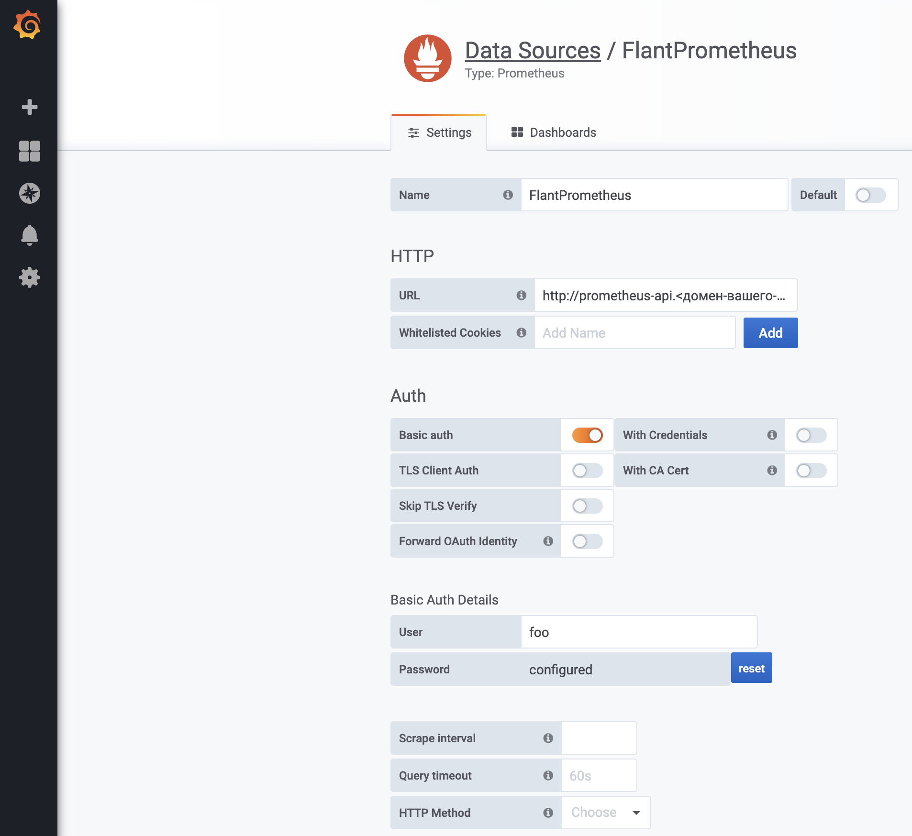

В данной статье описаны варианты подключения к Prometheus для сторонних приложений.

### Подключение Prometheus в качестве Datasource

У пользователей может возникнуть необходимость подключить Prometheus из данного модуля к сторонней графане Grafana.

У каждого `ingress-nginx-controller`'а есть сертификаты, при указании которых в качестве клиентских будет разрешено подключение к Prometheus. Всё что нужно - создать дополнительный `Ingress`-ресурс.
```yaml
apiVersion: networking.k8s.io/v1beta1
kind: Ingress
metadata:
  name: prometheus-api
  namespace: d8-monitoring
  annotations:
    kubernetes.io/ingress.class: nginx
    nginx.ingress.kubernetes.io/backend-protocol: HTTPS
    nginx.ingress.kubernetes.io/auth-type: basic
    nginx.ingress.kubernetes.io/auth-secret: basic-auth
    nginx.ingress.kubernetes.io/configuration-snippet: |
      proxy_ssl_certificate /etc/nginx/ssl/client.crt;
      proxy_ssl_certificate_key /etc/nginx/ssl/client.key;
      proxy_ssl_protocols TLSv1.2;
      proxy_ssl_session_reuse on;
spec:
  rules:
  - host: prometheus-api.example.com
    http:
      paths:
      - backend:
          serviceName: trickster
          servicePort: https
        path: /trickster/main
  tls:
  - hosts:
    - prometheus-api.example.com
    secretName: example-com-tls  
---
apiVersion: v1
kind: Secret
metadata:
  name: basic-auth
  namespace: d8-monitoring
type: Opaque
data:
  auth: Zm9vOiRhcHIxJE9GRzNYeWJwJGNrTDBGSERBa29YWUlsSDkuY3lzVDAK  # foo:bar
```
Далее остается только добавить Datasource в Grafana:

**В качестве URL необходимо указать `https://prometheus-api.<домен-вашего-кластера>/trickster/main/`**



* **Basic-авторизация** не является надежной мерой безопасности. Рекомендуется ввести дополнительные меры безопасности, например указать аннотацию `nginx.ingress.kubernetes.io/whitelist-source-range`. 

* **Огромный минус** подключения таким способом - необходимость создания Ingress-ресурса в системном namespace'е.
Deckhouse **не гарантирует** сохранение работоспособности данной схемы подключения в связи с его активными постоянными обновлениями. 

### Подключение стороннего приложения к Prometheus

Подключение к Prometheus защищено при помощи [kube-rbac-proxy](https://github.com/brancz/kube-rbac-proxy). Для подключения понадобится создать `ServiceAccount` с необходимыми правами.

```yaml
---
apiVersion: v1
kind: ServiceAccount
metadata:
  name: app
  namespace: default
---
apiVersion: rbac.authorization.k8s.io/v1
kind: ClusterRole
metadata:
  name: app:prometheus-access
rules:
- apiGroups: ["monitoring.coreos.com"]
  resources: ["prometheuses/http"]
  resourceNames: ["main", "longterm"]
  verbs: ["get"]
---
apiVersion: rbac.authorization.k8s.io/v1
kind: ClusterRoleBinding
metadata:
  name: app:prometheus-access
roleRef:
  apiGroup: rbac.authorization.k8s.io
  kind: ClusterRole
  name: app:prometheus-access
subjects:
- kind: ServiceAccount
  name: app
  namespace: default
``` 
Далее сделаем запрос используя программу `curl`:
```yaml
apiVersion: batch/v1
kind: Job
metadata:
  name: app-curl
  namespace: default
spec:
  template:
    metadata:
      name: app-curl
    spec:
      serviceAccountName: app
      containers:
      - name: app-curl
        image: curlimages/curl:7.69.1
        command: ["sh", "-c"]
        args:
        - >-
          curl -H "Authorization: Bearer $(cat /var/run/secrets/kubernetes.io/serviceaccount/token)" -k -f
          https://prometheus.d8-monitoring:9090/api/v1/query_range?query=up\&start=1584001500\&end=1584023100\&step=30
      restartPolicy: Never
  backoffLimit: 4
```
`Job`'а должна завершиться успешно.
