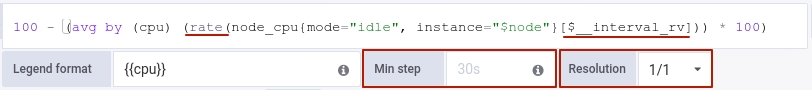
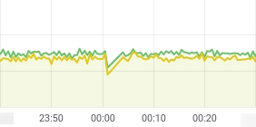
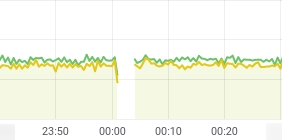
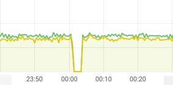

## Self-service dashboard management mechanism in the Observability module

The Observability module adds new dashboard types, including namespace-scoped resources.

This allows users to create and manage their own dashboards without requiring permissions for cluster-level objects.

Previously, dashboards could only be created using the GrafanaDashboardDefinition resource, which required permissions to cluster-level objects. The new mechanism introduces resources that operate within a specific namespace.

### Supported resource types

- **ObservabilityDashboard** — dashboards within a namespace.

Available in the Deckhouse web interface: **Monitoring → Projects**.

- **ClusterObservabilityDashboard** — dashboards for monitoring cluster components.

Available in the Deckhouse web interface: **Monitoring → System**.

- **ClusterObservabilityPropagatedDashboard** — allows you to expand the list of dashboards from the two previous categories.

These dashboards are automatically added in the Deckhouse web interface and appear in the following sections:
- **Monitoring → System**
- **Monitoring → Projects**
  Available to users with rights to the corresponding namespace or system partition.

> Converting existing dashboards from the GrafanaDashboardDefinition resource to the new types is done manually.

### Supported annotations

- **metadata.deckhouse.io/category** — sets the folder (category) in the interface;
- **metadata.deckhouse.io/title** — sets the displayed dashboard title. If not specified, the title from the JSON
  manifest will be used.

### Custom Data Source Support

Data sources previously created through the **GrafanaAdditionalDatasource** resource continue to work and are available in the Deckhouse web interface:
- **Data Overview**
- **Dashboards**

### Which dashboard type should I choose?

The choice of a type depends on the tasks and context of use.

#### ObservabilityDashboard

- **When to choose:** For monitoring resources within a specific namespace.
- **Advantages:** Available only to users with access to this namespace, simplifying management and delimiting permissions.

#### ClusterObservabilityDashboard

- **When to choose:** For monitoring all cluster components with system-wide coverage.
- **Advantages:** Suitable for operators and administrators who need global cluster visibility.

#### ClusterObservabilityPropagatedDashboard

- **When to choose:** For automatically distributing dashboards to all users with access to specific namespaces or system partitions.
- **Advantages:** Convenient centralized distribution of shared dashboards useful to multiple users.
  Send feedback
  Translation results available

To configure creating a dashboard as ClusterObservabilityPropagatedDashboard:

1. Add the `propagated-` prefix to the JSON file containing the dashboard model.

2. In [lib-helm](https://github.com/deckhouse/lib-helm/blob/main/charts/helm_lib/templates/_monitoring_grafana_dashboards.tpl#L76), normalization is used where all slashes are converted to dashes.

3. Dashboard type determination:
    - A file named `propagated-pod.json` will create a ClusterObservabilityPropagatedDashboard (COPD)
    - A file named `pod.json` will create a ClusterObservabilityDashboard (COD)

## How do I quickly optimize a third-party Dashboard?

1. Replace `irate` with `rate`:

   ```shell
   sed 's/irate(/rate(/g' -i *.json
   ```

2. Replace `Resolution` with `1/1`:

   ```shell
   sed 's/"intervalFactor":\s[0-9]/"intervalFactor": 1/' -i *.json
   ```

3. Get rid of `Min Step`:

   ```shell
   sed '/"interval":/d' -i *.json
   ```

4. Replace all graphs with `Staircase` (you will need to edit `Stack` + `Percent` graphs manually - switch them to `Bars`):

   ```shell
   sed 's/"steppedLine": false/"steppedLine": true/' -i *.json
   ```

## Best practices

### Save the Dashboard's uid

Save the uid when making any changes to the Dashboard (including renaming it and moving it between folders). Usually, you can find it at the end of the JSON file. In this case, all the existing links will continue to work. Note that no special actions are required - just do not change it intentionally.

### Monitor JSON files for changes

We do not recommend editing JSON files directly (there are more convenient ways to do this). However, after making changes to the Grafana interface and uploading the JSON file, you should take a careful look at what changes were made to it to make sure that you haven't messed anything up accidentally. (You can use `git add -p` & diffs in merge requests to check what changes were made to the file - it's your choice).

When making changes to the complex Dashboards that use templates, try to edit them where they were created (usually at <https://prometheus.kube.domain.my/>) and keep the Variables intact. Thus, you will avoid unnecessary changes to the "dynamic data" in MRs.

### How to "hide" the dashboard (or part of the dashboard) if data are lacking?

Do not try to generate Grafana Dashboard using Helm. A better approach is to create an Issue in Grafana requesting the required functionality.

## Settings before adding the first graph

### Adding the `ds_prometheus` variable

Grafana can have multiple Prometheus instances available, each with different data granularity and retention periods.

To ensure convenient data source selection, you must:

- Create the `$ds_prometheus` variable (instructions below).
- Specify `$ds_prometheus` as the **Data Source** for each dashboard, rather than a specific Prometheus instance.

The data source is specified using the `$ds_prometheus` variable.

Configure this in **Dashboard settings → Variables**.


### Time options

#### Time zone

In the **General** tab of the dashboard settings, find the **Time zone** parameter and set it to **Browser time**.

### Shared crosshair

One of the key features of graphs is visual correlation analysis.

For effective data comparison, it is important to be able to compare the same point in time across different graphs.

If the graphs are the same size and positioned one above the other, this is straightforward. However, it is not always possible (and not always aesthetically pleasing) to make all graphs the same size.

It is recommended to enable **Shared crosshair** mode for the **Graph Tooltip** parameter—it significantly simplifies visual correlation analysis.
When you hover over one chart, a vertical line displaying the same time will appear on all other charts.

This setting is available in:
**Dashboard settings → Panel options → Shared Crosshair**

>️ Using the **Shared tooltip** mode is not recommended, as it clutters the interface with unnecessary information.

## Basic Rules for Graphs

### Title

- Should be **short, clear, and unambiguous**, in **English**.
- **Bad Examples:**
- `Network Stuff` — too general, uninformative
- `Router Data` — unclear what data is being displayed

- **Good Examples:**
- `Avg Upstream Response Time`
- `Upstream Response Time`

### Legend

#### Basic Principles

- Display **only key series** to keep graphs readable and uncluttered.
- The number of series displayed should be limited.

#### Defining Key Series

1. **Total / Aggregate** — summary values, for example:
    - Total number of pods in a namespace (`sum by (namespace)`)
    - Total CPU consumption (`sum by (cluster)`)
    - Total memory

1. **Main Sections** — labels most often used to analyze graphs:
    - `namespace`
    - `node`
    - `cluster`

1. **Service labels** (e.g. `pod`, `container`) are rarely key and usually clutter the graph.

#### Limiting the number of series

- Use Prometheus aggregation functions:
- `sum by (namespace)` instead of displaying all pods
- `avg by (node)` to average metrics across nodes

**Example:**
Instead of displaying the `container_cpu_usage_seconds_total` metric for all pods in the cluster (hundreds of lines), we plot a `sum by (namespace)` graph and leave only a few key `namespaces`. This makes the graph clear and easy to analyze.

#### Displaying summary values (Total)

For metrics where it is important to see the summary value (e.g., number of pods, total memory used), we recommend adding a separate Total.

**Total formatting rules:**
- Marker color — yellow
- Line and area below the graph — transparent

> Detailed instructions on customizing the Total display style are provided in the "Additional Requirements" section.

#### Legend Placement

- Selected based on **maximum informativeness and convenience**:
- **Side** — if it's important to give the user the ability to hide/show elements
- **Bottom** — if this is easier to see

- The legend displays **key metrics**: max, min, mean/avg.

### Description

- Should provide a **complete understanding of what the graph displays**.
- **Bad example:** `This graph shows important data about the network` — too general, uninformative
- **Good example:** `This graph shows the requested CPU resources higher than the actual CPU consumption. In other words, it shows CPU resources that can be "freed" without affecting the service.`

### Data Source and Units

#### Units

- Units of measurement must be indicated on the graph. - Configuration is performed via: **All → Standard options → Unit**

**Select units of measurement:**

1. **Memory (RAM, cache, buffers, swap) and disk (FS usage, inode usage, volume usage)**
   Use binary units: KiB, MiB, GiB, TiB

2. **Network (traffic, speed, packets)**
   Units are measured per second: Kbps, Mbps, Gbps (in Grafana — bits/sec SI)

3. **CPU**
   Displayed in **cores** or **milliCPUs (m)**

### Select the presentation format (percentages or absolute values)

#### Defining the format

- When designing a graph, it is important to choose whether to display **percentages** or **absolute values**.

##### CPU

- **Percentage:** displays the load, clearly indicating how much the resource is being used, but it's difficult to compare different graphs.
- Settings: **All → Standard options → Unit → percent**
- **Absolute values:** cores or CPU seconds, ensure comparability.
- Settings: **All → Standard options → Unit → select the desired value or define your own**

> You can add deficit/surplus indicators: throttling, free resource volume, etc.

#### Multiple graph types

- If possible, display different indicators simultaneously: usage, deficit, and surplus.

### Visualization Types

#### Selecting a type

- Selected based on the volatility and nature of the data.

#### Highly volatile metrics (e.g., CPU)

- Recommended display as **bars**

#### Low-volatility metrics

- Use **lines**

#### Discrete or one-time values

- Use the **step** line style

### Removing visual noise

- Hide unnecessary lines that create clutter on the chart.

### Stacked Graphs

#### General Rules

- Stack only values that add up to the total
- Do not stack dissimilar values with different units

#### Hybrid Situations

- In cases where a combination of different metrics is required (e.g., process sum and total limit), use combined solutions and explicitly indicate this on the graph.
- Configuration is performed via Overrides: select the field with the desired name and apply the desired style.


### Sorting

#### Basic Principles

- Always consider the sorting order of lines on graphs and rows in tables.
- Display the most significant values for the user first to ensure the graph or table is as informative and easy to analyze as possible.

### Data Accuracy and Detail

#### Displaying a Chart Starting from Zero

For most metrics, it's more accurate to display the chart starting from **zero**.

To set this:

- Go to **All → Axis → Scale**
- Set **Soft min = 0**

This will ensure the chart starts at zero, with the upper limit determined automatically.

#### Scale

Choosing between **linear** and **logarithmic** scales should be a conscious decision.

Use **logarithmic scale** if one of the following conditions is met:

- **Wide Range of Values:**
  A logarithmic scale is useful when the data spans a wide range—for example, values varying from units to thousands or millions.

This allows you to better discern details and trends.

- **Analyzing Proportions and Percentage Changes:**
  On a logarithmic scale, equal distances on an axis correspond to equal percentage changes.

This is useful when analyzing metrics where relative rather than absolute differences are important.

- **Visualizing Exponential Growth:**
  A logarithmic scale makes exponential trends more visible, whereas on a linear scale, such data would appear as a sharp jump.

Use a linear scale in all other cases.

> The setting is performed via: **All → Axis → Scale**

Granted, in some cases, the level of detail makes it difficult to track global trends. However, the opposite is true much more often — due to insufficient detail, part of the data required for analysis is not displayed. To preserve the accuracy of data:
1. **always use the `rate` function instead of `irate`**;
2. **use `$__rate_interval` as the range for the range vectors**;
3. **use Resolution 1/1 in al cases**;
4. **never set the Min step**;

   

   **Reasons and details:**
      <ul dir="auto">
        <li>You can specify <code>step</code> in the Prometheus's API request. Suppose we have three hours of data and set a <code>step</code> of 30 seconds. In this case, we will get 360 data points (3 hours *60 minutes* 2 points per minute), and they can easily fit on the graph. Now suppose we have data for 24 hours. In this case, the 30-second step does not make any sense since you cannot fit 2880 data points on a screen (unless, of course, you have a 4K monitor - but still, each data point will have the size of a pixel, and the human eye cannot discern so much tightly packed information). To solve this problem, Grafana implements a tricky mechanism to auto-determine the step size. It works as follows:
        <ul>
          <li>Grafana uses the size of the graph (whether it occupies the entire screen, 1/2, 1/4 of the screen, etc.), the size of the browser window, and the screen resolution to calculate how many points can be shown on the screen.</li>
          <li>Next, Grafana divides the selected browsing period by the number of points that can be shown to get the "minimum viable step". Thus, for the screen that can fit 800 data points, it gets the following ratios:
            <ul>
              <li>30 minutes — 2.25 seconds,</li>
              <li>3 hours — 13.5 seconds,</li>
              <li>24 hours — 108 seconds,</li>
              <li>7 days — 756 seconds.</li>
            </ul>
          </li>
          <li>Next, Grafana turns to the <code>Min step</code> parameter and makes the minimum data point <code>step</code> equal to the <code>Min step</code> (if specified). Note that the <code>Min step</code> parameter can be specified globally (in the data source settings) and for each query in the panel. In our case, the <code>Min step</code>  is set globally. It corresponds to the <code>scrape_interval</code> for Prometheus (the <code>scrape_interval</code> for the main one is 30 seconds). In the end, Grafana gets the following values (taking into account the above restriction):
            <ul>
              <li>30 minutes — 30 seconds (instead of 2.25),</li>
              <li>3 hours — 30 seconds (instead of 13.5 seconds),</li>
              <li>24 hours — 108 seconds,</li>
              <li>7 days — 756 seconds.</li>
            </ul>
          </li>
          <li>Next, Grafana rounds the resulting values (to 5/15/30 seconds, 1/5/15 minutes, etc.) and gets the following:
            <ul>
              <li>30 minutes — 30 seconds,</li>
              <li>3 hours — 30 seconds,</li>
              <li>24 hours — 2 minutes,</li>
              <li>7 days — 10 minutes.</li>
            </ul>
          </li>
          <li>Next, Grafana refers to the Resolution parameter of the panel (it can be set to 1/1, 1/2, ..., 1/10) and increases the step according to it (twice for 1/2, in ten times for 1/10).</li>
        </ul>
      </li>
      <li>Most of the Prometheus data are stored in counters (not gauges), so you need to use the <code>rate</code> or <code>irate</code> function to get the current value. And that is where the problem begins.
        <ul>
          <li>The <code>rate</code> and <code>irate</code> functions use range vectors, but which range to pass? Grafana has a built-in (and ready-to-use) <code>$__interval</code> variable that stores the step that will be passed to Prometheus.</li>
          <li>But there must be al least two points in the range vector for the <code>rate</code> and <code>irate</code> functions to work (which is logical). However, a range vector for 30 seconds with a <code>scrape_interval</code> set to 30 seconds will contain only one point, and <code>rate</code>/<code>irate</code> will be useless in this case. And at this point, you may opt for any of the following WRONG approaches:
            <ul>
              <li>Set the Resolution to 1/2 for all queries so that the <code>$__interval</code> variable equals 2 x <code>Min step</code> for any interval. It helps — the graphs work as expected. The downside is that they are always half as detailed as they could otherwise have been.</li>
              <li>Set the Min step equal to two <code>scrape_intervals</code> This approach is somewhat better but has the same downsides.</li>
              <li>Use the <code>irate</code> function and pass a range vector for 1h (or any other value known to be larger than the period). This approach is the most deceptive. In this case, graphs are displayed accurately as long as the <code>step</code> is less or equal to the <code>scrape_interval</code>. However, if the  <code>step</code> is bigger than the <code>scrape_interval</code> (as is the case with 24h and 7d periods), the graph becomes utterly misleading: instead of displaying the rate for the entire step, it shows the rate for the last <code>scrape_interval</code> at each point. In other words, when browsing data for the 7 days, you see the CPU usage over the last 30 seconds of each 10-minute interval instead of the average usage for a (<code>step</code>) (10 minutes). Thus, you have no idea of what has happened to the CPU usage in the remaining 9 minutes and 30 seconds!</li>
            </ul>
          </li>
          <li>To solve this problem, need to use <code>$__rate_interval</code> (rv = range vector) Grafana build-in variable. This variable equals <code>max($__interval + Scrape interval, 4 * Scrape interval)</code>. It is similar to <code>$__interval</code> while its minimum value cannot be less than the period containing at least four points in the range vector. And that completely solves the problem!</li>
        </ul>
      </li>
    </ul>

5. **use `$__range` as the range for the range vectors in the avg/max/min_over_time functions**;

### The absence of data must be obvious

Grafana provides three modes for displaying the Null Value (no data).
* You should never use the `connected` mode since it is highly misleading!
* `Null` should be used in all cases except for stacking since it clearly shows that there are no data.
* The usage of the `null as zero` mode is recommended for stacking (otherwise, all the metrics will be lost if any one of them has a null value).

| connected               | null                                           | null as zero                                              |
|-------------------------|------------------------------------------------|-----------------------------------------------------------|
|  |  |  |

If there is no data on the graph, a dash ("No Value") should be displayed.

### The precision should be consistent with goals

* There is no reason to display values precisely to five decimal places if your error rate is 10%. The typical user will notice only the first two-three most significant digits anyway.
* If you have tens of thousands (or even millions) of requests over 3 hours (the default period for a Dashboard), does the precise value make sense? Maybe, the order of the number of requests is sufficient in this case?

Pay attention: the precision of the value must match the goals of using the indicator.

### Display data for the last 3 hours by default (auto-refresh every 30 seconds)

The three-hour display period is optimal (and should be used as default) since this is the maximum one for a fully detailed view.
* With the `scrape_interval` set to `30s` (the most commonly used value), three hours of data fully fit even on graphs with a size of 1/4 of the screen width (meaning all 30-second data points are displayed) - no approximation or conversion is needed.
* A larger scale (the smaller display period) does not make sense since it does not increase the detail but narrows the visible time range.
* A smaller scale (the larger display period) reduces the details, and the approximation comes into play.

It makes sense to set automatic updates every 30 seconds since Prometheus scrapes the data every 30 seconds. Thus, new data flow to it at regular intervals.

## Additional Requirements

### Collapsed Non-Essential Chart Series

- All **non-essential series** on dashboards must be **collapsed by default**.
- To do this, specify the following in the JSON configuration of the series:

```json
"collapsed": true
```

### Total Tooltip Requirements

- For the **Total Tooltip**, additional steps are required:
- Make it **invisible on the chart** via **Edit panel → Overrides**


- Also add a transform for it (Edit panel->Transform data)


### 3. Remaining Tooltip Requirements

- For all **other tooltips**, the following steps are required:
- Configure **descending sorting** via **Edit panel → All**


### 4. Sorting in the Legend

- In the legend, all values should be sorted in descending order by the Mean column.

## Useful notes

### Before pushing new dashboards, you have to remove all references to the existing domains

Before pushing changes to the repository, you have to make sure that there are no domains in the JSON file that may have been imported from Grafana.

An example of a script to delete these domains:

```shell
listOfDomains="
google.com
mycompany.com
"

listOfDashboards=$(find dashboards/* -name "*json")

for dashboard in $listOfDashboards; do
  for domain in $listOfDomains; do
    sed -i -E  "s/([^\"]+$domain)/example.com/g" $dashboard
  done
done
```

### TODO

* Make use of $__range and instant query to calculate data for the display period (usually used for singlestats);
* Make the legends of the same width so that the graphs can be displayed one below the other.
* Display a zero for the Y-axis.
* Display the upper bound of the Y-axis for 0-100% graphs.
* How to plot percentage charts (bars, instead of stepped lines).
* A trick with using stacking and showing Total.
* Set "On time range change" when the variable gets values that may change (e.g., the Pod names).
* Make CPU colors to be the same as in okmeter.
* What drawing mode to use and what is good about the staircase mode.
