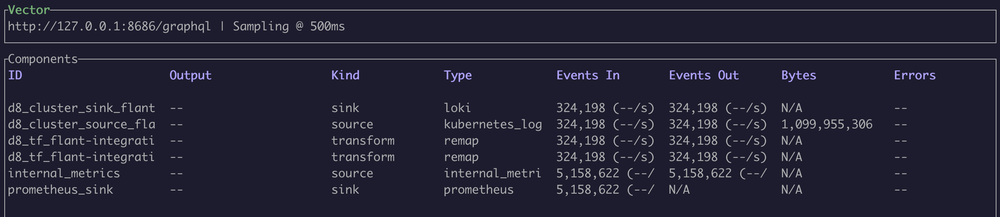

## How to enable debugging logs?

Enable the [debug](configuration.html#parameters-debug) parameter of the module.

```yaml
apiVersion: deckhouse.io/v1alpha1
kind: ModuleConfig
metadata:
  name: log-shipper
spec:
  version: 1
  enabled: true
  settings:
    debug: true
```

Then in logs, you will find a lot of helpful information about HTTP requests, connects reusing, detailed traces, and so on.

## How to get aware of logs pipelines?

To begin with, retrieve the list of pods on the desired node.

```bash
d8 k -n d8-log-shipper get pods -o wide | grep $node
```

Select the appropriate pod and execute commands directly from the container.

```bash
d8 k -n d8-log-shipper exec $pod -c vector -- COMMAND_NAME
```

All subsequent commands are assumed to be executed within the container.

### See pipelines as a graph

* Execute the `vector graph` command to get the output of logs pipelines topology in the [DOT format](https://graphviz.org/doc/info/lang.html).
* Put the output to [webgraphviz](https://www.webgraphviz.com/) os similar service to render the graph.

Example of the graph output for a single pipeline in ASCII format:

```text
+------------------------------------------------+
|  d8_cluster_source_flant-integration-d8-logs   |
+------------------------------------------------+
  |
  |
  v
+------------------------------------------------+
|       d8_tf_flant-integration-d8-logs_0        |
+------------------------------------------------+
  |
  |
  v
+------------------------------------------------+
|       d8_tf_flant-integration-d8-logs_1        |
+------------------------------------------------+
  |
  |
  v
+------------------------------------------------+
| d8_cluster_sink_flant-integration-loki-storage |
+------------------------------------------------+
```

### Investigate data processing

There is the `vector top` command to help you see how much data is going through all checkpoints of the pipeline.

Example of the output:



### Get raw log samples

You may use the `vector tap` command to get input data for any channel components.
The only argument to be set is the ID of the processing stage. Patterns in a glob format are also supported for selections (e.g., `d8_cluster_source_*`).

By using the following command, you can see the log's before applying the transformation rules (`d8_cluster_source_*` is
the first stage of processing according to the output of the `vector graph` command):

```bash
vector tap 'cluster_logging_config/*'
```

Transformed logs that are received at the input of the next channel components in the chain:

```bash
vector tap 'transform/*'
```

You can then use the `vector vrl` interactive console to debug [VRL](https://vector.dev/docs/reference/vrl/) message remap rules.

Example of a program on VRL:

```text
. = {"test1": "lynx", "test2": "fox"}
del(.test2)
.
```

## How to add a new source/sink support for log-shipper?

Vector in the `log-shipper` module has been built with the limited number of enabled [features](https://doc.rust-lang.org/cargo/reference/features.html) (to improve building speed and decrease the size of the final binary).

You can see a list of all supported features by executing the `vector list` command.

If supporting a new source/sink is required, you need to add the corresponding feature to the list of enabled features in the Dockerfile.
