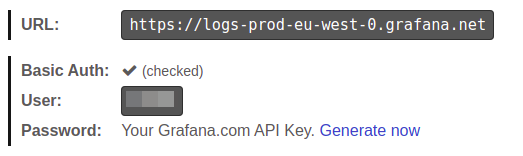



## Getting logs from all cluster Pods and sending them to Loki

```yaml
apiVersion: deckhouse.io/v1alpha2
kind: ClusterLoggingConfig
metadata:
  name: all-logs
spec:
  type: KubernetesPods
  destinationRefs:
  - loki-storage
---
apiVersion: deckhouse.io/v1alpha1
kind: ClusterLogDestination
metadata:
  name: loki-storage
spec:
  type: Loki
  loki:
    endpoint: http://loki.loki:3100
```

If you need to send logs to the loki cluster module, change the ClusterLogDestination parameter to d8-loki in the kind parameter, and see additional examples in the [documentation](https://deckhouse.io/modules/loki/examples.html)

## Reading Pod logs from a specified namespace with a specified label and redirecting to Loki and Elasticsearch

Reading logs from `namespace=whispers` with label `app=booking` and storing them into Loki and Elasticsearch:

```yaml
apiVersion: deckhouse.io/v1alpha2
kind: ClusterLoggingConfig
metadata:
  name: whispers-booking-logs
spec:
  type: KubernetesPods
  kubernetesPods:
    namespaceSelector:
      labelSelector:
        matchExpressions:
        - key: "kubernetes.io/metadata.name"
          operator: In
          values: [whispers]
    labelSelector:
      matchLabels:
        app: booking
  destinationRefs:
  - loki-storage
  - es-storage
---
apiVersion: deckhouse.io/v1alpha1
kind: ClusterLogDestination
metadata:
  name: loki-storage
spec:
  type: Loki
  loki:
    endpoint: http://loki.loki:3100
---
apiVersion: deckhouse.io/v1alpha1
kind: ClusterLogDestination
metadata:
  name: es-storage
spec:
  type: Elasticsearch
  elasticsearch:
    endpoint: http://192.168.1.1:9200
    index: logs-%F
    auth:
      strategy: Basic
      user: elastic
      password: c2VjcmV0IC1uCg==
```

## Creating a source in namespace and reading logs of all Pods in that NS with forwarding them to Loki

Namespaced pipeline - reading logs from `test-whispers` namespace (all Pods):

```yaml
apiVersion: deckhouse.io/v1alpha1
kind: PodLoggingConfig
metadata:
  name: whispers-logs
  namespace: tests-whispers
spec:
  clusterDestinationRefs:
    - loki-storage
---
apiVersion: deckhouse.io/v1alpha1
kind: ClusterLogDestination
metadata:
  name: loki-storage
spec:
  type: Loki
  loki:
    endpoint: http://loki.loki:3100
```

## Reading only Pods in the specified namespace and having a certain label

Read logs from Pods with label `app=booking` in namespace `test-whispers`:

```yaml
apiVersion: deckhouse.io/v1alpha1
kind: PodLoggingConfig
metadata:
  name: whispers-logs
  namespace: tests-whispers
spec:
  labelSelector:
    matchLabels:
      app: booking
  clusterDestinationRefs:
    - loki-storage
---
apiVersion: deckhouse.io/v1alpha1
kind: ClusterLogDestination
metadata:
  name: loki-storage
spec:
  type: Loki
  loki:
    endpoint: http://loki.loki:3100
```

## Migration from Promtail to Log-Shipper

Path `/loki/api/v1/push` has to be removed from the previously used Loki URL.

**Vector** will add this PATH automatically during working with Loki destination.

## Working with Grafana Cloud

This documentation expects that you have [created API key](https://grafana.com/docs/grafana-cloud/reference/create-api-key/).



Firstly you should encode your token with base64.

```bash
echo -n "<YOUR-GRAFANACLOUD-TOKEN>" | base64 -w0
```

Then you can create **ClusterLogDestination**

```yaml
apiVersion: deckhouse.io/v1alpha1
kind: ClusterLogDestination
metadata:
  name: loki-storage
spec:
  loki:
    auth:
      password: PFlPVVItR1JBRkFOQUNMT1VELVRPS0VOPg==
      strategy: Basic
      user: "<YOUR-GRAFANACLOUD-USER>"
    endpoint: <YOUR-GRAFANACLOUD-URL> # For example https://logs-prod-us-central1.grafana.net or https://logs-prod-eu-west-0.grafana.net
  type: Loki
```

Now you can create PodLogginConfig or ClusterPodLoggingConfig and send logs to **Grafana Cloud**.

## Adding Loki source to Deckhouse Grafana

You can work with Loki from embedded to deckhouse Grafana. Just add [**GrafanaAdditionalDatasource**](../../modules/prometheus/cr.html#grafanaadditionaldatasource)

```yaml
apiVersion: deckhouse.io/v1
kind: GrafanaAdditionalDatasource
metadata:
  name: loki
spec:
  access: Proxy
  basicAuth: false
  jsonData:
    maxLines: 5000
    timeInterval: 30s
  type: loki
  url: http://loki.loki:3100
```

## Elasticsearch < 6.X usage

For Elasticsearch < 6.0 doc_type indexing should be set.
Config should look like this:

```yaml
apiVersion: deckhouse.io/v1alpha1
kind: ClusterLogDestination
metadata:
  name: es-storage
spec:
  type: Elasticsearch
  elasticsearch:
    endpoint: http://192.168.1.1:9200
    docType: "myDocType" # Set any string here. It should not start with '_'
    auth:
      strategy: Basic
      user: elastic
      password: c2VjcmV0IC1uCg==
```

## Index template for Elasticsearch

It is possible to route logs to particular indexes based on metadata using index templating:

```yaml
apiVersion: deckhouse.io/v1alpha1
kind: ClusterLogDestination
metadata:
  name: es-storage
spec:
  type: Elasticsearch
  elasticsearch:
    endpoint: http://192.168.1.1:9200
    index: "k8s-{{ namespace }}-%F"
```

For the above example for each Kubernetes namespace a dedicated index in Elasticsearch will be created.

This feature works well combining with `extraLabels`:

```yaml
apiVersion: deckhouse.io/v1alpha1
kind: ClusterLogDestination
metadata:
  name: es-storage
spec:
  type: Elasticsearch
  elasticsearch:
    endpoint: http://192.168.1.1:9200
    index: "k8s-{{ service }}-{{ namespace }}-%F"
  extraLabels:
    service: "{{ service_name }}"
```

1. If a log message is in JSON format, the `service_name` field of this JSON document is moved to the metadata level.
2. The new metadata field `service` is used for the index template.

## Splunk integration

It is possible to send logs from Deckhouse to Splunk.

1. Endpoint must be equal to the Splunk instance name with the `8088` port and no path provided, e.g. `https://prd-p-xxxxxx.splunkcloud.com:8088`.
2. To add a token to ingest logs, go to `Setting` -> `Data inputs`, add a new `HTTP Event Collector` and copy a token.
3. Provide a Splunk index to store logs, e.g., `logs`.

```yaml
apiVersion: deckhouse.io/v1alpha1
kind: ClusterLogDestination
metadata:
  name: splunk
spec:
  type: Splunk
  splunk:
    endpoint: https://prd-p-xxxxxx.splunkcloud.com:8088
    token: xxxx-xxxx-xxxx
    index: logs
    tls:
      verifyCertificate: false
      verifyHostname: false
```



Splunk destination doesn't support pod labels for indexes. Consider exporting necessary labels with the `extraLabels` option.



```yaml
extraLabels:
  pod_label_app: '{{ pod_labels.app }}'
```

## Simple Logstash example

To send logs to Logstash, the `tcp` input should be configured on the Logstash instance side, and its codec should be set to `json`.

An example of the minimal Logstash configuration:

```hcl
input {
  tcp {
    port => 12345
    codec => json
  }
}
output {
  stdout { codec => json }
}
```

An example of the `ClusterLogDestination` manifest:

```yaml
apiVersion: deckhouse.io/v1alpha1
kind: ClusterLogDestination
metadata:
  name: logstash
spec:
  type: Logstash
  logstash:
    endpoint: logstash.default:12345
```

## Syslog

The following examples sets severity for the syslog messages and uses the socket destination:

```yaml
apiVersion: deckhouse.io/v1alpha1
kind: ClusterLogDestination
metadata:
  name: rsyslog
spec:
  type: Socket
  socket:
    mode: TCP
    address: 192.168.0.1:3000
    encoding: 
      codec: Syslog
  extraLabels:
    syslog.severity: "alert"
    # the request_id field should be present in the log message
    syslog.message_id: "{{ request_id }}"
```

## Graylog integration

Make sure that an incoming stream is configured in Graylog to receive messages over the TCP protocol on the specified port. Example manifest for integration with Graylog:

```yaml
apiVersion: deckhouse.io/v1alpha1
kind: ClusterLogDestination
metadata:
  name: test-socket2-dest
spec:
  type: Socket
  socket:
    address: graylog.svc.cluster.local:9200
    mode: TCP
    encoding:
      codec: GELF
```

## Logs in CEF Format

There is a way to format logs in CEF format using `codec: CEF`, with overriding `cef.name` and `cef.severity` based on values from the `message` field (application log) in JSON format.

In the example below, `app` and `log_level` are keys containing values for overriding:

```yaml
apiVersion: deckhouse.io/v1alpha1
kind: ClusterLogDestination
metadata:
  name: siem-kafka
spec:
  extraLabels:
    cef.name: '{{ app }}'
    cef.severity: '{{ log_level }}'
  type: Kafka
  kafka:
    bootstrapServers:
      - my-cluster-kafka-brokers.kafka:9092
    encoding:
      codec: CEF
    tls:
      verifyCertificate: false
      verifyHostname: true
    topic: logs
```

You can also manually set your own values:

```yaml
extraLabels:
  cef.name: 'TestName'
  cef.severity: '1'
```

## Collect Kubernetes Events

Kubernetes Events can be collected by log-shipper if `events-exporter` is enabled in the [extended-monitoring](../extended-monitoring/) module configuration.

Enable `events-exporter` by adjusting `extended-monitoring` settings:

```yaml
apiVersion: deckhouse.io/v1alpha1
kind: ModuleConfig
metadata:
  name: extended-monitoring
spec:
  version: 1
  settings:
    events:
      exporterEnabled: true
```

Apply the following `ClusterLoggingConfig` to collect logs from the `events-exporter` Pod:

```yaml
apiVersion: deckhouse.io/v1alpha2
kind: ClusterLoggingConfig
metadata:
  name: kubernetes-events
spec:
  type: KubernetesPods
  kubernetesPods:
    labelSelector:
      matchLabels:
        app: events-exporter
    namespaceSelector:
      labelSelector:
        matchExpressions:
        - key: "kubernetes.io/metadata.name"
          operator: In
          values: [d8-monitoring]
  destinationRefs:
  - loki-storage
```

## Log filters

Users can filter logs by applying two filters:

* `labelFilter` — applies to the top-level metadata, e.g., container, namespace, or Pod name.
* `logFilter` — applies to fields of a message if it is in JSON format.

### Collect only logs of the `nginx` container

```yaml
apiVersion: deckhouse.io/v1alpha2
kind: ClusterLoggingConfig
metadata:
  name: nginx-logs
spec:
  type: KubernetesPods
  labelFilter:
  - field: container
    operator: In
    values: [nginx]
  destinationRefs:
  - loki-storage
```

### Collect logs without strings `GET /status" 200`

```yaml
apiVersion: deckhouse.io/v1alpha2
kind: ClusterLoggingConfig
metadata:
  name: all-logs
spec:
  type: KubernetesPods
  destinationRefs:
  - loki-storage
  labelFilter:
  - field: message
    operator: NotRegex
    values:
    - .*GET /status" 200$
```

### Audit of kubelet actions

```yaml
apiVersion: deckhouse.io/v1alpha2
kind: ClusterLoggingConfig
metadata:
  name: kubelet-audit-logs
spec:
  type: File
  file:
    include:
    - /var/log/kube-audit/audit.log
  logFilter:
  - field: userAgent  
    operator: Regex
    values: ["kubelet.*"]
  destinationRefs:
  - loki-storage
```

### Deckhouse system logs

```yaml
apiVersion: deckhouse.io/v1alpha2
kind: ClusterLoggingConfig
metadata:
  name: system-logs
spec:
  type: File
  file:
    include:
    - /var/log/syslog
  labelFilter:
  - field: message
    operator: Regex
    values:
    - .*d8-kubelet-forker.*
    - .*containerd.*
    - .*bashible.*
    - .*kernel.*
  destinationRefs:
  - loki-storage
```



If you need logs from only one or from a small group of a Pods, try to use the kubernetesPods settings to reduce the number of reading filed. Do not use highly grained filters to read logs from a single pod.



## Log transformations

### Transforming logs into a structured object

You can use the `ParseMessage` transformation
to convert a string in the `message` field into a structured object.
If multiple `ParseMessage` transformations are used, the one that parses the string must be applied last.

```yaml
apiVersion: deckhouse.io/v1alpha2
kind: ClusterLogDestination
metadata:
  name: string-to-json
spec:
  ...
  transformations:
    - action: ParseMessage
      parseMessage:
        sourceFormat: String
        string:
          targetField: msg
```

Example original log entry:

```text
/docker-entrypoint.sh: Configuration complete; ready for start up
```

Transformed result:

```json
{... "message": {
  "msg": "/docker-entrypoint.sh: Configuration complete; ready for start up"
  }
}
```

### Transforming logs in Klog format into a structured object

You can use the `ParseMessage` transformation
to parse logs in Klog format and convert them into a structured object.

```yaml
apiVersion: deckhouse.io/v1alpha2
kind: ClusterLogDestination
metadata:
  name: klog-to-json
spec:
  ...
  transformations:
    - action: ParseMessage
      parseMessage:
        sourceFormat: Klog
```

Example original log entry:

```text
I0505 17:59:40.692994   28133 klog.go:70] hello from klog
```

Transformed result:

```json
{... "message": {
  "file":"klog.go",
  "id":28133,
  "level":"info",
  "line":70,
  "message":"hello from klog",
  "timestamp":"2025-05-05T17:59:40.692994Z"
  }
}
```

### Transforming logs in Syslog format into a structured object

You can use the `ParseMessage` transformation
to parse logs in Syslog format and convert them into a structured object.

```yaml
apiVersion: deckhouse.io/v1alpha2
kind: ClusterLogDestination
metadata:
  name: syslog-to-json
spec:
  ...
  transformations:
    - action: ParseMessage
      parseMessage:
        sourceFormat: Syslog
```

Example original log entry:

```text
<13>1 2020-03-13T20:45:38.119Z dynamicwireless.name non 2426 ID931 [exampleSDID@32473 iut="3" eventSource= "Application" eventID="1011"] Try to override the THX port, maybe it will reboot the neural interface!
```

Transformed result:

```json
{... "message": {
  "appname": "non",
  "exampleSDID@32473": {
    "eventID": "1011",
    "eventSource": "Application",
    "iut": "3"
  },
  "facility": "user",
  "hostname": "dynamicwireless.name",
  "message": "Try to override the THX port, maybe it will reboot the neural interface!",
  "msgid": "ID931",
  "procid": 2426,
  "severity": "notice",
  "timestamp": "2020-03-13T20:45:38.119Z",
  "version": 1
  }
}
```

### Transforming logs in CLF format into a structured object

You can use the `ParseMessage` transformation
to parse logs in CLF format and convert them into a structured object.

```yaml
apiVersion: deckhouse.io/v1alpha2
kind: ClusterLogDestination
metadata:
  name: clf-to-json
spec:
  ...
  transformations:
    - action: ParseMessage
      parseMessage:
        sourceFormat: CLF
```

Example original log entry:

```text
127.0.0.1 bob frank [10/Oct/2000:13:55:36 -0700] \"GET /apache_pb.gif HTTP/1.0\" 200 2326
```

Transformed result:

```json
{... "message": {
  "host": "127.0.0.1",
  "identity": "bob",
  "message": "GET /apache_pb.gif HTTP/1.0",
  "method": "GET",
  "path": "/apache_pb.gif",
  "protocol": "HTTP/1.0",
  "size": 2326,
  "status": 200,
  "timestamp": "2000-10-10T20:55:36Z",
  "user": "frank"
  }
}
```

### Transforming logs in Logfmt format into a structured object

You can use the `ParseMessage` transformation
to parse logs in Logfmt format and convert them into a structured object.

```yaml
apiVersion: deckhouse.io/v1alpha2
kind: ClusterLogDestination
metadata:
  name: logfmt-to-json
spec:
  ...
  transformations:
    - action: ParseMessage
      parseMessage:
        sourceFormat: Logfmt
```

Example original log entry:

```text
@timestamp=\"Sun Jan 10 16:47:39 EST 2021\" level=info msg=\"Stopping all fetchers\" tag#production=stopping_fetchers id=ConsumerFetcherManager-1382721708341 module=kafka.consumer.ConsumerFetcherManager
```

Transformed result:

```json
{... "message": {
  "@timestamp": "Sun Jan 10 16:47:39 EST 2021",
  "id": "ConsumerFetcherManager-1382721708341",
  "level": "info",
  "module": "kafka.consumer.ConsumerFetcherManager",
  "msg": "Stopping all fetchers",
  "tag#production": "stopping_fetchers"
  }
}
```

### Parsing JSON and reducing the nesting depth

You can use the `ParseMessage` transformation to parse log entries in JSON format.
Using the `depth` parameter, you can control the nesting depth.

```yaml
apiVersion: deckhouse.io/v1alpha2
kind: ClusterLogDestination
metadata:
  name: parse-json
spec:
  ...
  transformations:
    - action: ParseMessage
      parseMessage:
        sourceFormat: JSON
        json:
          depth: 1
```

Example original log entry:

```text
{"level" : { "severity": "info" },"msg" : "fetching.module.release"}
```

Transformed result:

```json
{... "message": {
  "level" : "{ \"severity\": \"info\" }",
  "msg" : "fetching.module.release"
  }
}
```

### Example of parsing mixed-format entries into a structured object

The string transformation must be applied last.

```yaml
apiVersion: deckhouse.io/v1alpha2
kind: ClusterLogDestination
metadata:
  name: parse-json
spec:
  ...
  transformations:
  - action: ParseMessage
    parseMessage:
      sourseFormat: JSON
  - action: ParseMessage
    parseMessage:
      sourceFormat: Klog
  - action: ParseMessage
    parseMessage:
      sourceFormat: String
        string:
          targetField: "text"
```

Example original log entry:

```text
/docker-entrypoint.sh: Configuration complete; ready for start up
{"level" : { "severity": "info" },"msg" : "fetching.module.release"}
I0505 17:59:40.692994   28133 klog.go:70] hello from klog
```

Transformed result:

```json
{... "message": {
  "text": "/docker-entrypoint.sh: Configuration complete; ready for start up"
  }
}
{... "message": {
  "level" : "{ "severity": "info" }",
  "msg" : "fetching.module.release"
  }
}
{... "message": {
  "file":"klog.go",
  "id":28133,
  "level":"info",
  "line":70,
  "message":"hello from klog",
  "timestamp":"2025-05-05T17:59:40.692994Z"
  }
}
```

### Replacing labels

You can use the `ReplaceKeys` transformation to replace `source` with `target` in the specified label keys.

> To apply the `ReplaceKeys` transformation to the `message` field or its nested fields,
> the log entry must first be parsed into a structured object using the `ParseMessage` transformation.

```yaml
apiVersion: deckhouse.io/v1alpha2
kind: ClusterLogDestination
metadata:
  name: replace-dot
spec:
  ...
  transformations:
    - action: ReplaceKeys
      replaceKeys:
        source: "."
        target: "_"
        labels:
          - .pod_labels
```

Example original log entry:

```text
{"msg" : "fetching.module.release"} # Pod label pod.app=test
```

Transformed result:

```json
{... "message": {
  "msg" : "fetching.module.release"
  },
  "pod_labels": {
    "pod_app": "test"
  }
}
```

### Removing labels

You can use the `DropLabels` transformation to remove specific labels from log messages.

> To apply the `DropLabels` transformation to the `message` field or its nested fields,
> the log entry must first be parsed into a structured object using the `ParseMessage` transformation.

```yaml
apiVersion: deckhouse.io/v1alpha2
kind: ClusterLogDestination
metadata:
  name: drop-label
spec:
  ...
  transformations:
    - action: DropLabels
      dropLabels:
        labels:
          - .example
```

#### Example of removing a specific label from a structured message

The following example shows how you can remove a label from a structured JSON message.
The `ParseMessage` transformation is applied first to parse the message,
followed by `DropLabels` to remove the specified label.

```yaml
apiVersion: deckhouse.io/v1alpha2
kind: ClusterLogDestination
metadata:
  name: drop-label
spec:
  ...
  transformations:
    - action: ParseMessage
      parseMessage:
        sourceFormat: JSON
    - action: DropLabels
      dropLabels:
        labels:
          - .message.example
```

Example original log entry:

```text
{"msg" : "fetching.module.release", "example": "test"}
```

Transformed result:

```json
{... "message": {
  "msg" : "fetching.module.release"
  }
}
```

## Collect logs from production namespaces using the namespace label selector option

```yaml
apiVersion: deckhouse.io/v1alpha2
kind: ClusterLoggingConfig
metadata:
  name: production-logs
spec:
  type: KubernetesPods
  kubernetesPods:
    namespaceSelector:
      labelSelector:
        matchLabels:
          environment: production
  destinationRefs:
  - loki-storage
```

## Exclude Pods or namespaces with a label

There is a preconfigured label to exclude particular namespaces or Pods: `log-shipper.deckhouse.io/exclude=true`.
It can help to stop collecting logs from a namespace or Pod without changing global configurations.

```yaml
---
apiVersion: v1
kind: Namespace
metadata:
  name: test-namespace
  labels:
    log-shipper.deckhouse.io/exclude: "true"
---
apiVersion: apps/v1
kind: Deployment
metadata:
  name: test-deployment
spec:
  ...
  template:
    metadata:
      labels:
        log-shipper.deckhouse.io/exclude: "true"
```

## Enable Buffering

The log buffering configuration is essential for improving the reliability and performance of the log collection system. Buffering can be useful in the following cases:

1. Temporary connectivity disruptions. If there are temporary disruptions or instability in the connection to the log storage system (such as Elasticsearch), a buffer allows logs to be temporarily stored and sent when the connection is restored.

1. Smoothing out load peaks. During sudden spikes in log volume, a buffer helps smooth out peak loads on the log storage system, preventing it from becoming overloaded and potentially losing data.

1. Performance optimization. Buffering helps optimize the performance of the log collection system by accumulating logs and sending them in batches, which reduces the number of network requests and improves overall throughput.

### Example of enabling in-memory buffering

```yaml
apiVersion: deckhouse.io/v1alpha1
kind: ClusterLogDestination
metadata:
  name: loki-storage
spec:
  buffer:
    memory:
      maxEvents: 4096
    type: Memory
  type: Loki
  loki:
    endpoint: http://loki.loki:3100
```

### Example of enabling disk buffering

```yaml
apiVersion: deckhouse.io/v1alpha1
kind: ClusterLogDestination
metadata:
  name: loki-storage
spec:
  buffer:
    disk:
      maxSize: 1Gi
    type: Disk
  type: Loki
  loki:
    endpoint: http://loki.loki:3100
```

### Example of defining behavior when the buffer is full

```yaml
apiVersion: deckhouse.io/v1alpha1
kind: ClusterLogDestination
metadata:
  name: loki-storage
spec:
  buffer:
    disk:
      maxSize: 1Gi
    type: Disk
    whenFull: DropNewest
  type: Loki
  loki:
    endpoint: http://loki.loki:3100
```

More detailed description of the parameters is available in the [ClusterLogDestination](cr.html#clusterlogdestination) resource.


