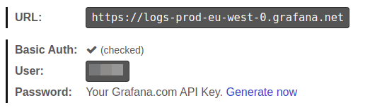



## Чтение логов из всех подов кластера и направление их в Loki

```yaml
apiVersion: deckhouse.io/v1alpha2
kind: ClusterLoggingConfig
metadata:
  name: all-logs
spec:
  type: KubernetesPods
  destinationRefs:
  - loki-storage
---
apiVersion: deckhouse.io/v1alpha1
kind: ClusterLogDestination
metadata:
  name: loki-storage
spec:
  type: Loki
  loki:
    endpoint: http://loki.loki:3100
```

Если вам нужно направить логи в кластерный модуль loki, то в ресурсе `ClusterLoggingConfig` в параметре `.spec.destinationRefs` укажите d8-loki, дополнительные примеры в [документации](/modules/loki/examples.html#чтение-логов-из-всех-подов-из-указанного-namespace-и-направление-их-в-loki)

## Чтение логов подов из указанного namespace с указанным label и перенаправление одновременно в Loki и Elasticsearch

Чтение логов подов из namespace `whispers` только с label `app=booking` и перенаправление одновременно в Loki и Elasticsearch:

```yaml
apiVersion: deckhouse.io/v1alpha2
kind: ClusterLoggingConfig
metadata:
  name: whispers-booking-logs
spec:
  type: KubernetesPods
  kubernetesPods:
    namespaceSelector:
      labelSelector:
        matchExpressions:
        - key: "kubernetes.io/metadata.name"
          operator: In
          values: [whispers]
    labelSelector:
      matchLabels:
        app: booking
  destinationRefs:
  - loki-storage
  - es-storage
---
apiVersion: deckhouse.io/v1alpha1
kind: ClusterLogDestination
metadata:
  name: loki-storage
spec:
  type: Loki
  loki:
    endpoint: http://loki.loki:3100
---
apiVersion: deckhouse.io/v1alpha1
kind: ClusterLogDestination
metadata:
  name: es-storage
spec:
  type: Elasticsearch
  elasticsearch:
    endpoint: http://192.168.1.1:9200
    index: logs-%F
    auth:
      strategy: Basic
      user: elastic
      password: c2VjcmV0IC1uCg==
```

## Создание source в namespace и чтение логов всех подов в этом NS с направлением их в Loki

Следующий pipeline создает source в namespace `test-whispers`, читает логи всех подов в этом NS и пишет их в Loki:

```yaml
apiVersion: deckhouse.io/v1alpha1
kind: PodLoggingConfig
metadata:
  name: whispers-logs
  namespace: tests-whispers
spec:
  clusterDestinationRefs:
    - loki-storage
---
apiVersion: deckhouse.io/v1alpha1
kind: ClusterLogDestination
metadata:
  name: loki-storage
spec:
  type: Loki
  loki:
    endpoint: http://loki.loki:3100
```

## Чтение только подов в указанном namespace и с определенным label

Пример чтения только подов, имеющих label `app=booking`, в namespace `test-whispers`:

```yaml
apiVersion: deckhouse.io/v1alpha1
kind: PodLoggingConfig
metadata:
  name: whispers-logs
  namespace: tests-whispers
spec:
  labelSelector:
    matchLabels:
      app: booking
  clusterDestinationRefs:
    - loki-storage
---
apiVersion: deckhouse.io/v1alpha1
kind: ClusterLogDestination
metadata:
  name: loki-storage
spec:
  type: Loki
  loki:
    endpoint: http://loki.loki:3100
```

## Переход с Promtail на Log-Shipper

В ранее используемом URL Loki требуется убрать путь `/loki/api/v1/push`.

**Vector** сам добавит этот путь при работе с Loki.

## Работа с Grafana Cloud

Данная документация подразумевает, что у вас уже [создан ключ API](https://grafana.com/docs/grafana-cloud/reference/create-api-key/).

Для начала вам потребуется закодировать в base64 ваш токен доступа к Grafana Cloud.



```bash
echo -n "<YOUR-GRAFANACLOUD-TOKEN>" | base64 -w0
```

Затем нужно создать **ClusterLogDestination**

```yaml
apiVersion: deckhouse.io/v1alpha1
kind: ClusterLogDestination
metadata:
  name: loki-storage
spec:
  loki:
    auth:
      password: PFlPVVItR1JBRkFOQUNMT1VELVRPS0VOPg==
      strategy: Basic
      user: "<YOUR-GRAFANACLOUD-USER>"
    endpoint: <YOUR-GRAFANACLOUD-URL> # Например https://logs-prod-us-central1.grafana.net или https://logs-prod-eu-west-0.grafana.net
  type: Loki
```

Теперь можно создать PodLogginConfig или ClusterPodLoggingConfig и отправлять логи в **Grafana Cloud**.

## Добавление Loki в Deckhouse Grafana

Вы можете работать с Loki из встроенной в Deckhouse Grafana. Достаточно добавить [**GrafanaAdditionalDatasource**](../../modules/prometheus/cr.html#grafanaadditionaldatasource).

```yaml
apiVersion: deckhouse.io/v1
kind: GrafanaAdditionalDatasource
metadata:
  name: loki
spec:
  access: Proxy
  basicAuth: false
  jsonData:
    maxLines: 5000
    timeInterval: 30s
  type: loki
  url: http://loki.loki:3100
```

## Поддержка Elasticsearch < 6.X

Для Elasticsearch < 6.0 нужно включить поддержку doc_type индексов.
Сделать это можно следующим образом:

```yaml
apiVersion: deckhouse.io/v1alpha1
kind: ClusterLogDestination
metadata:
  name: es-storage
spec:
  type: Elasticsearch
  elasticsearch:
    endpoint: http://192.168.1.1:9200
    docType: "myDocType" # Укажите значение здесь. Оно не должно начинаться с '_'.
    auth:
      strategy: Basic
      user: elastic
      password: c2VjcmV0IC1uCg==
```

## Шаблон индекса для Elasticsearch

Существует возможность отправлять сообщения в определенные индексы на основе метаданных с помощью шаблонов индексов:

```yaml
apiVersion: deckhouse.io/v1alpha1
kind: ClusterLogDestination
metadata:
  name: es-storage
spec:
  type: Elasticsearch
  elasticsearch:
    endpoint: http://192.168.1.1:9200
    index: "k8s-{{ namespace }}-%F"
```

В приведенном выше примере для каждого пространства имен Kubernetes будет создан свой индекс в Elasticsearch.

Эта функция также хорошо работает в комбинации с `extraLabels`:

```yaml
apiVersion: deckhouse.io/v1alpha1
kind: ClusterLogDestination
metadata:
  name: es-storage
spec:
  type: Elasticsearch
  elasticsearch:
    endpoint: http://192.168.1.1:9200
    index: "k8s-{{ service }}-{{ namespace }}-%F"
  extraLabels:
    service: "{{ service_name }}"
```

1. Если сообщение имеет формат JSON, поле `service_name` этого документа JSON перемещается на уровень метаданных.
2. Новое поле метаданных `service` используется в шаблоне индекса.

## Пример интеграции со Splunk

Существует возможность отсылать события из Deckhouse в Splunk.

1. Endpoint должен быть таким же, как имя вашего экземпляра Splunk с портом `8088` и без указания пути, например `https://prd-p-xxxxxx.splunkcloud.com:8088`.
2. Чтобы добавить token для доступа, откройте пункт меню `Setting` -> `Data inputs`, добавьте новый `HTTP Event Collector` и скопируйте token.
3. Укажите индекс Splunk для хранения логов, например `logs`.

```yaml
apiVersion: deckhouse.io/v1alpha1
kind: ClusterLogDestination
metadata:
  name: splunk
spec:
  type: Splunk
  splunk:
    endpoint: https://prd-p-xxxxxx.splunkcloud.com:8088
    token: xxxx-xxxx-xxxx
    index: logs
    tls:
      verifyCertificate: false
      verifyHostname: false
```



`destination` не поддерживает метки пода для индексирования. Рассмотрите возможность добавления нужных меток с помощью опции `extraLabels`.



```yaml
extraLabels:
  pod_label_app: '{{ pod_labels.app }}'
```

## Простой пример Logstash

Чтобы отправлять логи в Logstash, на стороне Logstash должен быть настроен входящий поток `tcp` и его кодек должен быть `json`.

Пример минимальной конфигурации Logstash:

```hcl
input {
  tcp {
    port => 12345
    codec => json
  }
}
output {
  stdout { codec => json }
}
```

Пример манифеста `ClusterLogDestination`:

```yaml
apiVersion: deckhouse.io/v1alpha1
kind: ClusterLogDestination
metadata:
  name: logstash
spec:
  type: Logstash
  logstash:
    endpoint: logstash.default:12345
```

## Syslog

Следующий пример показывает, как отправлять сообщения через сокет по протоколу TCP в формате syslog:

```yaml
apiVersion: deckhouse.io/v1alpha1
kind: ClusterLogDestination
metadata:
  name: rsyslog
spec:
  type: Socket
  socket:
    mode: TCP
    address: 192.168.0.1:3000
    encoding: 
      codec: Syslog
  extraLabels:
    syslog.severity: "alert"
    # поле request_id должно присутствовать в сообщении
    syslog.message_id: "{{ request_id }}"
```

## Пример интеграции с Graylog

Убедитесь, что в Graylog настроен входящий поток для приема сообщений по протоколу TCP на указанном порту. Пример манифеста для интеграции с Graylog:

```yaml
apiVersion: deckhouse.io/v1alpha1
kind: ClusterLogDestination
metadata:
  name: test-socket2-dest
spec:
  type: Socket
  socket:
    address: graylog.svc.cluster.local:9200
    mode: TCP
    encoding:
      codec: GELF
```

## Логи в CEF формате

Существует способ формировать логи в формате CEF, используя `codec: CEF`, с переопределением `cef.name` и `cef.severity` по значениям из поля `message` (лога приложения) в формате JSON.

В примере ниже `app` и `log_level` это ключи содержащие значения для переопределения:

```yaml
apiVersion: deckhouse.io/v1alpha1
kind: ClusterLogDestination
metadata:
  name: siem-kafka
spec:
  extraLabels:
    cef.name: '{{ app }}'
    cef.severity: '{{ log_level }}'
  type: Kafka
  kafka:
    bootstrapServers:
      - my-cluster-kafka-brokers.kafka:9092
    encoding:
      codec: CEF
    tls:
      verifyCertificate: false
      verifyHostname: true
    topic: logs
```

Так же можно вручную задать свои значения:

```yaml
extraLabels:
  cef.name: 'TestName'
  cef.severity: '1'
```

## Сбор событий Kubernetes

События Kubernetes могут быть собраны log-shipper'ом, если `events-exporter` включен в настройках модуля [extended-monitoring](../extended-monitoring/).

Включите events-exporter, изменив параметры модуля `extended-monitoring`:

```yaml
apiVersion: deckhouse.io/v1alpha1
kind: ModuleConfig
metadata:
  name: extended-monitoring
spec:
  version: 1
  settings:
    events:
      exporterEnabled: true
```

Выложите в кластер следующий `ClusterLoggingConfig`, чтобы собирать сообщения с пода `events-exporter`:

```yaml
apiVersion: deckhouse.io/v1alpha2
kind: ClusterLoggingConfig
metadata:
  name: kubernetes-events
spec:
  type: KubernetesPods
  kubernetesPods:
    labelSelector:
      matchLabels:
        app: events-exporter
    namespaceSelector:
      labelSelector:
        matchExpressions:
        - key: "kubernetes.io/metadata.name"
          operator: In
          values: [d8-monitoring]
  destinationRefs:
  - loki-storage
```

## Фильтрация логов

Пользователи могут фильтровать логи, используя следующие фильтры:

* `labelFilter` — применяется к метаданным, например имени контейнера (`container`), пространству имен (`namespace`) или имени пода (`pod_name`);
* `logFilter` — применяется к полям самого сообщения, если оно в JSON-формате.

### Сборка логов только для контейнера `nginx`

```yaml
apiVersion: deckhouse.io/v1alpha2
kind: ClusterLoggingConfig
metadata:
  name: nginx-logs
spec:
  type: KubernetesPods
  labelFilter:
  - field: container
    operator: In
    values: [nginx]
  destinationRefs:
  - loki-storage
```

### Сборка логов без строки, содержащей `GET /status" 200`

```yaml
apiVersion: deckhouse.io/v1alpha2
kind: ClusterLoggingConfig
metadata:
  name: all-logs
spec:
  type: KubernetesPods
  destinationRefs:
  - loki-storage
  labelFilter:
  - field: message
    operator: NotRegex
    values:
    - .*GET /status" 200$
```

### Аудит событий kubelet'а

```yaml
apiVersion: deckhouse.io/v1alpha2
kind: ClusterLoggingConfig
metadata:
  name: kubelet-audit-logs
spec:
  type: File
  file:
    include:
    - /var/log/kube-audit/audit.log
  logFilter:
  - field: userAgent  
    operator: Regex
    values: ["kubelet.*"]
  destinationRefs:
  - loki-storage
```

### Системные логи Deckhouse

```yaml
apiVersion: deckhouse.io/v1alpha2
kind: ClusterLoggingConfig
metadata:
  name: system-logs
spec:
  type: File
  file:
    include:
    - /var/log/syslog
  labelFilter:
  - field: message
    operator: Regex
    values:
    - .*d8-kubelet-forker.*
    - .*containerd.*
    - .*bashible.*
    - .*kernel.*
  destinationRefs:
  - loki-storage
```



Если вам нужны только логи одного пода или малой группы подов, постарайтесь использовать настройки `kubernetesPods`, чтобы сузить количество читаемых файлов. Фильтры необходимы только для высокогранулярной настройки.



## Преобразование логов

### Преобразование логов в структурированный объект

Вы можете использовать трансформацию `ParseMessage`,
чтобы преобразовать строку в поле `message` в структурированный объект.
При использовании нескольких трансформаций `ParseMessage`, преобразование строки должно выполняться последним.

```yaml
apiVersion: deckhouse.io/v1alpha2
kind: ClusterLogDestination
metadata:
  name: string-to-json
spec:
  ...
  transformations:
    - action: ParseMessage
      parseMessage:
        sourceFormat: String
        string:
          targetField: msg
```

Пример изначальной записи в логе:

```text
/docker-entrypoint.sh: Configuration complete; ready for start up
```

Результат преобразования:

```json
{... "message": { 
  "msg": "/docker-entrypoint.sh: Configuration complete; ready for start up"
  }
}
```

### Преобразование логов в формате Klog в структурированный объект

Вы можете использовать трансформацию `ParseMessage`,
чтобы распарсить логи в формате Klog и преобразовать их в структурированный объект.

```yaml
apiVersion: deckhouse.io/v1alpha2
kind: ClusterLogDestination
metadata:
  name: klog-to-json
spec:
  ...
  transformations:
    - action: ParseMessage
      parseMessage:
        sourceFormat: Klog
```

Пример изначальной записи в логе:

```text
I0505 17:59:40.692994   28133 klog.go:70] hello from klog
```

Результат преобразования:

```json
{... "message": {
  "file":"klog.go",
  "id":28133,
  "level":"info",
  "line":70,
  "message":"hello from klog",
  "timestamp":"2025-05-05T17:59:40.692994Z"
  }
}
```

### Преобразование логов в формате Syslog в структурированный объект

Вы можете использовать трансформацию `ParseMessage`,
чтобы распарсить логи в формате Syslog и преобразовать их в структурированный объект.

```yaml
apiVersion: deckhouse.io/v1alpha2
kind: ClusterLogDestination
metadata:
  name: syslog-to-json
spec:
  ...
  transformations:
    - action: ParseMessage
      parseMessage:
        sourceFormat: Syslog
```

Пример изначальной записи в логе:

```text
<13>1 2020-03-13T20:45:38.119Z dynamicwireless.name non 2426 ID931 [exampleSDID@32473 iut="3" eventSource= "Application" eventID="1011"] Try to override the THX port, maybe it will reboot the neural interface!
```

Результат преобразования:

```json
{... "message": {
  "appname": "non",
  "exampleSDID@32473": {
    "eventID": "1011",
    "eventSource": "Application",
    "iut": "3"
  },
  "facility": "user",
  "hostname": "dynamicwireless.name",
  "message": "Try to override the THX port, maybe it will reboot the neural interface!",
  "msgid": "ID931",
  "procid": 2426,
  "severity": "notice",
  "timestamp": "2020-03-13T20:45:38.119Z",
  "version": 1
}}
```

### Преобразование логов в формате CLF в структурированный объект

Вы можете использовать трансформацию `ParseMessage`,
чтобы распарсить логи в формате CLF и преобразовать их в структурированный объект.

```yaml
apiVersion: deckhouse.io/v1alpha2
kind: ClusterLogDestination
metadata:
  name: clf-to-json
spec:
  ...
  transformations:
    - action: ParseMessage
      parseMessage:
        sourceFormat: CLF
```

Пример изначальной записи в логе:

```text
127.0.0.1 bob frank [10/Oct/2000:13:55:36 -0700] \"GET /apache_pb.gif HTTP/1.0\" 200 2326
```

Результат преобразования:

```json
{... "message": {
  "host": "127.0.0.1",
  "identity": "bob",
  "message": "GET /apache_pb.gif HTTP/1.0",
  "method": "GET",
  "path": "/apache_pb.gif",
  "protocol": "HTTP/1.0",
  "size": 2326,
  "status": 200,
  "timestamp": "2000-10-10T20:55:36Z",
  "user": "frank"
}}
```

### Преобразование логов в формате LogFmt в структурированный объект

Вы можете использовать трансформацию `ParseMessage`,
чтобы распарсить логи в формате Logfmt и преобразовать их в структурированный объект.

```yaml
apiVersion: deckhouse.io/v1alpha2
kind: ClusterLogDestination
metadata:
  name: logfmt-to-json
spec:
  ...
  transformations:
    - action: ParseMessage
      parseMessage:
        sourceFormat: Logfmt
```

Пример изначальной записи в логе:

```text
@timestamp=\"Sun Jan 10 16:47:39 EST 2021\" level=info msg=\"Stopping all fetchers\" tag#production=stopping_fetchers id=ConsumerFetcherManager-1382721708341 module=kafka.consumer.ConsumerFetcherManager
```

Результат преобразования:

```json
{... "message": {
  "@timestamp": "Sun Jan 10 16:47:39 EST 2021",
  "id": "ConsumerFetcherManager-1382721708341",
  "level": "info",
  "module": "kafka.consumer.ConsumerFetcherManager",
  "msg": "Stopping all fetchers",
  "tag#production": "stopping_fetchers"
}}
```

### Парсинг JSON и уменьшение вложенности

Вы можете использовать трансформацию `ParseMessage`, чтобы парсить записи в логах в формате JSON.
С помощью параметра `depth` можно контролировать глубину вложенности.

```yaml
apiVersion: deckhouse.io/v1alpha2
kind: ClusterLogDestination
metadata:
  name: parse-json
spec:
  ...
  transformations:
    - action: ParseMessage
      parseMessage:
        sourceFormat: JSON
        json:
          depth: 1
```

Пример изначальной записи в логе:

```text
{"level" : { "severity": "info" },"msg" : "fetching.module.release"}
```

Результат преобразования:

```json
{... "message": {
  "level" : "{ \"severity\": \"info\" }",
  "msg" : "fetching.module.release"
  }
}
```

### Пример парсинга записей смешанных форматов в объект

Преобразование строки должно выполняться последним.

```yaml
apiVersion: deckhouse.io/v1alpha2
kind: ClusterLogDestination
metadata:
  name: parse-json
spec:
  ...
  transformations:
  - action: ParseMessage
    parseMessage:
      sourseFormat: JSON
  - action: ParseMessage
    parseMessage:
      sourceFormat: Klog
  - action: ParseMessage
    parseMessage:
      sourceFormat: String
        string:
          targetField: "text"
```

Пример изначальной записи в логе:

```text
/docker-entrypoint.sh: Configuration complete; ready for start up
{"level" : { "severity": "info" },"msg" : "fetching.module.release"}
I0505 17:59:40.692994   28133 klog.go:70] hello from klog
```

Результат преобразования:

```json
{... "message": {
  "text": "/docker-entrypoint.sh: Configuration complete; ready for start up"
  }
}
{... "message": {
  "level" : "{ "severity": "info" }",
  "msg" : "fetching.module.release"
  }
}
{... "message": {
  "file":"klog.go",
  "id":28133,
  "level":"info",
  "line":70,
  "message":"hello from klog",
  "timestamp":"2025-05-05T17:59:40.692994Z"
  }
}
```

### Замена лейблов

Вы можете использовать трансформацию `ReplaceKeys`, чтобы заменить `source` на `target` в заданных ключах лейблов.

> Перед применением трансформации `ReplaceKeys` к полю `message` или его вложенным полям
> необходимо преобразовать запись лога в структурированный объект с помощью трансформации `ParseMessage`.

```yaml
apiVersion: deckhouse.io/v1alpha2
kind: ClusterLogDestination
metadata:
  name: replace-dot
spec:
  ...
  transformations:
    - action: ReplaceKeys
      replaceKeys:
        source: "."
        target: "_"
        labels:
          - .pod_labels
```

Пример изначальной записи в логе:

```text
{"msg" : "fetching.module.release"} # Лейбл пода pod.app=test
```

Результат преобразования:

```json
{... "message": {
  "msg" : "fetching.module.release"
  },
  "pod_labels": {
    "pod_app": "test"
  }
}
```

### Удаление лейблов

Вы можете использовать трансформацию `DropLabels`, чтобы удалить заданные лейблы из записей логов.

> Перед применением трансформации `DropLabels` к полю `message` или его вложенным полям
> необходимо преобразовать запись лога в структурированный объект с помощью трансформации `ParseMessage`.

```yaml
apiVersion: deckhouse.io/v1alpha2
kind: ClusterLogDestination
metadata:
  name: drop-label
spec:
  ...
  transformations:
    - action: DropLabels
      dropLabels:
        labels:
          - .example
```

#### Пример удаления заданного лейбла из структурированного сообщения

В этом примере показано как вы можете удалить лейбл из структурированного JSON-сообщения.
Сначала применяется трансформация `ParseMessage` для парсинга сообщения,
после чего применяется `DropLabels` для удаления указанного лейбла.

```yaml
apiVersion: deckhouse.io/v1alpha2
kind: ClusterLogDestination
metadata:
  name: drop-label
spec:
  ...
  transformations:
    - action: ParseMessage
      parseMessage:
        sourceFormat: JSON
    - action: DropLabels
      dropLabels:
        labels:
          - .message.example
```

Пример изначальной записи в логе:

```text
{"msg" : "fetching.module.release", "example": "test"}
```

Результат преобразования:

```json
{... "message": {
  "msg" : "fetching.module.release"
  }
}
```

## Настройка сборки логов с продуктовых пространств имен, используя опцию namespace label selector

```yaml
apiVersion: deckhouse.io/v1alpha2
kind: ClusterLoggingConfig
metadata:
  name: production-logs
spec:
  type: KubernetesPods
  kubernetesPods:
    namespaceSelector:
      labelSelector:
        matchLabels:
          environment: production
  destinationRefs:
  - loki-storage
```

## Исключение подов и пространств имён, используя label

Существует преднастроенный label для исключения определенных подов и пространств имён: `log-shipper.deckhouse.io/exclude=true`.
Он помогает остановить сбор логов с подов и пространств имён без изменения глобальной конфигурации.

```yaml
---
apiVersion: v1
kind: Namespace
metadata:
  name: test-namespace
  labels:
    log-shipper.deckhouse.io/exclude: "true"
---
apiVersion: apps/v1
kind: Deployment
metadata:
  name: test-deployment
spec:
  ...
  template:
    metadata:
      labels:
        log-shipper.deckhouse.io/exclude: "true"
```

## Включение буферизации

Настройка буферизации логов необходима для улучшения надежности и производительности системы сбора логов. Буферизация может быть полезна в следующих случаях:

1. Временные перебои с подключением. Если есть временные перебои или нестабильность соединения с системой хранения логов (например, с Elasticsearch), буфер позволяет временно сохранять логи и отправить их, когда соединение восстановится.

1. Сглаживание пиков нагрузки. При внезапных всплесках объёма логов буфер позволяет сгладить пиковую нагрузку на систему хранения логов, предотвращая её перегрузку и потенциальную потерю данных.

1. Оптимизация производительности. Буферизация помогает оптимизировать производительность системы сбора логов за счёт накопления логов и отправки их группами, что снижает количество сетевых запросов и улучшает общую пропускную способность.

### Пример включения буферизации в оперативной памяти

```yaml
apiVersion: deckhouse.io/v1alpha1
kind: ClusterLogDestination
metadata:
  name: loki-storage
spec:
  buffer:
    memory:
      maxEvents: 4096
    type: Memory
  type: Loki
  loki:
    endpoint: http://loki.loki:3100
```

### Пример включения буферизации на диске

```yaml
apiVersion: deckhouse.io/v1alpha1
kind: ClusterLogDestination
metadata:
  name: loki-storage
spec:
  buffer:
    disk:
      maxSize: 1Gi
    type: Disk
  type: Loki
  loki:
    endpoint: http://loki.loki:3100
```

### Пример определения поведения при переполнении буфера

```yaml
apiVersion: deckhouse.io/v1alpha1
kind: ClusterLogDestination
metadata:
  name: loki-storage
spec:
  buffer:
    disk:
      maxSize: 1Gi
    type: Disk
    whenFull: DropNewest
  type: Loki
  loki:
    endpoint: http://loki.loki:3100
```

Более подробное описание параметров доступно [в ресурсе ClusterLogDestination](cr.html#clusterlogdestination).


