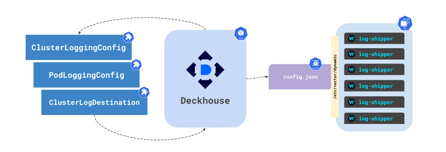
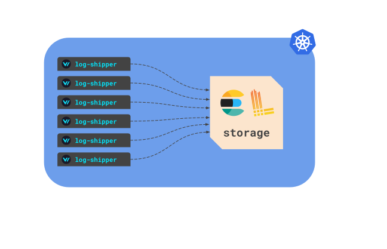
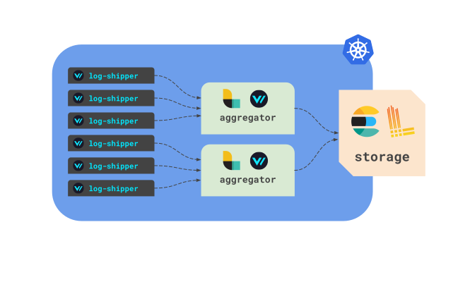
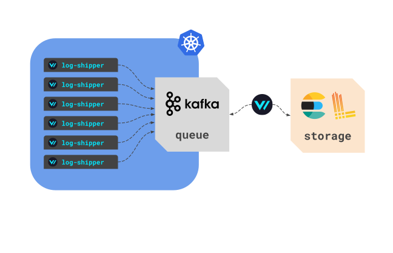
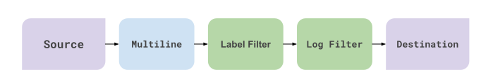

The `log-shipper` module simplifies the configuration of log collection in Kubernetes. It allows you to quickly collect logs from both applications running in the cluster and from the nodes themselves, and then send them to any storage system, internal or external (for example, Loki, Elasticsearch, S3, and others).

Module features:

- centrally collects and transmits logs from the cluster;
- filters, transforms, and enriches logs before sending;
- configures routing of logs between different sources and receivers.

<!-- Source: https://docs.google.com/drawings/d/1cOm5emdfPqWp9NT1UrB__TTL31lw7oCgh0VicQH-ouc/edit -->

1. Deckhouse is watching [ClusterLoggingConfig](cr.html#clusterloggingconfig), [ClusterLogDestination](cr.html#clusterlogdestination) and [PodLoggingConfig](cr.html#podloggingconfig) custom resources.
  The combination of a logging source and log destination is called `pipeline`.
2. Deckhouse generates a configuration file and stores it into Kubernetes `Secret`.
3. `Secret` is mounted to all log-shipper agent Pods and the configuration is reloaded on changes by the `reloader` sidecar container.

## Deployment topologies

This module deploys only agents on nodes. It is implied that logs are sent from the cluster using one of the following topologies.

### Distributed

Agents send logs directly to the storage, e.g., Loki, Elasticsearch.

<!-- Source: https://docs.google.com/drawings/d/1FFuPgpDHUGRdkMgpVWXxUXvfZTsasUhEh8XNz7JuCTQ/edit -->

* Less complicated scheme to use.
* Available out of the box without any external dependency besides storage.
* Complicated transformations consume more resources.

### Centralized

All logs are aggregated by one of the available aggregation destinations, e.g., Logstash, Vector.
Agents on nodes do minimal transformations and try to send logs from nodes faster with less resource consumption.
Complicated mappings are applied on the aggregator's side.

<!-- Source: https://docs.google.com/drawings/d/1TL-YUBk0CKSJuKtRVV44M9bnYMq6G8FpNRjxGxfeAhQ/edit -->

* Lower resource consumption for applications on nodes.
* Users can configure any possible mappings for aggregators and send logs to many more storages.
* Dedicated nodes for aggregates can be scaled up and down on the loading changes.

### Stream

The main goal of this architecture is to send messages to the queue system as quickly as possible, then other workers will read them and deliver them to the long-term storage for later analysis.

<!-- Source: https://docs.google.com/drawings/d/1R7vbJPl93DZPdrkSWNGfUOh0sWEAKnCfGkXOvRvK3mQ/edit -->

* The same pros and cons as for centralized architecture, yet one more middle layer storage is added.
* Increased durability. Suites for all infrastructures where logs delivery is crucial.

## Metadata

On collecting, all sources enrich logs with metadata. The enrichment takes place at the `Source` stage.

### Kubernetes

The following metadata fields will be exposed:

| Label        | Pod spec path           |
|--------------|-------------------------|
| `pod`        | metadata.name           |
| `namespace`  | metadata.namespace      |
| `pod_labels` | metadata.labels         |
| `pod_ip`     | status.podIP            |
| `image`      | spec.containers[].image |
| `container`  | spec.containers[].name  |
| `node`       | spec.nodeName           |
| `pod_owner`  | metadata.ownerRef[0]    |

| Label        | Node spec path                            |
|--------------|-------------------------------------------|
| `node_group` | metadata.labels[].node.deckhouse.io/group |


For Splunk, the `pod_labels` fields are not exported because it is a nested object, which is not supported by Splunk.


### File

The `host` label is the only label that contains the server's hostname.

## Log filters

There are two filters for reducing the number of messages sent to storage, `log filter` and `label filter`.

<!-- Source: https://docs.google.com/drawings/d/1SnC29zf4Tse4vlW_wfzhggAeTDY2o9wx9nWAZa_A6RM/edit -->

They are executed right after concatenating lines together with the multiline log parser.

1. `label filter` - rules are run on message metadata. The metadata (or label) fields are populated based on the log source, and different sources will have different sets of fields. These rules are needed, for example, to discard messages from a specific container or pod with/without a label.
1. `log filter` - rules are run on the original message. It is possible to discard a message based on a JSON field, or, if the message is not in JSON format, use a regular expression to search the string.

Both filters have the same structured configuration:

* `field` — the source of data to filter (most of the time it is a value of a label or a JSON parameter).
* `operator` — action to apply to a value of the field. Possible options are In, NotIn, Regex, NotRegex, Exists, DoesNotExist.
* `values` — defines different values for different operators:
  - DoesNotExist, Exists — not supported;
  - In, NotIn — a value of a field must / mustn't be in the list of provided values;
  - Regex, NotRegex — a value of a field must match any or mustn't match all the provided regexes (values).

More examples can be found in the [Examples](examples.html) section of the documentation.


Extra labels are added on the `Destination` stage of the pipeline, so it is impossible to run queries against them.

