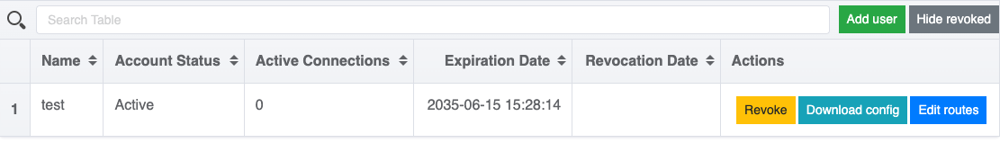

## Why doesn't automatic DNS server configuration work when connecting to macOS and Linux using the OpenVPN client

Due to the architectural features of the Linux and macOS operating systems, automatic DNS server configuration when using the official OpenVPN client is not possible.

To configure the DNS server on such operating systems, the service provides the ability to use third-party scripts that run when the client connects or disconnects.

In the client configurations generated by the module, the blocks responsible for these settings are predefined and commented out:

```bash
# Uncomment the lines below for use with Linux
#script-security 2
# If you use resolved
#up /etc/openvpn/update-resolv-conf
#down /etc/openvpn/update-resolv-conf
# If you use systemd-resolved, first install the openvpn-systemd-resolved package
#up /etc/openvpn/update-systemd-resolved
#down /etc/openvpn/update-systemd-resolved
```

To use these code blocks, uncomment them (remove the initial `#` symbol), and specify the correct paths to the scripts.

You can either prepare the scripts yourself or use ready-made scripts from the official [OpenVPN Community](https://community.openvpn.net/openvpn/wiki/Pushing-DNS-to-clients) (for Linux).
For macOS, you can use a [third-party script](https://github.com/andrewgdotcom/openvpn-mac-dns/blob/master/etc/openvpn/update-resolv-conf).


Scripts must have execution permissions.


## How to revoke, rotate or delete a user certificate

All operations with client certificates are performed via the openvpn-admin web interface. Buttons for managing certificates are available to the right of each user's name:



To rotate (issue a new certificate) or delete a client, you must first revoke their current certificate:


Once revoked, the Renew (rotation) and Delete (removal) actions become available.

## How to rotate a server certificate

The server certificate is rotated automatically several days before it expires.

If you need to rotate the certificate manually (e.g., due to certificate corruption or an unscheduled replacement), follow these steps:

1. Delete the secret `openvpn-pki-server` in the namespace `d8-openvpn`:

   ```shell
   d8 k -n d8-openvpn delete secrets openvpn-pki-server
   ```

1. Restart the OpenVPN pods to trigger the generation of a new certificate:

   ```shell
   d8 k -n d8-openvpn rollout restart sts openvpn
   ```

A new certificate will be generated automatically when the pods start.

## How to rotate a root certificate (CA)

The root certificate (CA) and server certificate are rotated automatically 1 day before expiration. Automatic rotation of clients certificates is not provided.
The root certificate (CA) is used to sign all certificates in OpenVPN — both server and client. Therefore, when replacing the CA, you must reissue all dependent certificates.

Steps to rotate the root certificate:

1. [Revoke or delete](#how-to-revoke-rotate-or-delete-a-user-certificate) all active client certificates using the openvpn-admin web interface.
If you choose to revoke certificates, you can rotate them later (Renew) after the CA is replaced, without recreating the clients.

1. Delete secrets `openvpn-pki-ca` and `openvpn-pki-server` in the namespace `d8-openvpn`:

   ```shell
   d8 k -n d8-openvpn delete secrets openvpn-pki-ca openvpn-pki-server
   ```

1. Restart OpenVPN pods:

   ```shell
   d8 k -n d8-openvpn rollout restart sts openvpn
   ```

1. [Rotate certificates](#how-to-revoke-rotate-or-delete-a-user-certificate) of revoked users, or create new ones.

1. Delete all revoked certificate secrets:

   ```shell
   d8 k -n d8-openvpn delete secrets -l revokedForever=true
   ```
