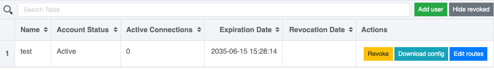
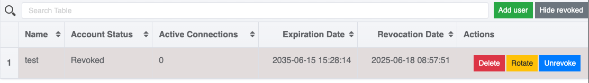

## Почему не работает автоматическая настройка DNS-сервера при подключении на macOS и Linux с помощью клиента OpenVPN

В связи с архитектурными особенностями операционных систем семейства Linux и macOS автоматическая конфигурация DNS-сервера при подключении с помощью официального клиента OpenVPN невозможна.

Для настройки DNS-сервера в таких ОС сервисом предусмотрена возможность использования сторонних скриптов, которые запускаются при подключении и отключении клиента.

В клиентских конфигурациях, генерируемых модулем, предопределены и закомментированы блоки, отвечающие за эти настройки:

```bash
# Uncomment the lines below for use with Linux
#script-security 2
# If you use resolved
#up /etc/openvpn/update-resolv-conf
#down /etc/openvpn/update-resolv-conf
# If you use systemd-resolved, first install the openvpn-systemd-resolved package
#up /etc/openvpn/update-systemd-resolved
#down /etc/openvpn/update-systemd-resolved
```

Для активации указанных блоков кода необходимо их раскомментировать (удалить начальный символ `#`), а также указать корректные пути к скриптам.

Скрипты можно подготовить самостоятельно или воспользоваться готовыми решениями от официального [OpenVPN Community](https://community.openvpn.net/openvpn/wiki/Pushing-DNS-to-clients) (для Linux).
Для macOS можно воспользоваться [сторонним скриптом](https://github.com/andrewgdotcom/openvpn-mac-dns/blob/master/etc/openvpn/update-resolv-conf).


Скрипты должны обладать правами на исполнение.


## Как отозвать, ротировать или удалить сертификат клиента

Все действия с клиентскими сертификатами выполняются через веб-интерфейс `openvpn-admin`. Справа от имени каждого пользователя доступны кнопки для управления сертификатом:



Чтобы ротировать (выпустить новый сертификат) или удалить клиента, необходимо сначала отозвать его текущий сертификат (Revoke):



После отзыва становятся доступными действия Renew (ротация) и Delete (удаление).

## Как ротировать сертификат сервера

Серверный сертификат ротируется автоматически за 1 день до окончания срока его действия.  

Если требуется выполнить ротацию вручную (например, при повреждении сертификата или внеплановой замене), выполните следующие шаги:

1. Удалите текущий секрет, содержащий сертификат и ключ сервера:

   ```shell
   d8 k -n d8-openvpn delete secrets openvpn-pki-server
   ```

1. Перезапустите поды OpenVPN, чтобы инициировать генерацию нового сертификата:

   ```shell
   d8 k -n d8-openvpn rollout restart sts openvpn
   ```

## Как ротировать корневой сертификат (CA)

Корневой сертификат (CA) и серверный сертификат ротируется автоматически за 1 день до окончания срока действия. Автоматическая ротация сертификатов пользователя не предусмотрена.
Корневой сертификат (CA) используется для подписи всех сертификатов в OpenVPN — как серверных, так и клиентских. Поэтому при его замене необходимо перевыпустить все зависимые сертификаты.

Шаги для ротации корневого сертификата:

1. [Отзовите или удалите](#как-отозвать-ротировать-или-удалить-сертификат-клиента) все активные клиентские сертификаты. Сделать это можно через интерфейс `openvpn-admin`. Если вы воспользуетесь отзывом, то после замены CA можно будет выполнить ротацию сертификатов (Renew), не создавая клиента заново.

1. Удалите секреты `openvpn-pki-ca` и `openvpn-pki-server`  в пространстве имён `d8-openvpn`:

   ```shell
   d8 k -n d8-openvpn delete secrets openvpn-pki-ca openvpn-pki-server
   ```

1. Перезапустите поды OpenVPN:

   ```shell
   d8 k -n d8-openvpn rollout restart sts openvpn
   ```

1. Выполните [ротацию сертификатов](#как-отозвать-ротировать-или-удалить-сертификат-клиента) для отозванных клиентов или создайте новых клиентов с новыми сертификатами.

1. Удалите все отозванные сертификаты:

   ```shell
   d8 k  -n d8-openvpn delete secrets -l revokedForever=true
   ```
