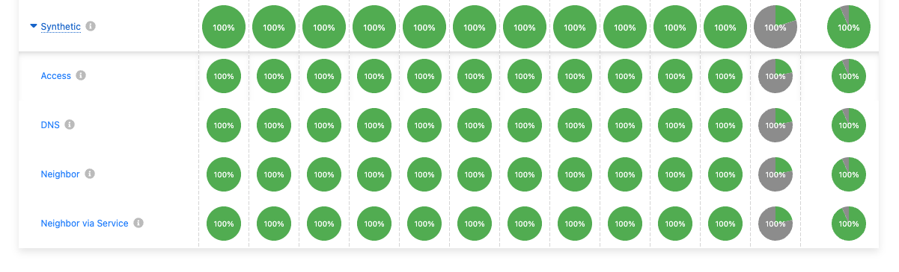
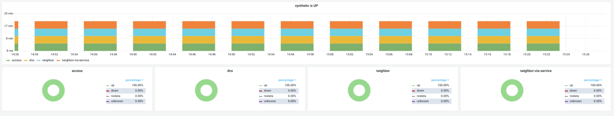

Модуль тестирует доступность платформы и состояние компонентов кластера в реальном времени, выводит информацию в виде соответствующих дашбордов.

Возможности модуля:

- для всех основных компонентов кластера разработаны сценарии постоянного тестирования;
- результаты тестирования сохраняются в виде метрик;
- отображает дашборд, показывающий работоспособность компонентов;
- данные могут быть экспортированы в любую внешнюю Prometheus-совместимую систему мониторинга.

Состав модуля:

- **agent** — работает на master-узлах и делает пробы доступности, отправляет результаты на сервер.
- **upmeter** — собирает результаты и поддерживает API-сервер для их извлечения.
- **front**:
  - **status** — показывает уровень доступности за последние 10 минут (требует авторизации, но ее можно отключить);
  - **webui** — показывает дашборд со статистикой по пробам и группам доступности (требует авторизации).
- **smoke-mini** — поддерживает постоянное *smoke-тестирование* с помощью StatefulSet.

Модуль отправляет около 100 показаний метрик каждые 5 минут. Это значение зависит от количества включенных модулей Deckhouse Kubernetes Platform.

## Интерфейс

Пример веб-интерфейса:

Пример графиков по метрикам из upmeter в Grafana:

