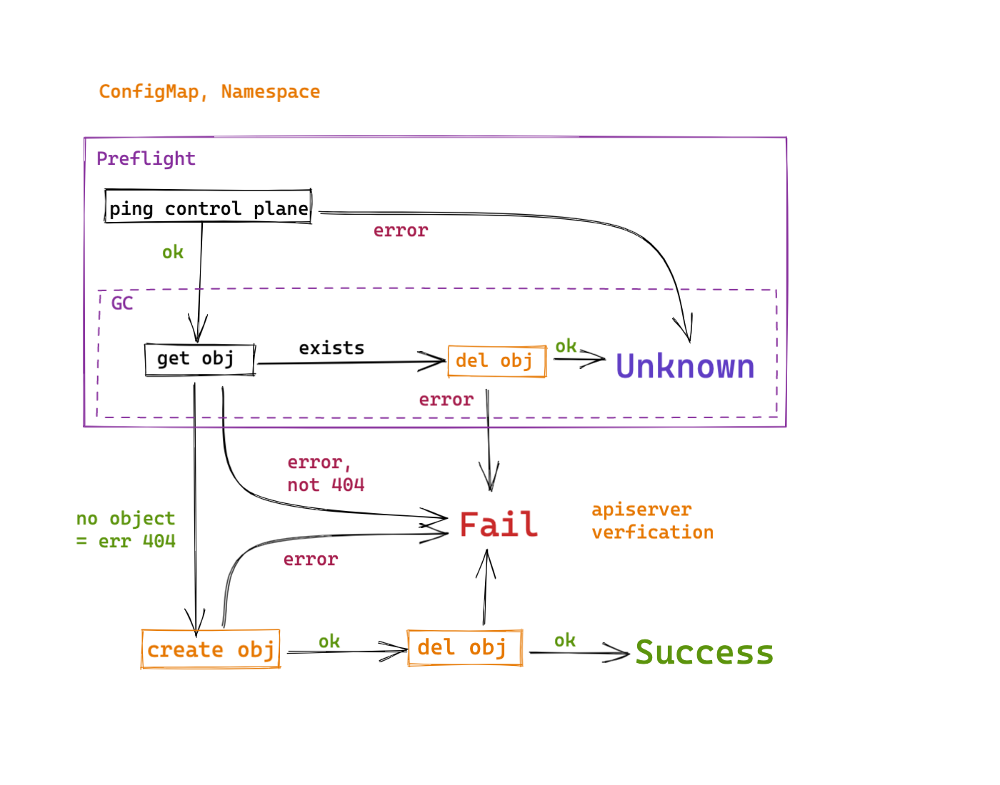
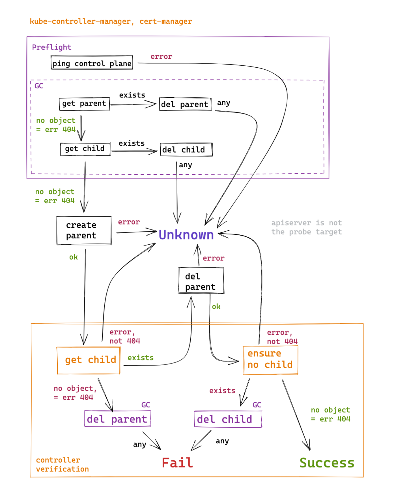

# Architecture description

- [Agent](#agent)
- [Server](#server)
  - [CRD](#crd)
    - [Downtime](#downtime)
    - [UpmeterRemoteWrite](#upmeterremotewrite)
- [Probes](#probes)
  - [Control Plane](#control-plane)
    - [Lifecycle of an object](#lifecycle-of-an-object)
    - [Lifecycle of an object state](#lifecycle-of-an-object-state)
    - [Lifecycle of a child object](#lifecycle-of-a-child-object)
  - [Synthetic](#synthetic)
    - [Supported probing methods](#supported-probing-methods)

The application consists of three parts:

- upmeter agent (ds/upmeter-agent)
- upmeter server (sts/upmeter)
- smoke-mini (sts/smoke-mini-{a,b,c,d,e})

## Agent

The agent measures the availability of Deckhouse components. It checks the state of the object through the cluster API or tracks the response to an HTTP request sent to the application. Examples include verifying that the Pod is Ready or that Prometheus responds properly to an HTTP request.

The logical unit of availability is called a probe. A probe tests some functionality and is made up of one check or several parallel checks. For example, the `cluster-scaling` probe consists of three checks that verify the status of the `cloud-controller-manager`, `machine-controller-manager`, and `bashible-apiserver` Pods.

If one of the checks fails (i.e., the component is unavailable), the probe status becomes `down`. The status can also be `up` (if all checks have completed successfully) and `uncertain` (if all checks have failed to find out whether components are available or not). The latter takes place if the probe conditions are not met. For example, probes based on Pod status will become `uncertain` if it is not known whether the API server is available at the time of the Pod checks.

The result of running the probe describes the availability status of the functionality that the probe checks. Probes are run periodically at predetermined intervals. The most frequently triggered probe, `dns`, runs 5 times per second. The most rarely triggered probes (e.g., `namespace` lifecycle checks) are run once a minute.

Probe results are captured at a base rate of 5 times per second and compiled into an array of probe statuses. The statuses are accumulated for 30 seconds. Every 30 seconds, the statistics for each probe is collected. The stats include four numbers:

- uptime;
- downtime;
- uncertain time;
- the leftover interval of 30 seconds in which no measurements were taken (nodata).

Measurements are not taken only if the agent is not running.

The probes are grouped into availability groups. These groups are covered by the SLA. The agent uses the same approach for calculating group availability statistics as it does for collecting probe statistics. The agent calculates the group status based on probe statuses in the same fashion as probe statuses are calculated based on check statuses.

Probe and group availability statistics accumulated over 30 seconds are sent to the `upmeter server` over HTTP.

Agent is a DaemonSet that runs only on the control plane nodes. Agent Pods use SQLite to implement the WAL. This ensures that the data is preserved even if `upmeter` is temporarily unavailable (the data will be sent when it becomes operational). The WAL stores data for the last 24 hours at most.

## Server

The server retrieves 30-second availability statistics from agents and compiles it into 5-minute statistics intervals. If there is more than one agent in the cluster, the server chooses the most optimistic statistic. The 5-minute stats are stored for all available time. SQLite database is used for storage, the data is stored in the `/db/dowtime.db.sqlite` file.

The server supplies the data in the JSON format. This data is used by the upmeter dashboard and the status page.

### CRD

#### Downtime

> **Note!** This functionality is not fully implemented yet.

Information about the activities that took place in the cluster or on the infrastructure and caused downtime can be documented using the `downtime.deckhouse.io` CRD object. In it, you can specify the expected type of downtime, the time interval, and the accessibility groups or probes affected. The server will treat this time as `uncertain` for the specified groups and probes.

- Can read the `Downtime` CR; in these CRDs:
  - startDate, endDate — start time and end time of the downtime in ISO format;
  - type — downtime type:
    - Accident — an incident on our side;
    - Maintenance — scheduled maintenance;
    - InfrastructureMaintenance — scheduled maintenance at the infrastructure provider;
    - InfrastructureAccident — problems with the provider's infrastructure;
  - description — information for users;
  - affected — a list of subsystems/components that are affected by the Downtime.

An example of a Downtime:

```yaml
apiVersion: deckhouse.io/v1alpha1
kind: Downtime
metadata:
  name: change-pod-cidr
  labels:
    heritage: deckhouse
    module: upmeter
spec:
- startDate: "2020-10-23T12:00:00Z"
  endDate: "2020-10-23T13:00:00Z"
  type: Maintenance
  description: "Change Pod's CIDR, ticket #33121"
  affected:
  - synthetic
  - control-plane
```

#### UpmeterRemoteWrite

The server can export data as metrics using the Prometheus Remote Write protocol.

```yaml
apiVersion: deckhouse.io/v1
kind: UpmeterRemoteWrite
metadata:
  labels:
    heritage: upmeter
    module: upmeter
  name: victoriametrics
spec:
  additionalLabels:
    cluster: cluster-name
    some: fun
  config:
    url: https://victoriametrics.somewhere/api/v1/write
    basicAuth:
      password: "Cdp#Cd.OxfZsx4*89SZ"
      username: upmeter
  intervalSeconds: 300
```

## Probes

- control-plane
  - access
  - basic-functionality
  - controller-manager
  - namespace
  - scheduler
  - cert-manager
- deckhouse
  - cluster-configuration
- extensions
  - cluster-scaling
  - dashboard
  - dex
  - grafana
  - openvpn
  - prometheus-longterm
- load-balancing
  - load-balancer-configuration
  - metallb
- monitoring-and-autoscaling
  - prometheus
  - prometheus-metrics-adapter
  - vertical-pod-autoscaler
  - horizontal-pod-autoscaler
  - key-metrics-presence
  - metric-sources
  - trickster
- nginx
  - *(controller name)*
- nodegroups
  - *(CloudEphemeral node group name)*
- synthetic
  - access
  - dns
  - neighbor
  - neighbor-via-service

### Control Plane

#### Lifecycle of an object

This probe checks the availability of the API server. The object lifecycle is checked by creating an object and deleting it. Failed requests to the API server are recognized as an inoperative state (downtime).

Probes:

- `Basic Functionality` — checks whether a ConfigMap object is created and deleted;
- `Namespace` — checks whether a ConfigMap object is created and deleted.



#### Lifecycle of an object state

This probe finds out the state of the object as part of its lifecycle. The probe is considered failed if the object does not reach the expected state (for example, if a Pod fails to get scheduled on a node). Failed API server operations are considered to be a sufficient condition for the probe to end with an uncertain status.

Probes:

- `Scheduler` — checks whether a Pod gets scheduled to a node.


#### Lifecycle of a child object

The probe is intended to keep track of the state of a controller that creates an object in response to the creation of another object. The probe verifies that the lifecycle of the child object is bound to the lifecycle of the parent object.

Probes:

- `Controller Manager`: StatefulSet → Pod,
- `Cert Manager`: Certificate → Secret.



### Synthetic

Probes belonging to the "synthetic" group send requests to the smoke-mini — a model web server application. This allows the user to estimate the behavior of real-life applications in the cluster. The `smoke-mini` app runs five HTTP server StatefulSets and provides an API for running tests. Pods of one of the StatefulSets are re-scheduled once a minute on random nodes. The `smokemini/reschedule.go` hook is responsible for scheduling.

#### Supported probing methods

* `/` — checks whether the Pod is available; returns the 200 response code in all cases;
* `/dns` — checks whether the cluster DNS is working by resolving the `kubernetes.default` domain name;
* `/neighbor` — checks whether there is access to the "neighboring" StatefulSet using the HTTP address of the Pod;
* `/neighbor-via-service` — checks whether the "neighboring" StatefulSet is accessible over a shared service.
