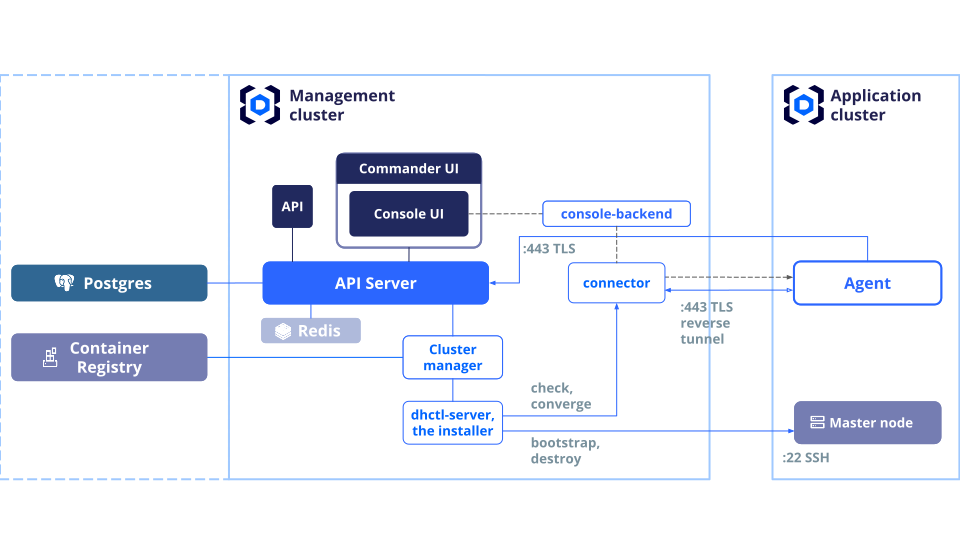


## Commander internals



Deckhouse Commander has an external dependency — PostgreSQL database.

The *API server* is the central component. Data is stored in PostgreSQL. Options for installing
Deckhouse Commander with a DBMS are listed in the [Installation section](./install.html).

The API server provides both external APIs — web applications and for external integration — and
internal APIs for working with clusters.

*Web Application* uses the API for managing clusters and other Deckhouse Commander entities.

Asynchronous operations — tasks — are used to manage clusters. The *cluster manager* is a service
that monitors tasks and executes them. Tasks can be cluster installation, cluster deletion, or
cluster state reconciliation with the specified configuration.

*Cluster manager* is single-threaded. Therefore, the efficiency of cluster processing depends on the
number of clusters and the number of cluster manager replicas. When a cluster is created in API, the
API server creates an installation task. Then the free instance of the cluster manager takes the
task to work on. The same happens for cluster update, delete or reconciliation operations.
*Cluster Manager* is responsible for launching installers — *dhctl servers*. Cluster Manager
launches a replica of the dhctl server with only the necessary version for each Deckhouse Kubernetes
Platform (DKP) cluster.

In each cluster, Deckhouse Commander automatically installs the `commander-agent` module. This
module is responsible for synchronizing Kubernetes resources in the application cluster, as well as sending
telemetry to the Deckhouse Commander API server. Telemetry includes basic metrics (total
number of CPUs, total memory, number of nodes, and total storage), DKP version, Kubernetes version, and DKP component availability.

### Network Availability Requirements For Components

Deckhouse Commander components require network connectivity with application clusters. This availability
is not needed all the time. However, during network connectivity, a comparison of the target and actual
cluster configuration occurs, and only with network access can the cluster be brought to the
desired state. What network access is needed for full functionality:

* **22/TCP** from Deckhouse Commander to the application cluster
  * Cluster Manager (dhctl) connects via SSH to the master node for initial setup or for
    destroying the cluster.
* **443/TCP** or **80/TCP** from the application cluster to Deckhouse Commander
  * 443 or 80 or other value — depends on the ingress controller parameters in the control
     cluster and on the `https.mode` parameter in the control cluster, specified in global
     settings or Deckhouse Commander module settings;
  * the agent collects configuration to update it and also sends telemetry to the server;
  * the agent creates a TCP tunnel through which the Cluster Manager controls the infrastructure part
       of the configuration.

By default, Deckhouse Commander configures the commander-agent to use HTTPS. To change
this, you need to explicitly set the commander-agent module configuration in the cluster template:

```yaml
apiVersion: deckhouse.io/v1alpha1
kind: ModuleConfig
metadata:
  name: commander-agent
  labels:
    heritage: deckhouse-commander
spec:
  enabled: true
  version: 1
  settings:
    # http is set explicitly ↓
    commanderUrl: "http://{{ .dc_domain }}/agent_api/{{ .dc_clusterUUID }}"
```

## Data encryption

Deckhouse Commander encrypts sensitive data stored in the database using keys that are automatically generated when the module is enabled and stored in the `commander-envs` secret.

> **Attention**: It is extremely important to save the keys to a secure location in order to be able to restore the database in case of any problems. If there are no keys, it will be **impossible** to restore the data!

```shell
❯ kubectl -n d8-commander get secret commander-envs -oyaml
apiVersion: v1
data:
  ACTIVE_RECORD_ENCRYPTION_DETERMINISTIC_KEY: YVBBNVh5QUxoZjc1Tk5uTXphc3BXN2FrVGZacDBsUFk=
  ACTIVE_RECORD_ENCRYPTION_KEY_DERIVATION_SALT: eEVZMGR0NlRaY0FNZzUySzdPODR3WXpranZiQTYySHo=
  ACTIVE_RECORD_ENCRYPTION_PRIMARY_KEY: RUdZOFdodWxVT1hpeHlib2Q3Wld3TUlMNjhSOW81a0M=
kind: Secret
metadata:
...
  name: commander-envs
  namespace: d8-commander
type: Opaque
```

## Collecting logs of the history of changes

In Deckhouse Commander version 1.9 and later, events related to the history of changes are printed to the standard output and are tagged with the `["audit"]` label. These logs can be collected and sent using the [log-shipper](/modules/log-shipper/) module.

Logs example:

```json
{"level":"INFO","time":"2025-06-18 14:22:15 +0300","request_id":"ea09d409dc3c95dcf658fc2c2838084b","pid":19,"tags":["audit"],"auditable_type":"ClusterSettings","auditable_id":"8a0041ef-6c30-48bc-b3ca-e9db3e22be47","action":"create","user_type":"User","remote_address":"82.150.57.81","request_uuid":"ea09d409dc3c95dcf658fc2c2838084b","workspace_slug":"xcjtd","user_name":"admin@company.my","audited_changes":{"cluster_manager":{"sync":{"mode":"auto"},"check_interval":1}}}
{"level":"INFO","time":"2025-06-18 14:22:15 +0300","request_id":"ea09d409dc3c95dcf658fc2c2838084b","pid":19,"tags":["audit"],"auditable_type":"Cluster","auditable_id":"056f7fe5-7d22-4a76-b5e2-f225c0a99613","action":"create","user_type":"User","remote_address":"82.150.57.81","request_uuid":"ea09d409dc3c95dcf658fc2c2838084b","workspace_slug":"xcjtd","user_name":"admin@company.my","audited_changes":{"name":"mycluster","archived_at":null}}
{"level":"INFO","time":"2025-06-18 14:23:57 +0300","request_id":"a1eaf50bbc87a8cca4cd17d8be8fffdb","pid":12,"tags":["audit"],"auditable_type":"ClusterSettings","auditable_id":"707c46b1-b2c8-4fab-9392-8216a2058219","action":"create","user_type":"AuthToken","remote_address":"238.106.231.86","request_uuid":"a1eaf50bbc87a8cca4cd17d8be8fffdb","workspace_slug":"bfqcc","user_name":"api-user","audited_changes":{"cluster_manager":{"sync":{"mode":"auto"},"check_interval":1}}}
{"level":"INFO","time":"2025-06-18 14:23:57 +0300","request_id":"a1eaf50bbc87a8cca4cd17d8be8fffdb","pid":12,"tags":["audit"],"auditable_type":"Cluster","auditable_id":"42d432aa-8250-4ef0-b260-51639e1445d0","action":"create","user_type":"AuthToken","remote_address":"238.106.231.86","request_uuid":"a1eaf50bbc87a8cca4cd17d8be8fffdb","workspace_slug":"bfqcc","user_name":"api-user","audited_changes":{"name":"15731486914-1-con-1-30","archived_at":null}}
{"level":"INFO","time":"2025-06-18 14:28:56 +0300","request_id":"069566a46c004e53b686189587d484a9","pid":19,"tags":["audit"],"auditable_type":"ClusterSettings","auditable_id":"402a4d4d-5c14-4466-a1f3-3d990d7cf35a","action":"create","user_type":"User","remote_address":"30.231.184.26","request_uuid":"069566a46c004e53b686189587d484a9","workspace_slug":"xcjtd","user_name":"user@company.my","audited_changes":{"cluster_manager":{"sync":{"mode":"auto"},"check_interval":1}}}
{"level":"INFO","time":"2025-06-18 14:28:56 +0300","request_id":"069566a46c004e53b686189587d484a9","pid":19,"tags":["audit"],"auditable_type":"Cluster","auditable_id":"9ee687d4-18fe-423c-bbaa-e8e46ea47e67","action":"create","user_type":"User","remote_address":"30.231.184.26","request_uuid":"069566a46c004e53b686189587d484a9","workspace_slug":"xcjtd","user_name":"user@company.my","audited_changes":{"name":"mycluster2","archived_at":null}}
{"level":"INFO","time":"2025-06-18 14:29:06 +0300","request_id":"d29b248fbce414db8b71f821a3b1886e","pid":12,"tags":["audit"],"auditable_type":"Cluster","auditable_id":"e0f3c3de-2129-4b75-b927-72a8eb26902b","action":"update","user_type":"User","remote_address":"30.231.184.26","request_uuid":"d29b248fbce414db8b71f821a3b1886e","workspace_slug":"xcjtd","user_name":"user@company.my","audited_changes":{"archived_at":[null,"2025-06-18T14:29:05.943+03:00"]}}
```

Configuration example:

```yaml
apiVersion: deckhouse.io/v1alpha2
kind: ClusterLoggingConfig
metadata:
  name: commander-audit-logs
spec:
  destinationRefs:
  - loki-example
  kubernetesPods:
    labelSelector:
      matchLabels:
        app: backend
    namespaceSelector:
      labelSelector:
        matchLabels:
          kubernetes.io/metadata.name: d8-commander
  labelFilter:
  - field: message
    operator: Regex
    values:
    - .*\[\"audit\"\].*
  type: KubernetesPods
---
apiVersion: deckhouse.io/v1alpha1
kind: ClusterLogDestination
metadata:
  name: loki-example
spec:
  type: Loki
  loki:
    endpoint: http://loki-example.loki.svc:3100
```

For more detailed configuration information, see the documentation of the [log-shipper](/modules/log-shipper/) module.

