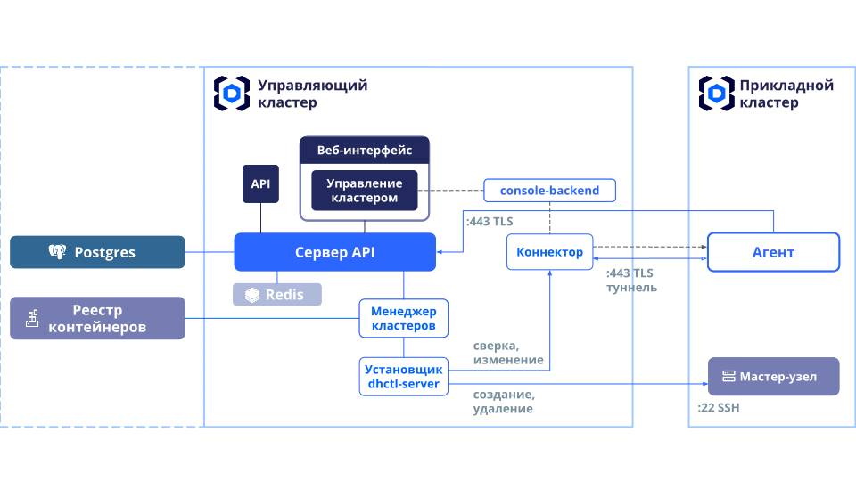


## Как устроен Deckhouse Commander

### Компоненты Deckhouse Commander



У Deckhouse Commander есть внешняя зависимость — база данных PostgreSQL.

*Сервер API* является центральным компонентом. Данные хранятся в PostgreSQL. Варианты установки
Deckhouse Commander с СУБД указаны в [разделе «Установка»](./install.html).

Сервер API предоставляет как внешние API — веб-приложения и для внешней интеграции - так и
внутренние API для работы с кластерами.

*Веб-приложение* использует API для управления кластерами и другими сущностями Deckhouse Commander.

Для управления кластерами используются асинхронные операции — задания. *Менеджер кластеров* — это
сервис, который отслеживает задания и выполняет их. Заданиями могут быть установка кластера,
удаление кластера или сверка состояния кластера с заданной конфигурацией.

*Менеджер кластеров* отвечает за запуск установщиков — *серверов dhctl*. Менеджер кластеров
запускает реплику сервера dhctl только нужной версии для каждого кластера Deckhouse Kubernetes
Platform (Deckhouse Platform Certified Security Edition).

В каждом кластере Deckhouse Commander автоматически устанавливает модуль `commander-agent`. Этот
модуль отвечает за синхронизацию ресурсов Kubernetes в прикладном кластере, а так же за отправку
телеметрии в сервер API Deckhouse Commander. Телеметрия включает в себя основные метрики (общее
количество ядер, общий объем памяти, количество узлов и общий объем хранилищ), версию Deckhouse Platform Certified Security Edition, версию
Kubernetes и доступность компонентов Deckhouse Platform Certified Security Edition.

### Требования к сетевой доступности компонентов

Компоненты Deckhouse Commander требуют сетевой доступности с прикладными кластерами. Эта доступность
не нужна все время. Однако во время сетевого доступа происходит сравнение целевой и фактической
конфигурации кластера, а так же только при сетевом доступе может быть запущено приведение кластера к
целевому состоянию. Какой сетевой доступ требуется для полной работоспособности:

* **22/TCP** от Deckhouse Commander к прикладному кластеру
  * менеджер кластеров (dhctl) подключается по SSH к мастер-узлу для первочной настройки или для
    уничтожения кластера.

* **443/TCP** или **80/TCP** от прикладного кластера к Deckhouse Commander
  * 443 или 80 или другое значение — зависит от параметров ингресс-контроллера в управляющем
     кластере и от параметра `https.mode` в управляющем кластере, который указывается в глобальных
     настройках или в настройках модуля Deckhouse Commander;
  * агент собирает конфигурацию, чтобы ее актуализировать, а так же отправляет телеметрию на сервер;
  * агент создает TCP-туннель, через который менеджер кластеров контролирует инфраструктурную часть
       конфигурации.

По умолчанию Deckhouse Commander настраивает commander-agent на использование HTTPS. Чтобы изменить
протокол на HTTP, нужно явно задать конфигурацию модуля commander-agent в шаблоне кластера:

```yaml
apiVersion: deckhouse.io/v1alpha1
kind: ModuleConfig
metadata:
  name: commander-agent
spec:
  enabled: true
  version: 1
  settings:
    # http задан явно ↓
    commanderUrl: "http://{{ .dc_domain }}/agent_api/{{ .dc_clusterUUID }}"
```

## Шифрование данных

Deckhouse Commander шифрует чувствительные данные в базе данных. Для шифрования используются ключи из
секрета `commander-envs`, которые генерируются автоматически при включении модуля.

> **Внимание**: Крайне важно сохранить ключи в надежное место, чтобы иметь возможность восстановить базу данных в случае каких-либо проблем. При отсутствии ключей восстановить данные будет **невозможно**!

```shell
$ kubectl -n d8-commander get secret commander-envs -oyaml
apiVersion: v1
data:
  ACTIVE_RECORD_ENCRYPTION_DETERMINISTIC_KEY: YVBBNVh5QUxoZjc1Tk5uTXphc3BXN2FrVGZacDBsUFk=
  ACTIVE_RECORD_ENCRYPTION_KEY_DERIVATION_SALT: eEVZMGR0NlRaY0FNZzUySzdPODR3WXpranZiQTYySHo=
  ACTIVE_RECORD_ENCRYPTION_PRIMARY_KEY: RUdZOFdodWxVT1hpeHlib2Q3Wld3TUlMNjhSOW81a0M=
kind: Secret
metadata:
...
  name: commander-envs
  namespace: d8-commander
type: Opaque
```

## Сбор логов истории изменений

В Deckhouse Commander, начиная с версии 1.9, события из «Истории изменений» направляются в стандартный вывод и помечаются тегом `["audit"]`. Сбор и отправку таких логов можно настроить при помощи модуля [log-shipper](/modules/log-shipper/)

Пример логов:

```json
{"level":"INFO","time":"2025-06-18 14:22:15 +0300","request_id":"ea09d409dc3c95dcf658fc2c2838084b","pid":19,"tags":["audit"],"auditable_type":"ClusterSettings","auditable_id":"8a0041ef-6c30-48bc-b3ca-e9db3e22be47","action":"create","user_type":"User","remote_address":"82.150.57.81","request_uuid":"ea09d409dc3c95dcf658fc2c2838084b","workspace_slug":"xcjtd","user_name":"admin@company.my","audited_changes":{"cluster_manager":{"sync":{"mode":"auto"},"check_interval":1}}}
{"level":"INFO","time":"2025-06-18 14:22:15 +0300","request_id":"ea09d409dc3c95dcf658fc2c2838084b","pid":19,"tags":["audit"],"auditable_type":"Cluster","auditable_id":"056f7fe5-7d22-4a76-b5e2-f225c0a99613","action":"create","user_type":"User","remote_address":"82.150.57.81","request_uuid":"ea09d409dc3c95dcf658fc2c2838084b","workspace_slug":"xcjtd","user_name":"admin@company.my","audited_changes":{"name":"mycluster","archived_at":null}}
{"level":"INFO","time":"2025-06-18 14:23:57 +0300","request_id":"a1eaf50bbc87a8cca4cd17d8be8fffdb","pid":12,"tags":["audit"],"auditable_type":"ClusterSettings","auditable_id":"707c46b1-b2c8-4fab-9392-8216a2058219","action":"create","user_type":"AuthToken","remote_address":"238.106.231.86","request_uuid":"a1eaf50bbc87a8cca4cd17d8be8fffdb","workspace_slug":"bfqcc","user_name":"api-user","audited_changes":{"cluster_manager":{"sync":{"mode":"auto"},"check_interval":1}}}
{"level":"INFO","time":"2025-06-18 14:23:57 +0300","request_id":"a1eaf50bbc87a8cca4cd17d8be8fffdb","pid":12,"tags":["audit"],"auditable_type":"Cluster","auditable_id":"42d432aa-8250-4ef0-b260-51639e1445d0","action":"create","user_type":"AuthToken","remote_address":"238.106.231.86","request_uuid":"a1eaf50bbc87a8cca4cd17d8be8fffdb","workspace_slug":"bfqcc","user_name":"api-user","audited_changes":{"name":"15731486914-1-con-1-30","archived_at":null}}
{"level":"INFO","time":"2025-06-18 14:28:56 +0300","request_id":"069566a46c004e53b686189587d484a9","pid":19,"tags":["audit"],"auditable_type":"ClusterSettings","auditable_id":"402a4d4d-5c14-4466-a1f3-3d990d7cf35a","action":"create","user_type":"User","remote_address":"30.231.184.26","request_uuid":"069566a46c004e53b686189587d484a9","workspace_slug":"xcjtd","user_name":"user@company.my","audited_changes":{"cluster_manager":{"sync":{"mode":"auto"},"check_interval":1}}}
{"level":"INFO","time":"2025-06-18 14:28:56 +0300","request_id":"069566a46c004e53b686189587d484a9","pid":19,"tags":["audit"],"auditable_type":"Cluster","auditable_id":"9ee687d4-18fe-423c-bbaa-e8e46ea47e67","action":"create","user_type":"User","remote_address":"30.231.184.26","request_uuid":"069566a46c004e53b686189587d484a9","workspace_slug":"xcjtd","user_name":"user@company.my","audited_changes":{"name":"mycluster2","archived_at":null}}
{"level":"INFO","time":"2025-06-18 14:29:06 +0300","request_id":"d29b248fbce414db8b71f821a3b1886e","pid":12,"tags":["audit"],"auditable_type":"Cluster","auditable_id":"e0f3c3de-2129-4b75-b927-72a8eb26902b","action":"update","user_type":"User","remote_address":"30.231.184.26","request_uuid":"d29b248fbce414db8b71f821a3b1886e","workspace_slug":"xcjtd","user_name":"user@company.my","audited_changes":{"archived_at":[null,"2025-06-18T14:29:05.943+03:00"]}}
```

Пример конфигурации:

```yaml
apiVersion: deckhouse.io/v1alpha2
kind: ClusterLoggingConfig
metadata:
  name: commander-audit-logs
spec:
  destinationRefs:
  - loki-example
  kubernetesPods:
    labelSelector:
      matchLabels:
        app: backend
    namespaceSelector:
      labelSelector:
        matchLabels:
          kubernetes.io/metadata.name: d8-commander
  labelFilter:
  - field: message
    operator: Regex
    values:
    - .*\[\"audit\"\].*
  type: KubernetesPods
---
apiVersion: deckhouse.io/v1alpha1
kind: ClusterLogDestination
metadata:
  name: loki-example
spec:
  type: Loki
  loki:
    endpoint: http://loki-example.loki.svc:3100
```

Более подробную информацию по настройке смотрите в документации модуля [log-shipper](/modules/log-shipper/).

