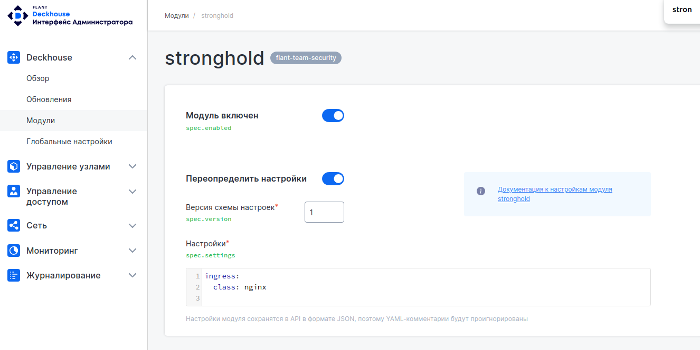

## Системные требования

Поскольку профиль использования хранилища секретов у каждого клиента различен, эти рекомендации должны служить лишь отправной точкой. Все требования к ресурсам прямо пропорциональны операциям, выполняемым кластером Stronghold.

Следует рассмотреть два основных типа кластеров согласно их назначению:
* **Небольшие кластеры**. Подходят для большинства начальных развертываний или для сред разработки и тестирования.
* **Большие кластеры**. Производственные среды с постоянно высокой рабочей нагрузкой. Это может быть большое количество транзакций, большое количество секретов или комбинация того и другого.

|  | Небольшой кластер | Большой кластер |
| :--- | :--- | :--- |
| Процессор | 4-8 ядер | 8-16 ядер |
| Память | 8-16 Гб | 16-32 Гб |
| Дисковый ввод-вывод | 3000+ оп/с | 3000+ оп/с |
| Дисковый ввод-вывод | 70+ Мб/с | 200+ Мб/с |

В зависимости от прогнозируемого количества и типа операций следует отталкиваться от следующих требований:
|  | 4 ядра | 16 ядер |
| :--- | :---  | :--- |
| Авторизация (получение токена) | до 20 оп/с | до 100 оп/с |
| Чтение ключа до 1кБ | до 500 оп/с | до 7000 оп/с |
| Запись ключа | до 30 оп/с | до 150 оп/с |

## Установка и включение Deckhouse Stronghold

**Термины и определения**

| Термин | Определение |
| :--- | :--- |
| Инлет | Способ поступления входящего трафика. |
| Бэкенд | Внутренняя часть, которая находится на сервере и скрыта от пользователей. |
| Модуль | Средство логического разделения программного обеспечения на блоки, каждый из которых выполняет определенную задачу. |
| Механизм секретов | Хранилище ключей-значений, используемое для хранения произвольных секретов. |

Для работы с Deckhouse Stronghold необходимо выполнить установку Deckhouse Platform Certified Security Edition. Процесс установки Deckhouse Platform Certified Security Edition описан по [ссылке](https://deckhouse.ru/gs/).

После того, как Deckhouse Platform Certified Security Edition установлен, необходимо включить модуль Deckhouse Stronghold.

Примените `ModuleConfig`для включения модуля:

```shell
apiVersion: deckhouse.io/v1alpha1
kind: ModuleConfig
metadata:
  name: stronghold
spec:
  enabled: true
```

или выполните команду:

```shell
kubectl -n d8-system exec deploy/deckhouse -c deckhouse -it -- deckhouse-controller module enable stronghold
```

По умолчанию, модуль запускается в режиме `Automatic` с инлетом `Ingress`. В текущей версии, другие режимы и инлеты не предусмотрены.

Если установка Deckhouse Platform Certified Security Edition выполнена в закрытом окружении, то с помощью секции параметров [https](configuration.html#parameters-https) можно настроить использование SSL-сертификатов..

Также Deckhouse Stronghold можно включить в веб-интерфейсе администратора Deckhouse Platform Certified Security Edition, для этого выберите модуль stronghold, как показано на рисунке ниже:



Рисунок - 1. Интерфейс администратора Deckhouse Platform Certified Security Edition.

Доступ к Deckhouse Stronghold осуществляется через инлеты. В данный момент доступен один инлет - `Ingress.` Адрес веб-интерфейса Stronghold формируется следующим образом: в шаблоне [publicDomainTemplate](/reference/api/global.html#parameters-modules-publicdomaintemplate) глобального параметра конфигурации Deckhouse ключ `%s` заменяется на `stronghold`.

Например, если `publicDomainTemplate` установлен как `%s-kube.company.my`, веб-интерфейс Stronghold будет доступен по адресу `stronghold-kube.company.my`.

## Получение токенов доступа

Способы получения токенов доступа:

- Root-токен из секрета `stronghold-keys` пространства имен `kubernetes d8-stronghold`. Пример команды получения root-токена:

  ```shell
  kubectl -n d8-stronghold get secret stronghold-keys -o json | jq -r .data.rootToken | base64 -d
  ```

- Токен доступа с полными правами через UI Deckhouse Admin.

  - Создайте [статического пользователя](/modules/user-authn/cr.html#user) и [группу](/modules/user-authn/cr.html#group) в Deckhouse Platform Certified Security Edition, или настройте аутентификацию через [внешние системы](/modules/user-authn/) (OIDC-провайдеров).
  - Добавьте пользователя в список администраторов Deckhouse Stronghold, используя параметр [management.administrators](configuration.html#parameters-management-administrators).
  - Авторизуйтесь в веб-интерфейсе и получите токен. Для этого в навигационном меню нажмите [Кнопку авторизации](images/image1.ru.png) и в открывшемся меню нажмите на *Копировать токен*.

- Токен доступа с полными правами через CLI.
  - Создайте [статического пользователя](/modules/user-authn/cr.html#user) и [группу](/modules/user-authn/cr.html#group) в Deckhouse Platform Certified Security Edition, или настройте аутентификацию через [внешние системы](/modules/user-authn/) (OIDC-провайдеров).
  - Добавьте пользователя в список администраторов Deckhouse Stronghold, используя параметр [management.administrators](configuration.html#parameters-management-administrators).
  - Авторизуйтесь с помощью `vault login`, выполнив следующие команды (укажите актуальный адрес в `VAULT_ADDR`):

    При аутентификации через внешние системы:

    ```shell
    export VAULT_ADDR=https://stronghold.demo.mydomain.tld/
    vault login -method=oidc -path=oidc_deckhouse
    ```

    При аутентификации через статического пользователя, выполните:

    ```shell
    export VAULT_ADDR=https://stronghold.demo.mydomain.tld/
    vault login
    ```

    Пример результата представлен ниже:

    ```console
    Waiting for OIDC authentication to complete...
    WARNING! The VAULT_TOKEN environment variable is set! The value of this
    variable will take precedence; if this is unwanted please unset VAULT_TOKEN or
    update its value accordingly.

    Success! You are now authenticated. The token information displayed below
    is already stored in the token helper. You do NOT need to run "vault login"
    again. Future Vault requests will automatically use this token.

    Key                  Value
    ---                  -----
    token                hvs.CAESIKdnfsKJAfkP5zP3JDgOB_9PAvXSOf_Zle1ntGTsKC1UGh4KHGh2cy5jSWlXdG9BRm5uUWdUUzRIdHlMYXVwN2I
    token_accessor       z6VXjAi6F3vjaclHu99FLOcr
    token_duration       768h
    token_renewable      true
    token_policies       ["default"]
    identity_policies    ["admin"]
    policies             ["admin" "default"]
    token_meta_role      deckhouse_dex_authenticated
    ```

> Полные права токена доступа подразумевают подключение политики `deckhouse_administrators` следующего вида: `path "*" { capabilities = ["create", "read", "update", "delete", "list", "patch", "sudo"]}`. Политика `deckhouse_administrators` автоматически подключается пользователям, перечисленным в списке администраторов Deckhouse Stronghold (параметр [management.administrators](configuration.html#parameters-management-administrators)). Пользователям не входящим в список администраторов подключается политика `default`.

Получив токен, выполните следующие команды, которые позволят работать с хранилищем:

```shell
export VAULT_TOKEN=hvs.CAESIPaA9shwUt9XIlvlu9FWhr6DyMgnP77bChDmb0mff6OcGh4KHGh2cy5maMz0UWgwdkZlMXlteENlUlhqNUlVeHg`
export VAULT_ADDR=https://stronghold.demo.mydomain.tld/
```

## Настройка параметров высокой доступности

Если используется одна мастер нода (не рекомендуется для продуктивных сред), то Deckhouse Stronghold работает в неотказоустойчивом режиме.
Распечаткой кластера занимается stronghold-automatic, используя ключи, сохраненные в кубернетес-секрете приинициализации кластера.
Высокая доступность обеспечивается автоматически, если количество мастер-узлов кластера Deckhouse Platform Certified Security Edition составляет три и более.
В этом режиме распечаткой кластера занимаются соседние ноды stronghold.

## Дополнительные разделы руководства администратора

- [Методы аутентификации](admin_guide_auth_methods.html)
- [Механизмы секретов](admin_guide_secret_engines.html)
- [Механизм секретов KV](admin_guide_kv.html)
- [Механизм секретов PKI](admin_guide_pki.html)
