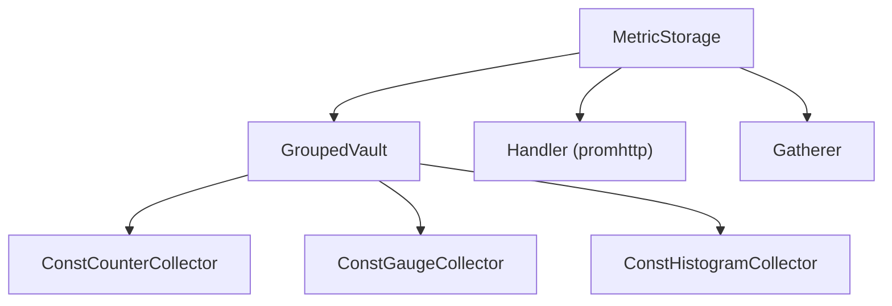

# metrics-storage

A thread-safe Prometheus metrics management library for Go with grouped lifecycle, auto-registration, and batch operations.

## Features

- **Auto-registration** -- metrics are created on first use; no upfront `prometheus.NewCounterVec` boilerplate
- **Grouped metrics** -- logically related metrics share a group and can be expired together in one call
- **Batch operations** -- apply many metric updates in a single validated call via the operations API
- **Automatic label expansion** -- new label keys are added to an existing metric transparently
- **Nil-safe** -- all top-level methods are safe to call on a nil `*MetricStorage`
- **Registry isolation** -- opt into a dedicated `prometheus.Registry` for testing or multi-tenant setups
- **Thread-safe** -- every operation is protected by fine-grained `sync.RWMutex` locks with read-optimised fast paths
- **Full Prometheus compatibility** -- implements `prometheus.Collector` and exposes an `http.Handler` for `/metrics`

## Architecture



| Package | Role |
|---------|------|
| `collectors/` | Type-safe counter, gauge, and histogram collectors with per-metric mutex |
| `labels/` | Label merging, sorting, and subset checks |
| `operation/` | Batch operation structs and validation |
| `options/` | Functional options for vault and metric registration |
| `storage/` | `GroupedVault` -- the internal grouped metrics store |

## Installation

```go
import metricsstorage "github.com/deckhouse/deckhouse/pkg/metrics-storage"
```

## Quick Start

```go
package main

import (
    "net/http"

    metricsstorage "github.com/deckhouse/deckhouse/pkg/metrics-storage"
)

func main() {
    storage := metricsstorage.NewMetricStorage(
        metricsstorage.WithNewRegistry(),
    )

    storage.CounterAdd("http_requests_total", 1, map[string]string{
        "method": "GET",
        "status": "200",
    })

    storage.GaugeSet("temperature_celsius", 21.5, map[string]string{
        "room": "server",
    })

    storage.HistogramObserve("request_duration_seconds", 0.42, map[string]string{
        "endpoint": "/api/v1/users",
    }, []float64{0.01, 0.05, 0.1, 0.5, 1, 5})

    http.Handle("/metrics", storage.Handler())
    http.ListenAndServe(":8080", nil)
}
```

## Usage

### Counters

Counters are cumulative values that only increase.

```go
// Convenience method -- auto-registers the metric on first call
storage.CounterAdd("http_requests_total", 1, map[string]string{
    "method": "GET",
    "path":   "/api/users",
    "status": "200",
})

// Explicit registration for repeated use
counter, err := storage.RegisterCounter("jobs_processed_total",
    []string{"queue", "status"},
)
if err != nil {
    log.Fatal(err)
}
counter.Add(1, map[string]string{"queue": "default", "status": "ok"})
```

### Gauges

Gauges represent a single value that can go up or down.

```go
storage.GaugeSet("memory_usage_bytes", 1024*1024*100, map[string]string{
    "instance": "server-1",
})

storage.GaugeAdd("active_connections", -1, map[string]string{
    "pool": "main",
})
```

### Histograms

Histograms track the distribution of observed values.

```go
buckets := []float64{0.005, 0.01, 0.025, 0.05, 0.1, 0.25, 0.5, 1, 2.5, 5, 10}
storage.HistogramObserve("request_duration_seconds", 0.42, map[string]string{
    "endpoint": "/api/v1/users",
}, buckets)
```

### Metric Registration with Options

```go
import "github.com/deckhouse/deckhouse/pkg/metrics-storage/options"

counter, err := storage.RegisterCounter("api_calls_total",
    []string{"method", "endpoint"},
    options.WithHelp("Total number of API calls"),
    options.WithConstantLabels(map[string]string{"service": "user-api"}),
)

gauge, err := storage.RegisterGauge("active_sessions",
    []string{"region"},
    options.WithHelp("Number of active user sessions"),
)

histogram, err := storage.RegisterHistogram("response_size_bytes",
    []string{"endpoint", "content_type"},
    []float64{100, 1000, 10000, 100000, 1000000},
    options.WithHelp("HTTP response size distribution"),
)
```

### Grouped Metrics

Grouped metrics share a lifecycle -- you can expire an entire group at once.

```go
grouped := storage.Grouped()

grouped.CounterAdd("user_session", "page_views_total", 1, map[string]string{
    "user_id": "12345",
    "page":    "/dashboard",
})

grouped.GaugeSet("user_session", "last_active_timestamp", float64(time.Now().Unix()), map[string]string{
    "user_id": "12345",
})

// Expire all metrics in the group
grouped.ExpireGroupMetrics("user_session")

// Or expire a single metric by name within a group
grouped.ExpireGroupMetricByName("user_session", "page_views_total")
```

### Batch Operations

Apply multiple metric updates in a single validated call.

```go
import "github.com/deckhouse/deckhouse/pkg/metrics-storage/operation"

ops := []operation.MetricOperation{
    {
        Name:   "http_requests_total",
        Action: operation.ActionCounterAdd,
        Value:  ptr.To(1.0),
        Labels: map[string]string{"method": "GET"},
    },
    {
        Name:   "memory_usage_bytes",
        Action: operation.ActionGaugeSet,
        Value:  ptr.To(float64(150 * 1024 * 1024)),
        Labels: map[string]string{"instance": "server-1"},
    },
    {
        Name:    "request_duration_seconds",
        Action:  operation.ActionHistogramObserve,
        Value:   ptr.To(0.42),
        Labels:  map[string]string{"endpoint": "/api/users"},
        Buckets: []float64{0.01, 0.1, 1, 10},
    },
}

commonLabels := map[string]string{"environment": "production"}

if err := storage.ApplyBatchOperations(ops, commonLabels); err != nil {
    log.Printf("batch failed: %v", err)
}
```

Grouped operations automatically expire existing group metrics before applying:

```go
groupedOps := []operation.MetricOperation{
    {
        Name:   "active_users",
        Group:  "user_stats",
        Action: operation.ActionGaugeSet,
        Value:  ptr.To(150.0),
        Labels: map[string]string{"region": "us-west"},
    },
    {
        Name:   "session_count",
        Group:  "user_stats",
        Action: operation.ActionGaugeSet,
        Value:  ptr.To(89.0),
        Labels: map[string]string{"region": "us-west"},
    },
}

storage.ApplyBatchOperations(groupedOps, nil)
```

Available actions: `ActionCounterAdd`, `ActionGaugeAdd`, `ActionGaugeSet`, `ActionHistogramObserve`, `ActionExpireMetrics`.

### Prometheus Integration

#### Built-in HTTP handler

```go
storage := metricsstorage.NewMetricStorage(metricsstorage.WithNewRegistry())

http.Handle("/metrics", storage.Handler())
http.ListenAndServe(":8080", nil)
```

#### Custom registry

```go
registry := prometheus.NewRegistry()
storage := metricsstorage.NewMetricStorage(metricsstorage.WithRegistry(registry))

// Register the storage collector into an external registry
externalRegistry := prometheus.NewRegistry()
externalRegistry.MustRegister(storage.Collector())
handler := promhttp.HandlerFor(externalRegistry, promhttp.HandlerOpts{})
```

#### Gathering metrics programmatically

```go
families, err := storage.Gather()
if err != nil {
    log.Printf("gather failed: %v", err)
}
```

## Best Practices

### 1. Register metrics at startup

Pre-register metrics during initialization to pay the registration cost once.
Subsequent calls to `CounterAdd`/`GaugeSet`/`HistogramObserve` with the same labels hit a lock-free fast path.

```go
func initMetrics(s *metricsstorage.MetricStorage) {
    s.RegisterCounter("requests_total", []string{"method", "status"})
    s.RegisterGauge("active_connections", []string{"pool"})
    s.RegisterHistogram("latency_seconds", []string{"endpoint"},
        []float64{0.01, 0.05, 0.1, 0.5, 1, 5})
}
```

### 2. Keep label cardinality low

Every unique combination of label values creates a separate time series.
Avoid unbounded values like user IDs, request IDs, or timestamps in labels.

```go
// Good -- bounded set of values
storage.CounterAdd("requests_total", 1, map[string]string{"method": "GET"})

// Bad -- unbounded cardinality
storage.CounterAdd("requests_total", 1, map[string]string{"request_id": uuid.New().String()})
```

### 3. Use groups for coordinated lifecycle

When a set of metrics should appear and disappear together (e.g., per-hook metrics), use a shared group name and expire them in one call.

```go
grouped := storage.Grouped()
grouped.GaugeSet("hook_run", "duration_seconds", 1.5, labels)
grouped.GaugeSet("hook_run", "exit_code", 0, labels)

// On next run, expire the old values before writing new ones
grouped.ExpireGroupMetrics("hook_run")
```

### 4. Use batch operations for bulk updates

`ApplyBatchOperations` validates all operations upfront and handles group expiration automatically.

```go
err := storage.ApplyBatchOperations(ops, commonLabels)
```

### 5. Isolate registries in tests

Use `WithNewRegistry()` to avoid polluting `prometheus.DefaultRegistry` across test cases.

```go
func TestMyFeature(t *testing.T) {
    storage := metricsstorage.NewMetricStorage(metricsstorage.WithNewRegistry())
    // each test gets its own registry -- no cross-test interference
}
```

### 6. Handle registration errors

`RegisterCounter`/`RegisterGauge`/`RegisterHistogram` return errors on type mismatches (e.g., registering a counter with a name already used by a gauge).

```go
counter, err := storage.RegisterCounter("api_calls", []string{"method"})
if err != nil {
    log.Fatalf("metric registration failed: %v", err)
}
```

### 7. Leverage nil-safe operations

A nil `*MetricStorage` silently ignores writes, which is useful for optional metrics.

```go
var storage *metricsstorage.MetricStorage // nil
storage.CounterAdd("safe_metric", 1, nil) // no-op, no panic
```

## Troubleshooting

### Metric name conflicts

Registering the same metric name with a different collector type returns an error.

```go
storage.RegisterCounter("requests", []string{"method"})
storage.RegisterGauge("requests", []string{"method"}) // error: counter collector exists
```

Use distinct metric names for different types.

### Missing histogram buckets

`HistogramObserve` via `ApplyOperation` requires buckets to be set; otherwise validation fails.

```go
// Correct
storage.HistogramObserve("latency", 0.5, labels, []float64{0.01, 0.1, 1, 10})
```

### Unexpected group expiration

`ApplyBatchOperations` implicitly expires all metrics in a group before applying grouped operations.
If metrics vanish unexpectedly, check whether the group name is reused across independent subsystems.

## License

Apache License 2.0 -- see [LICENSE](../../LICENSE).
