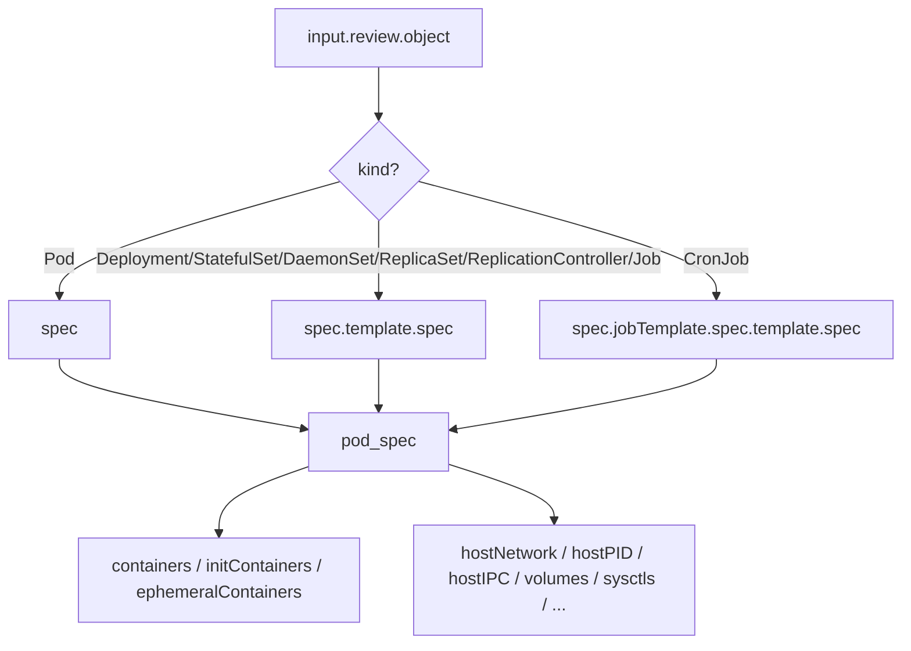

# Plan: Extend ConstraintTemplates to validate controller-level pod specs

## Problem

The built-in ConstraintTemplates in [`modules/015-admission-policy-engine/charts/constraint-templates/templates/`](modules/015-admission-policy-engine/charts/constraint-templates/templates/) only check Pod fields. When a user runs `helm install` or `kubectl apply` for a Deployment, the constraint is not evaluated until the kubelet tries to create the Pod — making debugging non-obvious. With `EnforcementAction: Deny`, the Deployment silently fails with no stdout feedback.

## Solution

Create a shared Rego library function that **normalizes the pod spec** — resolving `spec.template.spec` for controllers and `spec` for Pods — then refactor all existing security and operation templates to use it. This way the same ConstraintTemplate works for both Pods and controllers (Deployment, StatefulSet, DaemonSet, ReplicaSet, ReplicationController, Job, CronJob).

## Architecture

### Pod spec resolution map

| Kind | Path to pod spec |
|------|-----------------|
| Pod | `spec` |
| Deployment | `spec.template.spec` |
| StatefulSet | `spec.template.spec` |
| DaemonSet | `spec.template.spec` |
| ReplicaSet | `spec.template.spec` |
| ReplicationController | `spec.template.spec` |
| Job | `spec.template.spec` |
| CronJob | `spec.jobTemplate.spec.template.spec` |



### Step 1: Add `pod_spec` resolver to [`common.rego`](modules/015-admission-policy-engine/charts/constraint-templates/files/libs/common.rego)

Add these functions:

```rego
# Resolve the effective pod spec from any supported workload kind.
# Returns {} if the kind is not recognized (constraint won't fire).
pod_spec := spec if {
    obj := input.review.object
    kind := object.get(obj, ["kind"], "")
    spec := resolve_pod_spec_by_kind(obj, kind)
}

resolve_pod_spec_by_kind(obj, "Pod") := spec if {
    spec := object.get(obj, "spec", {})
}

resolve_pod_spec_by_kind(obj, "CronJob") := spec if {
    spec := object.get(obj, ["spec", "jobTemplate", "spec", "template", "spec"], {})
}

# Deployment, StatefulSet, DaemonSet, ReplicaSet, ReplicationController, Job
resolve_pod_spec_by_kind(obj, _) := spec if {
    kind := object.get(obj, ["kind"], "")
    controller_kinds := {"Deployment", "StatefulSet", "DaemonSet", "ReplicaSet", "ReplicationController", "Job"}
    controller_kinds[kind]
    spec := object.get(obj, ["spec", "template", "spec"], {})
}

resolve_pod_spec_by_kind(obj, _) := {} if {
    kind := object.get(obj, ["kind"], "")
    controller_kinds := {"Deployment", "StatefulSet", "DaemonSet", "ReplicaSet", "ReplicationController", "Job", "Pod", "CronJob"}
    not controller_kinds[kind]
}
```

### Step 2: Refactor `input_containers` in [`common.rego`](modules/015-admission-policy-engine/charts/constraint-templates/files/libs/common.rego)

Change the container iterator to read from `pod_spec` instead of hardcoded `input.review.object.spec`:

```rego
# Before (Pod-only):
input_containers contains c if {
    c := input.review.object.spec.containers[_]
}

# After (Pod + controllers):
input_containers contains c if {
    c := pod_spec.containers[_]
}
```

Same for `initContainers` and `ephemeralContainers`.

The parameterized `input_containers_from(obj)` already accepts an object — update it to accept a pod spec directly (or keep it for backward compat).

### Step 3: Refactor templates that access pod-level fields directly

#### 3a. Container-level security constraints (use `input_containers` / `check_container_bool`)

These only need the `input_containers` refactor from Step 2 — they already iterate containers via the lib. No additional changes needed **if** they pass the correct `labels` and `namespace`. For controllers, SPE labels are on the controller's `metadata`, not the template — which is the correct behavior.

Templates in this category:
- [`allow-privileged.yaml`](modules/015-admission-policy-engine/charts/constraint-templates/templates/security/allow-privileged.yaml)
- [`allow-privilege-escalation.yaml`](modules/015-admission-policy-engine/charts/constraint-templates/templates/security/allow-privilege-escalation.yaml)
- [`read-only-root-filesystem.yaml`](modules/015-admission-policy-engine/charts/constraint-templates/templates/security/read-only-root-filesystem.yaml)
- [`allowed-capabilities.yaml`](modules/015-admission-policy-engine/charts/constraint-templates/templates/security/allowed-capabilities.yaml)
- [`allowed-proc-mount.yaml`](modules/015-admission-policy-engine/charts/constraint-templates/templates/security/allowed-proc-mount.yaml)
- [`allowed-apparmor-profiles.yaml`](modules/015-admission-policy-engine/charts/constraint-templates/templates/security/allowed-apparmor-profiles.yaml)
- [`allowed-selinux.yaml`](modules/015-admission-policy-engine/charts/constraint-templates/templates/security/allowed-selinux.yaml)
- [`allowed-seccomp.yaml`](modules/015-admission-policy-engine/charts/constraint-templates/templates/security/allowed-seccomp.yaml)
- [`allowed-users.yaml`](modules/015-admission-policy-engine/charts/constraint-templates/templates/security/allowed-users.yaml) — uses custom `review_containers` and `review_pod_spec` helpers; needs refactor to use `pod_spec`
- [`allowed-flex-volumes.yaml`](modules/015-admission-policy-engine/charts/constraint-templates/templates/security/allowed-flex-volumes.yaml)

#### 3b. Pod-spec-level security constraints (access `obj.spec.xxx` directly)

These need to switch from `input.review.object` to `pod_spec` for field access:

- [`allow-host-network.yaml`](modules/015-admission-policy-engine/charts/constraint-templates/templates/security/allow-host-network.yaml) — accesses `obj.spec.hostNetwork`, container ports via `input_containers`
- [`allow-host-processes.yaml`](modules/015-admission-policy-engine/charts/constraint-templates/templates/security/allow-host-processes.yaml) — accesses `obj.spec.hostPID`, `obj.spec.hostIPC`
- [`allowed-host-paths.yaml`](modules/015-admission-policy-engine/charts/constraint-templates/templates/security/allowed-host-paths.yaml) — accesses pod spec volumes
- [`allowed-sysctls.yaml`](modules/015-admission-policy-engine/charts/constraint-templates/templates/security/allowed-sysctls.yaml) — accesses `obj.spec.securityContext.sysctls`
- [`allowed-volume-types.yaml`](modules/015-admission-policy-engine/charts/constraint-templates/templates/security/allowed-volume-types.yaml) — accesses pod spec volumes
- [`automount-service-account-token.yaml`](modules/015-admission-policy-engine/charts/constraint-templates/templates/security/automount-service-account-token.yaml) — accesses `obj.spec.automountServiceAccountToken` and `input.review.object.spec.containers` directly

For each of these, replace `input.review.object.spec` with the resolved `pod_spec` and `input.review.object` with a variable that holds the controller object (for metadata/labels/namespace access — those remain on `input.review.object`).

#### 3c. Operation constraints

- [`allowed-repos.yaml`](modules/015-admission-policy-engine/charts/constraint-templates/templates/operation/allowed-repos.yaml) — uses `input_containers` → auto-fixed by Step 2
- [`container-duplicates.yaml`](modules/015-admission-policy-engine/charts/constraint-templates/templates/operation/container-duplicates.yaml) — uses containers → auto-fixed
- [`container-resources.yaml`](modules/015-admission-policy-engine/charts/constraint-templates/templates/operation/container-resources.yaml) — uses containers → auto-fixed
- [`disallowed-tags.yaml`](modules/015-admission-policy-engine/charts/constraint-templates/templates/operation/disallowed-tags.yaml) — uses containers → auto-fixed
- [`disallowed-tolerations.yaml`](modules/015-admission-policy-engine/charts/constraint-templates/templates/operation/disallowed-tolerations.yaml) — checks pod spec tolerations → needs `pod_spec`
- [`dns-policy.yaml`](modules/015-admission-policy-engine/charts/constraint-templates/templates/operation/dns-policy.yaml) — checks `spec.dnsPolicy` → needs `pod_spec`
- [`image-pull-policy.yaml`](modules/015-admission-policy-engine/charts/constraint-templates/templates/operation/image-pull-policy.yaml) — uses containers → auto-fixed
- [`ingress-class.yaml`](modules/015-admission-policy-engine/charts/constraint-templates/templates/operation/ingress-class.yaml) — Ingress-specific, no pod spec → no change needed
- [`max-revision-history-limit.yaml`](modules/015-admission-policy-engine/charts/constraint-templates/templates/operation/max-revision-history-limit.yaml) — checks `spec.revisionHistoryLimit` on Deployment itself → no change needed
- [`priority-class.yaml`](modules/015-admission-policy-engine/charts/constraint-templates/templates/operation/priority-class.yaml) — checks `spec.template.spec.priorityClassName` for controllers or `spec.priorityClassName` for Pods → needs `pod_spec`
- [`replica-limits.yaml`](modules/015-admission-policy-engine/charts/constraint-templates/templates/operation/replica-limits.yaml) — checks `spec.replicas` on Deployment itself → no change needed
- [`required-annotations.yaml`](modules/015-admission-policy-engine/charts/constraint-templates/templates/operation/required-annotations.yaml) — checks metadata → no change needed
- [`required-labels.yaml`](modules/015-admission-policy-engine/charts/constraint-templates/templates/operation/required-labels.yaml) — checks metadata → no change needed
- [`required-probes.yaml`](modules/015-admission-policy-engine/charts/constraint-templates/templates/operation/required-probes.yaml) — uses `input.review.object.spec.containers` directly → needs refactor to `input_containers`
- [`storage-class.yaml`](modules/015-admission-policy-engine/charts/constraint-templates/templates/operation/storage-class.yaml) — checks PVC-related → needs investigation

### Step 4: Update tests

For each refactored constraint, add test cases with controller objects (Deployment, StatefulSet, CronJob) to the existing `test-matrix.yaml` files. The test generator ([`constraint_testgen`](modules/015-admission-policy-engine/charts/constraint-templates/tests/tools/constraint_testgen/)) needs new base objects for controllers:

```yaml
bases:
  deploymentPod:
    document:
      apiVersion: apps/v1
      kind: Deployment
      metadata:
        namespace: testns
      spec:
        template:
          spec:
            containers:
              - image: nginx
                name: nginx
  cronJobPod:
    document:
      apiVersion: batch/v1
      kind: CronJob
      metadata:
        namespace: testns
      spec:
        jobTemplate:
          spec:
            template:
              spec:
                containers:
                  - image: nginx
                    name: nginx
```

### Step 5: Verify

- Run `go run ./tests/tools/constraint_testgen generate -tests-root ./tests` to regenerate test suites
- Run `gator verify` on all rendered test suites
- Ensure no regressions on existing Pod-based tests

## Execution order

1. Add `pod_spec` resolver to [`common.rego`](modules/015-admission-policy-engine/charts/constraint-templates/files/libs/common.rego)
2. Add unit tests for `pod_spec` in [`common_test.rego`](modules/015-admission-policy-engine/charts/constraint-templates/files/libs/common_test.rego)
3. Refactor `input_containers` to use `pod_spec`
4. Refactor container-level security templates (3a) — verify each with gator
5. Refactor pod-spec-level security templates (3b) — verify each with gator
6. Refactor operation templates (3c) — verify each with gator
7. Add controller base objects to test matrices
8. Generate and run full test suite
